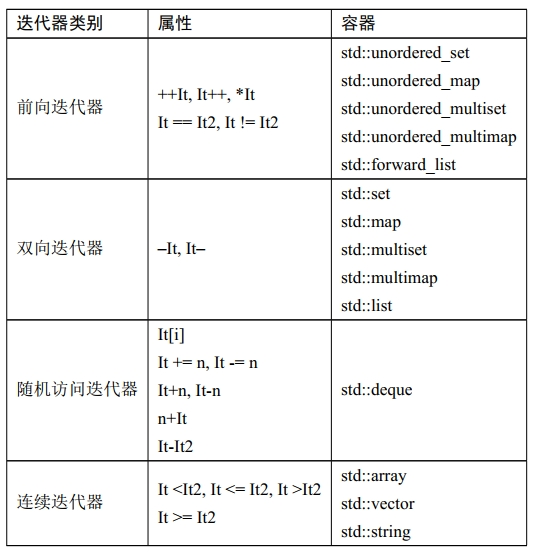

= 第八章 迭代器(iterator)

. 创建方法
.. 某种容器类型::iterator
.. 引入<iterator>，用std::begin, end, prev, next, distance, advance
. 适配器
.. front_inserter, back_inserter, inserter: 分别在容器的开头，结尾，或任意位置插入元素，会把功能映射到具体容器内部的成员函数上， 不确定具体容器类型，又想对其加元素时可用
. 流迭代器，用来创建istream和ostream可用的数据源或目标
.. std::istream_iterator, ostream_iterator

