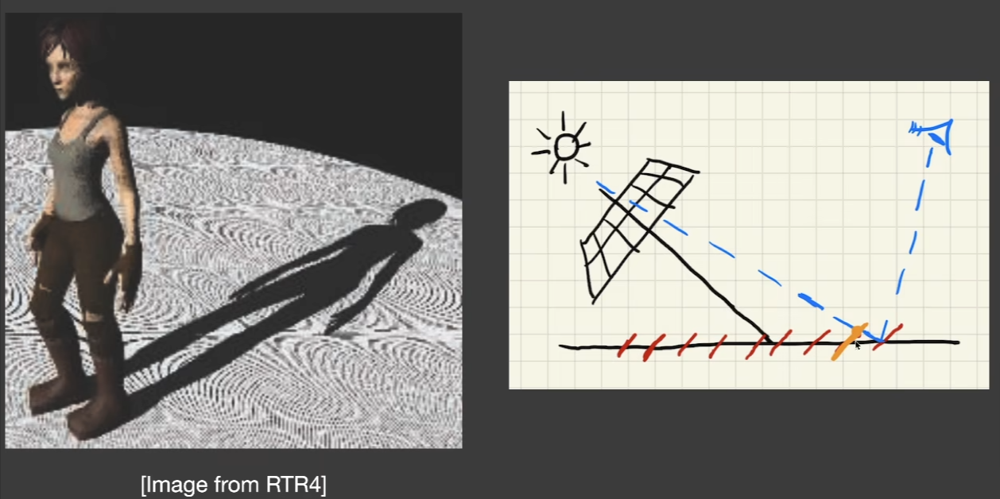
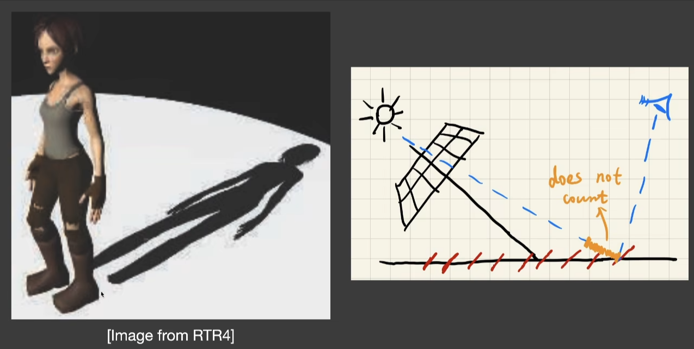

# 第三课 实时阴影1

## 阴影映射(shadow mapping)

1. 2躺算法
   - 从光源看向场景，输出最近的深度值
   - 从相机的位置出发，根据之前的深度值，检测这个点是否能被光源看到
2. 图像空间中的算法
   - 好处：只需要shadowmap，不需要实际场景的几何信息
   - 坏处：自遮挡现象，走样(锯齿)问题
     - 自遮挡现象，如图:
        
        
        注意橙色线段，第一趟时，光线记录的深度是打到橙色小平面上的深度，实际上不是打到观察点的深度，有微小的差距,导致了所谓自遮挡现象，即第一趟的深度小于第二趟的深度，程序以为那个点是被遮挡的

        当光源几乎垂直于地面时，此现象不明显，越与地面接近平行方向越明显

        - 解决：
          - 加一个偏移量，可根据光源角度调整，若深度差小于这个量，就不算遮挡，但是会造成阴影接不起来，因为在小角度，比如脚与地面接触的地方附近，都不算遮挡光

         

         - 二次深度
           - 不仅存最小深度，还存第二小的深度，使用这两个深度中间的值来做深度的比较
           - 要求所有物体都得有厚度，有正反面，但是地板没有反面，不属于watertight
           - 实现麻烦(影响性能)
     - 锯齿问题
      
         由于阴影图是由分辨率的，若分辨率不够大，就会造成锯齿阴影现象

是非常著名的阴影渲染技术

## 微积分回顾

在RTR中，更关心近似相等，某个关键近似不等式如下:

$$
\int_{\Omega}f(x)g(x)dx \approx \frac{\int_{\Omega}f(x)dx}{\int_{\Omega}dx}\int_{\Omega}g(x)dx
$$

1. 当实际积分区域很小的时候，越精确
2. g(x)变动不能太大

以上两种情况下，满足一种，近似式更精确

把渲染方程的V函数可以拿出去，变成:

$$
L_o(p,\omega_o) \approx \frac{\int_{\Omega^+}V(p, \omega_i)d\omega_i}{\int_{\Omega^+}d\omega_i} \int_{\Omega^+}L_i(p, \omega_i)f_r(p,\omega_i,\omega_o)\cos \theta_i d\omega_i
$$

这样做就可以先算积分，再根据可见性求V

什么时候更准确？满足下列一种

1. 对于点光源，积分就退化成乘积了，上式就是精确的
2. L_i光照不变且均匀的,diffuse的bsdf

## PCSS(Percentage closer soft shadows)

