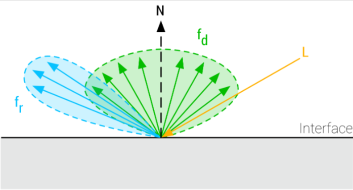
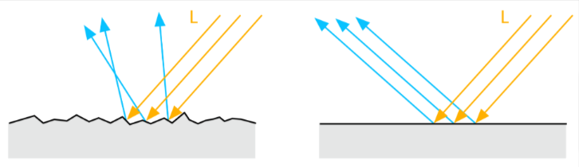
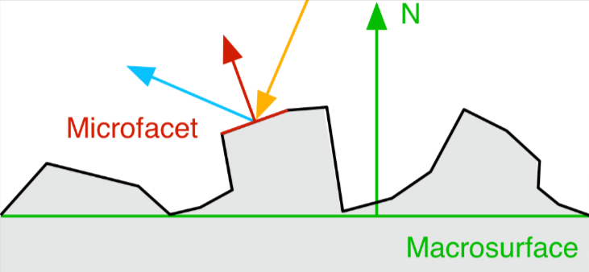
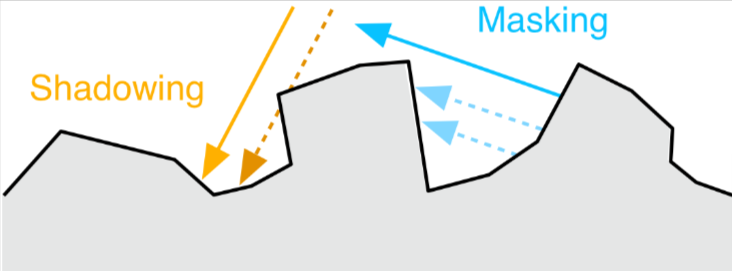
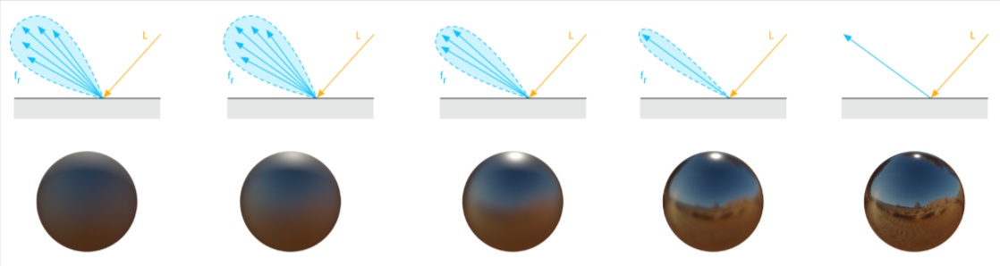
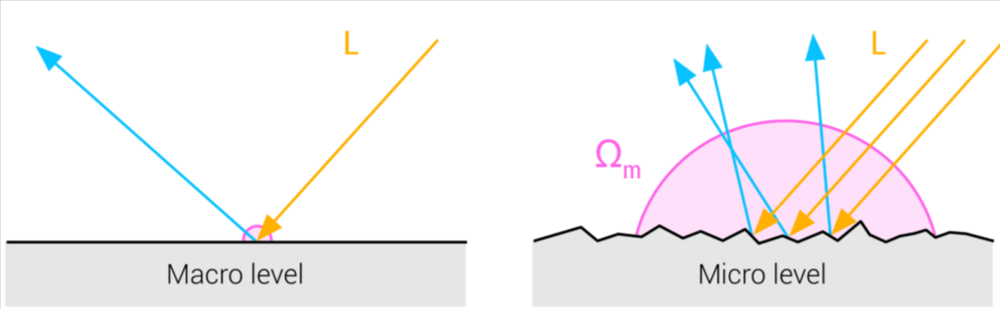
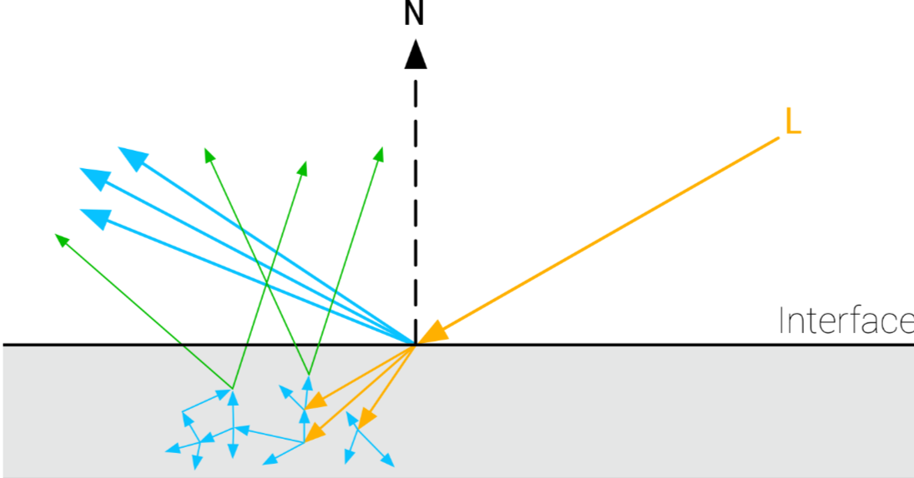

# Filament 官方文档

> 不是全文翻译，挑选了每个章节的关键点做总结
>
> 有自信保证意思基本无误，但若有错误，欢迎温柔私信我指正
>
> 读此文档之前，需要预先了解图形学基本知识和PBR基础理论，推荐以PBRT一书做参考

## 2 总览

Filament是为安卓设计的PBR引擎，方便安卓开发者创造高质量2d和3d渲染效果。本文档会讲解引擎内部的理论和实现，帮助开发者清晰理解此引擎

此文档不是设计文档，这些算法可以用来在任何引擎中实现PBR。同时也会解释算法，建模的选型原因

## 2.1 原则

遵循Brent Burley的论文《Physically-based shading at Disney》

- 移动端的实时性能

    我们主要的目标是设计和实现一个能够在移动端平台高效运行的渲染系统。主要目标是支持OpenGL ES 3.x的GPU
- 质量

    我们的渲染系统会着眼于图像整体的质量，但考虑到照顾那些性能较弱的GPU，会有所折中
- 易用

    在我们的渲染系统中，艺术家要能直观快速地操作和迭代资产，并且相关参数简单易懂
- 通俗易懂

    我们系统里尽可能都用物理学的单位，比如距离用米或厘米，色温用开尔文，灯光亮度用流明或坎德拉等
- 灵活

    基于物理的渲染方式必须预先排除非现实向的渲染。类似UI这样的，就会需要不可照亮的材质来实现
- 部署的文件大小

    尽量小，方便其他应用集成此系统

## 2.2 PBR

我们考虑到艺术性和产出效率，且与我们的目标契合，才选的PBR。

PBR的渲染方法相对于传统实时渲染的建模，提供了对材质和其与光线交互的更精确表示。材质和光照的分离，是PBR的核心方法，利用此方法创造的资产，在所有光照条件下都看起来更真实且精确

## 3 记号

此文档用到的符号定义

> 必要时我会做出说明，此处略

## 4 材质系统

后面的章节会介绍材质模型，物体表面的特性的介绍(比如各向异性，透明涂层等)会被简化。实践中，模型中的某一部分会被合并为一种。比如，标准模型里，透明图层模型和各向异性模型就可合并组合成一种，就更加灵活和强大了。关于Filament的材质实现，详见材质文档

## 4.1 标准模型

此模型用于表示标准的材质外观。材质模型使用数学化的BSDF表示,BSDF本身由两个函数组成: BRDF和BTDF

由于我们目标是对常见的物体表面建模，标准材质模型会(大幅)忽略BTDF，专注于BRDF。因此，我们的标准模型只能正确模拟反射，各向同性，绝缘体，或者拥有较短自由程的导体的表面特性

BRDF把标准材质表面的反馈情况，看成一个函数，此函数由两个项组成:

- 漫反射分量$f_d$
- 镜面反射分量$f_r$

物体表面，表面的法线，入射光之间的关系见图1



> 可见，这个BSDF模型与PBRT中还是很不同的，PBRT中的BSDF是根据材质是漫反射或镜面反射做了区分，Filament是把这两者组合了起来，当成两个分量了，标准模型这样做确实简化了

物体表面的完整反馈效果可被下式表示:

$$
f(v,l) = f_d(v,l) + f_r(v,l) \tag{1}
$$

> v是观察方向的单位向量，l是入射光的单位向量
>
> 此公式也就是说，给定了观察方向和入射光方向，就可根据$f_d$和$f_r$给出最终这个观察方向的反馈量

此方程根据单个方向入社的光线，给出了表面的反馈量。而完整的渲染方程要求解整个半球上l的积分

> PBRT就是这样的，也就是求渲染方程里$L_e * f_r * \cos\theta$在半球面上的积分，Filament是用两个分量简化了

常见的表面一般不是平整的，所以我们需要模拟不平整表面与光交互时的特征。

此种表面可用微表面BRDF做近似。微表面的意思就是：表面在微观层面并不是平滑的，而是由超多随机方向的微小平面组成。

平面与微表面与光交互的不同见图2



微表面中，只有法线夹在入射方向和观察方向中间时，才会反射可见到的光，如图3



然而，不是所有法线满足上述条件的微表面都会反射出光，因为BRDF还得考虑遮挡和阴影效果，如图4



> 左边橙色箭头有虚线，代表入射光的阴影效果，右边蓝色箭头有虚线，代表反射光的遮挡效果

微表面的BRDF受一个叫粗糙度(roughness)的参数大幅影响，这个参数代表材质表面的围观尺度有多光滑或者多粗糙。表面越光滑，微观的表面就越平整，就有更多的光反射出来；表面越粗糙，微观表面就很少平整，入射的光在反射后就散的比较开，相对于镜面高光，看起来就更模糊，见图5



> 反射的光散的越开，镜面反射效果越弱，看起来越模糊
>
> Filament中，粗糙度对应的参数叫perceptualRoughness

微表面模型用下面的方程来表示，这里的x可以是r(镜面反射),也可以是d（漫反射）:

$$
f_x(v,l) = \frac{1}{\vert n·v\vert\vert n·l\vert}\int_\omega D(m,\alpha)G(v,l,m)f_m(v,l,m)(v·m)(l·m)dm \tag{2}
$$

D项对微表面的分布情况做了建模(参考NDF(法线分布函数)),此项是表面外观表现的主要因素，参考图5

G项对微表面的可见性(遮挡，阴影效果)做了建模

镜面反射和漫反射式子都差不多，区别就在$f_m$这一项上，此项代表微表面的BRDF函数

注意，此式重点在于，要在微观层面的半球上做积分



上图就是说，宏观层面上，表面看作是平整的，有助于简化上面的方程(这里假设了某个方向的入射光，对应表面上的一个点)

然而，在微观层面，表面不是平整的，并且不能假设光线只有一条(但是可以假设入射光的方向是平行的)。因此，微表面会把这些平行的入射光散射到不同方向上去，我们必须在这个微表面的半球上做积分。

显然，对所有微表面半球做积分计算很不现实。因此我们会对镜面反射和漫反射的积分式做近似处理

## 4.2 绝缘体和导体

现实中，入射光会穿透表面，在物体内部散射，然后某些光会类似漫反射重新穿出表面，此种效应如图8



对于完全金属材质，不会有次表面散射的效应，也就是说，此种材质没有漫反射分量(后文会看到，此特性会影响镜面反射分量的观测到的颜色)。对于绝缘体，是有此种散射效果的，也就是说，其具有镜面反射和漫反射分量

为了对BRDF合理建模，我们必须区分绝缘体和导体

> 也就是导体的BRDF没有漫反射分量

## 4.3 能量守恒

BRDF的能量守恒很重要，也就是镜面和漫反射的能量总数，要小于入射的能量总数。若BRDF不满足能量守恒，艺术家就需要自己确保表面反射的光不会比入射光能量大

## 4.4 镜面反射BRDF

对于镜面反射形式的BRDF, 用$f_r$表示，基于菲涅尔定律建模。函数F是微表面模型的积分式的Cook-Torrance近似

$$
f_r(v,l) = \frac{D(h,\alpha)G(v,l,\alpha)F(v,h,f0)}{4(n·v)(n·l)} \tag{3}
$$

由于我们要实时计算，故必须把D,G,F三项做近似处理，下个小节我们会介绍如何近似

### 4.4.1 法线分布函数(镜面反射的D项)

Burley的某篇论文中，观察到长尾(幂律分布)的法线分布函数(NDF)很符合真实世界的场景。在Walter的某篇论文中提到的GGX就是长尾式下降且又在高光区域有短暂高峰的分布，只需用一个简单的公式就很可实现真实世界的场景。GGX模型等效于Trowbridge-Reitz分布，在现代PBR中，是很流行的算法模型

$$
D_{GGX}(h,\alpha)=\frac{\alpha^2}{\pi((n·h)^2(\alpha^2-1)+1)^2} \tag{4}
$$

NDF在GLSL中的实现，如下:

```GLSL
float D_GGX(float NoH, float roughness) {
    float a = NoH * roughness;
    float k = roughness / (1.0 - NoH * NoH + a * a);
    return k * k * (1.0 / PI);
}
```

我们可用一半精度的浮点数来优化这个实现。原方程中，当计算$1-(n·h)^2$时，有两个问题。首先，当$(n·h)^2$接近1(高光)时，会遭遇到浮点数取消问题，其次,当$n·h$接近1时精度不足

> 浮点数取消问题: 当浮点做除法运算时，若除数和被除数非常接近，会导致精度大幅下降，详见[此处](https://en.wikipedia.org/wiki/Floating-point_arithmetic#Addition_and_subtraction)

解决方法是利用拉格朗日等式:

$$
\vert a \times b \vert^2 = \vert a\vert^2\vert b\vert^2 - (a·b)^2 \tag{5}
$$

由于n和h都是单位向量,就可用叉乘来直接计算上式，下方代码展示了优化后的GGX实现

```GLSL
#define MEDIUMP_FLT_MAX    65504.0
#define saturateMediump(x) min(x, MEDIUMP_FLT_MAX)

float D_GGX(float roughness, float NoH, const vec3 n, const vec3 h) {
    vec3 NxH = cross(n, h);
    float a = NoH * roughness;
    float k = roughness / (dot(NxH, NxH) + a * a);
    float d = k * k * (1.0 / PI);
    return saturateMediump(d);
}
```

### 4.4.2 几何阴影(镜面反射的G项)

Eric Heitz在论文中指出，Smith几何阴影函数正是G项的确切形式。Smith公式为下式:

$$
G(v,l,\alpha)=G_1(l,\alpha)G_1(v,\alpha) \tag{6}
$$

$G_1$可以遵从一些模型，一般来说可设为GGX公式

$$
G_1(v,\alpha)=G_{GGX}(v,\alpha)=\frac{2(n·v)}{n·v+\sqrt{\alpha^2+(1-\alpha^2)(n·v)^2}} \tag{7}
$$

完整的Smith-GGX公式就是把第二项也用类似上式的办法替换

代入后，把公式3里的G函数用可见函数V替代，变为下式

$$
f_r(v,l)=D(h,\alpha)V(v,l,\alpha)F(v,h,f_0) \tag{9}
$$

其中:

$$
V(v,l,\alpha)=\frac{G(v,l,\alpha)}{4(n·v)(n·l)} = V_1(l,\alpha)V_1(v,\alpha) \tag{10}
$$

且:

$$
V_1(v,\alpha) = \frac{1}{n·v + \sqrt{\alpha^2+(1-\alpha^2)(n·v)^2}} \tag{11}
$$

然而，Heitz提到，把微表面的高度引入并与遮挡和阴影关联会带来更精确的结果。他定义了与高度关联的Smith函数,最终推导后的可见函数是:

$$
V(v,l,\alpha)=\frac{0.5}{n·l\sqrt{(n·v)^2(1-\alpha^2)+\alpha^2}+n·v\sqrt{(n·l)^2(1-\alpha^2)+\alpha^2}} \tag{15}
$$

关于可见函数V项的实现，见下方代码, 里面有两个开根，性能上开销会大一点

```GLSL
float V_SmithGGXCorrelated(float NoV, float NoL, float roughness) {
    float a2 = roughness * roughness;
    float GGXV = NoL * sqrt(NoV * NoV * (1.0 - a2) + a2);
    float GGXL = NoV * sqrt(NoL * NoL * (1.0 - a2) + a2);
    return 0.5 / (GGXV + GGXL);
}
```

开根里面都是平方项，我们做了近似处理，以优化移动端性能，注意，这在数学上是错误的

$$
V(v,l,\alpha) = \frac{0.5}{n·l(n·v)(1-\alpha)+\alpha+n·v(n·l)(1-\alpha)+\alpha} \tag{16}
$$

对应的GLSL代码如下:

```GLSL
float V_SmithGGXCorrelatedFast(float NoV, float NoL, float roughness) {
    float a = roughness;
    float GGXV = NoL * (NoV * (1.0 - a) + a);
    float GGXL = NoV * (NoL * (1.0 - a) + a);
    return 0.5 / (GGXV + GGXL);
}
```

也可用Hammon的近似法，它的近似法是在公式15的分母用插值处理

### 4.4.3 菲涅尔(镜面反射F项)

在基于物理的材质中，菲涅尔效应十分重要。在现实中，观察者看到的光，会随着观察角度产生变化，菲涅尔效应就是对此进行建模。这种效应在大面积的水域很明显，远处的水看起来近似镜面反射，近处的水却不是。

反射的光量，不单与观察角有关，还跟材质的折射率(IOR)有关。垂直入射的光，反射回去的光量标注为$f_0$,这个值可以用IOR推导出来，详见章节4.8.3.2， 观察角接近90时，反射回来的光量记为$f_{90}$,此值对于光滑材质来说反射率接近100%

更正式地来说，菲涅尔项定义了光在两种媒介交界处的折射反射效果，或者说是折射透射能量的比率，Schlick对于菲涅尔项做出了近似处理，对于Cook-Torrance的镜面反射BRDF,我们有:

$$
F_{Schlick}(v,h,f_0,f_{90})=f_0+(f_{90}-f_0)(1-v·h)^5 \tag{18}
$$

常数$f_0$代表了与法线方向入射的镜面反射率，对于绝缘体是无色的，金属是有色的。实际的值取决于交界处的反射率，GLSL里此项的实现要用到指数指令pow,见下方代码:

```GLSL
vec3 F_Schlick(float u, vec3 f0, float f90) {
    return f0 + (vec3(f90) - f0) * pow(1.0 - u, 5.0);
}
```

观察真实世界的材质可知，绝缘体和导体在极小夹角下都看上去无色，且菲涅尔反射率在90°时是1.0.更准确的$f_90$会在5.6.2中讨论

Schlick近似法的菲涅尔项就可用下方代码优化

```GLSL
vec3 F_Schlick(float u, vec3 f0) {
    float f = pow(1.0 - u, 5.0);
    return f + f0 * (1.0 - f);
}
```

## 4.5 漫反射BRDF