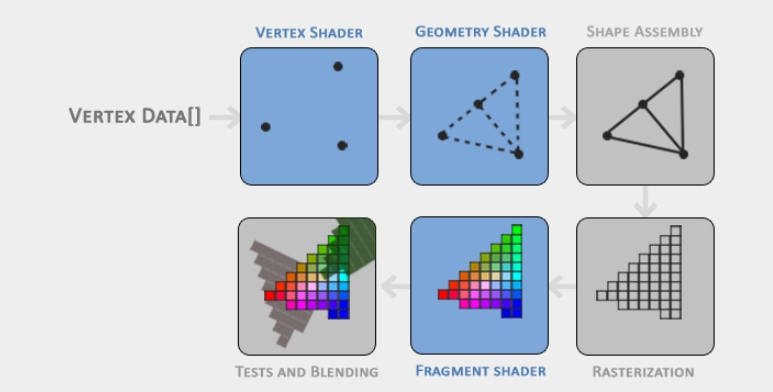
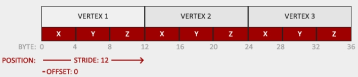
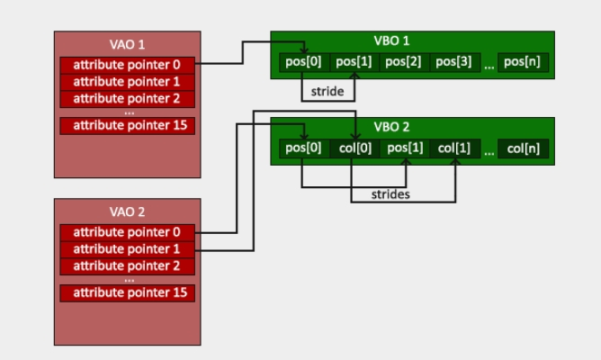

=== 你好，三角形

[.green]#图形管线# 负责把3D坐标转换为2D像素。其可粗分为两个部分，首先把三维坐标转换为二维坐标，然后把二维坐标转换为带有颜色值的像素。

图形管线可看作首尾相接的多个步骤，每个步骤的输出，是下个步骤的输入。这些步骤是高度定制化的，都有其功能，并且容易被并发执行。GPU里众多的核心就是用来执行管线各个步骤里的操作，这些操作的代码叫做着色器

图形管线的视觉化表述如下，蓝色的代表可被编程的步骤:

组成图形的一组三维坐标顶点值叫做 *顶点数据(Vertex Data)*， 顶点数据是用 *顶点属性(vertex attributes)* 表示的

[TIP]
====
为了让OpenGL知道你数据要渲染出什么东西，你需要告诉它这些数据的类型，这种类型叫做 [.green]#图元(primitive)#。包括有 [.blue]#点(GL_POINTS), 三角形(GL_TRIANGLES),和线段(GL_LINE_STRIP)# 
====

管线的各个着色阶段如下:

* [.green]#(顶点着色器)vertex shader#: 单个顶点数据作为输入，目的是把三维坐标转换为另一个三维坐标(后文会介绍其他用途), 可在此阶段对顶点属性做一些基本的处理，其处理完成后会输出到 [.green]#几何着色器(geometry shader)# 
* [.green]#几何着色器(geometry shader)#: (可选步骤)会把一组顶点作为输入，组成一个图元，并且也可以生成新的顶点，组成新的形状
* [.green]#图元组装(primitive assembly)#: 把之前着色器输出的所有顶点(或所有选中的点)组成图元
* [.green]#栅格化阶段(rasterization stage)#: 把上一步输出的所有图元映射为对应屏幕上的像素点，然后进行 [.green]#裁剪(clipping)# , 把所有在视野范围外的片段丢弃，以便提升性能

[TIP]
====
在OpenGL中，一个片段就是指渲染一个像素所需的所有数据
====

* [.green]#片段(片元)着色器(fragment shader)#: 主要功能是计算像素点得最终颜色值，一般也是所有OpenGL高级效果进行处理的地方。比如光照，阴影效果等
* [.green]#透明度测试和混色阶段(alpha test and blending stage)#: 检查像素的深度和模板值(后文会介绍), 用来检测物体是在前面还是后面，同时也会检查 [.green]#alpha值# (此值用来定义物体的透明度), 然后为响应的物体的颜色做出[.green]#混色# 处理。所以，即便像素的颜色已经在片段着色器里计算出来了，最终的像素颜色可能完全根计算出来的颜色不同

* [.green]#曲面细分和变换反馈循环#: 这两个阶段暂不介绍，会在后文说明

在现代OpenGL中，至少得有自己的顶点和片段着色器(GPU里没有默认的顶点和片段着色器)

==== 顶点的输入

要开始绘制首先得提供顶点数据，OpenGL是三维图形库，所以所有坐标都是以x,y,z坐标来设定的。OpenGL不会把你的坐标直接转成你屏幕上的二维像素。OpenGL只会处理x,y,z在[-1,1]之间的坐标。这个区间内的坐标叫做 [.green]#标准化设备坐标(NDC)# 此坐标区间内的图象是可见的，区间外的是不可见的

[TIP]
====
*NDC坐标*

顶点坐标在顶点着色器处理后，它们就会使NDC坐标，此坐标系的原点在屏幕中央，如图所示:

image::img/fg2_2.png

一般的屏幕坐标原点在左上角，所以要做转换。NDC坐标最后会通过你用glViewport提供的数据， [.green]#视口变换# 转换为屏幕空间坐标，最终的屏幕空间坐标会被转为片段，输入到片段着色器中
====

我们定义一组NDC坐标下的顶点，表示一个三角形:

[source,C++]
----
// z值都是0，所以看上去就是一个平面
float vertices[] = {
    -0.5f, -0.5f, 0.0f,
     0.5f, -0.5f, 0.0f,
     0.0f,  0.5f, 0.0f
};  
----

首先要在GPU上创建内存区，用于存储这些顶点数据，对OpenGL配置，决定如何解释这个内存区，和如何把这些数据传送给显卡。之后，顶点着色器就会根据配置处理这个内存区的顶点数据

管理这些内存的东西，叫做 [.green]顶点缓冲对象(vertex buffer objects(VBO)), 可把很多顶点数据存到GPU的内存中。VBO的好处是可一次性立即传输大量的数据到显卡，并且若没存足够时，保留这些数据，这样就不用每次只传送一个顶点的数据了。从CPU这边的内存里面传送数据到显卡是相对较慢的，所以尽可能地一次性传更多的数据。一旦数据在显卡的内存中，顶点着色器基本就可立即访问这些顶点数据，就会很快了

VBO就是我们第一个接触到的OpenGL对象，代码如下:

[source,C++]
----
unsigned int VBO;
// 此buffer的唯一ID为1
glGenBuffers(1, &VBO);  
----

OpenGL有多种类型的缓冲对象，VBO的类型叫 [.blue]#GL_ARRAY_BUFFER# OpenGL允许我们把不同类型的缓冲立即绑定到一起。我们可把刚刚创建的新缓冲对象绑定到GL_ARRAY_BUFFER，代码如下:

[source,C++]
----
glBindBuffer(GL_ARRAY_BUFFER, VBO);
----

然后我们在GL_ARRAY_BUFFER上的调用，都会使用当前绑定的这个缓冲对象，然后我们调用glBufferData()来把顶点数据传到缓冲的内存里

[source,C++]
----
// 把顶点数据拷贝到刚刚绑定的缓冲里
// 此函数用于拷贝用户定义的数据到当前绑定的缓冲中
// 第一个参数是缓冲类型，第二个参数定义了想要传入缓冲的数据的大小，第三个参数就是实际传入的数据，第四个参数设定了我们想要显卡如何管理这些数据
glBufferData(GL_ARRAY_BUFFER, sizeof(vertices), vertices, GL_STATIC_DRAW);
----

第四个参数有三个值:

* [.blue]#GL_STREAM_DRAW#: 数据只会设定一次，且只会被GPU使用最多几次
* [.blue]#GL_STATIC_DRAW#: 数据只会设定一次，并且会被使用多次
* [.blue]#GL_DYNAMIC_DRAW#: 数据会被经常改变，并且会被使用多次

我们的三角顶点数据不会改变，且会被经常使用，故选择  [.blue]#GL_STATIC_DRAW# ，若顶点数据会经常改变，使用 [.blue]#GL_DYNAMIC_DRAW# 能保证显卡把数据放在能更快写操作的内存中

现在我们把顶点数据通过VBO存到了显卡中，下一步我们会创建顶点和片段着色器

==== 顶点着色器

顶点着色器可用GLSL语言编程，着色器语言会在后文详细介绍。现代OpenGL需要至少一个顶点着色器程序和片段着色器程序。下面是顶点着色器的代码:

[source,GLSL]
----
#version 330 core
layout (location = 0) in vec3 aPos;

void main()
{
    gl_Position = vec4(aPos.x, aPos.y, aPos.z, 1.0);
}
----

第一行是OpenGL的版本号，330就是3.3；第二行使用关键词__in__声明了要输入的顶点属性，由于每个顶点有三维坐标，故创建了一个名字叫__aPos__的vec3输入变量，关于__layout location=0__会在后文介绍

[TIP]
====
GLSL使用最多四个元素的向量，可用vec.x, vec.y, vec.z, vec.w的方式取到值。w的值不作为坐标值使用，是用作称为 [.green]#透视分割(perspective division)# 来使用，在后文中会介绍
====

为了设定顶点着色器的输出，我们要给预定义变量 [.blue]#gl_Position# 赋值，这个变量的类型是vec4, 因为我们的aPos是三维的，故需要转换为四维的向量，w分量设为1.0f,详见后文

真实的应用里，顶点数据一般不是基于NDC坐标系的，故我们首先必须转换坐标系

==== 着色器的编译

把着色器代码写成C字符串如下:

[source,C++]
----
const char *vertexShaderSource = "#version 330 core\n"
    "layout (location = 0) in vec3 aPos;\n"
    "void main()\n"
    "{\n"
    "   gl_Position = vec4(aPos.x, aPos.y, aPos.z, 1.0);\n"
    "}\0";
----

为了让OpenGL能够使用这个着色器，代码必须在运行时动态编译。首先我们要创建一个着色器对象，通过ID来引用，用glCreateShader()来创建：

[source,C++]
----
// 顶点着色器的id
unsigned int vertexShader;
// 指定着色器类型GL_VERTEX_SHADER
vertexShader = glCreateShader(GL_VERTEX_SHADER);
----

然后我们把着色器源码和此着色器绑定，并编译此着色器

[source,C++]
----
// 着色器源码和着色器对象绑定
// 第二个参数代表有多少个字符串被当成源码，此处是1个字符串
glShaderSource(vertexShader, 1, &vertexShaderSource, NULL);
// 编译此着色器
glCompileShader(vertexShader);
----

[TIP]
====
如果你想检查着色器是否成功编译，你可以用下方代码完成:

[source,C++]
----
int  success;
char infoLog[512];
glGetShaderiv(vertexShader, GL_COMPILE_STATUS, &success);
if(!success)
{
    glGetShaderInfoLog(vertexShader, 512, NULL, infoLog);
    std::cout << "ERROR::SHADER::VERTEX::COMPILATION_FAILED\n" << infoLog << std::endl;
}
----
====

==== 片段着色器

用于像素颜色的计算，为了简单，此处统一输出橙色,着色器代码如下:

[source,C++]
----
#version 330 core
out vec4 FragColor;

void main()
{
    FragColor = vec4(1.0f, 0.5f, 0.2f, 1.0f);
} 
----

[TIP]
====
计算机图形学中的颜色被看成4个值的数组,红绿蓝和alpha(透明度)值，简称RGBA。值的区间在[0.0,1.0]，用这三种颜色分量混合出各种颜色
====

着色器代码中，通过__out__关键词输出最终的颜色值。为一个名叫__FragColor__的值赋予颜色RGBA值

编译片段着色器的代码与之前相似，只需把着色器创建的类型写为 [.blue]#GL_FRAGMENT_SHADER# 即可

[source,C++]
----
unsigned int fragmentShader;
fragmentShader = glCreateShader(GL_FRAGMENT_SHADER);
glShaderSource(fragmentShader, 1, &fragmentShaderSource, NULL);
glCompileShader(fragmentShader);
----

==== 着色器程序

着色器程序就是把已链接好的多个着色器合并到一起的程序。在使用之前编译好的着色器之前，需要先把着色器 
[.green]#链接(link)# 到着色器程序对象上，然后在渲染时激活这个程序，连接时会把每个着色器的输入输出首尾依次相连，若输入输出不匹配，会得到连接错误，创建此程序代码如下:

[source,C++]
----
// 创建着色器程序并返回id
unsigned int shaderProgram;
shaderProgram = glCreateProgram();
----

现在要绑定之前的两个编译好的着色器，并且用glLinkProgram()链接它们:

[source,C++]
----
// 绑定并链接着色器程序
glAttachShader(shaderProgram, vertexShader);
glAttachShader(shaderProgram, fragmentShader);
glLinkProgram(shaderProgram);
----

[TIP]
====
可通过下方代码检查链接成功与否并捕获响应的日志

[source,C++]
----
glGetProgramiv(shaderProgram, GL_LINK_STATUS, &success);
if(!success) {
    glGetProgramInfoLog(shaderProgram, 512, NULL, infoLog);
    ...
}
----
====

链接好后，通过glUseProgram（）激活:

[source,C++]
----
// 激活此着色器程序
glUseProgram(shaderProgram);
----

调用后所有着色和渲染都会使用此程序来执行处理。执行后就不需要之前的着色器对象了，通过以下语句删除:

[source,C++]
----
glDeleteShader(vertexShader);
glDeleteShader(fragmentShader); 
----

==== 顶点属性的链接

顶点着色器允许我们设定顶点属性以任何形式进行输入，故我们必须手动设定每一部分的数据应该对应顶点着色器里的哪个属性，也就是说要设定这些顶点数据应该被如何解析。

我们的顶点缓冲数据是以下方的格式组织的:

* 用32bit(4字节)来存储用浮点数表示的位置数据
* 每个位置用3个值表示
* 这三个值之间没有间隔，是被紧凑打包的
* 数据里的第一个值是缓冲的起始处

有了上述认识，我们就能通过glVertexAttribPointer()告诉OpenGL如何解释这些顶点数据了,代码如下:

[source,C++]
----
// 第一个参数代表哪个顶点属性会被配置,之前用layout (location = 0)声明的参数对应此处
// 第二个参数设定了顶点属性的大小，由于是vec3,故是由3个值组成
// 第三个参数设定数据的类型，这里是GL_FLOAT(浮点数)
// 第四个参数代表我们是否想让数据做归一化，若我们传入的是整型数据类型(int, byte)，那么设为GL_TRUE
// 第五个参数叫"跨度"，可设定两个相邻顶点属性的间隔，若是紧凑打包的，可设为0，代表自动检测
// 第六个参数代表偏移值，用来确定缓冲中第一个值的起始位置
glVertexAttribPointer(0, 3, GL_FLOAT, GL_FALSE, 3 * sizeof(float), (void*)0);
glEnableVertexAttribArray(0); 
----

[TIP]
====
每个顶点属性是从由VBO管理的内存中取出，从哪个VBO取，是根据当前绑定到GL_ARRAY_BUFFER上的缓冲来决定
====

到了此处，绘制之前的步骤基本准备好了，代码应该类似如下的情况:

[source,C++]
----
// 0. copy our vertices array in a buffer for OpenGL to use
glBindBuffer(GL_ARRAY_BUFFER, VBO);
glBufferData(GL_ARRAY_BUFFER, sizeof(vertices), vertices, GL_STATIC_DRAW);
// 1. then set the vertex attributes pointers
glVertexAttribPointer(0, 3, GL_FLOAT, GL_FALSE, 3 * sizeof(float), (void*)0);
glEnableVertexAttribArray(0);  
// 2. use our shader program when we want to render an object
glUseProgram(shaderProgram);
// 3. now draw the object 
someOpenGLFunctionThatDrawsOurTriangle(); 
----

绘制一个对象前都需要重复处理这些代码，但是若顶点属性很多时，缓冲对象的绑定和配置就变得很麻烦。所以就用一个对象来存储这些配置状态即可

==== 顶点数组对象

[.green]#顶点数组对象(vertex array object(VAO))# 可以类似VBO那样进行绑定，并在绑定后把后续的顶点属性调用存储到VAO里。此种做法的优点就是，当配置顶点属性时，你只需要调用一次即可，后续切换顶点数据和配置属性就不用每次都进行设定了。

[NOTE]
====
核心的OpenGL需要使用VAO，以便让其知道你要用顶点输入做什么事，若VAO绑定失败，OpenGL很可能会拒绝绘制任何东西
====

VAO存储了如下信息:

* glEnableVertexAttribArray 或 glDisableVertexAttribArray的调用
* 通过glVertexAttribPointer设定的顶点属性的配置
* 通过glVertexAttribPointer关联的VBO及其顶点属性

生成VAO的代码类似VBO，如下:

[source,C++]
----
unsigned int VAO;
glGenVertexArrays(1, &VAO); 
----

使用VAO的方法就是用glBindVertexArray取绑定。绑定后，要绑定和设定相关的VBO，然后解绑VAO以便之后复用。当我们想绘制一个对象，只需要绑定到这个VAO，代码如下:

[source,C++]
----
// ..:: Initialization code (done once (unless your object frequently changes)) :: ..
// 1. bind Vertex Array Object
glBindVertexArray(VAO);
// 2. copy our vertices array in a buffer for OpenGL to use
glBindBuffer(GL_ARRAY_BUFFER, VBO);
glBufferData(GL_ARRAY_BUFFER, sizeof(vertices), vertices, GL_STATIC_DRAW);
// 3. then set our vertex attributes pointers
glVertexAttribPointer(0, 3, GL_FLOAT, GL_FALSE, 3 * sizeof(float), (void*)0);
glEnableVertexAttribArray(0);  

  
[...]

// ..:: Drawing code (in render loop) :: ..
// 4. draw the object
glUseProgram(shaderProgram);
glBindVertexArray(VAO);
someOpenGLFunctionThatDrawsOurTriangle();  
----

VAO存储了我们顶点属性的配置和要使用的VBO，要绘制对象，只需取到此VAO，绑定，绘制，然后解绑即可

==== 期待已久的三角形

使用glDrawArrays来用当前已激活的着色器绘制图元。代码如下:

[source,C++]
----
glUseProgram(shaderProgram);
glBindVertexArray(VAO);
// 第一个参数是图元类型，第二个参数是顶点数组的起始索引，第三个参数是绘制的顶点数量
glDrawArrays(GL_TRIANGLES, 0, 3);
----

编译并运行程序，得到一个有橙色三角形的窗口

==== 元素缓冲对象

[.green]#元素缓冲对象(element buffer object(EBO))# 类似VBO，也是一个缓冲，其存储了顶点的索引，用于决定绘制哪个顶点, 这种绘制方式叫 [.green]#索引化绘制#

首先，我们定义一组唯一顶点及其索引，用于绘制一个矩形

[source,C++]
----
float vertices[] = {
     0.5f,  0.5f, 0.0f,  // top right
     0.5f, -0.5f, 0.0f,  // bottom right
    -0.5f, -0.5f, 0.0f,  // bottom left
    -0.5f,  0.5f, 0.0f   // top left 
};
unsigned int indices[] = {  // note that we start from 0!
    0, 1, 3,   // first triangle
    1, 2, 3    // second triangle
}; 
----

使用了索引，我们只需要4个顶点，而不是6个。然后，我们创建EBO

[source,C++]
----
unsigned int EBO;
glGenBuffers(1, &EBO);
----

然后绑定到__EL_ELEMENT_ARRAY_BUFFER__上

[source,C++]
----
glBindBuffer(GL_ELEMENT_ARRAY_BUFFER, EBO);
glBufferData(GL_ELEMENT_ARRAY_BUFFER, sizeof(indices), indices, GL_STATIC_DRAW); 
----

然后，把原先的glDrawArrays()换为glDrawElements()，表示我们用索引缓冲来渲染三角形,代码如下:

[source,C++]
----
glBindBuffer(GL_ELEMENT_ARRAY_BUFFER, EBO);
// 虽然只有4个顶点，但是是按索引当作6个点绘制
glDrawElements(GL_TRIANGLES, 6, GL_UNSIGNED_INT, 0);
----

glDrawElements()会取当前绑定的EBO里面的索引来绘制，那么也就是说每次绘制时都需要绑定一次，太麻烦。VAO也会跟踪EBO的绑定，当绑定VAO时，最后一个EBO也会被绑定，EBO是作为VAO的成员存储的，绑定到VAO也意味着自动绑定了那个EBO

image::img/fg2_5.png

[NOTE]
====
当目标是 [.blue]#GL_ELEMENT_ARRAY_BUFFER# 时，VAO会存储__glBindBuffer__的调用，这代表解绑的调用也会被存下来，所以在解绑VAO前，确保没有解绑EBO，否则你的EBO就是没配置的
====

代码的样子如下所示:

[source,C++]
----
// ..:: Initialization code :: ..
// 1. bind Vertex Array Object
glBindVertexArray(VAO);
// 2. copy our vertices array in a vertex buffer for OpenGL to use
glBindBuffer(GL_ARRAY_BUFFER, VBO);
glBufferData(GL_ARRAY_BUFFER, sizeof(vertices), vertices, GL_STATIC_DRAW);
// 3. copy our index array in a element buffer for OpenGL to use
glBindBuffer(GL_ELEMENT_ARRAY_BUFFER, EBO);
glBufferData(GL_ELEMENT_ARRAY_BUFFER, sizeof(indices), indices, GL_STATIC_DRAW);
// 4. then set the vertex attributes pointers
glVertexAttribPointer(0, 3, GL_FLOAT, GL_FALSE, 3 * sizeof(float), (void*)0);
glEnableVertexAttribArray(0);  

[...]
  
// ..:: Drawing code (in render loop) :: ..
glUseProgram(shaderProgram);
glBindVertexArray(VAO);
glDrawElements(GL_TRIANGLES, 6, GL_UNSIGNED_INT, 0);
glBindVertexArray(0);
----

运行代码会显示一个橙色矩形，在 [.green]#线框模式(wireframe mode)# 下，可以看到矩形是由两个三角形组成

[TIP]
====
*线框模式*:

可通过glPolygonMode(GL_FRONT_AND_BACK, GL_LINE)设定图元的绘制方式为线框模式，第一个参数代表应用于前方和后方的所有三角形，第二个参数代表用线段来绘制

要设置回默认模式，使用glPolygonMode(GL_FRONT_AND_BACK, GL_FILL)
====

==== 额外资源

* link:https://learnopengl.com/In-Practice/Debugging[讲OpenGL如何调试]

