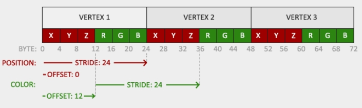

=== 着色器

着色器用于实现图形管线中特定的一部分功能，着色器之间无法直接交换数据，只能通过输入和输出相连的方式交换数据。着色器的执行是相互独立的。

==== GLSL

GLSL就是类C的语言，专门用于对向量和矩阵进行操作。

首先，用版本号声明作为开头，然后是输入和输出的变量列表，全局变量(uniform),然后是main函数。main函数是着色器的执行入口，在这个函数体里面，会对输入的变量做出处理，并输出结果。

着色器程序如下所示:

[source, GLSL]
----
#version version_number
in type in_variable_name;
in type in_variable_name;

out type out_variable_name;
  
uniform type uniform_name;
  
void main()
{
  // process input(s) and do some weird graphics stuff
  ...
  // output processed stuff to output variable
  out_variable_name = weird_stuff_we_processed;
}
----

其中每个输入的变量就叫做 [.green]#顶点属性(vertex attribute)# 其有一个最大数量限制，这个大小取决于硬件。OpenGL保证至少可用16个具有4个分量的顶点属性，但是一些硬件允许更多的数量，可通过 [.blue]#GL_MAX_VERTEX_ATTRIBS#

[source,C++]
----
int nrAttributes;
glGetIntegerv(GL_MAX_VERTEX_ATTRIBS, &nrAttributes);
std::cout << "Maximum nr of vertex attributes supported: " << nrAttributes << std::endl;
----

一般来讲至少返回16， 大部分场景下是够用了

==== 类型

GLSL就如其他编程语言那样，拥有各种数据类型，如同C语言一样，GLSL也有大部分默认的基础类型，比如int， float, double, uint, bool，还有两种常用的容器类型，比如vector, matrix, 关于矩阵我们会在后文详述

===== 向量

向量具有2-4个分量，分量可以是任何一种基础类型:

* vecn: n个浮点数的默认向量
* bvecn: n个布尔值的向量
* ivecn: n个int
* uvecn: n个无符号整型
* dvecn: n个double

有一种特性叫 [.green]#swizzling# 混合，可以灵活的组合向量的分量,如下:

[source,C++]
----
vec2 someVec;
vec4 differentVec = someVec.xyxx;
vec3 anotherVec = differentVec.zyw;
vec4 otherVec = someVec.xxxx + anotherVec.yxzy;
----

也可以往构造器里传入参数，组成和新的向量，这样可以减少需要的参数:

[source,C++]
----
vec2 vect = vec2(0.5, 0.7);
vec4 result = vec4(vect, 0.0, 0.0);
vec4 otherResult = vec4(result.xyz, 1.0);
----

==== 输入和输出

两个关键词，__in__和__out__用于在着色器中声明输入和输出的参数，上一个着色器的out如果根下一个着色器的in匹配上，为了定义顶点数据的组织方式，我们通过设定其位置元数据来实现，这样，我们就能在CPU这边配置顶点的属性。

前面的章节已经见过__layout(location = 0)__的关键词，顶点着色器因此需要为此输入值提供额外的布局特性，以便我们能把其与顶点数据相链接

[NOTE]
====
也可以省略__layout(location = 0)__标识符，用glGetAttribLocation来查询属性的位置，但是我喜欢在顶点着色器里面设定好，这样做易于理解，并且有些时候省事
====

片段着色器需要一个vec4类型的颜色值作为输出。如果没定义此变量，那么颜色缓冲的输出值就是未定义的，一般来讲，颜色就是黑的或者白的

当你把着色器程序做链接时，in和out的变量，若名称和类型相同，就会被链接起来

==== 全局变量

[.green]#全局变量(Uniform)# 是另一种从我们的程序里把数据传给GPU的方法。

不同于顶点属性的是，此类型的变量是全局的,意味着此变量在整个着色程序中是唯一的，且可被任何着色器访问。

只需添加__uniform__关键词即可声明。哪个着色器用到就在哪里声明。

[NOTE]
====
如果你声明了一个没用到的uniform，编译器会隐式删除此变量，这可能导致一些错误，切记
====

我们可以利用uniform实现根据时间变化图形的颜色，如下所示:

[source,C++]
----
float timeValue = glfwGetTime();
float greenValue = (sin(timeValue) / 2.0f) + 0.5f;
// 注意，找寻全局变量的位置不要求先使用此着色器程序，但是更新此值时，需要你先使用此程序
int vertexColorLocation = glGetUniformLocation(shaderProgram, "ourColor");
glUseProgram(shaderProgram);
glUniform4f(vertexColorLocation, 0.0f, greenValue, 0.0f, 1.0f);
----

[NOTE]
====
OpenGL的函数没有原生的函数重写支持，故函数可以用不同的类型定义OpenGL的新函数，比如glUniform就可以根据后缀区分类型:
* f: float
* i: int
* ui: unsigned int
* 3f: 三个float
* fv: float类型的向量或数组
====

更新后的渲染循环代码如下：

[source,C++]
----
while(!glfwWindowShouldClose(window))
{
    // input
    processInput(window);

    // render
    // clear the colorbuffer
    glClearColor(0.2f, 0.3f, 0.3f, 1.0f);
    glClear(GL_COLOR_BUFFER_BIT);

    // be sure to activate the shader
    glUseProgram(shaderProgram);
  
    // update the uniform color
    float timeValue = glfwGetTime();
    float greenValue = sin(timeValue) / 2.0f + 0.5f;
    int vertexColorLocation = glGetUniformLocation(shaderProgram, "ourColor");
    glUniform4f(vertexColorLocation, 0.0f, greenValue, 0.0f, 1.0f);

    // now render the triangle
    glBindVertexArray(VAO);
    glDrawArrays(GL_TRIANGLES, 0, 3);
  
    // swap buffers and poll IO events
    glfwSwapBuffers(window);
    glfwPollEvents();
}
----

那么如果每个顶点都需要改变颜色怎么办？不可能每个顶点都设置一个uniform吧，接下来我们会用顶点属性来实现此需求

==== 更多的属性!

我们把顶点的颜色值也写进顶点数据中，为每个三角形的顶点赋予红绿蓝的颜色值,如下所示:

[source,C++]
----
float vertices[] = {
    // positions         // colors
     0.5f, -0.5f, 0.0f,  1.0f, 0.0f, 0.0f,   // bottom right
    -0.5f, -0.5f, 0.0f,  0.0f, 1.0f, 0.0f,   // bottom left
     0.0f,  0.5f, 0.0f,  0.0f, 0.0f, 1.0f    // top 
}; 
----

由于现在有更多的数据传入到顶点着色器，有必要调整顶点着色器，来接收新的顶点属性，注意，此处的__aColor__属性的限定符是1

[source,GLSL]
----
#version 330 core
layout (location = 0) in vec3 aPos;   // the position variable has attribute position 0
layout (location = 1) in vec3 aColor; // the color variable has attribute position 1
  
out vec3 ourColor; // output a color to the fragment shader

void main()
{
    gl_Position = vec4(aPos, 1.0);
    ourColor = aColor; // set ourColor to the input color we got from the vertex data
}
----

片段着色器也需要相应修改，把ourColor作为输入变量

[source,GLSL]
----
#version 330 core
out vec4 FragColor;  
in vec3 ourColor;
  
void main()
{
    FragColor = vec4(ourColor, 1.0);
}
----

由于我们添加了新的顶点属性，VBO中内存的配置也更新了，必须重新配置顶点属性的指针，现在VBO中的内存布局类似这样:

得知了当前的布局，我们就能用glVertexAttribPointer更新顶点的格式:

[source,C++]
----
// position attribute
glVertexAttribPointer(0, 3, GL_FLOAT, GL_FALSE, 6 * sizeof(float), (void*)0);
glEnableVertexAttribArray(0);
// color attribute
glVertexAttribPointer(1, 3, GL_FLOAT, GL_FALSE, 6 * sizeof(float), (void*)(3* sizeof(float)));
glEnableVertexAttribArray(1);
----

注意上方的步长由于内存存入的缓冲数据格式添加了rgb颜色值，要重新计算

运行程序后，可看到一个彩色的三角形，代码link:https://learnopengl.com/code_viewer_gh.php?code=src/1.getting_started/3.2.shaders_interpolation/shaders_interpolation.cpp[在此]

这个图像不是你实际想要的，因为我们只提供了三种颜色，而不是三个颜色块，这是因为被片段着色器里的 [.green]#片段颜色插值# 处理过了。每个像素点的颜色是根据它们与各个顶点的位置插值得出的。片段插值会被应用到所有片段着色器输入的属性上

=== 我们自己的着色器类

由于编写，编译和管理着色器比较麻烦，我们建立了一个着色器类，从硬盘中读取着色器代码，编译并链接它们，也可以检查错误，着色器类如下所示:

[source,C++]
----
#ifndef SHADER_H
#define SHADER_H

#include <glad/glad.h> // include glad to get all the required OpenGL headers
  
#include <string>
#include <fstream>
#include <sstream>
#include <iostream>
  

class Shader
{
public:
    // the program ID
    unsigned int ID;
  
    // constructor reads and builds the shader
    Shader(const char* vertexPath, const char* fragmentPath);
    // use/activate the shader
    void use();
    // utility uniform functions
    void setBool(const std::string &name, bool value) const;  
    void setInt(const std::string &name, int value) const;   
    void setFloat(const std::string &name, float value) const;
};
  
#endif
----

==== 从文件中读取

代码如下:

[source,C++]
----
Shader(const char* vertexPath, const char* fragmentPath)
{
    // 1. retrieve the vertex/fragment source code from filePath
    std::string vertexCode;
    std::string fragmentCode;
    std::ifstream vShaderFile;
    std::ifstream fShaderFile;
    // ensure ifstream objects can throw exceptions:
    vShaderFile.exceptions (std::ifstream::failbit | std::ifstream::badbit);
    fShaderFile.exceptions (std::ifstream::failbit | std::ifstream::badbit);
    try 
    {
        // open files
        vShaderFile.open(vertexPath);
        fShaderFile.open(fragmentPath);
        std::stringstream vShaderStream, fShaderStream;
        // read file's buffer contents into streams
        vShaderStream << vShaderFile.rdbuf();
        fShaderStream << fShaderFile.rdbuf();		
        // close file handlers
        vShaderFile.close();
        fShaderFile.close();
        // convert stream into string
        vertexCode   = vShaderStream.str();
        fragmentCode = fShaderStream.str();		
    }
    catch(std::ifstream::failure e)
    {
        std::cout << "ERROR::SHADER::FILE_NOT_SUCCESFULLY_READ" << std::endl;
    }
    const char* vShaderCode = vertexCode.c_str();
    const char* fShaderCode = fragmentCode.c_str();
    [...]
----

然后就可以加上编译和链接着色器的代码:

[source,c++]
----
unsigned int vertex, fragment;
int success;
char infoLog[512];
   
// vertex Shader
vertex = glCreateShader(GL_VERTEX_SHADER);
glShaderSource(vertex, 1, &vShaderCode, NULL);
glCompileShader(vertex);
// print compile errors if any
glGetShaderiv(vertex, GL_COMPILE_STATUS, &success);
if(!success)
{
    glGetShaderInfoLog(vertex, 512, NULL, infoLog);
    std::cout << "ERROR::SHADER::VERTEX::COMPILATION_FAILED\n" << infoLog << std::endl;
};
  
// similiar for Fragment Shader
[...]
  
// shader Program
ID = glCreateProgram();
glAttachShader(ID, vertex);
glAttachShader(ID, fragment);
glLinkProgram(ID);
// print linking errors if any
glGetProgramiv(ID, GL_LINK_STATUS, &success);
if(!success)
{
    glGetProgramInfoLog(ID, 512, NULL, infoLog);
    std::cout << "ERROR::SHADER::PROGRAM::LINKING_FAILED\n" << infoLog << std::endl;
}
  
// delete the shaders as they're linked into our program now and no longer necessary
glDeleteShader(vertex);
glDeleteShader(fragment);
----

use函数直截了当:

[source,C++]
----
void use() 
{ 
    glUseProgram(ID);
}  
----

其他uniform的设置方法也很简单:

[source,C++]
----
void setBool(const std::string &name, bool value) const
{         
    glUniform1i(glGetUniformLocation(ID, name.c_str()), (int)value); 
}
void setInt(const std::string &name, int value) const
{ 
    glUniform1i(glGetUniformLocation(ID, name.c_str()), value); 
}
void setFloat(const std::string &name, float value) const
{ 
    glUniform1f(glGetUniformLocation(ID, name.c_str()), value); 
} 
----

使用方法如下:

[source,C++]
----
Shader ourShader("path/to/shaders/shader.vs", "path/to/shaders/shader.fs");
[...]
while(...)
{
    ourShader.use();
    ourShader.setFloat("someUniform", 1.0f);
    DrawStuff();
}
----

link:https://learnopengl.com/code_viewer_gh.php?code=src/1.getting_started/3.3.shaders_class/shaders_class.cpp[此处]是代码示例

link:https://learnopengl.com/code_viewer_gh.php?code=includes/learnopengl/shader_s.h[此处]是着色器类代码