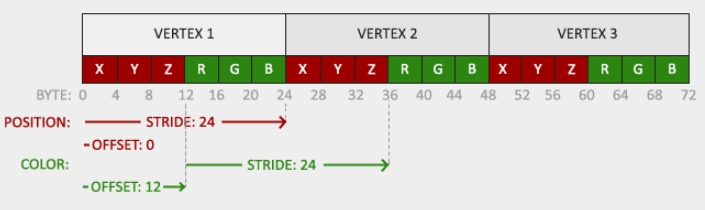
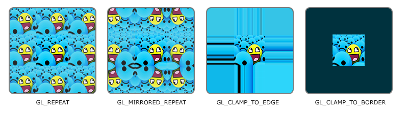

= LearnOpenGL 精要
:toc:
:toc-title: 目录

== 简单介绍

* OpenGL可以操作GPU(显卡)，使其可以在你的屏幕上显示图像
* OpenGL是用C语言编写的库，提供了一组API，你可通过调用API，完成对GPU的操作
* OpenGL是一个大型状态机，也就是代码调用时，要根据你之前对状态相关的API的调用，来确定当前的状态，再做出操作

== VBO

即顶点缓冲对象，用于把顶点的相关数据,比如位置，颜色，纹理坐标等，存到显存里，显存里的值是连续紧密挨着的，在绘制时要根据这些数据把顶点绘制出来

=== 创建

glGenBuffer(生成) -> glBindBuffer(绑定) -> glBufferData(配置) -> glVertexAttribPointer(描述vbo里面的数据怎么使用) -> glEnableVertexAttribArray(启用某个location的顶点属性)

== VAO

即顶点数组对象，把对VBO或EBO的操作录制下来，方便不同缓冲使用同样的配置来使用，减少配置代码

== 内存排布和配置参考

通过glVertexAttribPointer配置属性的指针，代表每个属性应该从哪读，读到哪

=== 创建

glGenVertexArrays(生成VAO) -> glBindVertexArray(绑定VAO，要在VBO之前操作) -> [对VBO做配置，让此VAO记录下配置操作] -> glBindVertexArray(0)(解绑此VAO(录制完毕))

=== 使用

绘制前调用glBindBuffer帮到要用的VAO

== EBO

带索引的VBO，用于按特定顺序绘制顶点，可减少顶点数据量

=== 创建

与VBO创建类似，只需把缓冲类型改为GL_ELEMENT_ARRAY_BUFFER即可

=== 使用

绘制时是调用glDrawElement

== 图形管线

把顶点处理并最终输出为图像的一系列过程

=== 步骤

顶点数据 -> 顶点着色器(可编程) -> 几何着色器(可选,可编程) -> 图元装配 -> 栅格化 -> 片段着色器（可编程） -> 测试与混合

== 着色器

独立且并行地运行在GPU里的小程序，一个shader对应图形管线里一个阶段

=== 创建

glCreateShader(创建着色器) -> glShaderSource(指定源码) -> glCompileShader(编译着色器) -> [可拿到日志(getShaderiv, glGetShaderInfoLog)] -> glCreateProgram(创建着色器程序) -> glAttachShader(把着色器与着色器程序绑定) -> glLinkProgram(按着色器类型，连接着色器) -> [成功后可删除着色器glDeleteShader] -> [可拿日志] -> glUseProgram(激活此着色器程序)

=== 使用

glUseProgram后就是使用此着色器程序来运行

== GLSL

OpenGL着色器的源代码所用语言

=== 基本数据类型

int， float, double, uint, bool

=== 向量类型

[基本数据类型首字母] + vec + [n](n在[2,4]间)， n代表分量，可用xyzw(位置),rgba(颜色), stpq(纹理坐标)取各个分量

=== 语法

* layout (location = ?) 指定变量对应的位置，要在VBO或EBO配置的时候配好并启用才有效，不写默认0

* uniform 全局变量，从程序里可通过此变量把参数传到着色器里

** 通过glUniform[n][type]设置值(glUseProgram后才可以设置)
** 通过glGetUniformLocation查uniform变量的location(不必glUseProgram)

== 纹理

纹理坐标(tex coord)在[0,1]间，左下角是原点

用纹理坐标取值的行为叫做*采样(sampling)*

*纹理过滤* 就是指如何根据纹理坐标取到纹理上的颜色，纹理上的像素点就叫做**纹素(texel)**, 获取颜色的方式一般有两种:

* 最近：取纹理坐标最近的那个纹素的颜色,图像颗粒感强
* 线性: 取纹理坐标周围的纹素的颜色，按照距离纹素的多少按比例混色，图像柔和但是看起来边缘模糊

=== 纹理环绕方式

超过纹理坐标范围的部分设置处理方式

* 重复
* 镜像重复
* 按照边缘值
* 指定超出边缘时显示的颜色

效果如下所示:

=== mipmap

把纹理按不同分辨率缩放后拼在一起存起来，方便在远处使用低分辨率，近处使用高分辨率，降低显存消耗，减少视觉bug

等级代表距离的级别，在切换等级是也可能产生生硬边界，也可设置过滤选项，还可以按放大还是缩小时分别配置

通过glTexParameteri配置

=== 纹理创建

glGenTextures(创建纹理) -> glBindTexture(绑到哪种纹理上) -> glTexImage2D(配置此绑定的纹理) -> glGenerateMipmap(生成mipmap) -> [可释放图片占用的内存]

=== 纹理使用

在GLSL里，声明uniform sampler2D,使用texture()根据纹理坐标取到对应纹理的颜色值

mix()可用来把多个纹理做混色处理，glUniform1i可设置纹理属于哪个单元

=== 纹理单元

就是纹理所在的location，默认为0，0单元默认是激活的，可用glActiveTexture激活单元，OpenGL的硬件至少支持16个单元

== 变换

四维矩阵用于图形的旋转，平移，缩放

先缩放,再旋转，最后位移

通过uniform变量把变换矩阵传到着色器里，对应变量声明如: uniform mat4 transform;

万向节锁： 某轴旋转90°时，由于重合于另一个轴，造成失去一个自由度，这两个轴的任何操作都变成重合后的轴的旋转操作

解决办法:
* 四元数
* 欧拉角做特殊处理

== 坐标系

* 局部/物体/对象 坐标系： 物体自己的坐标系
* 世界坐标系: 整个场景
* 观察坐标系: 相对于相机的坐标系
* 裁剪坐标系: 相机看不到的去掉，只留下能看到的部分
* 屏幕坐标系: 转变为屏幕对应的坐标系

通过M(本地转世界)V(世界转观察)P(添加投影效果)变换矩阵，一步一步从局部坐标系，转成屏幕坐标系

=== 计算法

P矩阵 * V矩阵 * M矩阵 * 本地坐标系下的原始坐标值，通过uniform传给着色器

== z-buffer

存在每个片段的z值，表示距离相机的前后，通过深度测试比较出哪个在前，方便只显示在前面的像素

=== 使用

通过glEnable(GL_DEPTH_TEST)启用

每帧绘制前要先清除: glClear(GL_DEPTH_BUFFER_BIT)

== 相机

要选择左手还是右手坐标系，然后给出在世界坐标下的位置，朝向，右向量，上向量，然后得出lookat矩阵，方便计算相机看到的物体的样子

