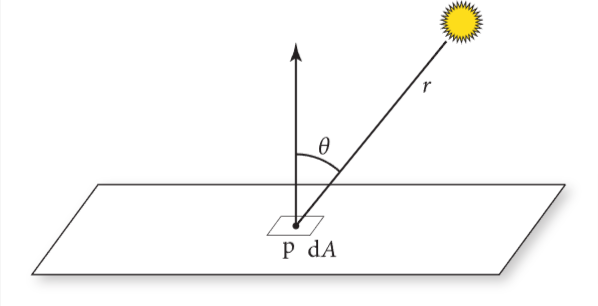
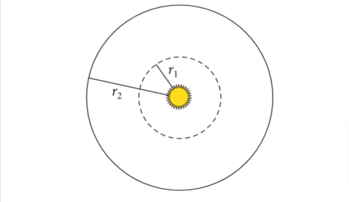
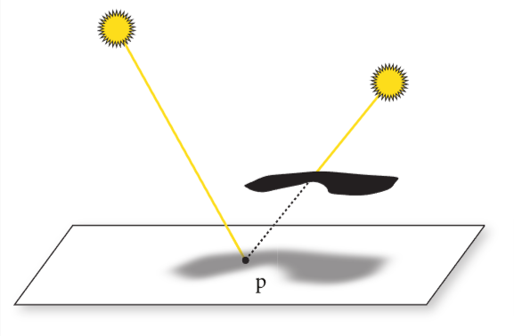
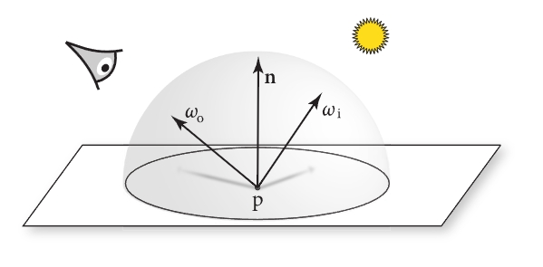

# 1 本书目标和总览

pbrt是基于光线追踪算法的。此算法沿着无限小的光线出发，直到与物体表面产生交互，用这种方式在某个特定位置和方向找到首个可视物体是十分简单的。同时，这种方法也是很多其他渲染算法的基础。

作者希望此书完整，图文并茂，且是基于物理(学)的

后面就是作者展开解释这几个概念，然后介绍了本书在版本迭代中更新的内容

> 本人补充或感受写到这种引用格式里
>
> 我编排的章节大体与原著一致，少数小篇章由本人重新整理，可能会略有小改，但是总体遵循原著。
>
> 内容是翻译加个人总结重新整理语言后写出来的，应该符合中文表达习惯。只保留了最重要的信息，所以部分内容会被省略，但是也会有一些内容会补充解释

## 介绍

### 什么是渲染？

即从3d场景的(代码/数学的)描述里，处理并生成图片。

### 什么是基于物理？

> 我个人更偏向于叫“基于物理学的”

即使用物理学上的规则和定律，去对现实世界的画面做拟真，这里主要指的是光线和物体之间的交互规律。这种技术被广泛使用大概只有15年，也就是比较新。

### 什么是pbrt？

pbrt即Physically Based Rendering Toolkit(基于物理的渲染工具包)，这个渲染系统是基于光线追踪算法的。能被用来渲染复杂场景下的仿真图片

### 本书特点

其他书只有理论，这本书既有理论又有完整实现，还提供了开源代码

## 文学式编程

Donald Knuth提出了编程美学的想法。简单来讲就是以人为本，而不是以机器为本的编程思想。代码可以被人类更好的阅读和理解。

后面举了文学式编程的例子，我看下来感觉像是基于注释的编程，每个注释代表了一段代码片段，通过注释去链接和跳转，和组织实际代码。

## 照片级渲染和光线追踪算法

### 照片级渲染的目的

根据3d场景创建分不清是实拍照片还是渲染出来的图片。具体来说就是用物理学方法，基于现在的显示技术，尽量准确的模拟光线与物体的交互过程。

### 什么是光？

描述了人类对光的认识的发展，讲到了光的波粒二象性。后面提到我们不用模拟到如此之深，因为光的波动性现象只在微观层面比较明显。这里我们主要是模拟光的粒子性，这种方式叫做光线追踪。

### 什么是光线追踪

简单来说就是模拟光的传播路径，在特定场景中会与其他物体交互和散射出来的这个过程。

大部分光追渲染系统都有以下这些因素的考虑:

1. 相机： 主要用来决定怎么看到这个场景。很多渲染系统把光看作是从相机发出的，然后打到场景中，来检测和观看这些光碰到的物体，然后把这些信息呈现到每个像素点上。

2. 光与物体的相交： 光线在场景里的物体相交时如何作用，比如物体的材质，法线等属性。大部分光追器能检测光线和多个物体的交点，但是一般来说，只返回第一个光线与物体相交的交点。

3. 光源： 光线追踪器必须模拟整个场景中光线的分布情况，这不仅包括灯光本身的位置，还包括它们在空间中分布能量的方式。

4. 光在物体表面的散射： 每个物体都需要提供它的外观信息，包括光如何与其表面交互，也包括光的再次辐射（折射，反射）的现象。关于表面散射的建模是参数化的，这样方便用来模拟各种外观材质。

5. 间接光的传播： 由于光打到物体上还会再次散射出来，所以光追器需要能捕捉并处理这些效应。

6. 光线的传播： 光在介质中传播的效应也需要考虑，比如在雾中，在烟中等

这些因素在后文都将充分介绍。

### 相机和胶片

介绍了针孔相机和视锥体。也就是针孔相机只关注所有经过这个小孔的光线，光线可以用一个原点加一个方向定义。针孔相机可以看成从这个孔作为原点，射向所看场景的方向，来定义这个光线。

到达相机的所有光线中，能量和波长都各有不同。人类的视觉系统会根据光的波长的不同，区分为不同的颜色。大部分相机的感应器能收集三种不同波长的光的分布情况，对应到红色，绿色和蓝色。这些光的信息足够让人类观察者感知到场景的视觉呈现样貌。

因此，pbrt还对胶片进行了抽象，用其储存图像，并且模拟胶片对入射光的反应。

pbrt中的相机和胶片的抽象在第五章会详细说明。除此以外，渲染系统就能关注于衡量光线的光照效果。

### 光线与物体的相交

当相机生成了一条光线，渲染器的第一个任务就是检测这个光线第一个碰到的物体，光线与其相交的交点，这个交点对于这个光线就是可见的，然后我们会模拟光在这个交点上的交互效应。

为了找到这个交点，我们要在所有物体中找到与这个光线相交的，并取出第一个这样的物体。我们先定义光线的表达式：

$$r(t) = o + t\vec{d}$$

o是光线原点，d是光的方向向量，t是光传播的时间，介于$[0,+\infty)$, r(t)是光线基于t的函数，找寻交点位置的话，确定t就可以了。
假设物体的表示函数是一个隐函数$F(x,y,z)=0$, 那么就是说，我们可以把光线方程带入到这个隐函数里，那么这个隐函数就只有一个未知参数就是t，我们在解出这个t，取最小的正根，就是最近的相交点对应的t。

比如，一个在原点的球面，半径为r的隐函数如下:

$$
x^2 + y^2 + z^2 - r^2 = 0
$$

把xyz的值替换为r(t)在三个维度的分量如下:

$$
(o_x + t\vec{d_x})^2 + (o_y + t\vec{d_y})^2 + (o_z + t\vec{d_z})^2 - r^2 = 0
$$

即这个式子只有t是未知的，只需要解t，看这个二次函数有没有实根就行。若没有实根，就是光线没有与球面相交，若有实根，那么最小的正实根就是交点。

找到交点对于光追器来说还远远不够，还需要知道交点所在表面的特定属性。首先，要找到这个交点对应的材质，然后，为了对这个点着色，额外的几何信息也需要提供，比如法线向量$\vec{n}$。虽然大部分光追器只需要$\vec{n}$,但是像pbrt这样的精密渲染系统还需要更多的信息，比如，表面的局部参数，位置，多种偏导数等。

如果直接找场景中所有物体求交点，那么程序就太慢了。更好的方式是用一种加速结构来快速去除不会与光相交的物体，把光追器的算法的时间复杂度降低至$O(m\log n)$，m是图像中的像素点个数，n是场景中物体的数量。虽然建立这个加速结构本身时间复杂度也是$O(n)$。这种方式对于复杂场景是很有效的。

pbrt对于各种形状的的几何相关的接口定义和实现会在第六章详述，加速结构会在第七章详述。

### 光的分布

之前的章节讲了如何找到光线与物体的交点，现在需要考虑光线到达交点后，会有多少光作用其上。这个问题涉及到场景中光的几何分布和光辐射分布。

对于点光源这样的简单光源来说，光的几何分布只取决于光的位置，但是点光源在现实中是不存在的，所以，基于物理的光都是基于面光源的。这代表了光源与其发出光的表面的几何形状有关。

为了更简单，在这里先用点光源做示例，更具体的内容见第4章和12章。

我们需要知道光线在交点p周围的微小区域里的分布了多少光。假设光源的光功率为$\Phi$,从这个点光源从各个方向辐射出来的光强度都是一致的，就是说，包裹这个点光源的单位球面上的光功率就是$\Phi/(4\pi)$, 具体的度量方法会在4.1节解释。

> 功率是指单位时间内传递的能量，单位是瓦特，能量单位是焦耳
>
> 球面面积方程是$S=4\pi r^2$, 单位球面r=1，球面的单位面积就是$1/4\pi$, 所以球面的单位面积的功率就是$\Phi/(4\pi)$



图1.5 检测p点周围微分面积内接收到的光功率，光源到p点的距离用r表示

考虑在图1.6中，由于之前假设光源在每个方向上的光功率一致，也就是单位面积上的光功率一致，那么距离光源越远的球面上，由于总面积变大，每个单位面积上的光功率就会变小。对于半径为r的球面上的单位面积的光功率根据r的变化，遵循$1/r^2$的变化规律



假设p点附近的微分面dA与入射光有$\theta$角(见图1.5)，光功率分布于dA上的比例以$\cos \theta$变化(也就是角度越小，功率越大)，综上可得，在这个微分面上的微分光功率dE就是:

$$
dE = \frac{\Phi \cos \theta}{4 \pi r^2}
$$

> 这里r就是光源到交点距离，θ就是r与交点法线的夹角，$\Phi$就是光源的功率(可以近似看作单位时间内光源亮度)

也就是说，打在一个物体表面的光有多少，与两个量有关，$\cos \theta$(表面与光方向的夹角余弦)和r(光源到交点的距离)

由于光是直线传播的，所以场景中的多光源是易于处理的。对于总体光照表现来说，可以通过分别计算每一束光线，再把其累加起来完成。这意味着，对于场景中的每个着色点，只需要使用专门的算法来对部分光源进行随机采样就可以了。详见12.6章节。

### 可见性

在之前的章节中，忽略了一个重要的因素：阴影。对于某些着色点，只有在光可以到达的位置才能被着色，即假设了光是畅通无阻的。

如下图，左侧的光可以照射到p点，右侧的光到达不了p点



还好，对于光追器来说，检测光源是否能到达着色点是容易的。只需要在这个点上构造一个射线，看是否能到达光所在的点就行，这种特殊的射线叫做阴影射线。

如果我们跟着阴影射线走，直达光源，比较这个t和光源碰撞的第一个物体的t就可以判断出这个点是否被遮挡。若没有被遮挡，这一点的着色就需要加上该光源对其的贡献。

### 光在表面的散射

> 这里的散射代表光的反射、漫反射、折射等一切从表面改变传播方向的现象的总称

我们现在能计算出重要的两个方面的信息了，着色点的位置和在其上的入射光照。现在需要考虑光在表面是如何散射的。

特别是对于交点p，散射出来的光(特别是朝向相机位置的光)带了多少能量。

如下图，入射光方向$\omega_i$, 交点p，散射出来的光到相机的方向$\omega_o$, $\omega_o$方向上光有多少能量取决于入射光的能量和BRDF



> BRDF(双向反射分布函数): 是一个函数，描述光线从一个方向入射到表面后，以另一个方向反射的比例，这个函数的参数就包括了$\omega_i$和$\omega_o$

场景中的每个物体都得有一个材质属性，这个属性用来描述表面每个点的外观属性。材质里就包含了BRDF,这个函数描述光线从一个方向入射到表面后，以另一个方向反射的能量的比例，对于p点的BRDF，函数就是$f_r(p, \omega_o, \omega_i)$ (为了方便计算，$\omega$是单位向量)

那么，我们很容易通过BRDF的定义，推广到对于透射光来说，有BTDF(双向透射分布函数),同时推广到广义的散射函数BSDF(双向散射分布函数)。

> 这里的bidirectional指光线在入射方向和散射方向之间的相互作用

pbrt支持多种BSDF模型，详见第九章。更复杂的函数有BSSRDF(双向散射表面反射分布函数)，用来描述从表面散射出来的点，与入射的点不是同一个点的场景，这种函数对于类似牛奶，皮肤等半透明材质的模拟是很必要的。

### 间接光的传播

Turner Whitted在1980年的光线追踪论文阐述了光追的递归本质，这是在渲染图片时，模拟间接光的镜面反射和光的传播的关键思想。

比如：如果从相机出发的一束光打到了类似镜子那样，拥有光滑表面的物体上，我们可以根据法线，得到反射光线，然后再递归地调用光追，找到从镜面上这个点的反射光到达的点的信息，以此类推，最终把这些结果汇总起来返回给相机这条光线作为结果。

对于透明物体，就是类似这种方法来模拟的。很多早期的光追器样例就是用光滑透明玻璃球来演示的。因为这种场景对于其他的渲染技术还不好模拟。

一般来说，到达相机的光的量由两部分组成：相机看向的物体发出的光(若这个物体是光源)的量，和这个物体反射出来的光的量。

这个思想对应了光传播方程(也叫渲染方程)，用来衡量光的辐射量，光的辐射度量会在4.1章节详解。

光在物体上某点的辐射量$L_o(p, \omega_o)$是该点在这个方向发出的光$L_e(p,\omega_o)$加上所有p点上的入射光接收到的能量,在球面$S^2$的积分(总光量)。
$$
L_o(p, \omega_o) = L_e(p, \omega_o) + \int_{S^2}f(p, \omega_o,\omega_i)L_i(p,\omega_i)|\cos \theta_i|d\omega_i
$$

> $L_o(p, \omega_o)$: 从p点沿$\omega_o$方向射出的光的辐射度(亮度)，这个$\omega_o$即射到相机点的方向
>
> $L_e(p, \omega_o)$: p点若自己是光源，要加上它自己的光辐射度
>
> $\int_{S^2}$: 表示从p点为球心所在的球面$S^2$上，要汇总所有入射光的光辐射
>
> $f(p, \omega_o,\omega_i)$: 这个就是BSDF函数，指从入射光方向$\omega_i$到出射方向$\omega_o$的光的反射辐射量是多少
>
> $L_i(p,\omega_i)$: 光源入射到p点的辐射度
>
> $\vert \cos \theta_i\vert$: 入射光与p点法线的夹角的余弦，描述点p由于入射光照射角度影响p点能接收到多少$L_i(p,\omega_i)$的量，加绝对值是说大于90°角的场景取正
>
> $d\omega_i$: 入射方向的微分立体角，用于对所有入射方向进行积分

关于这个方程的完整推导见4.3.1和13.1.1。要用分析法直接求这个积分，只要不是一个非常简单的场景,都是不可能的。所以我们需要简单化假设，或者是用一些积分技巧。

Whitted的光追算法简化了积分式，忽略其他方向的光辐射量，只考虑光源的$L_i(p,\omega_i)$，并且只考虑理想的反射和折射现象。就是说，这样做把积分变成了简单的累加法。

在1.3.6章节，我们会看到如何根据上面的方程做简单随机采样。在复杂光照和复杂表面散射的场景下，也能创造逼真的图像。在书的后续章节，会展示如何优化图像的生成效率。

### 光在介质中的传播

之前的文章中假设的是光在真空中的传播。若光在类似烟雾，雾气或者尘埃里面传播，光辐射的分布就不是之前提到的均匀分布的情况。很多种类的现象都跟光在介质的传播作用有关。比如在地球大气中，远处的物体会越来越淡(饱和度降低)。

对于在介质中传播的光，有两种效应：

1. 光的衰减：介质会吸收光，或者散射到其他的方向。我们可以通过计算光和交点的透光率$T_r$来模拟这个现象。透光率可以表示有多少光被散射。

2. 光的增益： 光传播过程中参与的介质，也可能会增强光，比如介质是发光体(比如火焰)，或者介质介质散射了其他方向的光，正好散射方向与光传播方向一致。我们可以通过求解体积光传输方程来得出光的辐射量，这种方法类似于之前我们通过求解光传输方程来确定反射的光辐射量。

## pbrt的系统总览

pbrt系统是按照面向对象来架构的，也就是说，之前上文提到的每一种基本的类型，系统中都会有对应的类型来实现其功能。

大部分pbrt的系统实现都会包含这14种关键类型。

> 对应代码类的表单请查看原书[system overview](https://www.pbr-book.org/4ed/Introduction/pbrt_System_Overview#)

包括以下几种类型:

1. Spectrum(光谱)类：

    描述光在不同波长下的强度和能量分布，用于精确模拟光的颜色和光谱特性，如材质反射和折射

2. Camera(相机)类:

    表示渲染系统中的相机，用于定义视点、视角和图像的投影方式，控制图像的采样和最终的图像生成过程

3. Shape(几何体)类:

    表示几何体的具体形状，负责光线的交叉检测和几何属性的计算

4. Primitive 图元类：

    表示场景中的图元,把shape和material组合在一起, 用于处理物体的几何形状和材质信息，进行光线追踪和光照计算

5. Sampler(采样器)类:

    用于在渲染过程中生成随机或准随机的样本点，决定如何对场景进行采样

6. Filter(滤波器)类：

    用于对采样后的图像进行过滤，通常是为了解决锯齿和采样噪点问题，改善最终渲染的图像质量

7. BxDF(双向分布函数相关的)类：

    表示双向反射分布函数，计算表面的光反射、散射、折射等复杂光线交互行为
8. Material（材质）类：

    表示物体表面的材质特性，用于计算光线与物体表面的相互作用，决定最终的光照效果

9. FloatTexture (浮点纹理)类:

    表示使用浮点数值的纹理，用于在材质或光照计算中使用可变的数值。为材质提供标量数据，如表面粗糙度、凹凸细节等

10. SpectrumTexture(光谱纹理):

    表示光谱分布的纹理，为材质提供与颜色或光谱相关的数据，用于精确控制光反射或折射时的光谱行为。

11. Medium(介质)类:

    表示场景中光线传播的介质，如空气、水、玻璃等，处理光线在介质中的散射、吸收和折射，模拟雾、烟、液体等复杂效果

12. Light (光源)类:

    表示场景中的光源，用于发出光线并照亮场景，定义不同类型的光源（点光源、环境光、平行光等），影响场景的照明效果

13. LightSampler(光源采样器)类:

    用于对场景中的光源进行采样，决定如何选择和使用光源进行光照计算

14. Integrator (积分器)类:

    负责执行光线追踪的核心算法，将场景的几何形状、光源、材质结合在一起计算最终的图像，控制光线传播的方式，决定如何累积和计算光线对图像的贡献

关于在这套系统下如何扩展，参考C.4章节

在本书之前的三个版本中，使用的是C++的抽象类扩展方式，这次，为了更好的为GPU提供渲染的支持，使用了更加便捷的方式，这种方式是基于标签的，每种特定类型都有独有的一个整数表示，关于这个话题，详见1.5.7。

在pbrt中，用这种方式实现的多态类型都被定义在头文件中，在base/文件夹下。这个版本的pbrt能在支持C++17的GPU上运行，并且提供相交测试的API

> 某些GPU(比如NVIDIA)可以运行特定C++提供的特定API的代码
>
> 在本书里面是运行在NVIDIA的GPU上，AMD暂时不支持
>
> 本小节后面部分内容是描述在CPU和GPU上渲染的不同点

### 系统执行的阶段

pbrt理论上可以分为三个阶段：

1. 场景描述处理阶段：

    把用户定义好的关于场景的描述信息进行处理。

    场景描述就是指一个文本文件，里面定义了一些几何形状，和对应的材质，光源，虚拟的相机等，还包括了各种算法要用到的各种参数。场景文件的格式定义可以在官网上查看。

    处理好的结果就是一个BasicScene类的对象，存储了场景的特性，但是还不足以用这些信息进行渲染。

2. 场景加载阶段：

    之前步骤的场景描述处理好后，生成对应的各种物体

    本书之前的版本把第一步和第二步混在一起，这个版本我们分开了，因为CPU渲染和GPU渲染在如何存储到内存中的时候，是不同的。

3. 主渲染循环阶段：

    这个阶段占了整个执行过程的大部分时间，本书的大部分代码都是在这个阶段的内容。为了更好的组织渲染过程，本书实现了一个积分器，就是为了处理和求解之前提到的渲染方程。

### main函数

伪代码如下:

> 我已经把文章里的代码主要的描述写成注释了
>
> 具体解释参考原书

```c++
int main(int argc, char* argv[]) {
    // 把命令行里的参数转换为字符串列表
    std::vector<std::string> args = GetCommandLineArguments(argv);
    // 为这些处理好的字符串声明一些变量
    // PBRT存储了各种适合放在命令行里的渲染参数，后续会被传到InitPBRT()函数中
    PBRTOptions options;
    std::vector<std::string> filenames;
    // 处理命令行的参数
    // 初始化pbrt
    InitPBRT(options);
    // 处理提供的场景描述文件
    BasicScene scene;
    BasicSceneBuilder builder(&scene);
    ParseFiles(&builder, filenames);
    // 渲染该场景
    // RenderWaveFront支持CPU和GPU渲染，可以并行地处理百万级别的图像采样，详见15章
    if (Options->useGPU || Options->wavefront)
        RenderWavefront(scene);
    else
        // 在CPU上渲染，使用Intergrator(积分器)实现，
        // 比起wavefront并行数量低得多，根据并行的CPU线程数来决定图像采样的数量
        RenderCPU(scene);
    // 渲染后的资源清理工作
    CleanupPBRT();
}
```

### 积分器接口

在RenderCPU()中，Integrator接口的实现类会实例化一个对象来处理渲染，由于Intergrator只运行在CPU上，所以我们会定义一个Integrator基类。这个类的具体实现定义在cpu/intergrator.h和cpu/intergrator.cpp中

```C++
/*
	积分器接口：根据指定总体的Primitive和光源信息来渲染场景
*/
#pragma once


namespace pbrt {
	class Integrator {
	public:
		// 积分器必须提供渲染的实现，这个函数是无参的，当场景完成初始化后，会被RenderCPU()立刻调用
		// 由具体的积分器实现来决定如何渲染场景
		virtual void Render() = 0;
		// 整合了场景里所有的几何物体的引用的特殊的Primitive
		// 存储了所有场景中的Primitive，这些Primitive都是有加速数据结构的
		// 这种结构能避免大量的光线求交操作，特别是与光源距离很远的Primitive
		// 由于这个特殊的Primitive也实现了Primitive接口，所以跟其他Primitive也没区别
		Primitive aggregate;
		// 所有光源都被一个类代表，且都实现了Light接口
		// 这个Light接口可以定义光源的形状和发射出来的光的能量的分布
		std::vector<Light> lights;
		// 所有的“无限”光源也会被存储在另外一个数组中，这种光源详见12.5
		// 这种光模拟无限远的光源，用来模拟阳光
		std::vector<Light> infiniteLights;
		// 找到在tmax距离内，与光线相交的物体相关的信息,即ShapeIntersection
		// 注意tMax的类型是Float(首字母大写)，具体是float还是double取决于编译器标识
		// 一般来讲float的精度也足够了，Float的定义在pbrt.h中
		pstd::optional<ShapeIntersection> Intersect(const Ray& ray, Float tMax = Infinity) const;
		// 与intersect()类似，这个函数检测光线是否由物体相交，只返回布尔值
		// P后缀说明这个函数只是用于判断是否intersetc(相交)的，不需要找最近的交点或者返回其他额外的信息
		// 一般来讲效率更高，比如可以用到阴影射线的相交判断上
		bool IntersectP(const Ray& ray, Float tMax = Infinity) const;
	protected:
		Integrator(Primitive aggregate, std::vector<Light> lights)
			: aggregate(aggregate),
			lights(lights) {
			// 若这个总Primitive存在，则取整个场景的加速结构包围盒，若没有，则调用Bounds3f()获取
			Bounds3f sceneBounds = aggregate ? aggregate.Bounds() : Bounds3f();
			// 遍历每一个光源
			for (auto& light : lights) {
				// 一些光源需要知道整个场景的包围盒，在刚刚创建这些光源的时候还是没有的，所以在构造器里，调用了Preprocess()函数来完成这些工作
				light.Preprocess(sceneBounds);
				// 若是平行光(阳光)，放到infiniteLights这里
				if (light.Type() == LightType::Infinite)
					infiniteLights.push_back(light);
			}
		}

	};
}
```

### 图块积分器与主渲染循环

对于所有基于CPU的pbrt积分器，都是使用相机模型来定义视图相关的参数，来用于渲染图像，为了让不同处理器能够并行处理，把图像分割成一个个图块。所以，pbrt用图块积分器来实现这个操作。

```C++
	class ImageTileIntegrator : public Integrator {
	public:
		void Integrator::Render() override {
			// 为了把图像按图块渲染，声明一些通用的变量
				// 先分配一点内存来暂存物体表面散射相关的属性，用来计算每条光辐射贡献
				// 预分配内存是为了避免大量光线计算时，在多线程并发new时，影响系统对内存的管理功能，进而影响性能
				// 若不预先分配内存，可能导致系统得内存分配得耗时占据了大部分的计算时间
				// 为了解决这个问题，这里提供了ScratchBuffer类来管理一小块预分配好的内存作为缓冲。
				// 这个缓冲区通过增量偏移来确认内存位置，缓冲区里的内存块不允许被单独释放，只能一起释放。释放也就只是把偏移量重置就可以了
				// 由于这个类不是线程安全的，利用ThreadLocal模板类，为每个线程创建单独的一个ScratchBuffer
				// 这个类的构造器根据lambda函数，根据ThreadLocal管理的对象的类型，来返回新的实例
				// 之后ThreadLocal会负责维护和管理每个线程的这些对象。
			ThreadLocal<ScratchBuffer> scratchBuffers([]() { return ScratchBuffer(); });
				// 由于每个线程不能使用同一个采样点，也需要用ThreadLocal来管理每个线程的Sampler对象
				// Sampler提供了Clone()函数来根据它的类型来创建新的实例
				// Sampler一开始是通过构造器提供的，后续是通过samplerPrototype拷贝的
			ThreadLocal<Sampler> samplers([this]() { return samplerPrototype.Clone(); });
				// ProgressReporter用于提示用户渲染进展，第一个参数就是处理的任务的总数
				// 这里，任务的总数就是每个像素点的采样个数，乘以总的像素点个数
				// 这里有必要使用64位精度的数字来计算，因为对于高精度图像，每个像素点会有很多采样点，计算以后精度不够
			Bounds2i pixelBounds = camera.GetFilm().PixelBounds();
				// 像素点采样的数量
			int spp = samplerPrototype.SamplesPerPixel();
			ProgressReporter progress(int64_t(spp) * pixelBounds.Area(), "Rendering",
				Options->quiet);
				// 当前轮取的采样点个数起止用waveStart和waveEnd表示
				// 下一轮要取得采样点总数用nextWaveSize表示
			int waveStart = 0, waveEnd = 1, nextWaveSize = 1;
			// 分轮次渲染图像
			// 只要当前轮的采样点开始没到采样总数
			while (waveStart < spp) {
				// 并行地渲染当前轮数的图块
					// 这个函数并行地循环整个图块，并行相关的功能函数参考B.6.A
					// 这个函数会自动选取合适的图块大小，主要考虑2个方面:
						// 1. 图块数量会远多于处理器个数，很可能某些图块处理起来快于其他图块
							// 所以如果把图块1对一分给处理器，很可能某些处理器处理完后就会空闲，其他处理器还在忙碌
						// 2. 图块太多也会影响处理效率，在并行线程请求任务时，会有微小的固定性能开销，图块越多，这个开销消耗的时间越多
					// 因此，这个函数选取的图块大小综合考虑要处理的区域和系统的处理器数量
				ParallelFor2D(pixelBounds, [&](Bounds2i tileBounds) {
					// 根据图块边界tileBounds渲染图块
						// 先请求线程对应的ScratchBuffer和Sampler
					ScratchBuffer& scratchBuffer = scratchBuffers.Get();
					Sampler& sampler = samplers.Get();
					// 根据图块边界遍历每个像素pPixel
					for (Point2i pPixel : tileBounds) {
						// <<每个像素点根据采样点来渲染>>
						for (int sampleIndex = waveStart; sampleIndex < waveEnd; ++sampleIndex) {
							// 为像素点生成采样点，同时设置一些内部的状态
							sampler.StartPixelSample(pPixel, sampleIndex);
							// 负责确定特定采样点的值，然后会通过调用ScratchBuffer::Reset()来释放这部分临时内存
							EvaluatePixelSample(pPixel, sampleIndex, sampler, scratchBuffer);
							scratchBuffer.Reset();
						}
					}
						// 把处理进度通知到ProgressReporter
					progress.Update((waveEnd - waveStart) * tileBounds.Area());
					});
				// <<更新waveStart, waveEnd>>
					// 把每轮的开始和结束，包括下一轮的数量都更新
				waveStart = waveEnd;
				waveEnd = std::min(spp, waveEnd + nextWaveSize);
				nextWaveSize = std::min(2 * nextWaveSize, 64);
				// <<可选：把当前图像写到磁盘里>>
					// 若用户在命令行写了"-write-partial-images",那么处理中的图片会在下一轮处理完之前，写到硬盘里
			}
			// 派生类必须实现如何确定特定采样点的值
			virtual void EvaluatePixelSample(Point2i pPixel, int sampleIndex,
				Sampler sampler, ScratchBuffer & scratchBuffer) = 0;

		}
		ImageTileIntegrator(Camera camera, Sampler sampler,
			Primitive aggregate, std::vector<Light> lights)
			: Integrator(aggregate, lights),
			camera(camera),
			samplerPrototype(sampler) {}
	protected:
		// 定义观察到的试图和透镜相关的参数(位置，朝向，焦点，视场等)
		Camera camera;
		// 样本的原型，用于后续复制
		Sampler samplerPrototype;
	};
```

采样器对最终生成的图像质量有明显的影响，它具有2个作用:

1. 选取哪些图像上的点，用于光线的追踪
2. 提供随机的采样值，用于估算光的传输积分值

比如，一些积分器需要根据光源选取随机的点，来计算面光源的光照效果。如何为这些光源生成分布更好的采样点会极大影响最终图像质量，详见第八章。

对于所有的pbrt积分器来说，每个像素点最终的颜色是基于随机采样算法的。如果每个像素点的最终颜色是用多个采样点取平均值，那么图像的质量就更好。采样点如果太少，采样问题就是图像上会出现很多颗粒状噪点，当采样点越多，噪点就越少(详见2.1.4)。

图块积分器的render()函数，会分轮次处理每个像素的采样点，对于刚开始的两轮，每个像素点只取一个采样点，后面的两轮，每个像素点会取2个采样点，后面的每轮处理，采样点个数翻两倍。

虽然这样的处理对于最终图像结果没有影响，但是这样做就可以预览到图片生成的整个过程，而不是只能一个像素一个像素的出结果。

由于pbrt是多线程并行处理的，在线程请求新的图块，和线程每轮结束时，一些线程会空闲，但是其他线程还在处理图块，这些因素促使了使用capped doubling方法

> capped doubling:
>
> doubling:使线程要处理的任务加倍，减少请求新图块的频率
>
> capped: 有上限的，避免处理任务加得太多导致其他线程闲置的问题

### 光线积分器的实现

刚刚的图块积分器用于把图片分为若干图块，光线积分器负责把从相机出发的光线进行收集和跟踪。所有相关的派生类积分器详见13，14章。

```C++
	// 光线积分器，负责跟踪相机出发的光的路径
	class RayIntegrator : public ImageTileIntegrator {
	public:
		// 只是把参数传给图块积分器
		RayIntegrator(Camera camera, Sampler sampler, Primitive aggregate,
			std::vector<Light> lights)
			: ImageTileIntegrator(camera, sampler, aggregate, lights) {}
		// 对于给定的像素点，使用对应的Camera和Sampler来生成一束光，然后调用Li()函数(在派生类里)，
		// 来确定这束光到达图片平面时有多少光辐射量，
		// 后续章节我们会发现，这个函数返回的值得单位量，与入射光在光源点的光谱辐射有关
		// 这里的Li()的函数名，对应的就是渲染方程里的Li
		// Li()得到的值会传给Film,Film会记录图片上的光线贡献情况
		void RayIntegrator::EvaluatePixelSample(Point2i pPixel, int sampleIndex,
			Sampler sampler, ScratchBuffer& scratchBuffer) {
			// <<为光线采样其光波波长>>
				// 每一束光都带有离散的多个波长的辐射量(默认4个波长)
				// 当为每个像素计算颜色值时，pbrt 在不同的像素采样中选择不同的波长，这样最终结果可以更好地反映所有波长的正确结果
				// 为了选取这些波长，lu这个样本值会被Sampler提供，lu会在[0,1)之间
			Float lu = sampler.Get1D();
				// SampleWavelengths()会把lu映射到特定的一组波长(根据胶片感光器响应与波长关系的模型)
				// 大部分Sampler实现保证了，若一个像素点有多个采样点，这些采样点在[0,1)之间分布均匀
				// 反过来说，为了保证图片质量，也需要光的波长在[0,1)之间较均匀的分布(避免色彩不准)
			SampledWavelengths lambda = camera.GetFilm().SampleWavelengths(lu);
			// <<为当前采样初始化CameraSample>>
				// CameraSample用来记录胶片上的位置，与相机生成的光线位置对应
				// 相机生成光线的位置的选取，取决于采样点的位置和像素点对应的重建滤波器
				// GetCameraSample就是用来完成以上操作的
				// CameraSample同时记录了光线相关的时间，和镜头位置采样值，
				// 用于渲染包含运动物体的场景和模拟非针孔光圈的相机模型
			Filter filter = camera.GetFilm().GetFilter();
			CameraSample cameraSample = GetCameraSample(sampler, pPixel, filter);
			// << 在当前采样上生成相机光>>
				// 相机接口提供了两个函数来生成光线
				// GenerateRay()：根据给定的样本位置，生成光线
				// GenerateRayDifferential(): 返回一个光线微分量，包含了相机在图像平面上 x 和 y 方向上相隔一个像素的采样点所生成的光线信息
				// 光线微分量用于在某些材质下获得更好的结果，详见第10章
				// 这个光线微分量可以用于计算像素间的纹理变化的程度，对于纹理的反锯齿来说至关重要
				// 一些CameraSample值可能对于给定的相机来说，没有合适的光线，因此，返回值是optional的
			pstd::optional<CameraRayDifferential> cameraRay =
				camera.GenerateRayDifferential(cameraSample, lambda);
			// <<若cameraRay有效，则跟踪光线>>
				// 在做完一些准备工作后，会把这个光传到光线积分器的派生类的Li()函数
				// 为了能返回光线L的辐射量，这个派生类还要负责初始化VisibleSurface类的实例
				// 这个实例用于为每个像素点，收集关于交点所在表面的几何信息，用于Film里面来储存
			SampledSpectrum L(0.);
			VisibleSurface visibleSurface;
			if (cameraRay) {
				// <<根据图像的采样频率，缩放相机光线的微分量>>
					// 在传到Li()函数前，ScaleDifferentials()函数会把光的微分量做缩放
					// 这种缩放是为了某个像素多个采样点的时候，用于表示胶片所在面的样本之间的实际间隔
				Float rayDiffScale =
					std::max<Float>(.125f, 1 / std::sqrt((Float)sampler.SamplesPerPixel()));
				cameraRay->ray.ScaleDifferentials(rayDiffScale);
				// <<计算相机光的辐射量>>
					// 对于没有储存每个像素点几何信息的Film实现，可以省下填充VisibleSurface对象的工作
					// 因此，只有在必要的时候才把这个值传入Li()函数，积分器的实现只有在VisibleSurface指针不为空的时候做初始化
					// CameraRayDifferential也携带了用来缩放光辐射量的权重值，对于简单的相机模型，每一束光的权重是相等的
					// 但是为了模拟相机不同的镜片系统的成像过程，可能某些光对光辐射量的贡献要大于其他的光
					// 比如，光晕效果，就是胶片平面边缘的光辐射量小于中心区域的光的辐射量
				bool initializeVisibleSurface = camera.GetFilm().UsesVisibleSurface();
				L = cameraRay->weight *
					Li(cameraRay->ray, lambda, sampler, scratchBuffer,
						initializeVisibleSurface ? &visibleSurface : nullptr);
				// <<对于非预期计算错误的值，进行warn>>
			}
			// <<为图片添加相机光对其的光贡献>>
				// 在到达光源的辐射量已知后，调用addSample()来更新对应像素点，为采样加上辐射量的权重
				// 关于如何在胶片中进行采样，详见5.4和8.8
			camera.GetFilm().AddSample(pPixel, L, lambda, &visibleSurface,
				cameraSample.filterWeight);
		}

		// 这个函数在光线积分器的子类必须实现，此函数返回指定光线原点的入射光辐射量，在特定波长进行采样
		virtual SampledSpectrum Li(
			RayDifferential ray, SampledWavelengths& lambda, Sampler sampler,
			ScratchBuffer& scratchBuffer, VisibleSurface* visibleSurface) const = 0;
	};
```

补充几个问题:

> *为什么需要$l_u$来随机分布波长?*
>
> 在渲染过程中，光线是由不同波长的光组成的，而这些波长对不同的颜色有贡献。为了在有限的计算资源下近似地计算所有波长的光线贡献，pbrt 使用了一种随机采样的方法。通过对不同像素的光线采样时选择不同的波长，pbrt 能够捕捉到更多的光谱细节，避免单一波长的光线主导计算结果。$l_u$是一个随机变量，用来确保在多个像素采样之间波长的选择是均匀和随机的，从而使得最终的渲染结果更接近真实的光谱表现。
>
> *胶片感光器响应与波长关系的模型是什么?*
>
> 胶片感光器对不同波长的光具有不同的敏感度。这种响应曲线通常模拟真实世界中感光器（如相机感光器或人眼）对不同波长的光的敏感度。每个波长的光照强度会对颜色的呈现产生不同的影响，胶片感光器响应模型能够让渲染引擎更准确地反映光源和物体表面反射的真实颜色。pbrt 的 Film::SampleWavelengths() 方法会基于这个模型来选择那些对感光器响应显著的波长，确保对不同波长的光有合适的权重处理
>
> *为什么说要提高图像质量，要确保采样的波长也在有效波长范围内均匀分布？*
>
> 如果采样的波长分布不均匀，那么一些波长可能会被过度采样，而其他波长可能被忽略。这会导致渲染结果偏向某些特定颜色，无法真实反映出完整的光谱。均匀分布的波长采样可以确保所有波长的光都有机会对最终的颜色贡献，从而使得颜色计算更接近真实世界的光学效果。这种均匀分布可以减少颜色失真，提高渲染的精确度和图像的整体质量。
>
> *sampler.Get1D()是一个随机值吗?*
>
> 不一定是完全随机的，不同的采样器（如随机采样器、均匀采样器、分层采样器等）可能会使用不同的采样策略。某些采样器可能通过准随机序列或确定性分布来生成值，以保证在样本空间中的均匀分布或更好的覆盖率，来完成不同目的的采样工作
>
> *什么是ray differential?*
>
> 表示光线在图像平面上的微小变化，通常用于处理图像的细节和纹理映射,使图像的光线采样精度更高，图像质量更好

### 随机行走积分器

> 光线的每一次反射或折射都视为一次“随机行走”的步骤，直到光线离开场景、被完全吸收或不再对图像产生重要贡献为止

随机行走积分器(RandomWalkIntegrator)继承自光线积分器，用来计算从光源打过来的光线的辐射量。

回忆一下，在1.2.7提到的忽略光传播介质的场景，光在空间里不会改变。这里我们也会忽略光在介质中的情况。假设入射光携带的光辐射与散射后的光的辐射量相等。出射光的辐射量根据渲染方程给出。

由于渲染方程不好计算，需要使用多种方法实现，在pbrt中，使用基于蒙特卡洛积分的方法，这种方式基于每个点的积分量来估计整个积分式的值。第二章会介绍蒙特卡洛积分，还有关于本书会使用到的关于蒙特卡洛积分的技术的额外内容。

虽然随机行走算法的实现也就20行左右，但是可以模拟复杂的光影效果(好的效果渲染时间很长)。在本章剩余的部分，我们会暂时跳过数学理论的部分，用更直观的方式来介绍这种方法。在后续章节中，会把跳过的部分进行补充。

```C++
	// 随机行走积分器
	class RandomWalkIntegrator : public RayIntegrator {
	public:
		// 这个函数会递归调用LiRandomWalk(),大部分此函数的参数都只是"路过"这个函数, VisibleSurface在这里会被忽略
		// 多了一个参数用于记录递归的深度
		SampledSpectrum Li(RayDifferential ray, SampledWavelengths& lambda,
			Sampler sampler, ScratchBuffer& scratchBuffer,
			VisibleSurface* visibleSurface) const {
			return LiRandomWalk(ray, lambda, sampler, scratchBuffer, 0);
		}
	private:
		// 由Li递归调用
		SampledSpectrum LiRandomWalk(RayDifferential ray,
			SampledWavelengths& lambda, Sampler sampler,
			ScratchBuffer& scratchBuffer, int depth) const {
			// <<若光线有相交则返回对应对象，否则>>
				// 第一步，先找到最近的交点的物体，若没有相交的，光线就会离开场景
				// 若有相交，返回ShapeIntersection对象，这个对象包含了交点的几何属性信息
			pstd::optional<ShapeIntersection> si = Intersect(ray);
				// 若没有交点，这个光线还是有光辐射，是来自于阳光等平行光的光辐射，用来模拟环境光
			if (!si) {
				// << 返回平行光源发射出来的光 >>
				SampledSpectrum Le(0.f);
					// 把这些平行光做累加
				for (Light light : infiniteLights)
					Le += light.Le(ray, lambda);
				return Le;
			}
			SurfaceInteraction& isect = si->intr;
			// << 找到表面交点发出的光 >>
				// 若有交点被找到，交点处需要根据光传播的方程做计算
				// 渲染方程里第一个量Le(p,wo)，是代表照出来的光的辐射量，通过调用SurfaceInteraction::Le()获取
			Vector3f wo = -ray.d;
				// 这里用来获取光线方向上发出的光的辐射量，若物体不是发光体，这部分就返回光谱分布为0的量
				// 渲染方程里的第二项是一个积分式，要求p点为球心的积分，这里可以用蒙特卡洛积分
				// 在p点任取方向w',那么可以估计出这个积分约等于这个点的光辐射量乘以dwi微元的总和
			SampledSpectrum Le = isect.Le(wo, lambda);
			// <<若最大递归深度达到，返回Le>>
			if (depth == maxDepth)
				return Le;
			// <<计算交点处的BSDF>>
			BSDF bsdf = isect.GetBSDF(ray, lambda, camera, scratchBuffer, sampler);
			// <<为离开表面的w'方向采样>>
			Point2f u = sampler.Get2D();
				// SampleUniformSphere返回u点对应的单位球面的均匀分布随机单位向量
			Vector3f wp = SampleUniformSphere(u);
			// <<根据采样的方向和表面，计算BSDF>>
				// BSDF提供f()来计算特定方向的值，通过absDot计算cosθ的绝对值，由于向量是单位化的，所以点乘以后就是cosθ
				// BSDF和cosθ都可能为0，这种情况就直接返回，因为对于结果的光辐射没有影响
			SampledSpectrum fcos = bsdf.f(wo, wp) * AbsDot(wp, isect.shading.n);
			if (!fcos)
				return Le;
			// <<递归地跟踪光线，来估计表面的入射光辐射量>>
				// SpawnRay()用于计算离开表面的那个新的光线(朝向w'的)
				// 还要保证光线的偏转足够大，不会再次与这个表面相交
				// 得到这个新光线后，再递归调用LiRandomWalk()来估计入射光辐射量，得到Li的最终值
			ray = isect.SpawnRay(wp);
			return Le + fcos * LiRandomWalk(ray, lambda, sampler, scratchBuffer,
				depth + 1) / (1 / (4 * Pi));
		}

		int maxDepth;
	};
```

根据渲染方程:
$$
L_o(p, \omega_o) = L_e(p, \omega_o) + \int_{S^2}f(p, \omega_o,\omega_i)L_i(p,\omega_i)|\cos \theta_i|d\omega_i
$$

第一部分可以直接获得，第二部分是个积分式，可用蒙特卡洛积分来估计，设有p点任意方向$\omega '$, 根据$\omega '$就可求得此点的出射辐射量，用这个出射辐射量除以$d\omega_i$微元，即球面积的微元$\frac{1}{4\pi r^2}$(r=1),可估计出积分的值
$$
\int_{S^2}f(p, \omega_o,\omega_i)L_i(p,\omega_i)|\cos \theta_i|d\omega_i \approx \frac{f(p, \omega_o,\omega ')L_i(p,\omega ')|\cos \theta '|}{\frac{1}{4 \pi}}
$$

就是说，估计一个积分的值，可以通过取积分上的其中一个值，用这个值缩放到积分域上来估计出来。取一个这样的值不够准确，就可以多取几个，然后取平均值，这样的方式即是说，取的点越多，积分的估计值越接近真实值。因此，每个像素点需要采样多次。

BSDF部分和余弦部分好算。只剩$L_i$(入射光辐射)的部分，然而，我们之前刚开始调用LiRandomWalk()的时候，我们用这个函数来找光源处的入射光的光辐射，所以说，通过递归调用，就能得到$L_i$

> *为什么可以通过生成一个2f的随机数，生成球面均匀分布的单位向量？*
>
> ```C++
> Point2f u = sampler.Get2D();
> Vector3f wp = SampleUniformSphere(u);
> ```
>
> 直接用3f生成的xyz不是在球面均匀分布的，会导致在球面两极多，赤道附近稀疏的情况
>

这种方式有很多缺点，如果发光的光源表面很小，大部分从相机发出的光线都找不到这个光源，为了得到更准确地图像，就需要更多的发出光线。对于点光源，图像就会变得黑，因为点光源与光线相交的概率为0。当散射的光集中于一小块区域的时候也有这个问题。是因为这种类似完美镜面的表面，光线只沿一个方向反射，但是随机采样法没法精确找到这个方向，造成无法准确模拟镜面反射的情况。

当蒙特卡洛积分应用得越深，这种问题越明显。在下面的章节中，我们会介绍如何改善这个问题。在第13和15章中，会详细说明这个问题。那些改进都是基于随机行走积分器的，但是会更健壮和高效。

## 如何阅读这本书

作者是严格按照从前到后的方式组织本书的。后面的章节默认读者是读过前面的章节，有些章节会比较深入和进阶，第一次读会比较吃力，在标题标注了*号。

源码参考官网