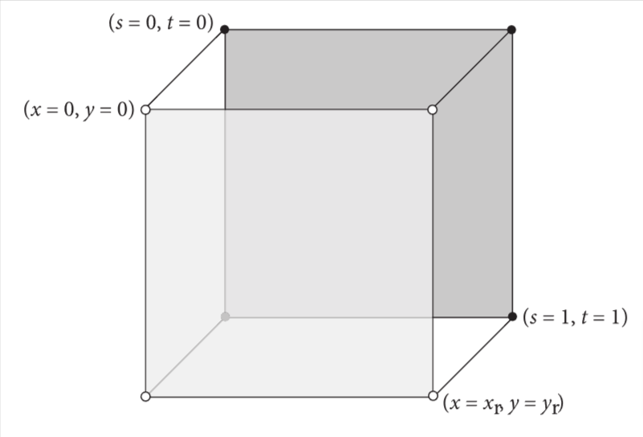

# 10 纹理与材质

在前一章介绍的BRDF和BTDF侧重于描述物体表面如何散射光的一部分问题。虽然这些BSDF描述了物体表面特定的点如何散射，但是渲染器需要确定这个点是哪个BRDF和BTDF，还需确定它们的参数是什么。在本章中，我们描述了一个程序化的着色机制来针对此问题。

pbrt中有两种组件：纹理是用于描述空间上的一些量度或光谱在表面上的变化量；材质用于衡量表面某点上的纹理属性，用来确定关联的BSDF的参数。把纹理图案的生成的职责，通过材质类，从反射模型的实现中分离出来，让它们之间的随意组合更加简单。从而让创建各种外观变得更容易。

在pbrt中， texture是一种十分通俗的理念：它是一个函数，把在某种域(比如表面的(u,v)参数化空间，或者(x,y,z)物体空间)里的点，映射到其他的某个域(比如光谱，或实数域)。在系统中，有各种纹理类的实现。比如，pbrt有代表0维的函数的纹理类，此函数返回一个常数，用来代表某个处处都是同一个参数值的表面。图像映射纹理是一个二维函数，这些类使用一个二维数组表示的像素值，来计算特定点的纹理值(它们会在10.4详述)。甚至有基于其他纹理函数计算出来的值来计算机的纹理函数。

纹理在最终图像中，可能是一个高频变化的源，图10.1展示了一个由于纹理导致有严重走样的图片。然而走样的视觉影响可以用来自第八章的非均匀采样技术来减少，更好的解决方法是实现适配其被采样的频率的纹理函数。对于许多纹理函数，对一个频率成分计算一个合理的估计值，并且用此方法反走样并不困难，并且比起增加图像采样率来说，此方法在减少走样上，明显更有效率

## 10.1 纹理的采样和反走样

自第8章的采样任务让人震惊，因为走样问题从开始就让人知道不能被解决。几何体边界无限的频率成分和硬阴影，无论图像采样率如何，保证了最终图像一定有走样。(唯一让人欣慰的是，剩余的走样可以通过足够数量精心安排位置的样本，来把视觉影响降低到可接受的程度)

幸运的是，若从纹理的角度来解决此问题，并不困难。要么经常有方便可用的解析式的纹理函数，这个函数可用来在采样前消除极高频部分；要么当计算纹理函数时多加小心，以便不在第一个位置引入高频。当此问题在纹理实现中被仔细考虑，就如本章后续要做的那样，一般来讲，为了渲染出没有纹理失真的图像，多一个像素采样样本都不需要。(当然，从光照计算中有效减少蒙特卡洛噪点是另外一回事)

为了消除由纹理函数带来的失真，有两个问题必须被强调：

1. 在纹理空间中的采样率必须被计算出来。屏幕空间的采样率可从图像分辨率和像素采样率来得知，但此处我们需要确定该场景物体表面采样率的结果，以便找到被采样的纹理函数的采样率
2. 给定纹理采样率，采样理论必须被用于引导纹理值计算，比起用采样率表示来说，不会有更高的频率变化(比如，通过从纹理函数中取出超过奈奎斯特极限的频率)

这两个问题会在后续章节依次强调

### 10.1.1 找到纹理采样率

考虑任意一个定义于场景中的物体表面的纹理函数，此函数就是关于位置的函数，$T(p)$。若我们忽略可见性带来的复杂度，即被其他物体上附近的图像样本挡住的可能，又或者那个表面可能在成像平面上只有有限的范围。此纹理函数也可以用成像平面上的点(x,y)来表示,$T(f(x,y))$,此处的$f(x,y)$是把图像点映射到表面上的点的函数。因此,$T(f(x,y))$给出了所见到的在(x,y)上的纹理函数的值。

根据上文简单地举个例子，考虑一个二维纹理函数$T(s,t)$,此函数在垂直于z轴的四边形上，并且四个点在世界空间上为(0,0,0),(1,0,0),(1,1,0),(0,1,0)。若一个正交相机看向z轴，那么这个四边形正好填充了成像平面，并且若点p在四边形上，且用下式映射到二维点(s,t)纹理坐标:

$$
s=p_x\,\,\,t=p_y,
$$

那么在(s,t)和屏幕像素（x,y）之间的关系就很明朗:

$$
s=\frac{x}{x_r}\,\,\,t=\frac{y}{y_r},
$$

此处总体图像分辨率为$(x_r,y_r)$(如图10.2)。因此，给定一个在成像平面间隔一个像素点的样本，在(s,t)里纹理参数空间中的采样间隔就是$(\frac{1}{x_r},\frac{1}{y_r})$,并且纹理函数必须移除在高频部分的细节，而不是在那个采样率下表示出来。



图10.2 若一个四边形用正交投影观察，那么这个四边形正好填充了成像平面，计算用像素坐标(x,y)表示的采样率和纹理采样率之间的关系是容易的

在像素坐标和纹理坐标之间的关系，还有因此得出的它们之间的采样率的关系，就是确定在纹理函数中允许的最大频率成分的一小部分关键信息。对于一个稍微更复杂的例子，给定一个在顶点上有(u,v)纹理坐标的三角形，并且用透视投影观察它，可能在同一个成像平面的采样点处，用解析法得到不同的u,v值。此方法在图像处理能被编程前，曾经就是最基本的纹理反走样方法。

对于更复杂的场景几何体，相机投影，和纹理坐标的映射，精确确定图像位置和纹理参数值的关系越来越复杂。幸运的是，对于纹理反走样，我们不需要能够为任意(x,y)计算$f(x,y)$,但是需要找到图像中特定点，关于像素采样的位置和纹理采样位置结果之间的变化。这种关系被这个函数的偏微分给出，$\frac{\partial f}{\partial x}$ 和$\frac{\partial f}{\partial y}$。比如，下式能被用来找到f的第一个近似值:

$$
f(x',y')\approx f(x,y)+(x'-x)\frac{\partial f}{\partial x} + (y' -y)\frac{\partial f}{\partial y}
$$

若偏微分在$(x'-x)$和$(y'-y)$的距离中变化缓慢，那么此近似值很合理。更进一步说，这些偏微分量给出了对于纹理采样位置在像素以x,y方向移动后的变化的近似值，对应的，也因此直接给出了纹理的采样率。比如，在上一个四边形的例子中,$\partial s / \partial x = 1 / x_r$,$\partial s/\partial y = 0$, $\partial t / \partial x = 0$,并且$\partial t / \partial y=1/y_r$

在通常情况下，找到这些偏微分量的关键都放在RayDifferential结构体中，此结构体定义于章节3.6.1，此结构体通过Camera::GenerateRayDifferential()方法，为每个相机光线进行初始化。这个结构体不单包含被追踪的光线，也包含两条额外的射线，一条从相机光线的像素样本垂直偏移，另一条水平偏移。所有几何体和光线的相交例程只用主相机光线来进行计算。这两个辅助射线会被忽略(由于RayDifferential是Ray的子类，所以这么做很容易)

我们可以用偏移射线来估计图像位置p(x,y)映射到世界空间位置的偏微分值，和u(x,y),v(x,y)从(x,y)到(u,v)参数化的坐标。给定渲染空间位置的偏微分$\partial p/\partial x$和$\partial p / \partial y$,和参数化(u,v)坐标的偏微分$\partial u / \partial x$,$\partial v / \partial x$,$\partial u / \partial y$,和$\partial v / \partial y$。在章节10.2，我们会看到这些量如何被用于计算任意基于p或(u,v)的屏幕空间微分量，并且看到这些量采样率的结果。在交点处的这些微分量被存于SurfaceInteraction结构体中

```c++
<<SurfaceInteraction Public Members>>+= 
Vector3f dpdx, dpdy;
Float dudx = 0, dvdx = 0, dudy = 0, dvdy = 0;
```

SurfaceInteraction::ComputeDifferentials()方法计算这些值。它被SurfaceInteraction::GetBSDF()方法调用，此方法在Material的GetBxDF()前调用，以便这些值能用于被材质类调用到的任何纹理计算例程中。

对于所有被追踪的光线，射线微分量并不总是在系统中可用，比如，从光源开始的射线被跟踪用来做光子映射或双向路径追踪。此外，虽然我们会在章节10.1.3中，看到在光线遇到镜面反射和透射时如何计算光线微分量，但是如何在漫反射后计算光线微分量还不太清楚。像这种和少数比如某个微分方向垂直于表面法线的情况，会导致未定义的数值，从相机到交点的另一种基于估计光线微分方法会被使用

```c++
<<SurfaceInteraction Method Definitions>>= 
void SurfaceInteraction::ComputeDifferentials(const RayDifferential &ray,
        Camera camera, int samplesPerPixel) {
    if (ray.hasDifferentials && Dot(n, ray.rxDirection) != 0 &&
        Dot(n, ray.ryDirection) != 0) {
        <<Estimate screen-space change in  using ray differentials>> 
    } else {
        <<Approximate screen-space change in  based on camera projection>> 
    }
    <<Estimate screen-space change in >> 
}
```

### 10.1.2 在介质传播中的光线微分量

### 10.1.3 对于镜面反射和透射的光线微分量

### 10.1.4 过滤纹理函数

## 10.2 纹理坐标的生成

> 总结

确定参数化的纹理坐标在某些时候很直接自然，比如确定平面上的纹理坐标，但是有些时候是没有直接自然的参数化方法。比如接近球面极点的(u,v)值就是极度扭曲的。故纹理坐标的生成需要一个接口来表示，让各种纹理坐标的算法抽象出来，与纹理本身解耦，方便纹理坐标算法的复用。

在pbrt里，2D纹理坐标用(s,t)表示，这样做是为了与参数化纹理最本质的坐标(u,v)做区分

对于2D纹理坐标的生成，接口是TextureMapping2D，此接口和它的实现类放在texture.h,textures.h和texture.cpp中

TextureMapping2D只有一个方法Map(),根据TextureEvalContext(封装了计算纹理坐标需要的变量)，返回TexCoord2D(封装了纹理坐标和各个微分量)。

### 10.2.1 (u,v)映射

UVMapping使用TextureEvalContext里的(u,v)坐标来计算纹理坐标(s,t)，还支持对其进行缩放和偏移

### 10.2.2 球面映射

用于球体纹理坐标映射，把纹理坐标(u,v)通过SphericalMapping映射到(s,t)

### 10.2.3 圆柱体映射

### 10.2.4 平面映射

### 10.2.5 3D映射

## 10.3 Texture接口和基本纹理

> 总结

有两种纹理类，一种是以浮点实现的纹理FloatTexture，另外一种时以光谱实现的纹理SpectrumTexture，其核心方法是Evaluate(),此方法取TextureEvalContext对象来计算纹理函数值，二者都有多个派生类。

### 10.3.1 常数纹理

> 总结

常数纹理无论如何计算都返回相同的常数值，可用任何采样率精确重建，故不需要反走样。
FloatTexture对应FloatConstantTexture,SpectrumTexture对应SpectrumConstantTexture

### 10.3.2 缩放纹理

> 总结

ScaledTexture可用其他纹理来定义各种纹理，给出两个其他纹理，一个作为纹理，一个作为缩放，算出乘积并返回

### 10.3.3 混合纹理

FloatMixTexture是更广义版本的缩放纹理。这种纹理是用两个同类纹理基于标量化的混色因子来定义

## 10.4 图像纹理

图像纹理存储了二维数组，每个元素是纹理函数的图像采样点的值。图像的重建就是利用这些值生成的。这些采样值一般叫做纹素(texel)。

图像纹理的基类是ImageTextureBase,其下也分为浮点型和光谱型的图像纹理派生类。

### 10.4.1 纹理的内存管理

### 10.4.2 图像纹理的计算

### 10.4.3 MIP贴图

### 10.4.4 图像贴图过滤

## 10.5 Material接口和实现

材质接口是用Material类定义的，其中最重要的方法是GetBxDF():

```c++
template <typename TextureEvaluator>
ConcreteBxDF GetBxDF(TextureEvaluator texEval, MaterialEvalContext ctx,
                     SampledWavelengths &lambda) const;
```

texEval用于优化GPU计算下的纹理坐标计算，没有直接调用Texture的evaluate(),ctx是材质需要的一些量的封装，lambda就是采样的波长，返回值ConcreteBxDF就是具体的材质对应的BSDF，这里做了封装，是为了系统实现的灵活性。