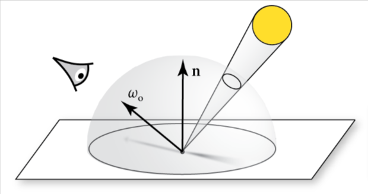
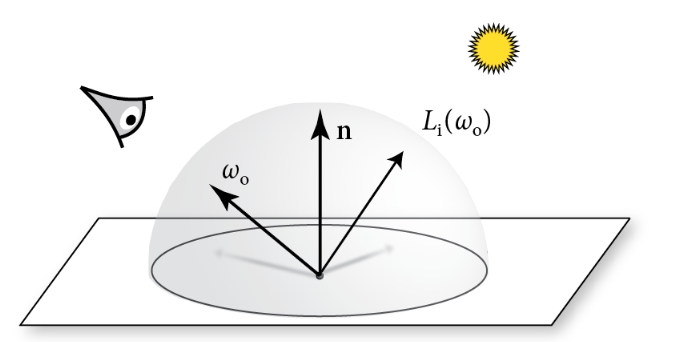

# 12 光源

为了让场景中的物体能被看见，必须有一个发光的源头，以便光能从这些源头反射到相机的传感器上。为此，本章首先展示Light接口，此接口允许定义各种类型的光源(阅读本章前，你可以复习章节4.4，此章节描述了发光的物理过程)

接着是一些实用光源的实现类。由于不同类型的光源的实现都隐藏在精心设计的接口下，所以在13到15章中，光传播的例程一般能在不知道具体光源类型的情况下进行操作，这类似于加速结构能在不知道具体表示的物体细节的情况下，持有不同类型的图元。

大部分种类的光源模型会在本章介绍，然而由于pbrt基于物理的设计，有一些种类会有轻微的限制。许多非物理的光源模型是为计算机图形学开发的，包含了比如:对光线随距离衰减的速率的控制;哪些物体会被光照到;哪些物体会根据光产生阴影等等。这一系列控制在基于物理的光传输算法中是不兼容的，因此，在此处的模型中不提供相关功能。

对此种照明控制下，产生问题的例子如下：考虑一个没有影子产生的光源，到达物体表面的能量，随着添加更多的面，能量的增加是没有上限的。考虑一系列围绕在这种光源的同心球面，如果忽略遮挡关系，每增加一层球壳就会增加总的接收到的能量。这直接违反了关于到达物体表面光照的总能量是不能大于光源发出的能量总和的准则。

在有着许多光源的场景中，在每个需要着色的顶点计算所有光源的光照是不太现实的。幸运的是，这是又一个可被随机处理掉的问题。给出一个合适的权重因子，所有光源光照效果的无偏估计就能用一部分，甚至一个光源计算出来。本章的最后一节因此会介绍LightSampler, 此类定义了一个选取这种光源的接口，及其多个实现类。

## 12.1 Light接口

Light类定义了光源必须实现的接口。定义在base/light.h，本章后续所有光源的实现类在lights.h和lights.cpp中

```c++
<<Light Definition>>= 
class Light : public TaggedPointer<<<Light Source Types>> > {
  public:
    <<Light Interface>>  
};
```

本章会介绍下列所有共9种类型的光源

```c++
<<Light Source Types>>= 
PointLight, DistantLight, ProjectionLight, GoniometricLight, SpotLight,
DiffuseAreaLight, UniformInfiniteLight, ImageInfiniteLight,
PortalImageInfiniteLight
```

所有光源必须能够返回总发出辐射功率$\Phi$,除此以外，还让后续会提到的PowerLightSampler来根据相对辐射功率采样光照变得可能。把更多的样本集中在光照贡献量最大的光源能十分有效的改进渲染效率。

```c++
<<Light Interface>>= 
SampledSpectrum Phi(SampledWavelengths lambda) const;
```

Light接口没有完全抽象出不同类型光源的所有不同点，虽然理论上这么做是必要的，但是实际上，考虑到效率和正确性，pbrt的积分器有时需要对不同类型的光源做出不同的处理。我们已经在章节1.3.6看到RandomWalkIntegrator出现这种问题的例子。在那个类中，"无限远"的光源会得到特殊处理，因为必须考虑到那些没碰撞到几何物体就离开场景的光线。

另一个例子是，从光源采样光照的蒙特卡洛算法需要注意到光照是用delta分布描述的，因为这种效果会影响某些计算。因此，光照会分成不同类型，Type()方法返回光照的类型

> 注意光源类型和光照类型不同

```c++
<<Light Interface>>+=  
LightType Type() const;
```

有四种光照类型

- DeltaPosition: 光照只从空间中单个点发出(delta代表这种光照能被狄拉克delta分布描述)
- DeltaDirection: 从单一方向发出光照的光源
- Area: 从一个几何形状的面上发出辐射的光照
- Infinite: 光照是在无限远的地方，并且没有几何形状，会为所有离开场景的光线提供辐射量

```c++
<<LightType Definition>>= 
enum class LightType { DeltaPosition, DeltaDirection, Area, Infinite };
```

有一个助手函数来检查某个光是否是用狄拉克delta分布定义的

```c++
<<Light Inline Functions>>= 
bool IsDeltaLight(LightType type) {
    return (type == LightType::DeltaPosition ||
            type == LightType::DeltaDirection);
}
```

对于渲染来说，在光照可能入射的方向上进行采样是一项重要的采样操作。考虑一个漫反射表面，该表面被一个小的球面光源照射到,如图12.1: 使用BSDF的采样分布来采样方向很可能是十分低效的，因为光线只在很小的锥体范围内可见，一种更好的方法是用基于光源的采样分布来代替。在这种场景下，采样的例程只应该从这个球面可能看见的方向来选择。



图12.1 对于直接光照的计算，一种从某点选取入射方向有效的采样方法是允许光源根据这个点的立体角定义一个方向的分布。在此处，有一个小的球形光源正照射到这个点，这个球形光源面对的方向的锥体，比起在半球面上均匀采样来说，是一个更好的采样分布

负责实现此重要任务的是SampleLi()方法，它的调用者传进一个LightSampleContext对象，此对象提供了关于场景中的参考点的信息，并且光源可选地返回一个LightLiSample对象，此对象封装了入射光的辐射量、发出此辐射的位置，和采样点的PDF。若对于光源没有到达参考点的可能性，或者没有与u关联的可用光照样本，会返回一个不可用的样本。最后，allowIncompletePDF用来表示采样例程在生成方向样本时，是否可以跳过那些贡献小的光源，这种能力能被应用了MIS补偿的积分器所使用。

```c++
<<Light Interface>>+=  
pstd::optional<LightLiSample>
SampleLi(LightSampleContext ctx, Point2f u, SampledWavelengths lambda,
         bool allowIncompletePDF = false) const;
```

LightSampleContext封装了关于接收到光照的点的很多信息，许多采样例程需要这些信息

```c++
<<LightSampleContext Definition>>= 
class LightSampleContext {
public:
    <<LightSampleContext Public Methods>> 
    <<LightSampleContext Public Members>> 
};
```

这个context只存了场景中的点，表面的法线，和着色用的法线，点是用Point3fi表示的，这让计算后的光线交点的误差范围可以被包含进来。后文中的一些采样例程会在采样的处理过程中，需要这个信息。若这个点在散射介质且不在某个面上，两个法线的变量就是默认的(0,0,0)

注意，此context没有包含时间，因为pbrt的光源不支持动画变换，章节末的练习讨论了相关的问题并扩展解决了。

```c++
<<LightSampleContext Public Members>>= 
Point3fi pi;
Normal3f n, ns;
```

就如其他Context类那样，此类也有各种构造器，方便构造此对象

```c++
<<LightSampleContext Public Methods>>= 
LightSampleContext(const SurfaceInteraction &si)
    : pi(si.pi), n(si.n), ns(si.shading.n) {}
LightSampleContext(const Interaction &intr) : pi(intr.pi) {}
LightSampleContext(Point3fi pi, Normal3f n, Normal3f ns)
    : pi(pi), n(n), ns(ns) {}
```

一个便利方法，用来为例程返回常规的Point3f方便使用

```c++
<<LightSampleContext Public Methods>>+= 
Point3f p() const { return Point3f(pi); }
```



图12.2 Light::SampleLi()方法返回了从某点的光照入射辐射量，同时还返回向量$\omega_i$,此向量给出辐射量从哪个方向照过来的

光照的样本被打包进了LightLiSample结构体中。辐射度L是离开光并射到某点的辐射量，这个量没有包含光线由于介质和遮挡带来的衰减效应，若在光源和被照射的物体之间有物体，wi会给出沿着光到达到这个点的方向(见图12.2)，光源发光的点会用pLight提供。最后，对于光的采样的PDF值会用pdf返回，这个pdf会根据接收到光的点的立体角计算出来。

```c++
struct LightLiSample {
    <<LightLiSample Public Methods>> 
    SampledSpectrum L;
    Vector3f wi;
    Float pdf;
    Interaction pLight;
};
```

就像我们之前见到的具有BSDF的完美镜面反射和透射，用delta分布定义的光源天生适配此采样框架，然而这些效果需要在一部分调用它们采样方法的例程上仔细处理，因为在返回的辐射量和PDF里，隐含了delta分布。对于大部分情况，这些delta分布会在估计式计算中自然的约掉，然而多重重要性采样代码必须注意这种情况，就如用BSDF的情况类似。对于从delta分布的光源上采样的样本，在LightLiSample中返回的pdf值应被设为1

与之相关的是，PDF_Li()方法返回了对于在ctx表示的点的给定的wi方向上的PDF值。此方法在多重重要性采样(MIS)中特别有用。举例来说，BSDF可能有采样后的方向，而且我们需要为光源的采样的方向计算PDF，以便计算MIS权重。此方法的实现可假设ctx中在wi方向的光线已经被找到，并与光源相交，那么有了SampleLi(),PDF就可以根据立体角计算出来。在此处，若光源是用狄拉克delta分布描述的，返回的PDF值应该是0

```c++
Float PDF_Li(LightSampleContext ctx, Vector3f wi,
             bool allowIncompletePDF = false) const;
```

若一束光线与面光源发生相交，有必要找到沿着光线方向发出的光的辐射量。这个任务是被L()方法处理，此方法会用到关于交点和出射方向的局部信息。当光源没有几何形状时，此方法不应被调用

```c++
<<Light Interface>>+=  
SampledSpectrum L(Point3f p, Normal3f n, Point2f uv, Vector3f w,
                  const SampledWavelengths &lambda) const;
```

另一个只在部分光照类型使用的接口方法是Le(),此方法运用了无限面积光源来对所有没有碰撞的光线贡献辐射量。这个方法只应被LightType::Infinite类型的光照调用

```c++
<<Light Interface>>+=  
SampledSpectrum Le(const Ray &ray, const SampledWavelengths &lambda) const;
```

最后，Light接口包含了一个Preprocess()方法，此方法会在渲染前调用，它会取场景的渲染空间边界作为参数。一些光源需要知道这些边界，并且当光源初始化时，边界就不可用了，所以，此方法让那些光源可以使用边界

```c++
<<Light Interface>>+=  
void Preprocess(const Bounds3f &sceneBounds);
```

还有3个额外的光线接口方法，会在之后使用到它们的时候介绍。一种使用场景是用来为光源采样建立加速层次，会在12.6.3详述。Light::SampleLe()和Light::PDF_Le()是用来对离开光源的光线根据它们的发光分布做采样。他们是双向光线传输算法的基石，这两个方法和使用这些方法的算法，会在本书在线版中定义

## 12.1.1 光度学中光的特性

pbrt使用辐射度量学作为光传输的基础模型。然而，光源经常用光度学单位来描述，比如，一个灯泡的包装上可能会说明其会发出1000流明的光。延伸来讲，光度学来描述光的发出的优点是，会考虑人类视觉上对波长的变化。按照光发出的可见光功率来描述，比起光在过程中消耗的功率来说，会更直观。(关于这个话题，回顾在4.4章节讨论的光照效率)

因此，在pbrt中的光源的描述文件可以用它们发出的流明功率来定义。这些定义会在之后的场景初始化代码中，转换为辐射度量学中的量。辐射度量学中的值，之后会传到本章的Light的实现类的构造器里，通常这些值是以基本光谱分布的形式传参的，并且有一个应用其上的缩放因子。

## 12.1.2 LightBase类

> 总结性陈述

LightBase是Light接口的基础类，但是实现类不要求必须继承此类，但是必须提供一部分Light相关方法的实现

LightBase的构造需要传入光照的类型，变换矩阵(用来在不同空间做坐标变换)，和介质接口。里面有L()和Le()的默认实现，供那些没有面积或者无限远光源来用，不用自己写实现。

大部分Light的实现类在它们的构造器里传入Spectrum值来定义光源的光谱发出的量，但是之后会把其转换为一个DenselySampledSpectrum，存到成员变量里，主要是为了减少计算，改善性能。

对于光源非常多的场景，DenselySampledSpectrum就占用过多内存，可以用LookupSpectrum()方法，此方法会清除过期的DenselySampledSpectrum拷贝，使用的是在章节B.4.2中提到的InternCache对象，若光源有相同的光谱辐射分布，就可以大幅节省内存

## 12.2 点光源

> 总结性陈述

PointLight表示了一个各向同性的点光源，在所有方向上都发出相同量的光。把其作为基础，就可以构造出更复杂的光源，包括聚光灯和把图像投影到场景中的灯

PointLight在自己的坐标系里的位置在原点，要转换到其他坐标系的位置上，要在构造器传入变换矩阵，同时还要传入光的强度I

严格来讲，点光源基于辐射量单位来描述到达某点的光是不正确的。辐射强度对于点光源来说，更适合用来描述光的发出量，然而我们会违反这术语，使用SampleLi()方法，来返回所有类型光源到达某点的光照量，把辐射强度除以距离的平方来转换单位。最终，计算的正确性不会受影响，并且可以让光线传输算法的实现更加的简洁，避免了根据不同光源类型来使用不同的接口的问题

点光源只在某点的单个方向接收光照，因此不需要使用随机样本量u，只需要找到光源在渲染坐标系的位置p，并且对它的光谱发出量在对应波长进行采样即可。PDF会在LightLiSample中返回1。在辐射量和PDF中隐含的狄拉克delta分布会在蒙特卡洛估计时被消除。

总的发光功率就是$4\pi I$，通过Phi()方法返回

## 12.2.1 聚光灯

> 总结性陈述

此光源就是点光源，只是指定了一个方向，光只在这个方向以锥形范围发出光，在光源自己的坐标系里位置在(0,0,0),方向指向+z，放到场景中时，要传入变换矩阵以确定位置和发光方向。

## 12.2.2 纹理投影灯

## 12.3 远光灯

也叫定向光，或无限远的点光源，这种光源发出的光在空间中任何位置都是同一个方向的，太阳光就可以看作远光灯

## 12.4 面光源

## 12.5 无限面积光源

## 12.6 光的采样

> 总结性陈述

由于辐射度量学中的线性叠加假设，场景中某个被多个光源照射的点，其光照量可以用多个独立光源的贡献量相加计算出来。但是这种做法在光源较多的时候太过低效。

对于多项式相加的无偏估计，基于蒙特卡洛估计的离散估计，我们有:

$$
\sum_i^n f_i \approx \frac{f_j}{p(j)}
$$

也就是说，用一个光源，就可以近似估计出所有光源照射到一个点的光量
