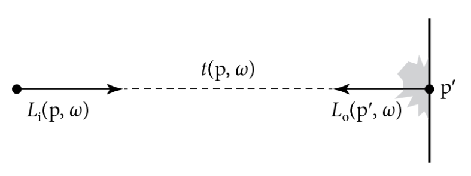
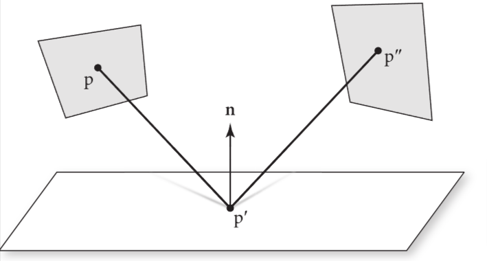
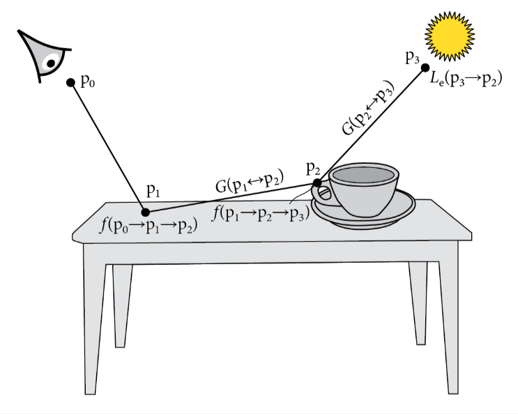

# 13 光的传播I: 表面反射

本章把光追理论，辐射度量学理论，蒙特卡洛采样算法结合起来，来实现两种不同的积分器，用来计算场景中物体表面散射的辐射量。这些积分器比第一章所说的RandomWalkIntegerator更有效率，用这两种积分器可以使错误数降低几百倍。

我们会以光传播等式的派生来开始，这个公式是在1.2.6章节介绍的。然后我们能正式介绍路径追踪算法，此算法应用了蒙特卡洛积分来计算这个等式。然后，我们会对SimplePathIntegrator的实现做描述，它是路径追踪的精简版实现，对于理解基本算法和调试样本算法是很有用的。然后本章会用PathIntegrator做概括总结，它是路径追踪更完整的实现。

这两个积分器会找到从相机开始的光的传输路径，并且考虑到了这些形状表面的散射效应。第14章会扩展路径追踪，使其包含介质传播的效果(本书在线版还包括了一章，用来描述双向路径追踪)

## 13.1 光传播公式(LTE)

光传播公式(LTE)描述了场景中辐射量分布的平衡性，这个公式给出了在表面上某点的总反射辐射量，这个辐射量是根据表面发光，BSDF和入射光照分布到达此点的量得出的。在此我们不考虑光在介质中的传播场景，这部分会在14章介绍

让LTE的计算困难的原因是，某个点接收到的辐射量是受场景中所有物体的几何和散射特性所影响。比如，某个很亮的光照射到一个红色物体上，可能会导致红色的光映到旁边的物体上，或者玻璃可能会在桌面上形成焦散效果。处理这种光照复杂性的渲染算法称为全局光照算法,为了与局部光照算法区分开，局部光照算法在着色计算中只使用与某一个表面属性相关的信息。

> 全局光照算法考虑场景光在所有物体相互作用的效果，本地光照算法只考虑单独的物体的着色，不会受其他物体影响

### 13.1.1 LTE的基本推导

我们已经选择基于用辐射度量学来描述光，故我们的光传输公式把这个条件作为基本假设，那么光的波动性就不重要了，故场景中的辐射分布就是均匀的。

光传输公式(LTE)的重要定律就是能量守恒，能量的改变必须在某种过程中被"归因"，同时，我们必须记录所有能量的变化。因为我们假设了光照是直线的过程，从某个系统中出来和进入的能量的差值，必须和发射出和吸收的能量的差值相等。这种想法在多个空间尺度下都相通。在宏观尺度下，我们有能量守恒定律：

$$
\Phi_o - \Phi_i = \Phi_e - \Phi_a
$$

即，离开物体的辐射通量$\Phi_o$减去进入物体的辐射通量$\Phi_i$，与物体辐射出的辐射通量$\Phi_e$减去吸收的辐射通量$\Phi_a$的差，是相等的

为了使某个平面上的的能量守恒，离开平面的辐射度$L_o$必须等于辐射出的辐射度加上入射光散射后的辐射量。辐射出的辐射量用$L_e$给出，散射后的辐射量是用散射公式给出，即下式:

> $L_o$等于这个点自己辐射出的辐射量加上照到这个点的光散射后的辐射量

$$
 L_o(p, \omega_o) = L_e(p, \omega_o) + \int_{S^2}f(p, \omega_o,\omega_i)L_i(p,\omega_i)|\cos \theta_i|d\omega_i
$$

> 这里的p点是场景中任意一点，这个式子就是说场景中任意一个p点(物体表面的点只是其中一种情况)，如何求得它的光辐射量

图13.1 在自由空间中，沿着光线方向的辐射量是不变的。因此，为了计算从p点在$\omega$方向的入射光辐射量，我们能找到这条射线的第一个与物体表面的交点，然后计算$-\omega$方向的出射光辐射量。光线投射函数$t(p,\omega)$给定了射线$(p,\omega)$在第一个表面的交点p'

由于我们已经假设光传播过程中没有介质参与，辐射量就是一个不会变化的数。因此，我们能把p点的入射光辐射量与p'的出射光辐射量关联起来，如上图13.1。 若我们定义了一个光线投射函数$t(p, \omega)$，用来计算从p射到第一个碰到的表面一点p'，方向为$\omega$,我们就能通过p'的出射辐射量，来写出p点的入射光辐射量

> 即，由能量守恒假设，可以用p'在$-\omega$上的的出射辐射量来反推p在$\omega$方向上的入射辐射量

$$
L_i(p, \omega) = L_o(t(p,\omega), -\omega)
$$

由于场景并不是封闭的，我们会让光线投射函数在光$(p, \omega)$没有与场景物体相交的时候，返回一个特殊值$\Lambda$，使得$L_o(\Lambda, \omega)$总为0

为了简洁，把$L_o$的下标舍弃，那么LTE就可写成:

$$
 L(p, \omega_o) = L_e(p, \omega_o) + \int_{S^2}f(p, \omega_o,\omega_i)L(t(p, \omega), -\omega_i)|\cos \theta_i|d\omega_i
$$

上式中的关键是，只有一个我们感兴趣的量，即表面上某点的出射辐射量。当然这个量在上式中的两侧都存在，所以我们的任务不简单，但是肯定更简单点了。记住，我们可以通过强制利用能量守恒来让这个式子更简单，这是很重要的。

> 就是说，在原版LTE中，有两个量需要关注，$L_i$和$L_e$，但是通过利用能量守恒定律，把$L_i$的部分替换为交点处反向的出射辐射量，改成了上式以后，只有一个$L_e$需要关注，也就降低了LTE的计算难度

### 13.1.2 LTE的解析解

LTE式子的简洁性掩盖了一个事实，除非是非常简单的场景，否则得到这个式子的解析解是不可能的。式子的复杂性来源于基于物理的BSDF模型，还有任意场景的几何特征，还有物体间错综复杂的可见关系，合起来的这一切，都需要一种数值上的解决方法。幸运的是，把光线追踪算法结合蒙特卡洛积分，就给出了一个强力的组合工具，能够在不需要在各种LTE分量中设置限制条件（比如： 要求所有BSDF都是朗伯材质，或者大幅限制物体的几何形状）的场景下，处理这种复杂性。

对于求解LTE，只需要简单设置一下即可。虽然对于更通用性质的渲染没有太大帮助，但是这种方法能帮助调试积分器。若某个积分器想求解完整的LTE时，不能计算出对应的解析解，那么很显然积分器就有问题。例如：考虑一个球面内部，都是朗伯型的BRDF,$f(p, \omega_o, \omega_i) = c$, 同时在所有方向上也发出常数性质的辐射量。那么我们就有：

$$
 L(p, \omega_o) = L_e + c\int_{H^2(\vec{n})}L(t(p, \omega), -\omega_i)|\cos \theta_i|d\omega_i
$$

在球面内部任意一点的出射辐射度的分布，与其他的点都相同。这个场景下，不同的点之间不会引入变化量。因此入射光辐射分布在所有点都是相等的，并且以余弦加权的入射光辐射量也必须在所有地方都相等。故，我们可以把辐射量函数替换为一个常数，那么LTE就可以写作下式:

$$
L = L_e + c\pi L
$$

> $\pi$是朗伯反射引入的常数，与半球积分的$2\pi$无关

尽管我们可以直接求得方程中的L，但有趣的是，可以考虑把右边的L项递归地替换回它自己，若我们把$\pi c$替换为$\rho_{hh}$, 表面的朗伯反射就有:

$$
L = L_e + \rho_{hh}(L_e + \rho_{hh}(L_e + ...\\
= \sum_{i=0}^{\infty}L_e\rho_{hh}^i
$$

> $\rho_{hh}$是反射率，为BSDF的一种简化形式

换句话说，出射辐射量等于此点发出的辐射量加上同时由BSDF散射的辐射量，再加上第二次被散射的辐射量，以此类推。

根据能量守恒定律，$\rho_{hh} < 1$， 故这个级数会收敛，并且在所有方向和所有点上，反射后的辐射量是:

$$
L=\frac{L_e}{1-\rho_{hh}}
$$

(这个级数也叫Neumann级数)

> 这里是通过把\sum_{i=0}^{\infty}L_e\rho_{hh}^i用无穷级数求解得到的
>
> 由于$\rho_{hh} < 1$，即光线会在多次反射后逐渐趋于0，即收敛

> **为何文中不直接求得$L=\frac{L_e}{1-\rho_{hh}}$,而是要用递归提代L后算无穷级数，这不是绕了个弯吗?**
>
> 主要是为了解释物理现象，帮助我们理解光的多次反射和累积效应，也表明了由于能量守恒，反射率$\rho_{hh} < 1$故求得的数不会越来越大，而是会收敛

对于把LTE中右侧的入射光辐射量，进行反复代入的过程，对于把LTE推导出更普遍的场景是具有指导意义的。例如，在下式中，仅仅考虑了直接光照，实际上是通过一次提代计算得到的结果:

$$
 L(p, \omega_o) = L_e(p, \omega_o) + \int_{S^2}L_d(p, -\omega_i)|\cos \theta_i|d\omega_i
$$

其中: $L_d(p, \omega_i) = L_e(t(p, \omega_i), -\omega_i)$

后面的散射过程被忽略了。

在后面的章节中，我们会看到如何在这个式子中进行递归提代，然后重新整理LTE的表达式，把其变为更自然的方式，用于渲染算法的开发。

### 13.1.3 LTE在面上的形式

在之前LTE式子比较复杂的原因是在几何物体之间的关系是隐含在光追函数$t(p, \omega)$中。将被积函数中的式子写明白，有助于阐明这个公式的结构。为了做到这点，我们会把之前的LTE公式重写成对于面积的积分而不是对于球面方向上的积分

首先，我们定义从p'点到p的出射辐射度:

$$
L(p' \rightarrow p) = L(p',\omega)
$$

若p'和p是相互可见的，并且$\omega=\widehat{p - p'}$。我们也能把在p'点的BSDF写成:

$$
f(p'' \rightarrow p' \rightarrow p) = f(p', \omega_o, \omega_i)
$$

这里$\omega_i = \widehat{p'' - p'}$，$\omega_o=\widehat{p - p'}$。这个式子有时候也被称为BSDF的三点形式。如图13.2

图13.2 LTE的三点形式，把对球面方向上的积分变为对面上的点所在的域上的积分。这种变换对于推导LTE在路径上的积分形式来说是很重要的

> 这里$\omega=\widehat{p - p'}$，上面的这个折线帽子指的是单位向量

然而，用这种方式写出的LTE还不太够。为了把LTE从对方向的积分转为对面上的积分，我们也需要乘上立体角的雅可比式子，这个式子是$\frac{|\cos \theta'|}{r^2}$

把这个变化后的式子结合起来，原来的$|\cos \theta|$是来自LTE，双向的可见性函数V(V=1时两点互相可见，否则V=0)，这个单一的几何耦合项函数$G(p \leftrightarrow p')$为:

$$
G(p \leftrightarrow p') = V(p \leftrightarrow p')\frac{|\cos \theta||\cos \theta'|}{||p-p'||^2}
$$

> 这个式子描述了p到p'的变化关系，若两点互相可见，则把LTE里的余弦量带过来，在乘以雅可比量(用于把方向积分转为面积分)，定义这个G是用于替换掉LTE里$|\cos \theta|d\omega$的部分

把这些式子代入到LTE，然后把其转换为面上的积分，我们可以得到LTE的三点形式公式:

$$
L(p' \rightarrow p) = L_e(p' \rightarrow p) + \int_A f(p'' \rightarrow p' \rightarrow p)L(p'' \rightarrow p')G(p'' \leftrightarrow p')dA(p'')
$$

这里的A是场景中所有的表面

虽然LTE原始式子和上式是等效的，但是二者使用了不同的表达方法。为了用蒙特卡洛方法计算LTE的原始式子，我们会在球面上根据方向的分布来采样，然后投射出光线来估计这个积分。然而，对于上式，我们会在表面的区域的分布里采样点，然后计算这些点的耦合关系函数，用于计算这个被积函数，同时对光线进行追踪来计算V的可见性

> 也就是说，LTE原式和上式的采样方法是不一样的。

### 13.1.4 LTE在光传播路径上的积分形式

有了之前形式的LTE，我们就能推导更灵活形式的LTE，被称为光线传播的路径积分式，用来表示辐射量在传播路径上的积分，在这个路径上的点是在一个高维度的路径空间中。用路径空间的其中一个主要动机是，它为要测量的值提供了一个明确的关于路径的积分，而不是根据能量守恒方程推出的繁琐的递归形式方程。

这种显式的式子让考虑路径如何被找到变得自由，特别是对于在可实践的渲染算法中，是用任何随机选取路径的技术，可以在给定足够样本数的情况下，计算出正确的答案。LTE的这种形式提供了双向光传输算法的基础。

把对面积的积分变为根据不同光波长的路径的路径积分的总和，我们可以从把LTE的三点形式做扩展开始，把式子中右侧的积分式做递归替换成$L(p'' \rightarrow p')$形式。下式中是从p1到p0时，给定入射光辐射量情况下的的一部分式子，p1是沿着光路径p1-p0中的表面上的第一个点:

$$
L(p_1 \rightarrow p_0) = L_e(p_1 \rightarrow p_0)\\
+ \int_A L_e(p_2 \rightarrow p_1)f(p_2 \rightarrow p_1 \rightarrow p_0)G(p_2 \leftrightarrow p_1)dA(p_2)\\
+ \int_A \int_A L_e(p_3 \rightarrow p_2)f(p_3 \rightarrow p_2 \rightarrow p_1)G(p_3 \leftrightarrow p_2)\\
 \times f(p_2 \rightarrow p_1 \rightarrow p_0)G(p_2 \leftrightarrow p_1)dA(p_3)dA(p_2) + \cdots
$$

> 上式就是LTE的三点形式下的递归代入式子，重点在于对LTE积分式里的入射光辐射度L用下一个交点的LTE代入，递归下去就是此形式

式子右侧中的每一项代表了路径长度增加时的光辐射度。例如，第三项就如图13.3,这条路径中，有4个顶点，由三条线段相连。所有路径下的辐射量由这四条路径给出(即相机点，2个面上的交点，光源的点)。其中，p0和p1是根据相机所在的原点和光线可以预先得出，但是p2和p3可能会在场景中的面上的不同位置变化，在所有的p2和p3点上做积分，就给出了到达相机点上，总的路径上的光辐射贡献量。

图13.3 对于从LTE中给定的场景中面上的所有p2,p3点，光在经过两次弹射后，从p1离开且沿着p0方向，就可得p0接收到的总辐射量。被积函数中乘积的分量就在此处表示，$L_e$表示光发出的辐射量，两点之间的几何关系式G, 和多个BSDF代表的散射效果f

把这个无穷累加的式子合并起来，可得:

$$
L(p_1 \rightarrow p_0) = \sum_{n=1}^{\infty}P(\bar{p_n})
$$

$P(\bar{p_n})$给出了从路径$\bar{p_n}$射出的辐射量，它经过了n+1个顶点

$$
\bar{p_n}=p_0,p_1,\cdots,p_n
$$

此处，$p_0$就在胶片平面或前镜片元件上，$p_n$就在光源上，且:

$$
P(\bar{p_n}) = \underbrace{\int_A \int_A \cdots \int_A}_{n-1}L_e(p_n \rightarrow p_{n-1}) \\
\times \left(\prod_{i=1}^{n-1}f(p_{i+1} \rightarrow p_i \rightarrow p_{i-1})G(p_{i+1} \leftrightarrow p_i)\right) dA(p_2)\cdots dA(p_n)
$$

继续下文之前，我们会定义一个额外的式子，帮助后文中的讨论，一个路径上的BSDF和几何项的乘积叫做吞吐量，用于描述从光源开始，经过所有的散射，最终打到相机上的光辐射的分式。如下式:

$$
T(\bar{p_n}) = \prod_{i=1}^{n-1}f(p_{i+1} \rightarrow p_i \rightarrow p_{i-1})G(p_{i+1} \leftrightarrow p_i)
$$

故有:

$$
P(\bar{p_n}) = \underbrace{\int_A \int_A \cdots \int_A}_{n-1}L_e(p_n \rightarrow p_{n-1})T(\bar{p_n})dA(p_2)\cdots dA(p_n)
$$

给定一个特定路径长度n, 要计算路径n上，到达p0的蒙特卡洛估计值，就是用合适的采样密度来采样一组顶点， $\bar{P_n} \sim p$, 来生成一条路径，然后利用这些顶点，使用$P(\bar{P_n})$来计算估计值:

$$
L(p_1 \rightarrow p_0) \approx \sum_{n=1}^{\infty}\frac{P(\bar{p_n})}{p(\bar{p_n})}
$$

> 这个式子就是说，要求得从p1点到p0点的辐射量，就是把所有可能到p0的路径上的辐射量累加起来，这里有个分母，是用来平衡选取的那条路径的概率，相当于让低概率的路径加大影响(因为难以取到)，高概率的路径减小影响(因为容易取到)。
>
> 理论上来说，你对p点采样的路径的辐射量累加，跟理想上的LTE积分肯定不是相等的，这里用约等号就是这个意思，即蒙特卡洛积分的核心思想，采样越多，越接近积分真实值。

不论是从相机开始生成这些路径上的点，还是从光源，或者从两头同时生成，亦或是从中间开始生成，这些方式都只会影响到该路径的采样概率密度$p(\bar{P_n})$。我们会在接下来的章节中看到这个式子如何推导为可实践的光传输算法。

### 13.1.5 被积函数中的delta分布

### 13.1.6 分割被积函数

## 13.2 路径追踪

## 13.3 一个简单的路径追踪器

## 13.4 更好的路径追踪