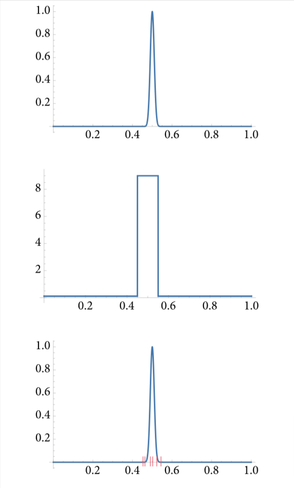

# 2 蒙特卡洛积分

通过随机的采样，使积分收敛于结果，其他积分方法对维度敏感，维度越多需要的采样点呈指数级上升，蒙特卡洛积分就好在采样数量与积分的维度无关。

蒙特卡洛积分只需要任意点的积分结果$f(x)$,来估计整个积分的值$\int f(x)dx$
这种方式易于实现，而且通用性强，与维度无关。在第13章，我们会看到在RandomWalkIntegrator上实现的光线传播算法，可以在无限维度的积分下，估计积分的值。

随机性为算法的设计带来了变革，这种算法可以归于两类：拉斯维加斯算法和蒙特卡洛算法。拉斯维加斯算法是使用随机的方法，但是最终结果总是相同的，蒙特卡洛算法，会根据特定的随机数得到不同的结果，但是把这些结果平均以后，会得到正确的答案。

接下来的章节会讨论在pbrt中大量使用到的蒙特卡罗积分的基础理论，在附录A里，有额外的蒙特卡洛采样函数，那些方法不太常用。

## 蒙特卡洛积分的基础

本小节会回顾概率论和统计学，这是蒙特卡洛积分的基础。

### 概率论背景回顾

大写字母代表从随机样本里选取的结果，对于特殊随机变量，会用到一些希腊字母。

若样本的选取的概率都是相同的，则我们说是均匀的(uniform)。能求出离散随机变量概率的函数，如p(X),称为PMF(概率质量函数)。

若有两个随机变量是独立的，p(X, Y)的联合概率就是它们自己的概率相乘
$$
p(X, Y) = p(X)p(Y)
$$

对于互相关联的随机变量，其中一个的概率会影响另一个的概率，比如盒子里面的黑白球拿取的问题，如果拿两个球(假设第一个球不放回)，那么第一个球的拿出后会影响第二个球的概率。这种情况下
$$
p(X,Y)=p(X)p(Y|X)
$$
$p(Y|X)$指：在给定X的条件下，Y的概率

在下文中，经常要从带有前提条件的情况下求随机变量的概率。比如，当要从光源中采样光照时就是如此。在12.6.3中提到的BVHLightSampler就会考虑接收到的点的3d位置和表面法线，因此光就是在其前提条件下进行随机选择的。然而，我们会忽略这些前提条件，因为这些条件太多，列出它们容易导致公式符号杂乱。

有一个重要的随机变量叫**标准均匀分布随机变量**，一般写作$\xi$，这个函数在[0,1)之间均匀独立地取出一个数。这个变量重要在两个方面:

1. 在软件中生成这种分布的数容易，大部分运行时库都有伪随机数生成器能生成它。
2. 我们能通过这个$\xi$，把其映射到离散的随机变量上。

> 举例：
>
> 比如将$\xi$分成两段[0,1/2],(1/2, 1),我们可以设$\xi$落在[0,1/2]取1，(1/2, 1)取2，这样就把$\xi$映射到了2个离散随机变量上。

选取一个$X_i$, 若:
$$
\sum_{j=1}^{i-1}p_j \leqslant \xi < \sum_{j=1}^{i}p_j
$$

> 这就是如上面举例的，如何把$\xi$映射成离散变量的数学表达。

在光照程序中，我们可能希望根据每个光源相对于所有光源的总功率$\Phi_i$来定义每个光源的采样光照的概率。

$$
p_i = \frac{\Phi_i}{\sum_j \Phi_j}
$$

> 也就是说，根据光源的功率$\Phi_i$在全部光源中的总功率的占比，来决定该光源被采样的概率

注意，这些$p_i$的值累加起来是1，也就是说，给出每个光源的概率， $\xi$就可以用于选取哪个光源进行采样。

某个随机变量的$P(x)$(**累积分布函数CDF**)，指从变量的分布中抽取的值小于或等于某个值x的概率。
> CDF:即把某一部分的概率累加起来的部分的概率，比如，求[0,1]间，随机取到小于等于0.8的概率是多少，这样的题

$$
P(x) = Pr\{X \leqslant x\}
$$

以骰子为例，$P(2)=\frac{1}{3}$, 即$\leqslant 2$的概率占$\frac{2}{6}$

**连续随机变量**是在一个连续的区域内随机取值(比如，实数里取值，单位球面上取向量，或者在场景里的物体表面上取值)。除了$\xi$之外，再举一个例子，假设有一个随机变量，在[0,2]之间，x的取值概率与2-x成正比，那么这个数，在0附近的概率是1附近的概率的两倍。

> 若x取的越接近0，2-x值越大，若x接近2，2-x值越小

PDF(**概率密度函数**)用来描述随机变量取到特定值的相对的概率，对于连续随机变量，称为PMF，p(x)(取某x点的概率)的PDF(概率密度)是CDF(累积分布函数)对x的微分:

$$
p(x) = \frac{dP(x)}{dx}
$$

对于均匀分布的随机变量，p(x)是个常数，对于均匀情况来说，这是很直观的结论，对于$\xi$，我们有:
$$
p(x) = 
\begin{cases}
1\,\,\,\, x\in[0,1)\\
0\,\,\,\, 其他
\end{cases}
$$

> 均匀分布的随机变量，概率密度处处相等，所以相对概率就是1

PDF是非负，且在其取值区间积分后为1(在某点的概率密度不一定小于1)

在随机变量的取值范围内，给定一个区间[a,b],对概率密度函数进行积分，即是对随机变量落在[a,b]内的概率:
$$
Pr\{x\in[a,b]\} = \int_a^b p(x)dx = P(b) - P(a)
$$

以上就是微积分第一定理(牛顿-莱布尼茨定积分公式)和概率密度函数的定义

### 期望值

对于函数$f$的期望值$E_p[f(x)]$,是指函数$f$在定义域D上，根据某种概率密度p(x)，算出来的平均值:
$$
E_p[f(x)] = \int_D f(x)p(x)dx
$$

> f(x)为你关心的函数的值
>
> p(x)是这个f(x)在x处的概率密度函数
>
> f(x) * p(x)指f(x)经过p(x)(pdf即相对概率的比例)加权后的值
>
> 对这个f(x)p(x)积分，即是对定义域D上的加权f(x)进行累加，相当于把f(x)的值按p(x)来连续加权并取平均，代表了若取趋近无穷个x的时候，其f(x)会越接近于这个期望值

下面举一个例子，若我们需要找到余弦函数在[0,$\pi$]之间的期望值，p为均匀分布，由于概率密度函数(PDF)p(x)在作用域D积分后必等于1, 所以p(x) = $\frac{1}{\pi}$,故:
$$
E[\cos x] = \int_0^\pi \frac{\cos x}{\pi}dx = \frac{1}{\pi}(\sin \pi - \sin 0) = 0
$$
> 即$\cos x$这个函数，当x在[0, $\pi$]之间以随机均匀取值趋近于无穷个时，$\cos x$的值就越接近0，可以通过余弦函数图像直观看出

关于期望值，有一些有用的属性:
$$
E[af(x)] = aE[f(x)]
$$
$$
E[\sum_{i=1}^nf(X_i)] = \sum_{i=i}^nE[f(X_i)]
$$

> 第一个式子就是积分常数可提性,第二个式子就是积分求和可以拆解，所以求和符号可以拿出来

在后续的章节会经常使用这几个特性

### 蒙特卡罗估计法

现在我们可以定义蒙特卡洛估计法了，这个方法估计出任意积分的结果。

假设我们想要估计一个一维积分的值$\int_a^bf(x)dx$, 给定一个独立随机均匀变量$X_i \in [a,b]$，蒙特卡洛估计法可以算出这个$X_i$估计出来的值:
$$
F_n = \frac{b-a}{n}\sum_{i=1}^nf(X_i)
$$
$E[F_n]$就等于这个积分的值，这个式子可以通过几步给证明出来:

1. 对于随机变量$X_i$的概率密度p(x)，等于$\frac{1}{(b-a)}$, p是一个常数，且p(x)积分后为1（在定义域[a,b]中）。利用之前提到的期望值公式，可得:
$$
E[F_n] = E[\frac{b-a}{n}\sum_{i=1}^n f(X_i)]\\
= \frac{b-a}{n}\sum_{i=1}^n E[f(X_i)]\\
= \frac{b-a}{n}\sum_{i=1}^n \int_a^b f(x)p(x)dx\\
= \frac{1}{n} \sum_{i=1}^n \int_a^b f(x)dx\\
= \int_a^b f(x)dx
$$

> p(x) = $\frac{1}{b-a}$所以移出积分式以后约分了分子
>
> 也就是说，要求一个类似于$\int_a^bf(x)dx$的积分结果，只要把$X_i$根据f(x)求到的结果的值全部求平均，只要取的$X_i$够多，最终结果形成的期望$E[F_n]$，就越接近这个积分的结果，而这个$E[F_n]$,即是吧$F_n$都加起来除以$X_i$的个数
>
> 简单再说一下，就是一个积分的值，可以通过随机取这个被积函数的值的平均，取的被积函数次数越多，求得的平均就越接近这个积分的最终值

把这个式子扩展到多个维度或者更复杂的积分域上，现在就比较直观了，若有n个独立随机样本$X_i$,是从一个均匀的多维度概率密度函数里取的，那么这个估计法也是一样的方式，比如，考虑到一个三维积分:
$$
\int_{z_0}^{z_1} \int_{y_0}^{y_1} \int_{x_0}^{x_1} f(x,y,z)dxdydz
$$

若采样点$X_i=(x_i,y_i,z_i)$是从一个$[x_0,x_1]\times[y_0,y_1]\times[z_0,z_1]$的立方体区域中选取，那么这个概率密度p(X)就是一个常数:
$$
\frac{1}{x_1-x_0} \frac{1}{y_1-y_0} \frac{1}{z_1-z_0}
$$
那么估计值就是:
$$
\frac{(x_1-x_0)(y_1-y_0)(z_1-z_0)}{n}\sum_{i=1}^{n}f(X_i)
$$

对于随机均匀变量，可以把上式改成
$$
F_n = \frac{1}{n}\sum_{i=1}^n \frac{f(X_i)}{p(X_i)}
$$

> $p(X_i)$在均匀的随机变量中，就是$\frac{1}{(x_1-x_0)(y_1-y_0)(z_1-z_0)}$, 所以用其化掉了分子
>
> 在非均匀分布中，\frac{f(X_i)}{p(X_i)}也是适用的，选取适当的p(x)可以更高效准确地估计积分

这一步很关键，对于蒙特卡洛法来说，精心选取一个合适的PDF，是减少图像错误的关键，详见章节2.2.2

所以上式就可用于估计积分值，唯一的限制就是，对于所有x,有$|f(x)|>0$,p(x)必须非0

> 上文就是说，在任何对于f(x)对结果有贡献的区域，其对应的p(x)必须覆盖得到
>
> 即，在f(x)不为0的区域，p(x)也不能为0，若为0，会导致积分估计不准确
>
> 举例:
>
> 假设要估计一个函数f(x)的积分，而f(x)在某个区域比如[1,2]有较大值，但是选取的概率密度p(x)在[1,2]上是0，也就是采样多少次，都不会在这个区间获得结果，导致对积分结果的估计不准确

现在，我们能理解之前随机行走积分器为何会用$\frac{1}{4 \pi}$了，在RandomWalkIntegrator中，是在单位球面随机均匀取一个方向，这个球面是$4\pi$,因为PDF是由单位化的采样区得出，所以是一个常数$\frac{1}{4\pi}$。所以利用之前提到的$F_n$公式，这个除数就放在了那。

使用了蒙特卡洛以后，n个采样可以被任意选取，不用考虑积分的维度。对于传统积分法来说，是非常重要的优点。因为传统的积分法随着维度上升，需要的采样呈指数级增长。

### 在蒙特卡洛积分法中的错误

现在我们知道蒙特卡洛积分会收敛于正确答案，但是也需要关注收敛的效果。可以用方差来衡量蒙特卡洛积分的收敛效果如何

对于一个蒙特卡洛估计器F，其方差为:
$$
V[F]=E[(F-E[F])^2]
$$
可得:
$$
V[aF]=a^2V[F]
$$
联立之前的期望累加公式，得：
$$
V[F] = E[F^2] - E[F]^2
$$
即，F的方差就是F平方的期望减去F期望的平方

对于独立随机变量的累加，类似之前的$F_n$，那么其方差就是每个采样值的方差的和
$$
V[\sum_{i=1}^{n}X_i]=\sum_{i=1}^{n}V[X_i]
$$
方差随着样本数量线性减小。由于方差是平方误差，因此蒙特卡洛估计中的误差只会以样本数量的$O(n^{-1/2})$的速率减少

> **为什么说方差的减小速率是线性的**
>
> 因为n-1个样本的方差跟n个样本的方差的比值等于1/n
>
> **为什么说误差减少的速率是$O(n^{-1/2})$**
>
> 由于方差的减小速率是1/n, 标准差(误差)是方差的平方根，可得速率为$\frac{1}{\sqrt{n}}$,即$O(n^{-1/2})$

收敛速度是$O(n^{-1/2})$也就是说，刚开始加的样本数对渲染误差减小的很好，后续加数量带来的误差减小幅度越来越小。就是说，采样点超过几十上百以后，对图像质量的改善作用越来越小，但是渲染时间还越来越慢。

对于估计器的收敛效果，可以用下式来表示
$$
\epsilon[F] = \frac{1}{V[F]T[F]}
$$

其中V[F]是方差，T[F]是计算要用到的时间

并不是所有的积分估计器的期望值都等于积分的结果值，这样的估计器叫做有偏的
$$
\beta = E[F] - \int f(x)dx
$$

> E[F]是估计器的期望值(在无偏中就是积分值，在有偏中与积分值有误差，所以减去积分值会得到一个$\beta$)
>
> 有偏估计器：其期望值与真实积分值之间存在偏差，但它们可能在某些情况下能够比无偏估计器更快地提供准确的结果
>
> 无偏估计器：其期望值恰好等于真实积分值，但可能需要更多的样本才能接近正确结果。

有偏估计器有时比起无偏估计器，可以用来更快的逼近正确结果。

在pbrt中，大部分使用的是蒙特卡洛估计法，除了SPPMIntegrator，这个类实现了光子映射算法

与方差关联的一个概念叫均方误差(MSE),是用来计算估计值与真实值之间平方误差的期望
$$
MSE[F] = E[(F- \int f(x)dx)^2]
$$

对于无偏估计器，MSE等于方差，否则MSE等于方差与估计器偏差的平方的和。

> 即，在有偏估计器中，$MSE[F] = V[F] + (Bias)^2$,
> 其中:
>
> $Bias=E[F] - \int f(x)dx \neq 0$

在简单的估计器里，可以求出方差和MSE的近似方程，但是大部分时候，是不可能的。但是这个值也是能被量化出来的。为了达到这个目的，样本方差可以被一组独立随机变量$X_i$计算出来。若把样本均值看作取算数平均值，即$\overline{X} = (1/n)\sum X_i$，那么样本方差可表示为:
$$
\frac{1}{n-1}\sum_{i=1}^{n}(X_i-\overline{X})^2
$$

关于除数为什么是$n-1$而不是n，是因为Bessel's correction，用来保证样本方差是一个无偏估计的方差(详见B.2.11,这里也介绍了几个关于如何稳定地计算样本方差)

> Bessel's correction: 用于修正样本方差的偏差，确保其成为总体方差的无偏估计, 具体为什么暂时不懂

样本方差本身也是方差的估计值，所以它自身也有方差，比如，对于一个随机变量，在99.99%的时间里都有一个值，在0.01%的时间里有另外一个值，如果我们取10个随机样本，都是第一个值，样本的方差就是0，虽然这个实际方差其实很大。

如果一个积分的精确估计$\widetilde{F} \approx \int f(x)dx$能被计算出来(比如用一个非常大的样本集)，那么MSE能被下式估计出来:
$$
MSE[F] \approx \frac{1}{n}\sum_{i=1}^{n}(f(X_i) - \widetilde{F})^2
$$

在pbrt里的imgtool工具，可以用里面的diff参数来求出图片的MSE

## 效率的优化

给定一个无偏的蒙特卡洛估计器，比较幸运的一点是方差(和错误)与样本数的关系是清晰的。如果我们的图像出现不可接受的噪点，只需要增加样本数量就可以降低噪点。

然而，计算是需要时间的，对于电影和每秒60帧的实时渲染来说，耗时都是需要重视的。对于减少误差的唯一方法就是在有限的样本数情况下，找到一种使样本发挥更大作用的方法。下面我们就来讨论一下这些优化方法:

### 分层采样法

一种经典且有效，用来减少误差的方法是，为积分选取更好的样本位置，以便更好地捕捉到积分的特性(或者说，能更精确，更少的错过重要的积分特点)。

分层采样法把积分分为多个区域，然后在每个区域进行采样。这里我们会分析一下这种方法是如何降低误差的，在后续章节8.2.1中，我们会用傅里叶分析方法进一步阐述这个问题。

分层采样法把一个积分的作用域$\Lambda$分成n个没有相交的区域$\Lambda_1,\Lambda_2,...,\Lambda_n$,每个区域叫做一层，这些区域必须覆盖积分域的全部作用域:
$$
\bigcup_{i=1}^{n}\Lambda_i=\Lambda
$$

> 所有区域求并集就等于积分的作用域$\Lambda$

为了找到$\Lambda$的样本，我们会在每个样本区域$\Lambda_i$上，根据在每个层的概率密度$p_i$，找寻每个$n_i$。

一个简单的例子就是对一个像素点进行超采洋，使用分层采样法，对于像素点周围的区域会被分成$k\times k$个格子，采样会在每个格子上均匀地进行，这种方式比直接在$k^2$上随机采样要好，因为在小格子里采样，不太会导致采样点聚拢在一起，造成某些区域没采样到，或者采样不均匀的问题(没很好的捕捉到积分域的特征)。

在一个层$\Lambda_i$中，蒙特卡洛估计是:
$$
F_i=\frac{1}{n_i}\sum_{j=1}^{n_i}\frac{f(X_{i,j})}{p_i(X_{i,j})}
$$

> 这里的$X_{i,j}$即第i行j列个层,$F_i$即每个层的采样估计值

总的估计值就是$F=\sum_{i} v_iF_i$，$v_i$是对于层$i(v_i\in (0,1]$)中的一个分层体积部分

> $v_i$是表示这一层的体积占整个采样区域的比例。这个值用来加权每一层的采样结果。

在这个层i的积分的真实结果是
$$
\mu_i = E[f(X_{i,j})] = \frac{1}{v_i}\int_{\Lambda_i} f(x)dx
$$

方差是:
$$
\sigma_i^2 = \frac{1}{v_i}\int_{\Lambda_i}(f(x) - \mu_i)^2dx
$$

> $\mu_i$指i层里的平均数

因此，对于在i层中的n个采样$n_i$，就有每层估计值的方差为$\frac{\sigma_i^2}{n_i}$,所以，对于总体估计值的方差为:
$$
V[F] = V[\sum v_iF_i]\\
= \sum V[v_iF_i]\\
= \sum v_i^2V[F_i]\\
= \sum \frac{v_i^2\sigma_i^2}{n_i}
$$

> 这个公式就是说，总体的方差等于每层的体积分数的平方乘以方差，再除以这层的采样数，把这些值累加起来。

假设i层的采样数$n_i$与体积分数$v_i$成正比，可得$n_i=v_in$

> 假设每个层的样本数 $n_i$ 与它在整个区域中占据的体积 $v_i$ 成正比。这意味着，如果某个层占的体积大（$v_i$ 较大），那么这个层中的样本数就会相应地多
>
> 根据这个假设，我们可以得出 $n_i$ 等于总样本数 $n$ 乘以该层的分数体积 $v_i$。这样，每个层的样本数 $n_i$ 就是按照该层在整个采样区域中的体积比例来分配的
>
> 即是说，体积大的层应该有更多样本，因为它代表了采样区域的更大部分。通过这种分层采样的方法，能够更加均匀地覆盖整个区域，提高采样效率。

把这个式子联合上式可得:
$$
V[F_n] = \frac{1}{n}\sum v_i\sigma_i^2
$$

为了与没做分层采样的方差做对比，我们注意到，在一个未分层的区域做采样，等效于在一个由$v_i$定义的离散概率分布的随机的分层$I$上，取在$\Lambda_I$上的随机样本X。那么X的采样就取决于I, 所以，这个情况就可以用条件概率来表示:
$$
V[F] = \frac{1}{n}[\sum v_i\sigma_i^2 + \sum v_i(\mu_i - Q)^2]
$$

Q代表在整个作用域$\Lambda$上的$f$的平均数

> 我还是不懂，以下是ChatGPT解释(不保证正确)
>
> 在分层采样中，我们首先随机选择一个分层 $I$（分层的概率由 $v_i$ 确定），然后在所选分层 $\Lambda_I$ 内采样一个随机变量 $X$。因此，整个采样过程依赖于 $I$，从而可以通过条件概率来表示
> $$
> V[F] = E[V[F|I]] + V[E[F|I]]
> $$
> $E[V[F|I]]$ 是条件期望的方差，即每个分层内的方差
>
> $V[E[F|I]]$ 是条件期望之间的方差，即每个分层的均值差异引起的方差

在上式中，有两个点值得注意:

1. 公式的第二项部分的累加肯定是非负的，因为方差总是非负。
2. 这个式子可以看出，分层法永远不会增加式子的方差。

分层法永远只会减小方差，除非第二项部分=0。只有在$f$的平均值正好等于每个层的平均值才会为0。

为了使分层法的样本最优，我们需要最大化公式第二项的累加值，所以，最好把每层的平均值都搞得尽量不相等。所以这也是为什么在$f$未知的时候要使每个层之间紧密相连。
如果某个层很大，意味着$\mu_i$越接近于整体的平均值Q。

> **这个式子是一个求和，那不应该是右项越大,V[F]越大吗**
>
> (GPT说的，不保真)增大第二项是微小的，但是第一项会相应减少很多，导致式子里V[F]减小
>
> 我的理解是，就是分层的时候，由于要把层里面的均值搞得不同，这个层就需要有更多不同于其他部分的点
>
> 什么是紧密相连的分层?
>
> 就是说这些分层尽可能多且小，可以避免样本几种于分层的某个区域，减少方差

总的来说，对于使用分层采样法来说，可以减小图像噪点和失真，且相对于不使用分层法来说，不会增加时间消耗

分层采样法主要的缺点是，设D为维度，每个维度有S个层，那么有关系$S^D$,代表需要的采样数量。导致随着维度上升，采样点指数级上升，很快就变得不可完成。幸运的是，基本上从一些维度里独立的分层是可能的，然后可以把这些不同维度的样本随机地结合起来，这种方法详见8.5。选取分层的维度需要与积分值高度相关。

### 重要性采样法

重要性采样法是一种使蒙特卡洛估计法的方差减小的强大的方法。这种方法通过在积分中根据$f(x)$取类似的分布函数$p(x)$来更快的收敛。在这种场景下，也就是说，对于$f(x)$值相对大的区域，应该多采样。重要性采样法是渲染技术中用于减小方差的方法中，使用的最多的方法之一，只需要利用更好的采样分布就可以达成很好的效果，简单有效。

下面我们来看下，为什么采样的分布会减小误差和错误。首先，考虑使用一个分布$p(x) \varpropto f(x)$ 或$p(x)=cf(x)$(这里假设$f(x)\geqslant 0$)

> 符号$\varpropto$代表与…成比例，或正比于。$p(x) \varpropto f(x)$意思是概率分布$p(x)$正比于$f(x)$，即$p(x)$是$f(x)$的一个缩放版本

把PDF参数化,这个常数c:
$$
c=\frac{1}{\int f(x)dx}
$$

> 由于$p(x)$的积分为1，可得
> $$
> \int p(x)dx = \int c * f(x)dx\\
> c * \int f(x)dx = 1\\
> c=\frac{1}{\int f(x)dx}
> $$

要找到这个PDF，需要我们知道这个积分的值，联立蒙特卡洛中的F_n$,就可得:
$$
\frac{f(X_i)}{p(X_i)}=\frac{1}{c}= \int f(x)dx
$$

> 式子中第一项由于我们假设p(x)与f(x)是比例关系，故$\frac{f(X_i)}{p(X_i)}$也应当有$\frac{1}{c}$的关系，再由之前得到的c=\frac{1}{\int f(x)dx},就可得$\frac{1}{c} = \int f(x)dx$

从上式我们看到，这种情况下估计器的方差为0！有点可笑的是，若我们能直接对f(x)积分的话，为啥还用蒙特卡洛呢。然而，如果p(x)与f(x)很相似，方差也会被减小

举一个更现实的例子，考虑一个高斯函数$f(x)=e^{-1000(x-\frac{1}{2})^2}$(如下图1)，这个函数的x在[0,1]之间，大部分都是接近0的，我们在X<0.2或X>0.3上采样的话，对于估计积分是几乎没帮助的，因为这个函数在1/4的区域附近有一个凸出来的部分，若用蒙特卡洛估计法，并且均匀采样的话，方差大概为0.0365。

若采样是在一个根据常数来分段分布的函数下(即用蒙特卡洛的离散分布估计)，方差会缩小大概6.7倍。如果从图3里取6个具有代表性的点，我们能看到大部分$f(x)$的取值都不是接近0的。

若重要性采样时，分布选的不好，会增加方差。有时候增加的还会相当多。

所以对于在渲染中使用蒙特卡洛积分时，用了不好的采样分布方法而加大采样点个数是不划算的。

### 多重重要性采样

我们经常会碰到被积函数是由两个或更多函数相乘出来的，类似$\int f_a(x)f_b(x)dx$。一般来说，可以通过为每个部分分出独立的重要性采样方法，虽然这些分出来的重要性采样的函数跟原始函数完全不相似。对于光的传播的积分中，这种情况是很常见的。比如BSDF乘以入射光辐射再乘以余弦因子这样的情况就是如此。

为了理解在这些函数乘积上应用蒙特卡洛方法，假设有两个采样分布函数$p_a$和$p_b$,分别与$f_a$和$f_b$相似(一般来讲这种情况不可能)。使用蒙特卡洛估计，我们有2种选项，要么根据$p_a$采样，要么根据$p_b$采样。

若根据$p_a$采样，则这个估计会有下式:
$$
\frac{f(X)}{p_a(X)} = \frac{f_a(X)f_b(X)}{p_a(X)} = cf_b(X)
$$

在这里，c是一个常数，由于$p_a(x) \varpropto f_a(x)$, 所以c等于$f_a$的积分值。

这个估计器的方差与$f_b$的方差成正比，反过来若取$p_a$采样，结果也相似。也就是说，在现实情况里,分布也只是近似于乘积的函数中的一个，这样做只会导致采样效果更差。

不幸的是，通过从每个分布里分别采样，然后再均匀地混合起来，这种方式也没好多少。因为方差是累计的，也就是说，只要有方差被加到估计器上了，我们就不能通过把低方差的估计器加入来消除这些方差。

多重重要性采样(MIS)就是处理这种问题的，这种方法简单易用。基本思想是：当我们估计一个积分的值时，我们应该从多个采样分布里选取这个值，选取的值至少有一个与积分的形状很相符，虽然我们不知道是这个采样具体是哪个。

> 即使我们不知道哪个分布最适合，通过覆盖更多的分布，我们增加了找到合适分布的机会，从而提高积分估计的准确性

MIS（多重重要性采样）提供了一种方法，通过对每种技术的样本进行加权，从而消除由于被积函数值与采样密度不匹配而导致的大方差峰值。

甚至于那些对于特殊场景的特殊采样方法也是鼓励使用的，因为这些方法也能减小特定的方差，而且一般来讲，这些方法的使用的性能成本很低。

对于两种采样分布$p_a$和$p_b$, 分别取一个采样$X\thicksim p_a$, $Y\thicksim P_b$,这个多重重要性采样估计公式是:
$$
w_a(X)\frac{f(X)}{p_a(X)} + w_b(Y)\frac{f(Y)}{p_b(Y)}
$$
这里$w_a$和$w_b$是函数的权重，根据$f(x)$的积分来取的估计器的期望值

把上式推广来看，即：给定n个采样，在$p_i$分布上，有$n_i$个样本，$X_{i,j}$是从第i个分布中取得的样本，那么蒙特卡洛在多重重要性采样下的估计是:
$$
F_n = \sum_{i=1}^{n}\frac{1}{n_i}\sum_{j=1}^{n_i}w(X_{i,j})\frac{f(X_{i,j})}{p_i(X_{i,j})}
$$

对于无偏估计器中，权重函数的所有条件就是它们的和是1(当$f(x)\neq 0$),即$\sum_{i=1}^{n}w_i(x)=1$,并且当$p_i(x)=0$时，$w_i(x)=0$

把$w_i(X)$设为$\frac{1}{n}$代表了多个估计器相加的场景，之前讲到，这种方式并不有利于减少方差。更好的做法是，当某个采样技术能很好的匹配积分时，增大这个权重，反之则减小，这样来减少高方差样本对最终结果的的贡献影响。

在实践中，一个比较好的选择是使用平衡启发法来衡量每个函数项的权重。平衡启发法通过考虑样本生成的所有不同的方式，而不只是用特定的一种来生成样本。

平衡启发法来取得第i个采样方法的权重的公式是:
$$
w_i(x)=\frac{n_ip_i(x)}{\sum_jn_jp_j(x)}
$$

> 这里的i表示当前考虑的采样方法，j表示所有的采样方法的序号

对于之前提到的，从两个采样方法中各取一个采样的例子来说，若采用平衡启发法，MIS下的蒙特卡洛估计的式子如下：
$$
\frac{f(X)}{p_a(X) + p_b(X)} + \frac{f(Y)}{p_a(Y) + p_b(Y)}
$$

每个$f$的值都要除以所有概率密度函数的和，而不是只除以样本对应的概率密度函数。因此，若$p_a$生成了一个低概率的采样点，$p_b$生成了高概率的采样点的时候，由于除以$p_a(X) + p_b(X)$，减少了这些样本的贡献。实际上，这些采样中，当从$p_a$中获取时，是被降了权重的，因为与$p_b$ 相关的采样技术在积分域的相应点上更为有效

> 权重的大小反映了某个采样方法在对应采样点处的匹配程度。我们通过加权平均来避免单一采样方法在某些区域表现不佳时对整体估计造成较大的影响

若某个采样方法在某点概率密度很大，那么多重重要性采样的权重就可以使最终结果的方差大大减少。

在pbrt中，有BalanceHeuristic()函数来做多重重要性采样，可以对两个分布来求。

在实际情况中，指数启发法一般能更好的减少方差，对于一个指数$\beta$,这个指数启发法的式子是:
$$
w_i(x)=\frac{(n_ip_i(x))^\beta}{\sum_j(n_jp_j(x))^\beta}
$$

请注意，对于指数启发法，公式跟平衡启发法很像，但是它能更多的减少相对低概率的采样的贡献度，我们取$\beta=2$是因为大部分情况2足够了，所以在代码里面，这个指数2是硬编码的

多重重要性采样甚至可以不需要在所有分布下取样本，这种方式称为单采样模型。我们就不在此推导了。公式如下:
$$
\frac{w_i(X)}{q_i}\frac{f(X)}{p_i(X)}
$$
这里$q_i$是指某个$p_i$从所有概率分布函数里面选出来的概率

给定一个积分的无偏估计，相对于单一样本模型来说，平衡启发法效果会更好。

对于多重重要性采样来说，有一个缺点是，若里面有某种采样法非常匹配积分的函数，MIS会稍微增加方差大小。对于渲染相关的应用，MIS几乎总是值得用来降低方差的，不论碰到这种情况与否，都能总体上降低方差。

#### 补偿

多重重要性采样一般都是使用概率分布来采样的，每个概率分布方法也可以单独用作积分的重要性采样，对于非零的积分式来说，生成一个非零0的概率也不为0.然而，当使用MIS时，并不要求所有PDF在被积函数非0的地方时非0的，只要求其中有一个PDF非0就行。

这个结果引出了叫MIS补偿的机制，能够更好的降低方差。有一个现象是，若所有分布的采样在某个区域都有概率，但是这个区域对应的被积函数值很小，那么一般来讲，这个区域就是被过采样了，遗留下的区域就是被积函数高度欠采样的区域。MIS补偿就是受这个现象的启发。

MIS补偿是基于这样一个点子，使某个或多个概率分布更加突出。例如，把某个概率分布中，低概率的部分改成0，那么新的概率密度函数p'就可以定义为:
$$
p'(x)=\frac{max(0,p(x)- \delta)}{\int max(o,p(x)-\delta)dx}
$$

其中$\delta$是固定值，代表对$p(x)$的调整程度

这种方法当在表格式采样分布的场景下十分易用。对于采样环境映射的光源下效果比较好，详见12.5

> 表格式采样分布:指预先计算并存储的采样分布，这让应用采样算法更加高效

### 俄罗斯轮盘赌

这种方法能够提高蒙特卡洛估计的效率，它把对最终结果贡献较小的样本的计算跳过了。在渲染中，我们有以下形式的估计器:
$$
\frac{f(X)v(X)}{p(X)}
$$
这个被积函数中，有$f(X)$,这个因数是容易被计算的(这个因子在渲染中就与表面如何散射光线有关)，其他几个因数更难算一些，比如$v(X)$(二值可见因子(表示两个点之间是否有直接的可见性))需要跟踪一条光线才能得出。在这种情况下，式子中最不易计算的部分都在v这个因子上。

> $v(x)$:只有0或1两个值(二值),若点A发出的光能无阻挡到达B，则为1，反之则为0

若$f(X)$是0，那么我们就可以跳过$v(X)$的计算。然而，如果$f(X)$在比较小但是非0的时候也略过不算，那么我们会在这个估计器里引入偏差，会导致整体上低估了被积函数的值。

俄罗斯轮盘赌解决了这个问题，这种方法让我们同样可以在$f(X)$很小但非0的时候跳过这些计算，还能保持在最终结果大体正确。

为了使用俄罗斯轮盘赌方法，我们选取一个终止计算的概率q，这个值可以根据情况取。比如，这个值可以基于某个特定样本算出来的被积函数的值来确定，若被积函数越小，这个终止概率p越大。有了这个种植概率q，那么有些样本就不用计算了，会使用一个常数c来代替(比如c=0)。
对于1-q的采样，估计器还是会进行计算，但是权重会变成$\frac{1}{1-q}$,用来补偿之前跳过的采样计算。

> **为什么是$\frac{1}{1-q}$**?
>
> 假设我们在原始蒙特卡洛估计中，每个样本都应该被考虑。如果我们随机跳过某些样本，估计值会变小，因为跳过的样本没有被考虑，导致最终的估计结果不足。为了让估计结果保持无偏，也就是说，期望值保持不变，我们需要放大那些没有被跳过的样本的贡献,弥补跳过的部分的值。

现在我们有了新的估计器:
$$
F'=
\begin{cases}
\frac{F-qc}{1-q}\,\,\,\, \xi > q\\
c\,\,\,\, 其他
\end{cases}
$$

> **为什么分子上是F-qc**?
>
> 减qc目的是补偿在q概率下终止计算的那些样本的影响，是为了让结果总体上贡献不会偏大做做的补偿。
>
> **$\xi > q$**?
>
> $\xi$表示一个随机数，用来决定是否跳过该样本$\xi > q$表示没有跳过该样本。

易见，F'的期望与原本的F的期望是一样的:
$$
E[F']=(1-q)(\frac{E[F]-qc}{1-q})+qc=E[F]
$$

俄罗斯轮盘赌方法不会降低方差，事实上，除非c=F,否则这种方法总是会增加方差，然而，确实能够有效的降低蒙特卡洛估计法的计算耗时。

### 分裂采样法

俄罗斯轮盘赌减少了采样的(计算)数量，分裂采样法增加了多维积分中，某些维度上的采样数量，用来改进效率。下面来举个例子，假设有这么一个积分:
$$
\int_A \int_B f(x,y)dxdy
$$
若用标准重要性采样估计，我们可以在独立的分布中，取$X_i \thicksim p_x\$和$Y_i \thicksim p_y$,来计算估计值:
$$
\frac{1}{n}\sum_{i=1}^{n}\frac{f(X_i,Y_i)}{p_x(X_i)p_y(Y_i)}
$$

分裂采样法允许我们可以在区域A取每个样本时，在区域B取多个样本。故我们有$X_i$个样本的同时，有m个样本$Y_{i,j}$，得出估计器式子:
$$
\frac{1}{n}\sum_{i=1}^{n}\frac{1}{m}\sum_{j=1}^{m}\frac{f(X_i,Y_{i,j})}{p_x(X_i)p_y(Y_{i,j})}
$$

若可以分开每个$X_i$计算$f(X_i,·)$，相比从$X_i$中取nm个样本来说，这种方法使我们能更快的计算nm个样本的值。

> 也就是在$X_i$这部分的计算，可以复用这部分的计算结果，若是直接取nm个点，那么所有$X_i, Y_i$都需要重新计算，这种方式减小了计算开销。

对于渲染来说，
$$
\int_A \int_B f(x,y)dxdy
$$
上式就用来计算像素点的颜色值。假设有像素区域A上的积分，其中在像素区域内某点x，一条光线射入到场景中，并且在与物体的交点处对半球区域B进行积分，来计算反射辐射量，此时会追踪一条或多条光线。采用分裂采样法，我们可以在每个光线积分取多个采样点，来分摊每个从相机发出的光线的计算成本，提升计算效率。

## 使用反演法进行采样

## 在分布之间转换

## 延伸阅读

