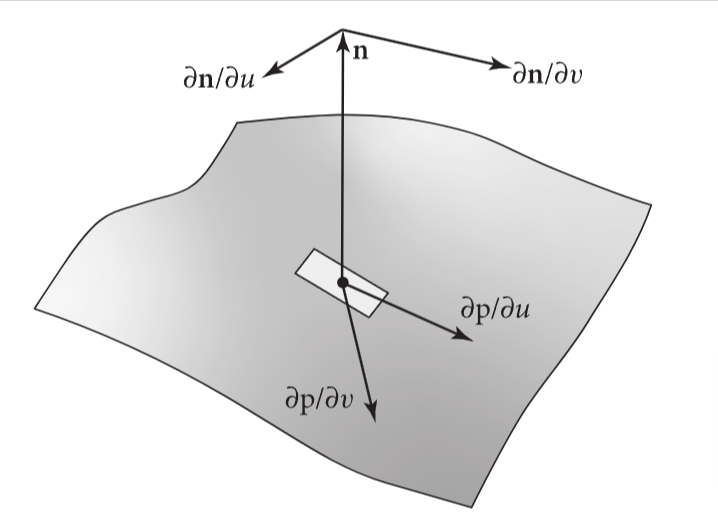

# 3 几何及其变换

## 坐标系统

pbrt中，使用三维直角坐标系。某个点的坐标取决于所使用的坐标系统和位置，但是这个点的绝对位置是固定的。

对于n维场景，坐标系有原点$p_o$，n个线性独立的基向量定义的n维仿射空间。所有的向量$\vec v$可以被多个基向量的相加来表示。给定一个向量$\vec v$和其基向量$v_i$,有一组特定系数$s_i$，使:
$$
\vec v = s_1\vec v_1 + s_2\vec v_2 + ... + s_n\vec v_n
$$

相似的，对于所有点p，有一组特定系数$s_i$，公式如下:
$$
p=p_o + s_1\vec v_1 + s_2\vec v_2 + ... + s_n\vec v_n
$$
因此，虽然点和向量都是用x,y,z来表示的，但是它们不同的数学表达不同，不能被简单地互换。

所以，为了定义一个坐标系，我们需要原点和基向量，但是我们只能在这个坐标系里表示点和向量，在其他坐标系就不同了。因此我们定义一个标准坐标系,即原点(0,0,0),基向量x,y,z就是三个坐标轴,其他的坐标系会基于这个标准坐标系来定义，这种方式叫世界空间(world space)。

### 左/右手坐标系

作者在这里叙述了左右手坐标

> 简单来说，我们把x都指向右侧，y都指向上的时候，z轴朝远处就是左手坐标系，朝近处就是右手坐标系。

## n-元组基类

pbrt的类都是基于n-元组(tuple)的类来实现的。这些文件定义在/util/vecmath.h中。

这些类使用了很多高级C++编程技术，只需要知道做什么就可以了，不感兴趣的话不用关注实现。

> 后续文章主要介绍了Tuple2,和Tuple3,这里不详述

## 向量

pbrt基于2维和3维元组类提供了2维和3维向量类

> 后续文章介绍了vector类的用法和向量相关的计算基础，此处略

## 点

在pbrt里，有Point2和Point3类，来表示点。

> 后续段落讲了这些类的使用，略过

## 法线

> 法线的定义和在pbrt中的实现，略

## 射线

> Ray类和RayDifferential类(射线微分量)在pbrt的实现的介绍，略

## 包围盒

> 包围盒的理论和实现，略

## 球面几何学

< 球面几何介绍，和相关函数，略

## 矩阵转换

> 略

## 矩阵转换的应用

> 略

## 3.11 相互作用

SurfaceInteraction和MediumInteraction分别代表表面上的局部的点和在介质中的点的相互作用的信息。例如：在第六章中，光线与物体的相交过程，是用SurfaceInteraction返回交点局部的微分几何信息。在后续的第十章中，纹理相关的代码会利用SurfaceInteraction里的值来计算材质的属性。类似的，MediumInteraction类是用于光在介质中(比如烟雾，云)传播的场景。所有的这些实现放在interaction.h和interaction.cpp中

> 在文中，交点(intersection point)是光线与物体表面几何上的坐标点，交互点(interaction point)是更广义的交点，不局限于光线与物体的交点，只要会相互作用的点就叫交互点，所以交互点可理解为交点在概念上的超集

SurfaceInteraction 和 MediumInteraction 都继承自一个通用的 Interaction 类，该类提供了通用的成员变量和方法，这使得系统中那些不需要考虑表面与媒介交互差异的部分可以仅通过 Interactions 来实现

> interaction类是把表面材质和光的介质的相互作用从这两个抽象里面分离，这样做是为了让各种表面和各种介质的处理过程解耦化

<<Interaction的定义>>

```c++
class Interaction {
  public:
    // <<Interaction的Public方法>> 
    // <<Interaction的Public成员>> 
};
```

这个类里有各种构造器，取决于构造的顺序和对应接收的参数的顺序，下列这个构造器是最通用的:

<<Interaction的public方法>>

```c++
Interaction(Point3fi pi, Normal3f n, Point2f uv, Vector3f wo, Float time)
    : pi(pi), n(n), uv(uv), wo(Normalize(wo)), time(time) {}
```

所有interaction都有一个p点，用Point3fi存储，是用Interval来代表每个坐标的值。存储一个浮点值的区间而不是单个Float是为了表示在交点处具有数值误差的域，这种误差发生于p点在与光线相交计算的时候。这个信息有助于避免光线在离开表面时不正确的自相交现象，详见6.8.6

<<Interaction的public成员>>

```c++
Point3fi pi;
```

Interaction类提供了一些便利的方法，在不需要考虑上述误差的时候(比如：纹理计算方法的时候)，返回一个普通的Point3f点

<<Interaction的public方法>>

```c++
Point3f p() const { return Point3f(pi); }
```

所有的interaction实现都有一个时间量，这个值用于设置离开交互点时生成的光线的时间点。

<<Interaction的public成员>>

```c++
Float time = 0;
```

在光线经过时的交互过程(比如光线到物体的交互和光线通过介质时的交互)，会在成员变量里存入一个与光线方向相反的向量wo,对应渲染公式里的$\omega_o$(即交点的出射光向量)，对于其他那些出射方向类型的交互点，不会设置此值(比如在物体表面随机采样的点)，wo的值是(0,0,0)

> 在路径追踪的过程中，光线的传播方向是最终朝着光源的，而不是从光源射出的光的方向，所以这里是存了wo的反方向向量
>
> 方便处理局部坐标系中的光线方向问题

<<Interaction的public成员>>

```c++
Vector3f wo;
```
m
对于在表面上的交互点，n这个符号存了表面上这个点的法线，同时，uv存了(u,v)的参数化坐标值。那么你就要问了，为什么把这些值存到Interaction类，而不是SurfaceInteraction上？原因是有些系统很可能不会关注表面和介质交互点的区别，例如，在给定某个被照亮的点时，在某些光照的计算方法中，会在光源上来采样点。这些计算方法会在这些值不为0时使用它们，而为0时忽略他们。把这些变量安排在interaction里会更加方便。

<<Interaction的public成员>>

```c++
Normal3f n;
Point2f uv;
```

检查某个Interaction的指针或引用是否是两个子类之一是可能的。表面上的法线是否非零就是区别

<<Interaction的public方法>>

```c++
bool IsSurfaceInteraction() const { return n != Normal3f(0, 0, 0); }
bool IsMediumInteraction() const { return !IsSurfaceInteraction(); }
```

这些方法也被用来转换子类。检查转换是否可行的方法，也适合放在这个类中。这个方法的非常数变量和对应的AsMedium()方法是类似的，这里就不列出来了

<<Interaction的public方法>>

```c++
const SurfaceInteraction &AsSurface() const {
    CHECK(IsSurfaceInteraction());
    return (const SurfaceInteraction &)*this;
}
```

Interaction的实现也能通过MediumInterface类，来代表两种类型的介质之间的相互作用，这会在11.4介绍，也可以用Medium来代表在散射介质中某点的属性。在这种情况下，从Interaction的抽象就可以得知：表面在这里可以代表介质之间的交界面，同时，对于介质中的某点，是没有交界面的，但是有当前的介质的属性。这两种情况的值，为了方便，都存到了Interaction中，n和uv也同理存到此处。

<<interaction的public成员>>

```c++
const MediumInterface *mediumInterface = nullptr;
Medium medium = nullptr;
```

### 3.11.1 表面的交互

表面上特定点的几何属性用SurfaceInteraction表示(一般来说时光线打到表面时的交点)， 有了这个抽象可以让大部分系统只根据这个点的数据来运行，而不需要考虑这个点所对应的物体的几何特征。

<<SurfaceInteraction的定义>>

```c++
class SurfaceInteraction : public Interaction {
  public:
    <<SurfaceInteraction的Public方法>> 
    <<SurfaceInteraction的Public成员>> 
};
```

除了从Interaction基类中带过来的参数，SurfaceInteraction也存了参数化的偏导数$\frac{\partial p}{\partial u
}$和$\frac{\partial p}{\partial v}$, 和表面法线的偏导数量$\frac{\partial \vec{n}}{\partial u}$和$\frac{\partial \vec{n}}{\partial v}$,见图3.30

<<SurfaceInteraction的Public成员>>

```c++
Vector3f dpdu, dpdv;
Normal3f dndu, dndv;
```



图3.30 p点周围的几何微分量。表面偏导数$\frac{\partial p}{\partial u}$和$\frac{\partial p}{\partial v}$， 这两个量不是必须正交的。法线$\vec{n}$是用$\frac{\partial p}{\partial u}$和$\frac{\partial p}{\partial v}$叉乘得来。法线对应的$\frac{\partial \vec{n}}{\partial u}$和$\frac{\partial \vec{n}}{\partial v}$记录了在表面沿着u,v方向移动时，法线的微分变化量

> **为什么表面偏导数$\frac{\partial p}{\partial u}$和$\frac{\partial p}{\partial v}$可以不正交?**
>
> 因为曲面的形状和参数化方式决定了它们的相对方向。例如，如果曲面在某个位置是弯曲的或扭曲的，切向量之间就可能不是直角
>
> **为什么$\frac{\partial \vec{n}}{\partial u}$和$\frac{\partial \vec{n}}{\partial v}$图上看起来是正交的？**
>
> 不够明白

从上文中可以发现，我们假设了物体的几何形状是有参数化形式描述的，那么对于在(u,v)范围内的值，表面上的点可以被某个函数f求得，即$p=f(u,v)$，然而不是所有形状都满足此条件。在pbrt中，所有形状都至少在某个局部上，有参数化的描述，故我们会坚持用参数化的表达方法，因为这种假设在其他地方(比如在第10章的材质抗锯齿上)也很有帮助

SurfaceInteraction的构造器的入参用来设置上述提到的这些值。这些值用偏导数的叉乘来计算法线向量

<<SurfaceInteraction的public方法>>

```c++
SurfaceInteraction(Point3fi pi, Point2f uv, Vector3f wo, Vector3f dpdu,
        Vector3f dpdv, Normal3f dndu, Normal3f dndv, Float time,
        bool flipNormal)
    : Interaction(pi, Normal3f(Normalize(Cross(dpdu, dpdv))), uv, wo, time),
      dpdu(dpdu), dpdv(dpdv), dndu(dndu), dndv(dndv) {
    // <<根据真实的几何信息初始化着色相关的几何信息>> 
    // <<根据朝向和左右手坐标系调整法线向量>> 
}
```

SurfaceInteraction存储了某个表面法线的第二个实例，和各种偏导数，用来表示这些量可能的扰动值，这些扰动值是由凹凸贴图或网格的每个顶点插值的法线生成的。系统中的一部分会用这种着色几何体，其他部分用的是原始的量

<<SurfaceInteraction的public成员>>

```c++
struct {
    Normal3f n;
    Vector3f dpdu, dpdv;
    Normal3f dndu, dndv;
} shading;
```

着色几何体的值是在构造器中进行初始化，对应到最初的几何体的表面。如果着色几何体存在，一般来说要等SurfaceInteraction构造完成以后才会计算。 SetShadingGeometry()方法，用来更新着色几何体

<<根据真实的几何信息初始化着色相关的几何信息>>

```c++
shading.n = n;
shading.dpdu = dpdu;
shading.dpdv = dpdv;
shading.dndu = dndu;
shading.dndv = dndv;
```

表面法线在pbrt中有特别的含义，对于闭合形状体，假设法线指向形状的外侧。对于当作面积光源来用的几何体来说，光默认情况下是从表面沿着法线方向射出，另一边就是黑的。由于法线有特殊的含义，pbrt为用户提供了反转法线方向的机制，可通过ReverseOrientation类来达成。因此，检查Shape是否有此标志是必须的，若有，则要反转法线方向。

然而，对于法线的朝向，还有其他因素在这里要考虑。若几何体对应的转换矩阵要从pbrt默认的左手坐标系切换到右手坐标系，我们也需要把法线的朝向做切换，为了解释为什么需要这么做，考虑一个缩放矩阵$S(1,1,-1)$，我们会自然的期望这个缩放能够切换法线的方向，尽管因为我们有从$\vec{n} = \frac{\partial p}{\partial u}\times \frac{\partial p}{\partial v}$计算得来的法线，
$$S(1,1,-1)\frac{\partial p}{\partial u}\times S(1,1,-1)\frac{\partial p}{\partial v}=S(-1,-1,1)(\frac{\partial p}{\partial u}\times \frac{\partial p}{\partial v})\\
=S(-1,-1,1)\vec{n}\\
\neq S(1,1,-1)\vec{n}$$

> 1. 分别在u,v的偏微分量上应用缩放矩阵
> 2. 利用叉乘分布律，把$S(1,1,-1)$提到外面, 在 $x$ 和 $y$ 方向保持不变，$z$ 方向翻转，会导致叉乘结果的 $z$ 分量也会受到反转影响
> 3. $S(-1,-1,1)\vec{n}\neq S(1,1,-1)\vec{n}$两侧的法线不同，左侧是通过对切向量分别缩放并再进行叉乘得到的，而右侧是直接对法线 $\vec{n}$ 应用缩放 $S(1,1,-1)$
>
> 直接在切向量上缩放并进行叉乘，和先叉乘再缩放法线会得到不同的结果

因此，在切换左右手坐标系时，我们有必要反转法线的方向，因为在这里，反转并不是为了使用叉乘来计算法线的方向。所以，给调用者传一个反转的标识是有必要的。

<<根据朝向和左右手坐标系调整法线向量>> 

```c++
if (flipNormal) {
    n *= -1;
    shading.n *= -1;
}
```

pbrt也提供也可以把每个多边形网格面用一个整数作为索引。这个索引是用来给特定纹理映射操作来使用。另一个SurfaceInteraction构造器可以做这件事

<<SurfaceInteraction的public成员>>

```c++
int faceIndex = 0;
```

当一个着色坐标系被计算，SurfaceInteraction通过SetShadingGeometry()方法来更新它。

<<SurfaceInteraction的public方法>>

```c++
void SetShadingGeometry(Normal3f ns, Vector3f dpdus, Vector3f dpdvs,
        Normal3f dndus, Normal3f dndvs, bool orientationIsAuthoritative) {
    // <<为SurfaceInteraction计算shading.n>> 
    // <<初始化着色相关的偏导数值>> 
}
```

在与之前相似的叉乘操作后(包括可能的法线反转操作)，来计算初始化的着色法线，若需要，就会反转着色法线活着真实的几何体法线，这样做，两条法线就在同一个半球面上了。因为着色法线一般来说代表了几何体法线的相对微小扰动值，两条法线应该会在同一个半球面上。在这个情况下，几何体的法线和着色法线都会正确的指向形体表面的外侧，故调用者会传一个布尔值来判断哪个需要被反转。

<<为SurfaceInteraction计算shading.n>>

```c++
shading.n = ns;
if (orientationIsAuthoritative)
    n = FaceForward(n, shading.n);
else
    shading.n = FaceForward(shading.n, n);
```

法线设置好后，各种偏导数就能被拷贝进参数了

<<初始化着色相关的偏导数值>>

```c++
shading.dpdu = dpdus;
shading.dpdv = dpdvs;
shading.dndu = dndus;
shading.dndv = dndvs;
```

### 3.11.2 介质交互

就如之前所说，MediumInteraction类是用来表示散射介质中某点上的某种相互作用，比如烟和云等。

<<MediumInteraction的定义>>

```c++
class MediumInteraction : public Interaction {
  public:
    // <<MediumInteraction的Public方法>> 
    // <<MediumInteraction的Public成员>> 
};
```

与SurfaceInteraction相反的是，这个类为Interaction基类加了很少的成员。只有一个PhaseFunction, 这个类用于描述在介质中粒子如何散射光线。相位函数和PhaseFunction类会在11.3章节介绍

<<MediumInteraction的public方法>>

```c++
MediumInteraction(Point3f p, Vector3f wo, Float time, Medium medium,
                  PhaseFunction phase)
    : Interaction(p, wo, time, medium), phase(phase) {}
```

<<MediumInteraction的public成员>>

```c++
PhaseFunction phase;
```

## 延伸阅读