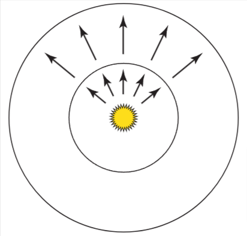

# 4 辐射度量学，光谱，色彩

为了精确的描述光如何被呈现，和如何被采样并计算成为一张图片。我们首先要建立一些辐射度量学的认知。

辐射度量学研究的是电磁辐射在某种环境中的传播现象。在本章中，我们首先会介绍电磁辐射的四个关键指标：辐射通量(flux), 辐射强度(intensity), 辐照度(irradiance),辐射度(radiance)

这几个物理量会跟着波长变化，可以用光谱分布来描述这些物理量。光谱分布可以给出每个波长下有多少光。(spectrum代表光谱分布，spectra代表复数的光的光谱分布)

对于渲染来说，我们只关心介于380nm到780nm的波长的电磁体的光波波长，也就是对于人类来说可见的光。

在4.5详细介绍了关于光谱分布相关的各个类

人类感知颜色是这样的，若光波波长小于400nm左右时，是淡蓝色的，对于波长约为550nm时，是绿色的，波长约为650nm是红色的。

为什么要有精确的颜色模型原因有二：

1. 显示设备对于像素的值，是用颜色值来表示，而不是光谱分布，所以，精确的把光谱分布转为对应的颜色对于图像的渲染显示是十分重要的。
2. 发光和反射相关的颜色属性是利用颜色来实现的。这些颜色为了可以用于渲染，必须被转换为光谱分布。

> 第二点，转为光谱是为了计算光线的传播。

关于颜色相关的实现和函数，详见章节4.6

## 4.1 辐射度量学

辐射度量学基于光的粒子性，波动性被忽略，只考虑基于几何光学的宏观尺度下光线与物体的作用。由于辐射度量学与Maxwell方程有一定联系，所以算是有比较坚实的物理基础。

> 光学属于物理学的一个分支，几何光学是光学的一部分

pbrt中，做出了如下假设:

1. 线性叠加：两束光合并即为两束光的能量相加，在现实中，是有非线性叠加的情况，但只在极高能量的光之间的叠加时会发生。
2. 光的能量守恒：散射后的光的能量永远小于散射前的能量
3. 没有光的偏振现象
4. 没有荧光，磷光现象
5. 光处于稳定状态：假设光的辐射分布是稳定的，不会随着时间变化

这样的假设最大的缺失就是没有光的衍射和干涉现象。但是这个问题也可以通过一些方法绕过。比如，把光辐射用Wigner分布函数替换(本书不讲)

### 4.1.1 基本量

辐射通量(flux), 辐射强度(intensity), 辐照度(irradiance),辐射度(radiance)，这些量都衍生自关于时间，面积，方向上的能量(energy)。这些量一般都是基于光的波长的，详见4.1.3

#### 能量(energy)

单位为焦耳，来源于光照时发出的光子，每个光子是在特定波长下的，且带有特定数量的能量。辐射度量学下的所有基本的物理量都会以不同的方式影响光子的量，对于在波长$\lambda$的光子携带的能量如下式:

$$
Q=\frac{hc}{\lambda}
$$

c是光速(299472458 m/s), h是普朗克常数$h\approx 6.626 \times 10^{-34} m^2kg/s$

#### 辐射通量(flux)

能量用于衡量一段时间内的能量总数，然而在稳态假设下，我们更关心瞬时的能量。辐射通量(flux)也被称为power，代表在单位时间内传递到某个表面或空间的能量总和。可以通过求微分能量与微分时间的比值的极限来得到:
$$
\Phi = \lim_{\Delta t \to 0}\frac{\Delta Q}{\Delta t} = \frac{dQ}{dt}
$$

单位是焦耳每秒(J/s)或者瓦特(W)

光源发出的光的能量就是用辐射通量描述的，若把光源看成一个理想球体，从这个球体球心出发在两个不同距离画两个球，小的球的通量与大的球通量相等，但是由于这两个球面的面积不同，大球每个单位面积上能量小于小球。如图4.1



#### 辐照度(irradiance)和辐射出射率(radiance exitance)

辐射通量的衡量，要求单位时间内的某块区域的能量能被先衡量出来。给定一个有限的面A，我们能用方程$E=\Phi/A$来定义这个面积上的平均辐射通量的密度。其中E就是辐照度，代表通量到达表面的能量密度，也叫"辐射出射率(M)"(通量离开表面时的密度)。E的单位是$W/m^2$。(辐照度有时候也用于表示光离开表面时的通量，为了表述更清晰，我们分开两种情况)

对于像图4.1这样的点光源来说，辐照度在外层球面上的量小于内层球面上的量(外层球面面积更大)。若这个点光源发出的光能量在所有方向都相同，且对于球面的半径为r，有:

$$
E=\frac{\Phi}{4\pi r^2}
$$

这个方程解释了，某点接收到的光的能量会随着与光源的距离的平方来下降。

推广上式，得到辐照度是在微分面积下的微分通量的极限，如下式:

$$
E(p) = \lim_{\Delta A \to 0}\frac{\Delta \Phi (p)}{\Delta A} = \frac{d\Phi (p)}{dA}
$$

反过来，辐射通量(Flux)即为E(p)在面积A下的积分：

$$
\Phi = \int_A E(p)dA
$$

辐照度的方程也帮助我们理解兰伯特定理, 即是说，对于落到某个表面的光的能量，是光出射方向与表面法线的余弦值的部分。

当光源出射方向与面积A有一定角度时(A2)，A的面积比正射(A1)时要大，为$A/\cos \theta$
所以对于A2的每个点，辐照度是:

$$
E_2 = \frac{\Phi \cos\theta}{A}
$$

#### 辐射强度(intensity)

考虑现有一个无穷小的光源在发射出光子，若我们把这个光源放到单位球的球心上，我们能计算出光的通量的密度，即辐射强度，用I表示，单位是W/sr。对于球的全部方向，有下式:
$$
I = \frac{\Phi}{4\pi}
$$

推广上式，得到

$$
I = \lim_{\Delta \omega \to 0}\frac{\Delta \Phi}{\Delta \omega} = \frac{d\Phi}{d\omega}
$$

反过来，通过对I在$\omega$上的积分，我们能求出辐射通量$\Phi$:
$$
\Phi=\int_{\Omega}I(\omega)d\omega
$$

辐射强度用于描述光在某个方向上的分布，但是只有点光源的情况下才有意义

#### 辐射度(radiance)

在辐射度量学中，最后一个，且最重要的一个物理量就是辐射度(radiance)，用L表示，辐照度和辐射出射率给了我们某点p下的微分面积下的微分辐射通量的值，但是这个值没有对不同方向的分布做区分。辐射度给出了立体角下的辐照度，如下式:

$$
L(p,\omega)=\lim_{\Delta\omega\to 0}\frac{\Delta E_\omega(p)}{\Delta\omega} = \frac{dE_\omega(p)}{d\omega}
$$

$E_\omega$代表垂直于$\omega$方向的面的辐照度，也就是说，辐射度并不是指辐射通量中p所在的面的通量。这种表示法去除了在兰伯特定律中的$\cos\theta$

辐射度是每个单位面积和单位立体角下的辐射通量的密度，关于辐射通量的形式，有下式：

$$
L = \frac{d^2\Phi}{d\omega dA^{\bot}}
$$

$dA^\bot$是$dA$在垂直于$\omega$的假想面上的投影，见图4.3。

由上式可知，在某个极小立体角$\omega$方向和这个角方向垂直的投影面$A^\bot$上的辐射通量，当$d\omega$和$dA$变得非常小时，计算出来的极限即L，也就是辐射度。


### 4.1.2 入射/出射辐射度函数

在表面边界上，辐射度函数L一般来说是不连续的，辐射度在微微高于表面和微微低于表面的情况可能完全不同(比如在镜面上和下方，辐射度完全不同)。这时候就需要分表面的内外，即用两个函数分别表示它们的辐射度
$$
L^+(p,\omega) = \lim_{t \to 0^+}L(p+t\vec{n_p}, \omega)\\
L^-(p,\omega) = \lim_{t \to 0^-}L(p+t\vec{n_p}, \omega)
$$

$\vec{n_p}$是p点的法线向量

这样的方式太繁琐了，没必要。我们偏向于根据面对光源的入射的点和出射的点来区分二者。

我们把入射光写作$L_i(p,\omega)$,出射光写作$L_o(p,\omega)$,在这两种情况下，$\omega$总是指向p点向表面离开的那一侧。其他有些书上可能$L_i$的$\omega$方向是指向p点的，要注意。


对于某个空间中,且不在面上的点，$L^+=L^-$,也就是:
$$
L_o(p,\omega)=L_i(p,-\omega)=L(p,\omega)
$$

### 4.1.3 辐射度量学的光谱分布

之前讨论的辐射量（如辐射亮度、辐射通量等）没有考虑不同波长的光的区别。接下来可以通过对极小的波长范围取极限值，来定义这些辐射量的“光谱版本”，即更精确地表示不同波长的光对辐射量的贡献。

我们能定义光谱辐射量$L_\lambda$, 表示无穷小的波长区间的辐射度:
$$
L_\lambda = \lim_{\Delta\lambda\to 0}\frac{\Delta L}{\Delta \lambda} = \frac{dL}{d\lambda}
$$
反之，对其积分就是辐射度L：
$$
L = \int_{\lambda_0}^{\lambda_1}L_\lambda(\lambda)d\lambda
$$

以此类推，可以给出各个光谱下的辐射物理量。

### 4.1.4 亮度与光度学

所有在辐射度量学中的量，在光度学里面，都有对应的量。光度学研究的是人类能够通过视觉系统感知到的可见的电磁辐射。

每个光谱辐射的量，都可以通过对光谱响应曲线$V(\lambda)$进行积分，转换为对应的光度学中的量。这个$V(\lambda)$描述了人眼对各个波长光的敏感度情况。

亮度指人眼能观察到的光的光谱能量分布下的明亮程度。举个例子,在绿色波长中具有一定能量的光谱分布，会比在蓝色波长中具有相同能量的光谱分布对人眼看起来更亮。(由于人眼对不同波长的光敏感度不同，尤其是对绿色更为敏感)

我们可以用Y来表示亮度，Y关于光谱辐射度可列下式:
$$
Y = \int_\lambda L_\lambda(\lambda)V(\lambda)d\lambda
$$

亮度和光谱响应曲线$V(\lambda)$很接近于用XYZ表示的色彩的值，详见4.6.1

亮度的单位是每立方米坎德拉($cd/m^2$), 坎德拉与在光度学中的辐射强度等效。

## 4.2 辐射度量学中的积分

在渲染中经常要做的就是计算辐射量的积分。本小节将展示如何使这些积分计算起来更简单。

我们以计算辐照度(irradiance)为例，假设在p点有表面的法线向量$\vec{n}$,向$\Omega$方向进行辐射,有

$$
E(p,\vec{n})=\int_{\Omega}L_i(p, \omega)|\cos \theta|d\omega
$$

其中$L_i(p,\omega)$是入射辐射函数,$\vert \cos \theta|d\omega$是为了对应$dA^{\bot}$在立体角$\omega$上的面积微元(取绝对值是防止跑到表面内)。$\theta$是$\omega$和法线$\vec{n}$的夹角。辐照度一般是在沿着$\vec{n}$上的$H^2(\vec{n})$的半球体方向上进行积分计算

辐照度一般看作是在半球面上积分


图4.5 在点p的辐照度，是由入射辐射度乘以入射方向的余弦值，在半球面上的积分求得。

在上面方程中的，$d\omega$对应单位半球面的面积微元(回顾章节3.8.1)

### 4.2.1 在投影立体角上积分

在积分中各种余弦量经常干扰了积分的表达。这个问题可以用投影立体角代替立体角来避免。
我们先把物体投影到单位球面上(这里与求立体角的操作一致)，然后再把这个球面上的投影再次投影到与法线垂直的单位圆盘上。如图4.6


图4.6：物体对应的投影立体角就是用余弦值加权的立体角。先把物体投影到单位球面上(找到立体角)，再投影到法线所在的垂直的平面上，然后测量这个投影再平面上的面积。也就是说，投影立体角的大小取决于法线的方向(即法线与物体方向的夹角大小，夹角越小，投影越大)

投影立体角与立体角的关系如下式:

$$
d\omega^{\bot} = |\cos \theta|d\omega
$$

> d\omega^{\bot}即立体角$\omega$在法线垂直面上的投影的立体角微元
>
> 绝对值是当$\theta$大于90°时，取正

所以，在半球面上根据辐射度求辐照度的积分可以写为:

$$
E(p, \vec{n}) = \int_{H^2(\vec{n})}L_i(p,\omega)d\omega^{\bot}
$$

> 也就是把$\cos \theta$去除，方便式子表达原本意思，为此，把微分量从立体角的微元$\omega$改为了投影立体角微元$d\omega^{\bot}$。式子本意是不变的。

### 4.2.2 在球坐标上积分

### 4.2.3 在一块面积上积分

## 4.3 物体表面的反射

当光照射到物体的表面，表面会散射光，其中一部分会反射回所在场景中。有两个主要的效应来描述这种反射效果：反射光的光谱分布和双向分布。例如：一颗柠檬的表面会吸收大部分蓝色波段的光线，反射大部分红色和绿色波段的光线。因此，当这个柠檬被白光照射到时，它的颜色是黄色，不论是从哪个方向看去，几乎都是同一种颜色，然而有一些方向具有高光效果(即看上去泛白)。相对比来说，从镜面的某点的反射光，几乎全部都取决于观察的方向，对于镜面上固定的一点来说，当观察角变化，物体在镜面上的反射图像也会跟着变化。

对于半透明表面来说，情况会更复杂一些。类似皮肤，叶子，蜡，和液体这样的各种材质都有次表面光传播的现象(即，光射入到表面的点，与反射出来的光的起点不是同一个点，它们之间有微小的距离间隔)。比如，若把光线照到一个人的嘴里，会让这个人的脸也亮起来，就是由于在脸里面的光穿过了皮肤射了出来。

为了描述这种光的反射现象，我们抽象了2种概念：BRDF和BSSRDF,详见4.3.1和4.3.2。

BRDF忽略了次表面上的光传播效应，用于处理非透明(或几乎不透明)的材质，这种对光传播效应的简化的做法高效且错误少。

BSSRDF结合了BRDF，并且对于半透明材质做了一般场景下的处理。

> BRDF: Bidirectional Reflectance Distribution Function: 双向反射分布函数
>
> BSSRDF: bidirectional scattering surface reflectance distribution function: 双向散射表面反射分布函数

### 4.3.1 BRDF与BTDF

BRDF对物体表面的光的反射过程给出了方程化的表达。如图4.10


图4.10 BRDF是一个四元函数，包含入射/出射方向$\omega_i$和$\omega_o$, 用来描述从$\omega_i$入射的光在$\omega_o$方向上反射出来有多少量

$L_o(p, \omega_o)$是沿着$\omega_i$方向，在p点反射后的光的辐射量

$L_i(p, \omega_i)$是入射光的辐射量

若把$\omega_i$看作微分立体角，那么p点的辐照度的微分量可写作:

$$
dE(p, \omega_i) = L_i(p, \omega_i)\cos \theta_i d\omega_i
$$

$\omega_o$方向上反射出来的光的辐射度微分量，就是根据上式得出的辐照度求出来的。由于几何光学中的线性叠加效果，反射光辐射的微分量与入射光的辐照度成正比:

$$
dL_o(p, \omega_o)\varpropto dE(p, \omega_i)
$$

> 为什么用辐照度和辐射度来求比例，而不是辐照度比辐照度或辐射度比辐射度？
>
> 辐照度E是单位面积上接收到的总辐射能量，它是所有方向上入射光的总和。它描述的是从所有方向上投射到表面上的能量密度，因此是方向无关的。
>
> 辐射亮度L是描述在特定方向上每单位立体角和单位面积的辐射能量密度。它是方向相关的，描述的是从一个特定方向（如出射方向）上发射的能量
>
> BRDF 是描述表面在特定方向上反射光的比例，而不是整体的反射。因此，出射光必须用方向相关的量来描述，也就是辐射亮度$L_o$


上式的比例对应的常数就是该表面的BRDF里的$f_r$, 对于入射出射方向$\omega_i$和$\omega_o$来说，有:

$$
f_r(p,\omega_o,\omega_i)=\frac{dL_o(p,\omega_o)}{dE(p,\omega_i)} = \frac{dL_o(p, \omega_o)}{L_i(p, \omega_i)\cos \theta_i d\omega_i}
$$

对于光谱中的BRDF来说，用光谱的辐射量替换这里的辐射量即可。

基于物理学的BRDF有两个重要的特性:

1. 互逆性：即$f_r(p, \omega_i, \omega_o) = f_r(p, \omega_o, \omega_i)$
2. 能量守恒: 反射后的光的总能量小于等于入射光的总能量，对于出射光方向$\omega_o$,有:

$$
\int_{H^2(\vec{n})} f_r(p, \omega_o, \omega')\cos\theta'd\omega'\leq 1
$$

> 这个式子说明：在法线方向上的半球上，对反射光辐射量进行积分(即求总的反射光辐射量)，总是小于等于1的
>
> *为什么这里入射光不用$\omega_i$而是$\omega'$,同理$\theta'$?*
>
> 用$\omega'$表示任意可能的入射方向,$\omega_i$表示某个特定方向,同理$\theta'$表示任意入射方向与法线的夹角
>
> BRDF对应$f_r$这个被积函数积分后不大于1代表就是反射总能量的比例不会超过入射光总能量。
> $H^2$中H代表Hemisphere(半球),平方代表半球面有2个自由度,类似的，球面就是$S^2$
>
> *既然是对BRDF做积分，为何还要乘以$\cos \theta'$?*
>
> 对所有方向上入射的光的辐照度加了权，相当于对入射光的总能量做了修正，用以代表特定方向上的入射光的能量

注意，BRDF的实际值不一定小于1。只是在上式中的积分后，才满足小于等于1的结果

> BRDF实际值是存在部分方向大于1的可能的，比如镜面反射，多个入射方向上的光辐射在某个特定的反射方向上叠加，从而造成该方向的反射光辐射大于对应的入射方向上的光辐射。也就是光被集中于某个方向上了，但是总体算积分时，还是能量守恒的(即上式积分值小于等于1)

由互逆性可得，BRDF可视为在半球上所有方向的光照射下，在某个特定反射方向下的总反射量，可以等效看作：物体在给定方向的入射光照射下，其在半球上反射出来的的光的总反射量。用方程表示如下:

$$
\rho_{hd}(\omega_o)=\int_{H^2(\vec{n})}f_r(p, \omega_o, \omega_i)|\cos \theta_i|d\omega_i
$$

> $\rho$代表反射率,h是指半球(Hemisphere),d指方向(direction)，也就是出射方向上，从半球光照到$\omega_o$方向上的反射率

BRDF中，半球到半球的反射率用$\rho_{hh}$表示，式子代表了在半球方向上所有入射光照一致时，反射的光的反射比率:

$$
\rho_{hh} = \frac{1}{\pi}\int_{H^2(\vec{n})}\int_{H^2(\vec{n})}f_r(p, \omega_o, \omega_i)|\cos \theta_o \cos \theta_i|d\omega_o d\omega_i
$$

BTDF(bidirectional transmittance distribution function)双向透射分布函数，是用来描述光的透射效应的，一般表示为$f_t(p, \omega_o, \omega_i)$,其中$\omega_i$和$\omega_o$在相反的半球面上。注意，在BTDF上不满足互逆性，详见9.5.2

为了使等式显得更简洁，我们会把BRDF和BTDF合成为$f(p, \omega_o, \omega_i)$，这个整体称为BSDF(bidirectional Scattering Distribution function)(双向散射分布函数)。第九章会具体介绍关于渲染会用到的各种BSDF。

利用BSDF的定义，我们可得到下式:

$$
dL_o(p, \omega_o) = f(p, \omega_o, \omega_i)L_i(p, \omega_i)|\cos \theta_i|d\omega_i
$$

> 出射光辐射度的微分量，即BSDF乘以入射光的辐射度的余弦值，再乘以入射光立体角的微分量

$\cos \theta_i$取绝对值是因为，在本书的pbrt中，法线方向与入射角方向不一定在同一侧(其他很多渲染系统是在同侧的)，这样做是想保持法线在Shape对象中原本的方向，方便类似"法线总是指向表面的外侧"这样的假设。

对于p点上所有入射光照下，在$\omega_o$方向的出射光辐射度，可以对上式积分求得:

$$
L_o(p, \omega_o) = \int_{S^2}f(p, \omega_o, \omega_i)L_i(p, \omega_i)|\cos \theta_i|d\omega_i
$$

> 在球面上的积分$S^2$是由于BSDF包含了BRDF和BTDF

在渲染中，这个式子就是基础。它代表了在某点上，基于表面的散射属性下，入射光分布如何转换为出射光分布。

当在整个球面$S^2$为积分域时，也被称为散射方程，当只计算半球面$H^2(\vec{n})$时，被称为反射方程。在13-15章，这个方程主要用作计算表面某点的辐射量。

### 4.3.2 BSSRDF

BSSRDF(bidirectional scattering surface reflectance distribution function)(双向散射表面反射分布函数)，用来表示材质上的次表面光传播现象。分布函数$S(p_o, \omega_o, p_i, \omega_i)$用来描述$p_o$点在出射方向$\omega_o$存留的辐射量，比上$p_i$点在$\omega_i$上的微分辐射通量，这个比率可用下式表示:

$$
S(p_o, \omega_o, p_i, \omega_i) = \frac{dL_o(p, \omega_o)}{d\Phi(p_i, \omega_i)}
$$


图4.11 BSSRDF扩展了BSDF来表示出射光位置与入射光位置不同的情况，一般来讲比BSDF更难计算，在现实物体上，次表面光传播对物体外表的呈现起到很大作用。

对于BSSRDF的方程的积分，需要在物体表面的面积和入射光的方向上积分，把原本二元散射方程扩充到四元积分
$$
L_o(p_o,\omega_o) = \int_A\int_{H^2(\vec{n})}S(p_o, \omega_o, p_i, \omega_i)L_i(p_i, \omega_i)|\cos \theta_i|d\omega_i dA
$$

积分中多加了2个维度，渲染的计算更加复杂，然而，随着$p_i$和$p_o$的距离增加，S的值一般都会越来越小，这个事实很大程度上方便了次表面散射算法的实现。

在表面下的光的传播，可以用介质中的体积光的传播来描述。详见14.1。次表面散射因此也与类似云层和烟雾中光的传播过程类似，只是其尺度相比起来更小罢了。

## 4.4 发光

大于绝对零度的物体的原子是运动的。根据麦克斯韦方程，具有电荷的运动的粒子会发出特定波长范围内的电磁辐射。对于室温下来说，大部分的辐射都是红外波段的辐射。物体必须更热，才能发出在可见光波段内，具有实际意义的电磁辐射。

许多不同种类的光源可以把能量转换为电磁辐射。对于发光的物体，称作灯泡(lamp)，或者发光体(illuminant)。然而我们一般不用illuminant，因为一般我们用这个词来代表发光的光谱分布，而不是发光体。灯泡属于灯具(luminaire)中的一种，灯具指能保存并维持光线的物体，这些物体也具有诸如反射或漫反射光线的能力，即改变光分布的能力。

理解物理学中光辐射的过程，能帮助我们在渲染中为光源进行精确的建模。这些类型的灯泡，现在很常见:

- 钨丝白炽灯：里面有一根小钨丝，流经其上的电流会加热这跟钨丝，导致钨丝发出电磁辐射，根据钨丝的温度，决定电磁辐射的波长分布情况。磨砂玻璃灯泡壳能把光线散射到更大的范围。大部分能量是转为红外波段的电磁辐射，意味着消耗的大部分能量转为了热量，而不是光。
- 卤素灯： 也有钨丝，但是是被卤素气体包围。一段时间后，灯丝被加热后就会蒸发，但是卤素能把蒸发的钨丝的部分重新附着到灯丝上，这样的方法能延长灯光的寿命。同时，也防止了蒸发的钨丝部分落到灯泡壳上，降低了灯光亮度的问题。
- 气体放电灯: 在氢，氖，氩或者蒸发的金属气体中使电子流过时，会导致特定波长的光被辐射出来(原子也会辐射出一些红外波段的电磁辐射)。由于一般来说人类需要更宽波长的光，所以会在灯壳上涂上荧光材料，把辐射出来的光波扩展到更大的波长范围中(荧光涂料同时也提高了紫外波段的辐射转换成可见光波段的效率)
- LED灯：基于电致发光效应，利用某些材料会由于电场作用其上导致的光子的辐射效应。

对于这些光源，底层的物理原理都是电子与原子相碰撞，使原子外层的电子能量跃迁到更高的级别，当这些电子回归到低能量级别时，光子就被辐射出来了。除了这种方法以外，还有另外的方法，比如化学发光法(比如荧光棒)，生物发光法(比如萤火虫)，在这就不进一步讨论了。

**发光效能**用来衡量光源把能量转换为可见光的效率，实际上，这个量是光度学中的辐射出的光通量，比上辐射度量学中总功率(或所有波长下辐射的总功率)的比值，如下式:

$$
\frac{\int \Phi_e(\lambda)V(\lambda)d\lambda}{\int \Phi_i(\lambda)d\lambda}
$$

其中$V(\lambda)$是光谱响应曲线，在4.1.4章节中介绍过。

> - **分子**：$\int \Phi_e(\lambda)V(\lambda)d\lambda$表示发射光通量和人眼视觉响应函数$V(\lambda)$的加权积分。这里，$\Phi_e(\lambda)$是光源在波长$\lambda$处发射的光通量，而$V(\lambda)$是描述人眼对不同波长光的敏感度的函数。这个积分结果表示了光源在不同波长下对人眼的有效光通量。
>
> - **分母**：$\int \Phi_i(\lambda)d\lambda$表示光源在所有波长下的总输入光通量（或总功率）。它是光源消耗的能量或发出的能量。
>
> - **整个方程**：通过将分子的有效光通量与分母的总输入光通量进行比值计算，可以得到光源的光效，表示其转换能量为可见光的效率。

光效的单位为流明/瓦特,若把$\Phi_i$看作光源消耗的光通量时，则光效也代表了光源转换通量为电磁辐射的效率。光效也能被定义为光的出射度(光度学中等效于辐射出射度)比上辐照度的比值，或者出射亮度比上辐射度的比值。

对于钨丝白炽灯，光效值约为 15 lm/W。 在波长$\lambda=555\,nm$时，光源发光效能最高可达683。

### 4.4.1 黑体辐射

黑体是一个完美的辐射体。他会把辐射通量以物理上最高效的方式转换为电磁辐射。然而真实情况下黑体是不存在的，但一些辐射体有接近黑体的表现。黑体在发射光谱方面有一个有用的闭式表达式，该表达式是温度的函数，这对于建模非黑体发射体非常有用。

> **黑体**：在任何条件下，对任何波长的外来辐射完全吸收而无任何反射的物体，即吸收比为1的理想化的物体。
>
> 某个光源所发射的光的颜色，看起来与黑体在某一个温度下所发射的光颜色相同时，黑体的这个温度称为该光源的色温
>
> “闭式表达式”是指由初等函数经过有限次的初等运算复合而成的表达式
> 
> 接近黑体的辐射体，可用于预测和分析实际物体在特定温度下的辐射特性

黑体之所以叫黑体，是因为这种物体会吸收全部的入射光，这些光不会反射出来。可以说，吸收就是辐射的反向过程，因此，如果时光可以倒流，所有被黑体吸收的光通量，会被全部辐射出来。

布朗克定律给出了黑体辐射方程，这个式子是关于波长$\lambda$和开尔文温度T,如下式:
$$
L_e(\lambda, T) = \frac{2hc^2}{\lambda^5(e^{hc/\lambda k_bT} - 1)}
$$

c是光速(真空下为299792458 m/s), h是普朗克常量, 为$6.62606957\times 10^{-34}Js$, $k_b$是玻尔兹曼常数,为$1.3806488\times 10^{-23}J/K$, K是温度单位。黑体是完美的漫反射体，它会在所有方向上进行辐射。

> $L_e$是emitter(辐射体)的辐射度

黑体在不同温度下的波长分布情况如图4.12


图4.12 当温度升高，在可见光波段(380nm~780nm)会有更多光辐射出来,会使光谱分布从偏红的颜色逐渐变为偏蓝的颜色。随着温度升高，辐射出来的能量越多(见玻尔兹曼定律方程)

> x轴波长，y轴能量，线条颜色为开尔文温度

Blackbody()函数计算指定开尔文温度和波长下辐射出来的辐射度

```c++
Float Blackbody(Float lambda, Float T) {
    if(T <= 0) return 0;
    const Float c = 299792458.f;
    const Float h = 6.62606957e-34f;
    const Float kb = 1.3806488e-23f;
    // <<根据波长值(lambda)返回黑体发出的辐射量>>
    //  lambda转为纳米l
    Float l = lambda * 1e-9f;
    Float Le = (2 * h * c * c) /
        (Pow<5>(l) * (FastExp((h * c) / (l * kb * T)) - 1));
    return Le;
}
```

对于非黑体辐射，用基尔霍夫辐射定律来描述，此定律说明了某波长下发出的辐射的分布，等于该波长下黑体的辐射乘以该物体在该波长下吸收的辐射的一个分式。这个分式等于1除以反射的辐射量，方程如下:

$$
L_e'(T, \omega, \lambda) = L_e(T, \lambda)(1 - \rho_{hd}(\omega))
$$

$L_e(T, \lambda)$就是普朗克定律给出的黑体辐射量，$\rho_{hd}(\omega)$就是之前介绍的半球方向上反射的辐射比例

斯特番—波耳兹曼定律给出了点p的黑体的出射辐照度方程:

$$
M(p) = \sigma T^4
$$

$\sigma$是斯特番—波耳兹曼常数,为$5.67032\times 10^{-8}Wm^{-2}K^{-4}$。注意，在所有波长下的总辐射量会以$T^4$的速度快速增长，因此，使黑体温度加1倍会使辐射能量变为16倍。

> M(p)代表单位面积上的辐射功率(辐照度)

黑体的辐射分布描述了不同温度下非黑体的辐射特征，这个指标是很有用的。若某个辐射体的辐射光谱分布与黑体在某个温度下的辐射分布类似时，那么我们可以说，这个辐射体在某个温度下具有相应的颜色。一种找到色温的方法是，使用维恩位移定律，取光源辐射最高时对应的温度的波长，这种方法给出了在黑体于特定温度下的辐射的波长，式子如下:

$$
\lambda_{max}=\frac{b}{T}
$$

b是维恩位移常数$2.8977721\times 10^{-3}m\,K$

对于钨丝白炽灯，色温约为2700 K， 卤素灯约为3000 K, 荧光灯接于2700K到6550 K。一般来说，色温超过5000 K 被称为"冷"(光), 2700-3000 K 被称为"暖"(光)

### 4.4.2 标准光源

对光辐射分布分类的另一种有效方法是由CIE组织定义的各种"标准光源"。

标准光源A 被用来表示白炽灯的平均色温，对应黑体辐射度约为2856K,光谱分布如下图:


> y轴是相对光通量

(标准光源B和C是用来表示日光在两种时间下的表现，是由光源A加上特定滤波器实现的。这两种光源已经不被使用了。光源E用来描述常数化的光谱分布的，只被用来与其他光源做对比)

光源D 用来描述日光中不同的阶段，根据日光光谱的特征向量来定义，这种方式将日光可以表示为三个项的线性组合(一个固定项，和两个加权项)。其中一个权重主要用来对应黄-蓝 色彩的变化，用来模拟大气中多云或者水的粉-绿效果。D65色温是6504K,用来表示欧洲中午的光谱分布，CIE推荐用在表示日间光照情况，特殊情况除外。

光源F 用来描述荧光现象，是基于各种真实的荧光灯的光谱分布得来的。

## 4.5 光谱分布的表示


图4.16 柠檬表面的反射光谱分布

在真实世界中的光谱分布可能很复杂，我们已经见过各种复杂的光谱，在图4.16我们可以看到柠檬表面的反射光谱分布。为了渲染带有各种复杂光谱的场景，渲染器必须高效且精确地表示出光谱的分布情况。本节将介绍pbrt中对此的抽象和计算过程。对应的代码在util/spectrum.h和util/spectrum.cpp中

我们会从定义可见光波长范围的常数开始。在pbrt中，波长的单位是纳米，这样对于人类来说更易读

<<Spectrum的常数>>

```c++
constexpr Float Lambda_min = 360, Lambda_max = 830;
```

### 4.5.1 Spectrum接口

在pbrt中，我们会找到多种实用的光谱表示方式，有根据波长来列出光谱样本值的方式，也有用函数来描述的方式(比如黑体函数)。这引出了我们的第一个接口类Spectrum，一个Spectrum指向了对应的一种光谱的表示方式的实现。

Spectrum继承自TaggedPointer, 此类负责在运行时处理的多态的具体事务。TaggedPointer要求所有Spectrum的实现类写到模板参数里，可以让TaggedPointer用唯一的整数来区分每种实现类(详见B.4.4)

<<Spectrum的定义>>

```c++
class Spectrum
    : public TaggedPointer<ConstantSpectrum, DenselySampledSpectrum,
                           PiecewiseLinearSpectrum, RGBAlbedoSpectrum,
                           RGBUnboundedSpectrum, RGBIlluminantSpectrum,
                           BlackbodySpectrum> {
  public:
    // <<Spectrum Interface>> 
};
```

就像基于TaggedPointer的其他类一样，Spectrum定义了一个接口，必须被所有光谱的表示的实现类所实现。在C++中典型的实现方式是在Spectrum里定义一个纯虚函数，然后Spectrum的实现类继承Spectrum，然后实现这些方法。如果是用TaggedPointer的方式，接口是被隐式定义的，对于接口中的每个方法，在Spectrum中会有一个用于把方法调用分派到合适的类型的实现方法上。我们会在此详述某一个方法是如何实现的，但是Spectrum的其他的方法就省略了，因为都是遵从统一模板的。

Spectrum最重要的方法是operator(), 此方法取一个波长$\lambda$,然后返回这个波长的光谱分布

```c++
<<Spectrum接口>>
Float operator()(Float lambda) const;
```

这个方法对应的实现虽然密集，但是简单。调用TaggedPointer::Dispatch()方法，来开始分派此方法的调用。TaggedPointer类存储了一个整数的标签，以及连带着对象编码后的类型的指针。然后，Dispatch()就能在运行时决定特定的类型。之后，带着这个指针来调用回调函数，转换到实际类型的指针。

一个叫op的lambda函数，拿到了这个auto类型的指针，在C++17中，这种lambda函数扮演了模板函数的角色。用具体的类型来调用它，就类似实例化了这个类型的lambda表达式

<<Spectrum的内联方法定义>>

```c++
inline Float Spectrum::operator()(Float lambda) const {
    auto op = [&](auto ptr) { return (*ptr)(lambda); };
    return Dispatch(op);
}
```

Spectrum的实现也必须提供一个MaxValue()方法，返回在其波长范围内光谱分布的最大边界值。在pbrt中，此方法主要用于计算光源发出的辐射通量的边界，以便光源可以根据场景中期望的光照贡献来被采样。

```c++
<<Spectrum接口>>
Float MaxValue() const;
```

### 4.5.2 各种光谱分布

定义完Spectrum接口，我们会从定义几个显式列出光谱分布函数值的Spectrum实现类开始。ConstantSpectrum最简单，它表示在所有波长下，光谱分布都是一个常数。在pbrt中，此类常用来定义一个为0的光谱分布，表示某种特定形式的散射效果不存在。

ConstantSpectrum的实现直接了当，我们在此省略了MaxValue()。注意，此类没有继承自Spectrum。这个地方与传统的C++虚函数抽象基类不同，因为我们用了C++的类型系统，故在ConstantSpectrum和Spectrum之间没有显式的关联。

> 由TaggedPointer的标签指针实现多态性，不是由C++的虚函数实现的多态性，所以类的声明时，不用显式写继承

<<Spectrum的定义>>

```c++
class ConstantSpectrum {
  public:
    ConstantSpectrum(Float c) : c(c) {}
    Float operator()(Float lambda) const { return c; }
  private:
    Float c;
};
```

DenselySampledSpectrum则更具表达性，此类存储了一个光谱分布，此光谱分布在给定整形波长范围$[\lambda_{min}, \lambda_{max}]$，以1nm的间隔进行采样。

```c++
<<Spectrum的定义>>
class DenselySampledSpectrum {
  public:
    <<DenselySampledSpectrum Public Methods>> 
  private:
    <<DenselySampledSpectrum Private Members>> 
};
```

它的构造器取另一个Spectrum类，然后根据那个类的波长范围内的每个波长，计算出光谱分布。若提供的类的光谱分布计算成本很高，那么此类就很实用，因为它允许通过读取内存中的单个值来进行后续的计算。

```c++
<<DenselySampledSpectrum Public Methods>>
DenselySampledSpectrum(Spectrum spec, int lambda_min = Lambda_min,
                       int lambda_max = Lambda_max, Allocator alloc = {})
    : lambda_min(lambda_min), lambda_max(lambda_max),
      values(lambda_max - lambda_min + 1, alloc) {
    if (spec)
        for (int lambda = lambda_min; lambda <= lambda_max; ++lambda)
            values[lambda - lambda_min] = spec(lambda);
}
```

```c++
<<DenselySampledSpectrum Private Members>>
int lambda_min, lambda_max;
pstd::vector<Float> values;
```

为给定波长lambda来查找光谱的值，就是波长范围外返回0，否则把此波长转为索引，返回存储的值。

```c++
<<DenselySampledSpectrum Public Methods>>
Float operator()(Float lambda) const {
    int offset = std::lround(lambda) - lambda_min;
    if (offset < 0 || offset >= values.size()) return 0;
    return values[offset];
}
```

### 4.5.3 内嵌的光谱数据

### 4.5.4 采样后的光谱分布

细心的读者可能注意到，虽然Spectrum类让计算光谱分布函数变得可能，但是除了在特定波长上采样以外，没有能力做更多的计算。比如，要计算反射方程(方程4.14)的被积函数值，需要取两个光谱分布的乘积，一个用于BSDF，另一个用于入射光辐射量函数。

使用目前引入的抽象来提供这种功能会很快变得难以管理。例如，虽然两个 DenselySampledSpectrum（密集采样光谱）的乘积可以被另一个 DenselySampledSpectrum准确的表示出来，但考虑两个PiecewiseLinearSpectrum的乘积：其结果将是分段二次函数，并且后续的乘积运算只会进一步增加函数的阶数。此外，不同类型的 Spectrum 实现之间的运算不仅需要为每一对类型组合提供一个自定义的实现，还需要为每个结果选择一个合适的 Spectrum的表示方式。

> 也就是在Spectrum里面实现不同类型的Spectrum相乘很麻烦，会提高代码复杂度

pbrt避免了这种复杂性，方法是：把一组离散的波长看作蒙特卡洛积分(这个积分已在图像合成时执行过了)的一部分，来执行光谱计算。为了理解是如何实现的，考虑在某个特定波长范围$[\lambda_0,\lambda_1]$里，有平面上一点p，法线为n，要计算它的(非光谱的)辐照度,使用方程4.7(用入射光辐射量表示辐照度)，和式子4.5(用光谱辐射量表示辐射量)，我们有下式:

$$
E=\int_\Omega\int_{\lambda_0}^{\lambda_1}L_i(p, \omega,\lambda)|\cos \theta |d\omega d\lambda
$$

这里的$L_i(p, \omega,\lambda)$是入射光在波长$\lambda$的光谱辐射度

运用标准蒙特卡洛估计，并利用$\lambda$和$\omega$是不相关的事实，我们能看到E的估计值可以用在某种概率分布$p_\omega$上的$\omega_i$方向上，和以某种概率分布$p_\lambda$的波长$\lambda_i$来进行采样的比值的累加的平均值来估计，如下式:

$$
E \approx \frac{1}{n}\sum_{i=1}^n\frac{L_i(p, \omega_i,\lambda_i)|\cos \theta_i|}{p_\omega(\omega_i)p_\lambda(\lambda_i)}
$$

因此我们只需要能够在特定离散的波长下计算积分，就能估计辐照度。更普遍的说，我们能在波长的积分下表达所有光谱量。比如，在章节4.6中，展示了使用RGB色彩来渲染图片，每个像素点的颜色可以用到达某个像素点以红绿蓝的响应来建模的的光谱辐射量的积分来计算。pbrt因此只使用了离散的光谱样本来做光谱计算。

> 用蒙特卡洛法，对某个波长下的某个角度进行辐射量的采样，然后根据概率密度做加权，就可以估计出辐照度，不用直接算这个积分。采样的波长和方向也可以在区域里面自己选

所以，我们就可以处理类里那些与光谱采样且利用光谱样本进行计算的相关实现，在此，我们会定义一个用于设置光谱样本数量的常数(章节4.6.5会详述关于此值的权衡细节)。pbrt默认使用4种波长的样本，这个值改起来很方便，但是改完要重新编译系统。

```c++
<<Spectrum的常数>>
static constexpr int NSpectrumSamples = 4;
```

#### SampledSpectrum类

SampledSpectrum类存储了一组NSpectrumSamples的值，用于表示离散波长下的光谱分布值。此类提供了对其进行各种数学运算的方法

```c++
<<SampledSpectrum的定义>>
class SampledSpectrum {
  public:
    <<SampledSpectrum Public Methods>> 
  private:
    pstd::array<Float, NSpectrumSamples> values;
};
```

此类包含了2个构造器:

1. 为所有波长提供单个值
2. 传入适当大小的pstd:span,用于为每个波长设置值

```c++
<<SampledSpectrum Public Methods>>= 
explicit SampledSpectrum(Float c) { values.fill(c); }
SampledSpectrum(pstd::span<const Float> v) {
    for (int i = 0; i < NSpectrumSamples; ++i)
        values[i] = v[i];
}
```

#### SampledWaveLengths

SampledWavelengths是一个独立的类,用来存SampledSpectrum对应的波长。因此，要仔细弄清SampledSpectrum对应的是哪个SampledWavelengths，还要避免把不同SampledWavelengths的SampledSpectrum合在一起操作。

```c++
<<SampledWavelengths Definitions>>
class SampledWavelengths {
  public:
    <<SampledWavelengths Public Methods>> 
  private:
    <<SampledWavelengths Private Members>> 
};
```

为了在蒙特卡洛积分的背景下使用，存于SampledWavelengths的波长必须是根据某种概率分布采样的。因此，这个类不仅存了波长，同时也存了每个波长的概率密度

```c++
<<SampledWavelengths Private Members>>
pstd::array<Float, NSpectrumSamples> lambda, pdf;
```

采样波长最简单的方式就是在给定区间内均匀采样，SampleUniform()取均匀样本量u和波长的范围，实现了此方式。

<<SampledWavelengths的public方法>>

```c++
static SampledWavelengths SampleUniform(Float u,
        Float lambda_min = Lambda_min, Float lambda_max = Lambda_max) {
    SampledWavelengths swl;
    // <<用u采样第一个波长>> 
    // <<对剩余的波长进行初始化>> 
    // <<为采样的波长计算PDF>> 
    return swl;
}
```

这个方法在给定的区间内均匀的选出第一个波长

```c++
<<用u采样第一个波长>>
swl.lambda[0] = Lerp(u, lambda_min, lambda_max);
```

其余的波长从第一个波长开始，均匀地以delta步进取值，并且在超过lambda_max时，折回lambda_min再取。结果就是利用单个随机数生成了一组分层的波长样本。这种方式的优点之一是，比起为每个波长使用单独的均匀样本的方式来说，此方式在SampledUniform()的调用者要调整样本值的数量时，不必修改传到此方法的样本数量代码，而是可以直接修改NSpectrumSamples值即可。

```c++
<<Initialize lambda for remaining wavelengths>>= 
Float delta = (lambda_max - lambda_min) / NSpectrumSamples;
for (int i = 1; i < NSpectrumSamples; ++i) {
    swl.lambda[i] = swl.lambda[i - 1] + delta;
    if (swl.lambda[i] > lambda_max)
        swl.lambda[i] = lambda_min + (swl.lambda[i] - lambda_max);
}
```

每个样本的概率密度很容易计算，因为采样的分布是均匀的。

```c++
<<Compute PDF for sampled wavelengths>>= 
for (int i = 0; i < NSpectrumSamples; ++i)
    swl.pdf[i] = 1 / (lambda_max - lambda_min);
```

## 4.6 色彩

### 4.6.1 XYZ色彩

### 4.6.2 RGB色彩

### 4.6.3 RGB色彩空间

### 4.6.4 为什么使用光谱渲染?

### 4.6.5 多个波长的采样的选取

### 4.6.6 从RGB到光谱
