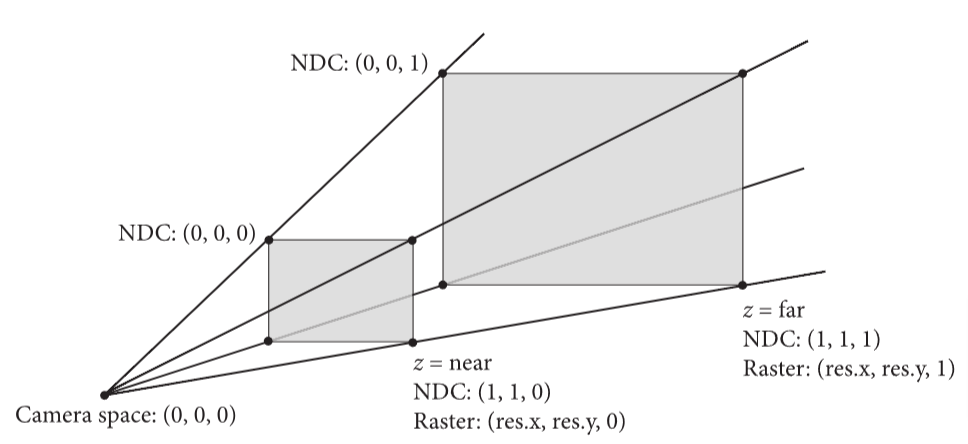
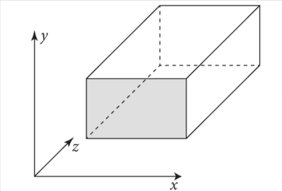
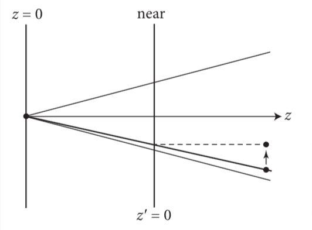
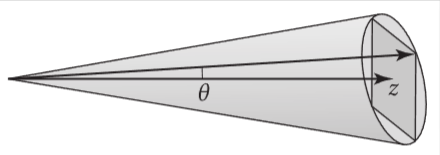
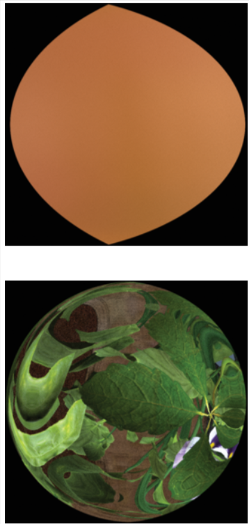
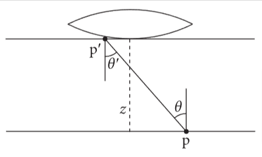
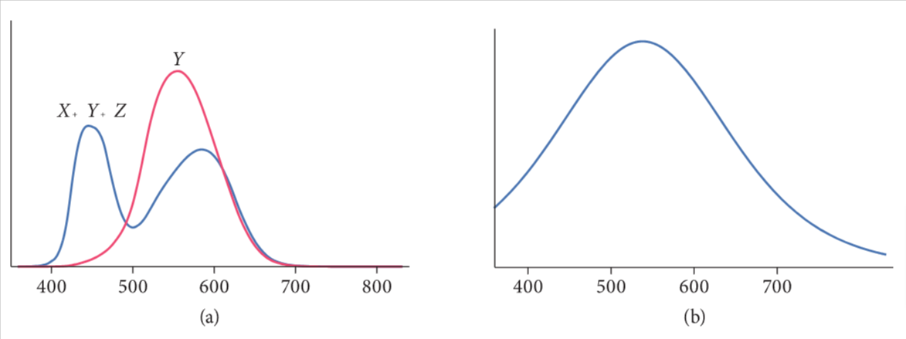
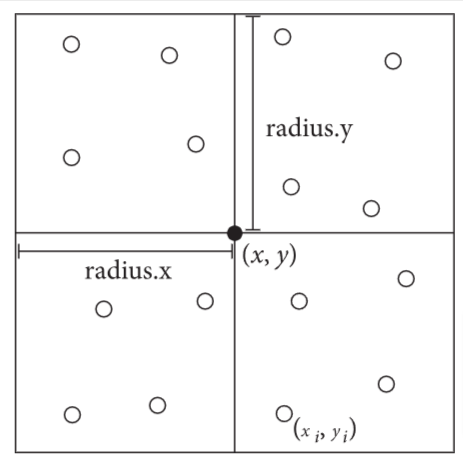
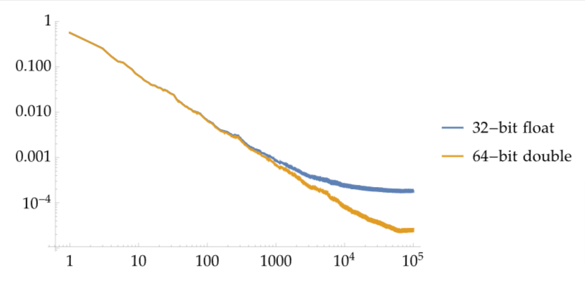

# 5 相机和胶片

小孔成像忽略了透镜的聚焦效果，是全图清晰聚焦的，透镜只能部分聚焦，导致图像看起来不太真实，为了使图像更真实，需要模拟透镜的效果。

相机的透镜系统引入了各种图像畸变，比如图像边缘的晕影效果，和枕型，桶型失真等。

在pbrt中，使用Film类来表示相机捕捉到的图像，用Camera接口来代表相机

在本章中，会介绍2个Film的实现类，它们两个都使用PixelSensor类来代表特定感光器对光谱的响应效果，使其看起来像胶片拍的或是数码相机拍的，关于胶片和感光器的类会在本章最后一节介绍。

## 5.1 相机接口

Camera类继承自TaggedPointer

> TaggedPointer简单来讲是为了减少C++多态时虚表的内存开销(特别是复杂场景的渲染时，虚表会导致内存占用大)，并让同一个函数同时支持GPU和CPU的调用(代码在CPU和GPU运行时，函数存储在内存中不同的位置)

```c++
class Camera : public TaggedPointer<PerspectiveCamera,OrthographicCamera,
                                    SphericalCamera, RealisticCamera> {
  public:

    /*
        必须实现的方法，用于对应图像采样的光线的计算，返回的光线需要归一化
        若给定的CameraSample对象由于一些原因没有有效的光线，那么pstd::optional中的返回值需要被重置。
        传入进来的SampleWavelengths(采样波长)不是常量引用，故相机就可以模拟镜头的色散效果，在这种情况下，光线只追踪单一波长的光，并且 GenerateRay() 方法将调用 SampledWavelengths::TerminateSecondar()
        传入到此函数的CameraSample结构体，包含了相机光线需要的所有样本值。
    */
    PBRT_CPU_GPU inline pstd::optional<CameraRay> GenerateRay(
        CameraSample sample, SampledWavelengths &lambda) const;

    /*
        相机必须提供此方法的实现，这个方法不仅会类似GenerateRay()计算主光线，
        还会计算位于胶片沿x,y方向上移动一个像素的微分光线，
        用来代表特定相机光线的采样所对应的胶片的区域大小，
        用于计算抗锯齿时的纹理查找，提高图像质量
    */
    PBRT_CPU_GPU
    pstd::optional<CameraRayDifferential> GenerateRayDifferential(
        CameraSample sample, SampledWavelengths &lambda) const;

    /*
        相机的实现必须提供对应Film(胶片)的访问实现，用于获知诸如输出的图片的分辨率等信息
    */
    PBRT_CPU_GPU inline Film GetFilm() const;

    /*
        模拟现实相机的快门效果，让胶片暴露在光中一小段时间。若此值不为0，会有动态模糊效果
        相对于相机有移动的物体会被模糊
        可以根据快门开关之间的时间内的光分布情况，利用蒙特卡洛积分和点采样方法，可以得到动态模糊的效果

        此接口用一个在[0,1)间随机均匀分布的样本u，对应到快门的开启时间点，一般来讲
        只是用来在快门开启和关闭时间里进行线性插值，使动态模糊更真实
    */
    PBRT_CPU_GPU inline Float SampleTime(Float u) const;

    /*
        允许相机设置ImageMetadata对象的参数，比如相机的转换矩阵等，若输出的图片的格式支持存储这些额外的信息，那么这些信息会被写入到最终图像里
    */
    void InitMetadata(ImageMetadata *metadata) const;

    /*
        Camera接口的实现类必须使CameraTransform类可以用于其他坐标空间
    */
    PBRT_CPU_GPU inline const CameraTransform &GetCameraTransform() const;
}
```

### 5.1.1 相机的坐标空间

除了世界空间外，还有物体空间，相机空间，相机-世界空间，和渲染空间

- 物体空间： 几何图元定义所在的坐标系统，比如，在pbrt中，球体圆心就在物体空间的坐标原点
- 世界空间： 所有物体摆放在一个世界空间里，需要把物体从物体空间坐标转换为世界空间的坐标，世界空间是其他空间的标准框架。
- 相机空间： 相机被放置于世界空间的某一点，有一个观察方向和摆放的朝向，相机的位置看成坐标原点，这个坐标系的z轴对应观察方向，y轴对应相机摆放的向上的方向
- 相机-世界空间： 类似相机空间，这个坐标系的原点是相机的位置，但是保持了世界空间的方向，相机不一定沿着z轴观察
- 渲染空间： 场景根据渲染需求做了坐标系转换，在pbrt中，可以是世界空间，相机空间，或是相机-世界空间

> 相机空间中，坐标系原点在相机位置，三个轴根据相机移动和转动变化，相机-世界空间中，坐标原点在相机位置，但是三个轴方向与世界空间一致

基于光栅化的渲染中，传统上都是在相机空间中进行各种计算，三角形的顶点坐标，在投影到屏幕和光栅化前，会从物体空间中全部转换到相机空间中，方便判断哪些物体能被相机看到。

与此相对的是，许多光线追踪器(包括pbrt之前的版本)是在世界空间上渲染。当生成光线时，相机是在相机空间中实现的，但是这些相机会把那些需要求交和着色的光线，转换到世界空间中。这种方式存在一个问题，即转换过程中，离原点近的，精度高，远的精度低，若相机的位置离原点很远，这个相机看向的场景时呈现的图像就会存在误差。

> 若相机和场景离原点过远，相机空间到世界空间的转换过程的浮点数造成的误差会导致图像失真

在相机空间中渲染，对于离相机最近的物体，由于没有了相机空间到世界空间的转换过程，能原生提供最大的浮点计算精确度。但是在光线追踪中，这样做有个问题。场景一般会把主要特征沿着坐标轴建模(比如建筑物模型的地板和天花板可能就是对齐y轴的)，轴对称包围盒在这种情况下会退化得只剩一个维度，这样就减小了包围盒的表面积。

类似BVH的加速结构会在第七章介绍，在这种包围盒下影响比较大，若相机在这样的场景中旋转，轴对称包围盒的包围效果就不好，会影响渲染性能。

> 轴对称包围盒(AABB): 一个矩形框，其边与坐标轴平行，用于包围三维空间中的物体。它是最小的矩形体积，可以包含所有物体的顶点
>
> 个人理解：由于模型建模时为了方便，会把模型的主要特征，沿着坐标轴方向建模(比如高楼的高度会沿着y轴方向向上建模)。在相机空间中，由于坐标系根据相机的观察方式做了转换，模型在这个空间里可能就是“歪着的”，用轴对称包围盒这样的方式去包裹，会造成盒子空出来的空间通常比世界空间下的要大，在光线求交时，增加了大量本来不会相交的点的判断，影响了性能

使用相机-世界空间来渲染会更好，相机是在坐标原点，场景坐标也被相应转换，然而，转动相机不会影响场景的几何坐标点，因此加速结构的包围盒还是很有效。使用相机-世界空间，不会有更快的渲染速度或更精确的渲染结果。

CameraTransform类抽象了在各个空间之间的坐标系转换过程,这个类维护了两类转换，从相机空间到渲染空间的转换，和从渲染空间到世界空间的转换。在pbrt中，后者的转换不能动画化，所有动画都是用相机空间来转换，这是为了保证移动相机时，不会造成场景中静态物体也需要动态化，这会造成性能损失。

> 移动相机不会造成性能损失，但是移动物体由于会导致包围盒变大，会降低加速结构的效率，所以要避免物体不必要的移动

```c++
/*
    封装各个坐标空间之间的转换过程
    该类维护了两类转换：从相机空间到渲染空间，从渲染空间到世界空间
    Camera的实现类必须使此类支持其他系统的坐标空间
*/
/*
    传入相机到世界空间转换后的对象，根据配置里渲染基于的渲染空间做转换
    默认的渲染空间是相机-世界空间，但是也可以在命令行里面配置成其他空间
*/
CameraTransform::CameraTransform(const AnimatedTransform &worldFromCamera) {
    switch (Options->renderingSpace) {
    case RenderingCoordinateSystem::Camera: {
        // <<对于相机空间的渲染，计算worldFromRender>>

        /*
            对于相机空间的渲染，从相机到世界空间的转换过程会被worldFromRender使用
            对于从相机空间到渲染空间的变换过程，用了恒等变换(identity transformation),
            故这两个坐标系统是等价的。
            由于worldFromRender是不能被动画化，所以取了动画帧时间的中点(tMid)，然后
            把这个点在相机变换中的动画，并入renderFromCamera
        */
        Float tMid = (worldFromCamera.startTime + worldFromCamera.endTime) / 2;
        worldFromRender = worldFromCamera.Interpolate(tMid);
        break;
    }
    case RenderingCoordinateSystem::CameraWorld: {
        // <<对于相机-世界空间的渲染，计算worldFromRender>>
        /*
            对于相机-世界空间上的渲染(默认)，渲染空间到世界空间的坐标系变换时基于动画帧
            的中点来转换到相机的位置
        */
        Float tMid = (worldFromCamera.startTime + worldFromCamera.endTime) / 2;
        Point3f pCamera = worldFromCamera(Point3f(0, 0, 0), tMid);
        worldFromRender = Translate(Vector3f(pCamera));
        break;
    }
    case RenderingCoordinateSystem::World: {
        // <<对于世界空间的渲染，计算worldFromRender>>
        /*
            对于世界空间的渲染，就是做恒等变换
        */
        worldFromRender = Transform();
        break;
    }
    default:
        LOG_FATAL("Unhandled rendering coordinate space");
    }
    LOG_VERBOSE("World-space position: %s", worldFromRender(Point3f(0, 0, 0)));
    // <<计算renderFromCamera>>
    /*
        一旦worldFromRender设置完后，worldFromCamera剩余的变换过程会在这里处理，
        存入到renderFromCamera
    */
    Transform renderFromWorld = Inverse(worldFromRender);
    Transform rfc[2] = {renderFromWorld * worldFromCamera.startTransform,
                        renderFromWorld * worldFromCamera.endTransform};
    renderFromCamera = AnimatedTransform(rfc[0], worldFromCamera.startTime, rfc[1],
                                         worldFromCamera.endTime);
}
```

### 5.1.2 CameraBase类

Camera接口的通用函数放到CameraBase中，其他相机类皆继承此类。关于camera的实现的相机类都放在cameras.h下面

CameraBase类如下:

```c++
/*
    camera接口的通用功能实现在此，所有camera实现须继承此类
*/
class CameraBase {
  public:
    // CameraBase Public Methods
    PBRT_CPU_GPU
    Film GetFilm() const { return film; }
    PBRT_CPU_GPU
    const CameraTransform &GetCameraTransform() const { return cameraTransform; }

    PBRT_CPU_GPU
    Float SampleTime(Float u) const { return Lerp(u, shutterOpen, shutterClose); }

    void InitMetadata(ImageMetadata *metadata) const;
    std::string ToString() const;

    PBRT_CPU_GPU
    void Approximate_dp_dxy(Point3f p, Normal3f n, Float time, int samplesPerPixel,
                            Vector3f *dpdx, Vector3f *dpdy) const {
        // Compute tangent plane equation for ray differential intersections
        Point3f pCamera = CameraFromRender(p, time);
        Transform DownZFromCamera =
            RotateFromTo(Normalize(Vector3f(pCamera)), Vector3f(0, 0, 1));
        Point3f pDownZ = DownZFromCamera(pCamera);
        Normal3f nDownZ = DownZFromCamera(CameraFromRender(n, time));
        Float d = nDownZ.z * pDownZ.z;

        // Find intersection points for approximated camera differential rays
        Ray xRay(Point3f(0, 0, 0) + minPosDifferentialX,
                 Vector3f(0, 0, 1) + minDirDifferentialX);
        Float tx = -(Dot(nDownZ, Vector3f(xRay.o)) - d) / Dot(nDownZ, xRay.d);
        Ray yRay(Point3f(0, 0, 0) + minPosDifferentialY,
                 Vector3f(0, 0, 1) + minDirDifferentialY);
        Float ty = -(Dot(nDownZ, Vector3f(yRay.o)) - d) / Dot(nDownZ, yRay.d);
        Point3f px = xRay(tx), py = yRay(ty);

        // Estimate $\dpdx$ and $\dpdy$ in tangent plane at intersection point
        Float sppScale =
            GetOptions().disablePixelJitter
                ? 1
                : std::max<Float>(.125, 1 / std::sqrt((Float)samplesPerPixel));
        *dpdx =
            sppScale * RenderFromCamera(DownZFromCamera.ApplyInverse(px - pDownZ), time);
        *dpdy =
            sppScale * RenderFromCamera(DownZFromCamera.ApplyInverse(py - pDownZ), time);
    }

  protected:
    // CameraBase Protected Members
    CameraTransform cameraTransform;
    Float shutterOpen, shutterClose;
    Film film;
    Medium medium;
    Vector3f minPosDifferentialX, minPosDifferentialY;
    Vector3f minDirDifferentialX, minDirDifferentialY;

    // CameraBase Protected Methods
    CameraBase() = default;

    CameraBase(CameraBaseParameters p);

    /*
        通过多次调用camera的GenerateRay()函数来计算光线的微分量

        camera的实现类必须实现此函数，但是那些方法之后还是会调用此函数
        (注意，函数的签名不同于实现类中的那个)

        相机的各种实现类会传入this指针(camera入参)，这会允许此函数调用对应camera的
        GenerateRay()函数。这种额外复杂性的引入是由于我们没在camera接口使用虚函数，
        这意味着CameraBase类需要有camera传入才能调用GenerateRay()方法
    */
    PBRT_CPU_GPU
    static pstd::optional<CameraRayDifferential> GenerateRayDifferential(
        Camera camera, CameraSample sample, SampledWavelengths &lambda);
};
```

CameraBase的构造器参数如下:

```c++
/*
    CameraTransForm: 最重要的类，把相机坐标变换成场景所用的坐标
    
    shutterOpen, shutterClose: 快门的开关时间

    Film: 存储最终图像，且模拟了胶片的感光器

    Medium: 相机要考虑的介质
*/
struct CameraBaseParameters {
    CameraTransform cameraTransform;
    Float shutterOpen = 0, shutterClose = 1;
    Film film;
    Medium medium;
    CameraBaseParameters() = default;
    CameraBaseParameters(const CameraTransform &cameraTransform, Film film, Medium medium,
                         const ParameterDictionary &parameters, const FileLoc *loc);
};
```

## 5.2 投影相机的模型

三维空间下的观察问题在三维图形学下是最基本的问题之一，即，如何把3D场景展示在二维图像上。最经典的解决方法是用$4\times 4$矩阵来实现。因此，我们会介绍一个投影矩阵的相机类，叫ProjectiveCamera，然后基于它，定义2个相机模型。第一个实现是正交投影，另一个实现是透视投影，这两种是最经典和广泛运用的投影类型。

正交和透视投影都需要定义2个与观察方向垂直的平面，近平面和远平面，当用光栅化渲染的时候，不在这两个平面内的物体会被剔除，最终图像中就没有这些物体。(剔除近平面前面的物体是非常重要的，这是为了防止物体深度为0时的奇点问题，同时避免把相机背后的物体错误地映射到了前面)

> 在光栅化渲染下，当物体深度接近或等于0时，计算时导致结果为无穷大或未定义，导致奇点问题(不可控现象，比如黑块，闪烁，消失)。深度值为负时，若计算没有加排除负值的判断，会导致相机后面的物体会跑到前面来

对于光追器来说，投影矩阵只是单纯用来确定离开相机的光线，这些问题并不适用，因此，在这种情况下，过分担心设置这些平面的深度值是没必要的。

如图5.2所示，还有三种坐标系，这些坐标系对于定义各种投影相机的类是很有用的：

- 屏幕空间： 屏幕空间是在胶片平面上定义的，相机在相机空间中把物体投影到胶片平面上，在屏幕窗口中的物体的那部分，会在生成的图像中可见。在近平面上的点会被映射到深度z为0的面上，远平面上的点映射到的深度z值就是1。注意，虽然其被称为"屏幕"空间，但还是一个3维坐标系，因为z值是有意义的
- 归一化的设备坐标(NDC)空间: 被渲染的图像真正的坐标系，对于x和y，范围从左上到右下，(0,0)到(1,1)，深度值与在屏幕空间中的值相同，可通过某种线性变换把屏幕空间转换为NDC空间
- 光栅空间：与NDC空间几乎相同，除了x和y是从(0,0)到图像分辨率下的x,y像素数

投影相机使用$4 \times 4$矩阵，来在上述空间之间做变换



图5.2 为了简化相机类的实现，有几种相机相关的坐标空间被普遍使用。camera类持有这些空间之间的转换方法。在渲染空间下的场景中的物体会被相机观察到，这些物体在以相机控件的原点，指向+z轴方向上。在近平面和远平面之间的物体，会被投影到胶片平面，胶片平面即在相机空间中z=near的平面。胶片平面在光栅空间中就是z=0的面，在光栅空间中，x，y的范围就是图片分辨率的x,y像素数。NDC空间归一化了光栅空间，所以x,y值在(0,0)到(1,1)之间

除了CameraBase类需要的参数外，ProjectiveCamera也需拿到投影变换矩阵、图像在屏幕空间的范围、焦距、和透镜光圈大小的参数。如果光圈不是一个无穷小的孔，那么图像中的一部分可能会变得模糊(在真实的透镜系统中，聚焦范围外的物体会模糊)。这种效果的模拟会在后面的章节详述

<<ProjectiveCamera的public方法>>

```c++
ProjectiveCamera(CameraBaseParameters baseParameters,
        const Transform &screenFromCamera, Bounds2f screenWindow,
        Float lensRadius, Float focalDistance)
    : CameraBase(baseParameters), screenFromCamera(screenFromCamera),
      lensRadius(lensRadius), focalDistance(focalDistance) {
    <<计算投影相机的变换矩阵>> 
}
```

ProjectiveCamera的实现类，会把从相机到屏幕的投影矩阵传到此处这个基类的构造器中，因此，这个构造器能轻松的计算光栅空间到相机空间过程中的其他所有变换

<<计算投影相机的变换矩阵>>

<<计算投影相机的屏幕变换矩阵>>

```c++
cameraFromRaster = Inverse(screenFromCamera) * screenFromRaster;
```

<<ProjectiveCamera的protected成员>>

```c++
Transform screenFromCamera, cameraFromRaster;
```

唯一在构造器中值得注意的变换是从屏幕到光栅的投影变换，它是通过组合NDC到光栅和从屏幕到NDC变换，2个步骤计算出来的。一个重要的细节是，y坐标会被最终转换所反转，这是必要的，因为在屏幕坐标中，y增加是在图像中上移，但是在光栅坐标中是下移

<<计算投影相机的屏幕(空间)转换>>

```c++
Transform NDCFromScreen =
    Scale(1 / (screenWindow.pMax.x - screenWindow.pMin.x),
          1 / (screenWindow.pMax.y - screenWindow.pMin.y), 1) *
    Translate(Vector3f(-screenWindow.pMin.x, -screenWindow.pMax.y, 0));
Transform rasterFromNDC =
    Scale(film.FullResolution().x, -film.FullResolution().y, 1);
rasterFromScreen = rasterFromNDC * NDCFromScreen;
screenFromRaster = Inverse(rasterFromScreen);
```

<<ProjectiveCamera的protected成员>>

```c++
Transform rasterFromScreen, screenFromRaster;
```

### 5.2.1 正交投影相机

正交投影相机把场景的矩形区域投影到区域对应的盒子区域的正面上。物体在这种投影法上，没有近大远小的变化，平行的线还是平行的，并且这种方式保持了物体间相对的距离，如图5.3:


图5.3 正交观察矩形体是一个在相机空间里与坐标轴对齐的盒子，在其中的物体会被投影到z=近平面上

正交投影的图片看上去会显得缺乏深度感。但是平行的线还是能保持平行

正交投影相机OrthographicCamera的构造器用Orthographic()函数生成正交变换矩阵

### 5.2.2 透视投影相机

与正交投影相似的是透视投影相机也会把长方体空间投影到二维胶片的面上，但是，会有近大远小效果。物体投影后会产生形状变化，这种方式与人眼和相机镜头的原理相似。不像正交投影，透视投影不会保持距离和角不变，并且平行线也不会一直平行。

<<PerspectiveCamera的定义>>

```c++
class PerspectiveCamera : public ProjectiveCamera {
  public:
    <<PerspectiveCamera的Public方法>> 
  private:
    <<PerspectiveCamera的Private成员>> 
};
```

<<PerspectiveCamera的Public方法>>

```c++
PerspectiveCamera(CameraBaseParameters baseParameters, Float fov,
                  Bounds2f screenWindow, Float lensRadius, Float focalDist)
    : ProjectiveCamera(baseParameters, Perspective(fov, 1e-2f, 1000.f),
                       screenWindow, lensRadius, focalDist) {
    <<为透视相机的光线计算原点位置的微分变化量>> 
    <<为透视相机计算cosTotalWidth>> 
    <<为透视相机计算z=1时的图像平面区域>> 
    <<为透视相机计算最小的微分量>> 
}
```

透视投影描述了场景的透视观察效果。场景中的一点会投影在垂直于z轴的观察平面上。Perspective()函数计算这个变换。这个函数取视场角fov,和近平面和远平面



图5.6 透视变换矩阵把相机空间中的点投影到近平面上。投影后的坐标x'和y'等于投影前x,y坐标除以z坐标。上图中，用箭头表示了投影的效果。投影后的z'之后会计算出来，那么近平面上一点会映射到z'=0的面上,远平面一点会映射到z'=1的面上

<<变换函数的定义>>

```c++
Transform Perspective(Float fov, Float n, Float f) {
    <<为透视投影执行投影的除法>> 
    <<把正则透视的视野缩放到这个fov>> 
}
```

变换过程非常简单，如下两步:

1. 相机空间中的点p投影到观察平面上。下方这些代数式表示了投影后的x',y'在观察面上能以被z除x,和y的方式来计算出来。投影后的z已被重新映射了，所以z的值在近平面上是0，远平面上是1.相关的计算如下:

    $$
    x'=x/z\\
    y'=y/z\\
    z'=\frac{f(z-n)}{z(f-n)}
    $$

    > f: 相机焦距， n: 相机的近裁剪面

    所有的这些计算可以用$4 \times 4$的矩阵编码，这个矩阵可以用在齐次坐标上。

    $$
    \begin{bmatrix}
    1 & 0 & 0 & 0\\
    0 & 1 & 0 & 0\\
    0 & 0 & {\frac{f}{f-n}} & {-\frac{fn}{f-n}}\\
    0 & 0 & 1 & 0\\
    \end{bmatrix}
    $$

    > $\frac{f}{f-n}$表示对z坐标的缩放
    >
    > $-\frac{fn}{f-n}$表示从z坐标的透视投影偏移

    <<为透视投影执行投影的除法>>

    ```c++
    SquareMatrix<4> persp(1, 0,           0,              0,
                        0, 1,           0,              0,
                        0, 0, f / (f - n), -f*n / (f - n),
                        0, 0,           1,              0);
    ```

2. 用户指定的视场角（fov）会通过缩放投影平面上的(x,y)的值来考虑，从而确保视场内的点投影到视平面上的坐标在[-1,1]的范围内。对于方形图像来说，x和y都落在屏幕空间的[-1,1]之间。否则，更窄方向上的图像映射到[-1,1]，更宽的方向上映射到等比例更大的屏幕空间值范围中。回想一下，正切是等于直角三角形的对边与邻边的比值。在此处邻边边长是1，故对边边长为$\tan(fov/2)$。用这个长度的倒数来缩放是把fov映射到[-1,1]上。

<<把正则透视的视野缩放到这个fov>>

```c++
Float invTanAng = 1 / std::tan(Radians(fov) / 2);
return Scale(invTanAng, invTanAng, 1) * Transform(persp);
```

如同OrthographicCamera那样，投影相机的构造器计算相机生成的光线在像素点上的偏移量的信息。在这种场景下，光线的原点是不变的，并且光线的微分量只在方向上不同。在此处，我们计算相应像素点位置在相机空间上的近投影面位置的改变量。

<<为透视相机的光线计算原点位置的微分变化量>>

```c++
dxCamera = cameraFromRaster(Point3f(1, 0, 0)) -
           cameraFromRaster(Point3f(0, 0, 0));
dyCamera = cameraFromRaster(Point3f(0, 1, 0)) -
           cameraFromRaster(Point3f(0, 0, 0));
```

<<PerspectiveCamera的Private成员>>

```c++
Vector3f dxCamera, dyCamera;
```

透视相机的fov最大角的余弦值有时候会很有用。尤其是在fov外的物体做快速剔除，可以用观察方向向量来与此值点乘，再与这个值比较来达成。余弦值可以通过相机的观察向量和图像某个角落的向量来计算出来(见图5.7)。这个角落的位置需做微小的调整(因为要考虑以每个像素为中心的滤波函数的宽度，这个宽度是用来根据它们的位置来做采样的权重值(详见章节8.8))



图5.7 计算透视相机的最大观察角的余弦值。代表了PerspectiveCamera在观察方向上的边界的一个锥体，可以用相机的观察方向作为中心轴，计算这个轴与图像角落某点的夹角$\theta$的余弦来找到。在相机空间中，这个余弦值简化为该向量经过归一化的z分量值

<<为透视相机计算cosTotalWidth>>

```c++
Point2f radius = Point2f(film.GetFilter().Radius());
Point3f pCorner(-radius.x, -radius.y, 0.f);
Vector3f wCornerCamera = Normalize(Vector3f(cameraFromRaster(pCorner)));
cosTotalWidth = wCornerCamera.z;
```

<<PerspectiveCamera的Private成员>>

```c++
Float cosTotalWidth;
```

运用了透视投影后，相机空间的光线都从(0,0,0)的原点出发。一个光线的方向是由原点到近平面的点的向量给出。pCamera对应入参的CameraSample对象的pFilm的位置。换句话说，光线的向量方向的每个分量都相应等于这个点的位置量，所以，为了计算方向而做减法是没用的，我们直接用pCamera来初始化方向即可。

<<PerspectiveCamera的方法定义>>

```c++
pstd::optional<CameraRay> PerspectiveCamera::GenerateRay(
        CameraSample sample, SampledWavelengths &lambda) const {
    <<计算光栅量和相机样本的位置>> 
    Ray ray(Point3f(0, 0, 0), Normalize(Vector3f(pCamera)),
            SampleTime(sample.time), medium);
    <<为了景深效果而修改光线>> 
    return CameraRay{RenderFromCamera(ray)};
}
```

GenerateRayDifferential()也遵从了GenerateRay()的实现，除了下方这个额外的代码片段，此片段计算光线的微分量

<<为PerspectiveCamera的光线微分量计算偏移光线>>

```c++
if (lensRadius > 0) {
    <<在考虑镜头效果的情况下计算PerspectiveCamera的光线微分量>> 
} else {
    ray.rxOrigin = ray.ryOrigin = ray.o;
    ray.rxDirection = Normalize(Vector3f(pCamera) + dxCamera);
    ray.ryDirection = Normalize(Vector3f(pCamera) + dyCamera);
}
```

### 5.2.3 薄透镜模型和景深

理想化的针孔相机只允许光线通过单个点，然后到达胶片上，在现实是不可实现的。然而，让相机拥有极小的光圈是可行的，小的光圈允许相对更少的光照射到胶片感光器上，在这种场景下，需要更长时间的光照来捕获足够的光子来精确的拍到图像，代价是，当物体在快门打开的期间移动，会导致物体模糊。

真实的相机有镜头系统，会把光聚焦在一个有限尺寸下的光圈中，光线穿过此光圈照到胶片上。相机的设计师们(和摄影师们利用可调节大小的光圈)面临一个抉择：光圈越大，照射到胶片上的光越多，需要曝光的时间就越短。然而，镜头只能聚焦在单个平面上(焦距面)，离这个平面距离越远的物体，就越模糊，越大的光圈，这个效应越明显。

RealisticCamera类实现了一个对真实镜头系统的很精确的模拟。对于我们之前介绍的简单的相机模型来说，我们能应用一个经典的的光学近似方法，即薄透镜近似法，这种近似法利用传统计算机图形学投影模型，来对有限光圈的效应做建模。薄透镜近似法用一个球形轮廓的镜片的光学系统来建模，此透镜的厚度相对于镜片的曲率半径要小

在薄透镜近似法下，与光轴相平行的入射光会穿过透镜，并聚焦于透镜后的一点，这个点叫焦点。焦点到透镜的距离f叫焦距。如果胶片平面被安放在焦点处，那么无限远的物体会被聚焦，因为它们会在胶片上变成一个点

接下来介绍了薄透镜原理和方程，初中物理知识

## 5.3 球形相机

此相机会在相机的一个点上收集所有方向的光，然后把点映射到图像对应的方向上，对应类是SpericalCamera

## 5.4 胶片和成像

在相机投影或镜头把在胶片上的场景的图像形成后，有必要对胶片如何测量光进行建模，来用渲染器生成最终图像。本章先总览辐射度量学中如何在胶片上测量光，然后继续讨论光谱能量如何被转换为三原色(RGB)，引出PixelSensor类，这个类不单做此处理，还做一些在相机中常见的其他处理。然后，考虑到胶片上的图像样本如何被累加到最终图像的像素点上，我们会引出Film接口和它的两个实现类，这两个实现类把这个模型做了实践。

### 5.4.1 相机测量方程

在模拟真实图像的形成过程时，精心定义胶片或相机感光器如何测量辐射度是很有必要的。从镜头的背面到达胶片的光线，携带了场景中的辐射量。对于胶片上的一点，也因此有了各种方向上的入射光的辐射量。离开镜头的辐射量的分布，受胶片上那个点看到的离焦模糊的量影响，图5.17分别展示了胶片上两个点看到从镜头射过来的辐射量的图像



图5.17 从胶片两个点往镜头看去的场景图像 （a）从清晰聚焦的点看过去的样子，入射光辐射量在面上均匀恒定分布。(b)从非聚焦的区域看过去，可以看到场景的一小部分图像，也就是辐射量变化非常快。

给出了入射辐射量的函数，我们就能定义胶片上某点的入射光的辐照度。先从方程4.7开始，用辐射度来得到辐照度的定义，然后，我们可以利用方程4.9，把在立体角上的积分转换为在面积上的积分(在这种情况下，平面上某个区域$A_e$，与镜头的背面相切)。这样就可以得到在胶片平面上的点p的辐照度方程:

$$
E(p)=\int_{A_e}L_i(p,p')\frac{\vert\cos \theta \cos \theta'\vert}{\|p'-p\|^2}dA_e
$$

图5.18展示了这种场景下的几何关系:



图5.18：辐照度测量方程的几何设置。当光线通过点p'到胶片上的点p时，点p'在镜头背部透镜相切的面上，辐射度可以被测量。z是从胶片平面到镜头背部相切的平面的距离，$\theta$ 是从 p' 到 p 的向量与光轴之间的夹角。

由于胶片平面平行于镜片平面,即$\theta = \theta'$。因此我们可利用p和p'的距离等于镜头到胶片面的轴距离(用z轴表示)除以$\cos \theta$求得，整理一下，可得:

$$
E(p)=\frac{1}{z^2}\int_{A_e}L_i(p,p')\vert\cos^4\theta\vert dA_e \tag{5.3}
$$

对局胶片范围比距离z相对较大的相机，$\cos \theta$项可以显著降低入射光辐照度，此项也会导致黑边现象。大部分现代数码相机利用预设的矫正因子来增加感光器边缘的像素值，纠正了此效果。

在快门打开的时间内，对胶片上某点的辐照度进行积分，可得出辐射曝光量，即是单位面积能量的辐射单位，$J/m^2$:

$$
H(p)=\frac{1}{z^2}\int_{t_0}^{t_1}\int_{A_e}L_i(p,p',t')\vert\cos^4\theta\vert dA_e dt' \tag{5.4}
$$

(辐射曝光量也叫辐射通量)。在某点测量辐射曝光量可反映出：胶片平面收到的能量的多少，部分取决于相机快门打开的时间长度。

摄影用的胶片(或数码相机里的CCD, CMOS感光器)是在微小面积下测量辐射能量。基于方程5.4，且在感光器像素面积$A_e$下积分,我们可得:

$$
J(p)=\frac{1}{z^2}\int_{A_p}\int_{t_0}^{t_1}\int_{A_e}L_i(p,p',t')\vert\cos^4\theta\vert dA_e dt' dA_p \tag{5.5}
$$

上式代表了到达某个像素点的焦耳，此式被称为相机测量方程

虽然这些因子应用到了本章介绍的所有相机模型，但是它们只包含在RealisticCamera实现类中。原因很务实：大部分渲染器不会对此效果做建模，所以在更简单的相机模型忽略此效果，能让pbrt渲染的图像与其他系统渲染的图像对比时更容易。

### 5.4.2 感光器响应的建模

传统的胶片是基于一种化学反应，当卤化银晶体暴露在光照下时，会生成溴化银。卤化银对蓝色十分敏感，但是可以把晶体分成多层，中间用彩色滤光片和染料把每层分开，来捕捉彩色的图像

现代数码相机使用CCD或者CMOS感光器，这些感光器使每个像素在光照下会把一定数量的光子转换为电能。捕获彩色图像的方法各种各样，但是最常见的是用彩色滤光片在每个像素上覆盖，只计算彩色滤光片允许通过的红绿蓝三种颜色的光子数。每个像素一般也会有一个微镜片，增加感光器能捕获到的光量。

对于胶片和数码感光器，像素的颜色测量都可以使用光谱响应曲线来建模，该曲线可以把彩色滤光片或胶片对光的化学响应与波长的关系表现出来。

给定一个入射光的光谱分布$s(\lambda)$, 一个像素的红光部分如下式:

$$
r = \int s(\lambda)\overline{r}(\lambda)d\lambda \tag{5.6}
$$

数码感光器的像素点一般是以马赛克方式排布，绿色像素比红蓝像素多2倍，因为人类的视觉系统对绿光更敏感。为了把感光器像素转换为图像像素的颜色，需要采用去马赛克算法，这也是像素马赛克的一个体现。

采用四边形马赛克像素并按原样使用其颜色值的简单方法效果不佳，因为组成感光器像素的位置略有不同

> 1. 一个感光器对应一种颜色，感光器上面有彩色滤光片，只能通过红绿蓝三种光中的一种
> 2. 感光器的每个像素点对应一种颜色，多个感光器像素点的排布方式就叫马赛克排布，由于人眼对绿色更敏感，绿色像素点是红蓝数量的两倍
> 3. 多个感光器像素点最终通过解马赛克算法合成一个图像像素点的颜色，也就是多个感光器像素点对应图像中一个像素点
> 4. 在马赛克分布里，感光器的像素点的位置不是均匀的，分布方式有好几种，具体请查阅资料

设计数码感光器有诸多挑战，大部分挑战是来自像素点的尺寸需要极小，因为图像需要高分辨率。像素点越小，打到其上的光子越少，导致精确衡量光照量就越难。像素阵列也会遭遇各种类型的噪声，其中，散粒噪声(shot noise)是最主要的一种，这种噪声是由于光子的离散性导致的：捕获到的光子中有一些随机扰动，会导致捕获到的光子一会多一会少。散粒噪声可以用泊松分布来建模

为了使传统胶片产生足够的化学反应，或者使光子被感光器充分捕获，每个像素必须接收到足够的光量。在方程5.5中，我们可知每个像素捕获的能量取决于入射光的光辐射量，像素面积，出瞳面积，和曝光时间。对于特定相机的实现，像素面积是固定的，为了增加光照而增加镜片光圈面积和曝光时间都可能导致非预期的副作用。更大的光圈减少了景深效应，这可能导致非预期的失焦模糊。更长的曝光时间也会由于场景中物体的运动或相机在快门开启的时候的运动导致模糊。感光器和胶片因此提供了在ISO配置下的额外控制。

对于现实中的胶片，ISO把对光的感应度进行了量化(ISO值越高，图像需要的光越少)。在数码相机中，ISO控制了增益大小-即从感光器读出的像素值的缩放因子。对于现实中的相机，增加增益值会导致噪点增多(像素点初始的光量加了倍率)。由于pbrt不会依据现实中的感光器的噪点现象来建模，ISO值会根据需要的曝光度来设置一个值

在pbrt的感光器模型中，我们不会对马赛克和噪点做建模，也不会对其他现象比如泛光效果(当曝光时间足够长时，这个像素点的光会增加，并且周围的像素点光也会增加)。我们也不会模拟从感光器中读出图像的处理过程(许多相机使用滚动快门，逐行读取扫描线)。对于高速移动的物体，这会导致意想不到的效果。本章末的练习会以不同方式修改pbrt，以讨论这些效果

PixelSensor类实现了pbrt的半理想的像素色彩度量模型。定义于film.h和film.cpp下

<<PixelSensor的定义>>

```c++
class PixelSensor {
  public:
    // <<PixelSensor Public Methods>> 
    // <<PixelSensor Public Members>> 
  private:
    // <<PixelSensor Private Methods>> 
    // <<PixelSensor Private Members>> 
};
```

PixelSensor对感光器的像素色彩度量进行了半理想化的建模:

1. 曝光控制: 图像明暗可以由用户控制
2. RGB感应：基于光谱感应曲线，模拟光谱辐射量到三原色的转换
3. 白平衡： 相机对捕获的图像进行处理，包括对初始RGB值根据光照色彩来调整，
   来模拟人类视觉系统中的色彩适应过程。因此，捕获的图像在视觉上看起来与
   人类观察者在拍照时记忆中的图像相似

pbrt包含了一个真实感相机模型，也是基于投影矩阵的理想模型。因为针孔相机有一个无限小的光圈。我们在PixelSensor在实现上做了程序上的折衷，这样的话用针孔模型渲染的图像就不是完全黑的。我们留下了Camera的响应作用，用来对光圈尺寸效应的建模。理想化的模型不会考虑此，尽管RealisticCamera在<<为RealisticCamera光线计算权重>>里确实这样做了。PixelSensor之后只会考虑快门时间和ISO的设置。这两个因素被包含在一个量里，叫做成像比(imaging ratio)。

PixelSensor构造器取感光器的RGB匹配函数-$\bar{r},\bar{g}$和$\bar{b}$, 把成像比作为参数。同时，它也会根据用于要求输出的RGB值来取颜色空间，也会取光照的光谱，这个光谱定义了场景中什么颜色是白色。把这些参数合在一起，就能够在感光器的测量下，把光谱能量转换为RGB，然后输出为颜色空间中的RGB。

图5.19表示了对相机响应建模的效果，对比用XYZ匹配函数来计算初始像素值来渲染，和用确切相机感光器的匹配函数来渲染。

<<PixelSensor Public Methods>>

```c++
PixelSensor(Spectrum r, Spectrum g, Spectrum b,
       const RGBColorSpace *outputColorSpace, Spectrum sensorIllum,
       Float imagingRatio, Allocator alloc)
    : r_bar(r, alloc), g_bar(g, alloc), b_bar(b, alloc),
      imagingRatio(imagingRatio) {
    <<从相机RGB矩阵计算XYZ>> 
}
```

<<PixelSensor Private Members>>

```c++
DenselySampledSpectrum r_bar, g_bar, b_bar;
Float imagingRatio;
```

感光器像素记录光的RGB颜色空间与用户定义的最终图像的RGB颜色空间一般来说不一样。颜色空间的形式一般来说是针对某种相机的，并且受它的像素的颜色滤光片的物理属性决定，最终图像的RGB颜色空间，类似sRGB的颜色空间，或在4.6.3中的其他颜色空间的一种，一般来说，是根据设备不同而不同。因此，PixelSensor的构造器计算一个$3 \times 3$的矩阵，用来把RGB空间转换为XYZ。从这里，能很轻松的转换为特定的输出颜色空间。

这个矩阵的发现是从解决一个优化问题中得来的。它开始于超过二十种光谱分布，表示来自标准色卡上各种颜色色块的反射率。这个构造器会计算这些色块的RGB颜色(在相机颜色空间中，也包括输出颜色空间光照下的XYZ颜色)。如果这些颜色被对应列向量所代表，那么我们能考虑一个$3 \times 3$的矩阵M下的问题:

$$
M
\begin{bmatrix}
r_1 & r_2 & {\cdots} & r_n \\
g_1 & g_2 & {\cdots} & g_n \\
b_1 & b_2 & {\cdots} & b_n \\
\end{bmatrix} \approx
\begin{bmatrix}
x_1 & x_2 & {\cdots} & x_n \\
y_1 & y_2 & {\cdots} & y_n \\
z_1 & z_2 & {\cdots} & z_n \\
\end{bmatrix}
$$

同时，只要有超过三种反射率值，问题就会成为一个超定问题，可以通过线性最小二乘法来求解。

<<从相机RGB矩阵计算XYZ>>

<<计算用于训练的色块的相机RGB值>>

<<为用于训练的色块计算xyzOutput值>>

<<利用线性最小二乘法来初始化XYZFromSensorRGB>>

给定感光器的光照量，为每个被ProjectReflectance()处理的反射率计算RGB的相关系数

<<计算用于训练的色块的相机RGB值>>

```c++
Float rgbCamera[nSwatchReflectances][3];
for (int i = 0; i < nSwatchReflectances; ++i) {
    RGB rgb = ProjectReflectance<RGB>(swatchReflectances[i], sensorIllum,
                                      &r_bar, &g_bar, &b_bar);
    for (int c = 0; c < 3; ++c)
        rgbCamera[i][c] = rgb[c];
}
```

为了得到比较好的结果，被用于改良问题的光谱应该代表了一个比较好的表示现实世界的光谱的量。在pbrt中使用的是基于标准色谱表光谱测量量。

```c++
<<PixelSensor Private Members>>
static constexpr int nSwatchReflectances = 24;
static Spectrum swatchReflectances[nSwatchReflectances];
```

ProjectReflectance()工具方法为一个反射率取其光谱分布，并且有一个光照量，也还有三个光谱匹配函数$\bar{b_i}$对应三原色的颜色空间。这个方法返回一个三项式的相关系数$c_i$，由下式给出:

$$
c_i = \int r(\lambda)L(\lambda)\bar{b_i}(\lambda)d\lambda
$$

r是光谱反射率函数，L是光照的光谱分布，$\bar{b_i}$是一个光谱匹配函数。在第二个匹配函数$\bar{b_2}$一般来说对应了亮度或者至少绿色的假设下，这个颜色在人类视觉系统中有最大的反馈。返回的颜色的三项是被$\int L(\lambda)\bar{b_2}(\lambda)d\lambda$归一化了。在这种方法下，线性最小二乘法的你和至少根据视觉的重要性粗略地对每对RGB/XYZ进行加权。

#### 色彩适应和白平衡

#### 感光器响应的采样

由于在PixelSensor中的感光器响应函数描述了感光器根据辐射量给出的基于波长的响应，当对光的波长进行采样时，至少近似地估计辐射量的变化是有意义的。最少，辐射量为0的光线波长应该不被采样，这样的话，波长就对最终图像没有贡献了。更普遍的来说，根据感光器响应函数来做重要性采样是必要的，这种方式提供了减少5.8估计式的错误。

然而，选取采样所用的分布具有挑战性，因为目标是最小化人类观察到的错误，而不是严格地最小化数字上的错误。图5.21(a)展示了CIE Y匹配函数和X,Y,Z的总和的匹配函数，两者都可能被使用。实际中，根据Y来采样会给出超量的色彩噪点，但是基于三个匹配函数的和来采样会导致在400~500nm间波长的样本过多，这些样本在视觉呈现上相对不太重要。

一个参数化的概率分布函数，用于平衡这些关注点，并且对于在可见波长段中采样挺好用的,即下式:

$$
p_v(\lambda)=(\int_{\lambda_{min}}^{\lambda_{max}}f(\lambda)d\lambda)^{-1}f(\lambda) \tag{5.9}
$$

其中:

$$
f(\lambda)=\frac{1}{\cos h^2(A(\lambda - B))}
$$

$A = 0.0072nm^{-1}, B=538nm$,图5.21(b)展示了$p_v(\lambda)$的图


图5.21 (a) CIE Y 匹配函数的归一化的PDF，和X,Y,Z总的的匹配函数 (b) 根据方程5.9推出的参数化的分布$p_v(\lambda)$

### 5.4.3 图像采样的滤波

Film的实现主要负责把每个像素点的光谱样本聚合在一起，以便计算最终的像素值。在现实中的相机，每个像素会在很小的区域上聚集光。在这个小区域的空间上，像素的感应可能随空间变化，这取决于感光器的物理设计。在第八章，我们会从信号处理的角度来考虑此效果，并且我们会了解图像函数的采样细节和样本的加权如何极大的影响图像的最终质量

为了处理这些细节，现在我们会假设一些滤波函数$f$，用来定义感光器在图像像素点周围随空间的响应变化量。这些滤波函数很快就会趋于0，这样做是模拟现实里胶片上的像素点只对接近这个点的光做出响应。同时，这些滤波器也模拟了像素点响应的空间上的其他变化量。利用此方式，若我们有一个图像函数$r(x,y)$，用于在胶片任意位置给出红色值(比如利用方程5.6中，利用感光器响应函数$\bar{r}(\lambda)$来测量的值)，然后，滤波后在点(x,y)的红色值$r_f$就被下式给出:

$$
r_f(x,y) = \int f(x-x', y-y')r(x',y')dx'dy' \tag{5.10}
$$

上式中，假设$f$是积分到1

> $f(x-x', y-y')$表明f这个滤波函数是根据实际点到像素点距离来求得具体响应多少量
>
> $r(x',y')$代表感光器对于像素区域内某点，应该给出红色量的多少
>
> **为什么是积分?**
>
> 像素点在中心，滤光片盖在上面，一般是矩形的，会对矩形范围内的光，根据位置做出响应，负责对像素点周围的光进行采集，所以实质上是对滤光器范围内的面上做积分

照例，我们会利用该点的采样，来估计积分值，估计式如下:

$$
r_f(x,y) \approx \frac{1}{n}\sum_i^n\frac{f(x-x', y-y')r(x',y')}{p(x_i,y_i)} \tag{5.11}
$$

> 还是使用蒙特卡洛来估计积分值，分母p就是由采样法给出某点的pdf

为了对被积函数进行采样，此处用了2种方法，第一种在之前的pbrt版本也用到了，即对图像均匀采样，每个图像样本可能会对多个像素点的最终值产生贡献，这取决于所使用的滤波函数的范围。此方法给出了如下估计式:

$$
r_f(x,y) \approx \frac{A}{n}\sum_i^n f(x-x', y-y')r(x',y') \tag{5.12}
$$

> 均匀采样的pdf为$\frac{1}{A}$，所以可以放到分母上

上式中A是胶片的面积，图5.23解释了此方法:某个位于(x,y)的像素点，像素点有一个像素滤波器，范围是radius.x(代表x方向的长度)，radius.y(代表y方向的长度).所有在滤波器范围内的$(x_i,y_i)$样本，会对像素点的值做出贡献，贡献量的多少取决于滤波函数$f(x-x_i,y-y_i)$的值



图5.23 **二维图像的滤波**.为了计算在(x,y)的实心圆点的滤波后的像素值，在这个矩形区域radius.x，radius.y里的所有的图像样本都需要考虑。每个图像样本$(x_i,y_i)$使用空心圆点表示，使用二维滤波函数$f(x-x_i,y-y_i)$来得到权重值,所有样本的总的平均权重就是最终像素的值

虽然方程5.12给出了像素值的无偏估计，但是，滤波函数中的变化会导致估计值的变化。考虑一个常量图像函数r的场景，在这种场景下，我们期望最终图像像素的结果都是r。然而，滤波函数$f(x-x_i,y-y_i)$的累加值并不是等于1的，其只在期望值上等于1。因此，这个图像甚至在简单的场景下，都会存在噪点。如果改为用下式来估计:

$$
r_f(x,y) \approx \frac{\sum_i^n f(x-x', y-y')r(x',y')}{\sum_i^n f(x-x', y-y')}
$$

那么滤波函数带来的变化就会被消除，代价是微小的估计偏差(这就是带权重的重要性采样的蒙特卡洛估计)，在实际场景中，这种取舍是值得的。

公式5.10也可以独立估计出每个像素的值。此方法就由本版本pbrt所使用。在这种情况下，利用基于滤波函数分布来在胶片上采样点是值得的。此方式被称为滤波重要性采样。利用此方式，滤波器在空间中的变化量是用像素的样本位置的分布来计算的，而不是根据滤波器的值来缩放每个样本的贡献量来计算的。

若$p\propto f$,那么在方程5.11的这两个因子就可以消除，那么只剩下$r(x_i,y_i)$的平均值，采样值被一个常数比例缩放。然而，我们必须处理少见(对于渲染来说)的积分估计值位负的情况，就如在第八章所见，滤波函数中的一部分为负，比起非负来说，能得出更好的结果。在那种情况下，我们有$p \propto \vert f\vert$,可得:

$$
r_f(x,y) \approx (\int\vert f(x',y')\vert dx'dy')(\frac{1}{n}\sum_t^n sign(f(x-x_i,y-y_I))r(x_i,y_i))
$$

此处sign(x)当x>0时等于1，x=0时等于0，其他情况等于-1。然而这个估计式与方程5.12有相同的问题，即便有一个常数的函数r，这个估计式依然会有变化，这个变化取决于有多少sign函数得出1或-1

因此，本版本的pbrt继续是用加权的重要性采样估计法来计算像素值，用下式:

$$
r_f(x,y) \approx \frac{\sum_i w(x-x_i,y-y_i)r(x_i,y_i)}\sum_i{w(x-x_i,y-y_i)} \tag{5.13}
$$

上式中$w(x,y)=\frac{f(x,y)}{p(x,y)}$

最开始的两种方式具有一种优势，即每个图像样本可以对多个像素的最终滤波后的值产生贡献。这对于渲染效率是有益处的，因为所有涉及到为某个图像样本进行的计算，都能被用于改善多个像素点的准确度。为其他像素点生成的样本不总是有用，在第八章中某些样本生成算法的实现，以保证在像素内良好覆盖为目的来精心选择样本的位置。如果其他像素的样本混在其中，那么一个像素的所有样本集就不再有那种结构，这会导致误差增加。由于滤波重要性采样不在像素间共享样本，所以不会有此问题。

滤波重要性采样还有更多优势，这种方式让渲染并行化更简单，若渲染器是以不同线程处理不同像素的方式并行，那么多个线程就没有机会来并发修改同一个像素的值。最后一个优点是，若有任何由于使用很差的采样积分造成的差异尖峰导致的一些样本非常亮，那么这些样本只会对一个像素做贡献，而不是在多个像素上涂抹开。修复单个像素的人造痕迹比起被这种样本影响周遭一片像素来说还是更简单。

### 5.4.4 Film接口

胶片接口定义在film.h文件中

SpectralFilm在代码里没有提到，这个类用于记录在某个特定波段的光谱图像，这个图像被离散化为不重叠的范围内。详见pbrt的文件格式的文档

样本可通过两种方式提供给胶片。第一种方法是在积分器估计辐射度时，让Sampler从胶片上选择某点。这些样本通过AddSample()函数提供给Film对象，addSample()包含如下参数:

- 样本的像素点坐标,pFilm
- 样本的光谱辐射度，L
- 样本的波长, lambda
- 一个可选的VisibleSurface，用来描述第一个可视的点的几何特征
- 权重值：由Filter::Sample()返回，用于计算时使用

Film的实现假设多个线程不会并发时，用同一个点的pFilm调用AddSample()(然而Film的实现应该假定线程会同时在不同的pFilm点并行调用)。因此，不必担心这个函数的实现存在互斥问题，对于某个像素，一些数据并不独有的时候除外

Film接口也包含了一个函数，返回所有可能生成的样本的边框。注意，这个边框跟图像像素点的边框不一样，通常情况下，像素滤波器范围比单个像素更宽

VisibleSurface持有某个表面上的某点的各种信息，除了点，法线，着色法线，时间外，还储存了每个像素点的偏导数$\frac{\partial z}{\partial x}$和$\frac{\partial z}{\partial y}$, x和y是在光栅空间，z在相机空间。这些值在图像的去噪算法中很有用，因为它们使得检测平面中相邻像素是否共面成为可能。表面的反射率(albedo)是在均匀光照下的反射光的光谱分布，这个量在去噪前把纹理从光照中分离是很有用的

我们不会在此包含VisibleSurface的构造器，这个构造器的主要功能就是从SurfaceInteration对象拷贝值到自己的成员变量上。

成员变量set是用来检测VisibleSurface是否已被初始化

Film的实现能调用usesVisibleSurface()来检测是否传了*VisibleSurface到addSample()里。若VisibleSurface没传，这个函数能允许积分器避免初始化VisibleSurface的昂贵开销

从光源开始对路径进行采样的光传输算法(比如双向路径算法), 要求把贡献值“溅射"到任意像素上的能力，比起把计算最终像素值当成一个加权的溅射贡献平均值来说，这里的贡献值是被简单累加的。一般来说，在给定像素点周围"溅射"到的贡献值越多，那么像素就越亮。addSplat()把某个值溅射到图像中的某个位置

对比AddSample(), addSplat()函数可以被多个最终会更新同一个像素的线程同时并行调用，因此，Film的实现，在实现这个函数的时候，必须实现互斥，或者原子操作。

Film的实现必须提供SampleWavelengths()函数，来从胶片感光器能响应的波段采样。(比如，通过SampledWavelengths::SampleVisible())

此外，这些实现也必须提供一些方便操作的函数，来获取图像的范围，感光器的对角线的长度，单位是米

WriteImage()函数会处理并生成最终图像，然后把其存到文件里。由于相机空间变换，这个函数取了一个缩放因子，应用到样本上，提供给addSplat()函数

### 5.4.5 胶片的通用功能

Film的实现类继承自FilmBase类，这个类里有通用的成员函数和Film的部分接口的函数实现

FilmBase的构造器入参有这些值:

- 图像的整体分辨率
- 整个图像的边界框
- 滤波器
- 像素感光器
- 胶片的对角线长度
- 输出图片的文件名

这些参数都被打包放到了FilmBaseParameters结构体中，用来减少入参长度

```c++
struct FilmBaseParameters {
    Point2i fullResolution;
    Bounds2i pixelBounds;
    Filter filter;
    Float diagonal;
    const PixelSensor *sensor;
    std::string filename;
};
```

FileBase的构造器之后会从这个结构体里复制这些值，把胶片的对角线长度从毫米转换为米，因为在pbrt里，测量距离的单位是米

<<FilmBase的public方法>>

```c++
FilmBase(FilmBaseParameters p)
    : fullResolution(p.fullResolution), pixelBounds(p.pixelBounds),
      filter(p.filter), diagonal(p.diagonal * .001f), sensor(p.sensor),
      filename(p.filename) {
}
```

<<FilmBase的protected成员>>

```c++
Point2i fullResolution;
Bounds2i pixelBounds;
Filter filter;
Float diagonal;
const PixelSensor *sensor;
std::string filename;
```

拥有这些值可以用来直接实现Film接口的一些函数

<<FilmBase的public方法>>

```c++
Point2i FullResolution() const { return fullResolution; }
Bounds2i PixelBounds() const { return pixelBounds; }
Float Diagonal() const { return diagonal; }
Filter GetFilter() const { return filter; }
const PixelSensor *GetPixelSensor() const { return sensor; }
std::string GetFilename() const { return filename; }
```

SampleWavelengths()的一个实现，根据方程5.9的分布值进行采样

<<FilmBase的public方法>>

```c++
SampledWavelengths SampleWavelengths(Float u) const {
    return SampledWavelengths::SampleVisible(u);
}
```

SampleBounds()方法只需给定Filter，也可以被简单实现。计算样本的边界框涉及滤波器半径的扩展和在pbrt中像素坐标的半个像素距离的偏移量。详见8.1.4

<<FilmBase的方法定义>>

```c++
Bounds2f FilmBase::SampleBounds() const {
    Vector2f radius = filter.Radius();
    return Bounds2f(pixelBounds.pMin - radius + Vector2f(0.5f, 0.5f),
                    pixelBounds.pMax + radius - Vector2f(0.5f, 0.5f));
}
```

### 5.4.6 RGBFilm类

RGBFilm记录图像呈现的RGB色彩值

<<RGBFilm的定义>>

```c++
class RGBFilm : public FilmBase {
  public:
    // <<RGBFilm的public方法>> 
  private:
    // <<RGBFilm::Pixel的定义>> 
    // <<RGBFilm的Private成员>> 
};
```

为了处理从FilmBase传过来的参数，RGBFilm取了一个颜色空间用来输出图像，这个参数允许定义一个RGB颜色分量的最大值，同时有一个参数，用来控制输出图像的浮点精确度

<<RGBFilm的方法定义>>

```c++
RGBFilm::RGBFilm(FilmBaseParameters p, const RGBColorSpace *colorSpace,
                 Float maxComponentValue, bool writeFP16, Allocator alloc)
    : FilmBase(p), pixels(p.pixelBounds, alloc), colorSpace(colorSpace),
      maxComponentValue(maxComponentValue), writeFP16(writeFP16) {
    filterIntegral = filter.Integral();
    // <<计算outputRGBFromSensorRGB矩阵>> 
}
```

滤波器的积分函数用于归一化通过AddSplat()提供的样本的滤波器的值，所以它也被缓存到了成员变量里

<<RGBFilm的private成员>>

```c++
const RGBColorSpace *colorSpace;
Float maxComponentValue;
bool writeFP16;
Float filterIntegral;
```

最终图像的颜色空间是用用户定义的RGBColorSpace类来给出，这个类与感光器的RGB颜色空间不太可能相同。这个构造器因此计算一个$3 \times 3$的矩阵，用来把感光器的RGB值转换为输出的颜色空间值

<<计算outputRGBFromSensorRGB矩阵>>

```c++
outputRGBFromSensorRGB = colorSpace->RGBFromXYZ *
    sensor->XYZFromSensorRGB;
```

<<RGBFilm的private成员>>

```c++
SquareMatrix<3> outputRGBFromSensorRGB;
```

给定图像(可能是被裁剪过的)的像素分辨率，构造器分配一个二维像素数组结构，每一个元素就是一个像素点。运行中的加权像素贡献量的总和，是在rgbSum这个成员变量里以RGB的颜色的方式呈现。 weightSum持有了像素点采样的光贡献量的滤波器加权后的值的总和。这些分别对应了方程5.13中的分子和分母。最后，rgbSplat持有了一个(未加权)的样本溅射量的总和。

所有的这些量都是用双精度浮点数实现的。单精度浮点数一般是很高效，但是当用于大量样本的图像渲染时，关联的总量值的精度就不太行。虽然在视觉上能看出来的错误很少见，但是在衡量蒙特卡洛采样算法的错误的时候，容易引起问题。

图5.24展示了这个问题的例子，我们为每个像素取了四百万样本来渲染一个测试场景的图像， 是用32位或64位浮点值作为RGBFilm的像素值，然后，我们根据样本数量画出了方差(MSE)。对于无偏的蒙特卡洛估计器，当取n个样本时，MSE是O(1/n)，在双对数图中，应该是斜率-1的直线。然而，我们可见当n>1000时，32位浮点的参考图像,MSE就平了，
也就是更多的采样不会减少错误了。如果用64位浮点数，还是曲线会如期望那样继续往下走。


图5.24，MSE根据样本数量的变化情况。当渲染场景时，用无偏蒙特卡洛估计器时，我们期望MSE与样本数n相关，算法复杂度O(1/n)。在双对数图里，这个错误率对应了一条斜率为-1的直线。考虑我们使用的测试场景，我们能看到参考图像是用32位浮点数时，当n大于1000时，报错率就下不去了。

> 也就是说，当每个像素采样率约大于1000后，由于单精度浮点数的原因，会导致样本数量继续增加的时候，错误率的减小就大不如前，这种场景下，就需要考虑用双精度浮点数

<<RGBFilm::Pixel的定义>>

```c++
struct Pixel {
    double rgbSum[3] = {0., 0., 0.};
    double weightSum = 0.;
    AtomicDouble rgbSplat[3];
};
```

<<RGBFilm的private成员>>

```c++
Array2D<Pixel> pixels;
```

RGBFilm不会把VisibleSurface指针传给AddSample()

<<RGBFilm的public方法>>

```c++
bool UseVisibleSurface() const {return false;}
```

AddSample()在根据pFilm点更新像素前，把光谱辐射转换为感光器的RGB值

<<RGBFilm的public方法>>

```c++
void AddSample(Point2i pFilm, SampledSpectrum L,
       const SampledWavelengths &lambda,
       const VisibleSurface *, Float weight) {
    // <<把样本的辐射量转换为PixelSensor的RGB值>>  
    // <<(可选)感光器的RGB值做夹拢>> 
    // <<用已被滤波器处理的样本贡献量来更新像素值>> 
}
```

辐射量首先被感光器转换为RGB值

<<把样本的辐射量转换为PixelSensor的RGB值>>

```c++
RGB rgb = sensor->ToSensorRGB(L, lambda);
```

用蒙特卡洛积分渲染的图片，当使用的采样分布与被积函数匹配不够好时，能表现出亮噪点像素，是由于当$\frac{f(x)}{p(x)}$用蒙特卡洛估计时，$f(x)$非常大，$p(x)$非常小导致的(这种像素点俗称萤火虫)，对于这种像素点，可能需要许多其他的样本来得到更精确的估计。

去除萤火虫点的广泛做法是，把样本的贡献值都夹拢在最大量中。这么做会一引入一些错误：能量丢失了，然后图像不再是无偏于真实图像的。然而，当图像更关注美学而不是数学时，这种方式还是挺有效的。

RGBFilm的maxComponentValue参数能被设置为夹拢的阈值，默认是无穷大，即不夹拢

<<可选操作：夹拢感光器的RGB值>>

```c++
Float m = std::max({rgb.r, rgb.g, rgb.b});
if (m > maxComponentValue)
    rgb *= maxComponentValue / m;
```

给定一个可能被夹拢的RGB值，在其中的像素点会通过把光贡献量加到方程5.13的分子分母上

<<用滤波器处理过的样本贡献量更新像素值>>

```c++
Pixel &pixel = pixels[pFilm];
for (int c = 0; c < 3; ++c)
    pixel.rgbSum[c] += weight * rgb[c];
pixel.weightSum += weight;
```

AddSplat()方法首先重用从AddSample()的前两个部分，来计算对应辐射量L的RGB值

<<RGBFilm方法定义>>

```c++
void RGBFilm::AddSplat(Point2f p, SampledSpectrum L,
                       const SampledWavelengths &lambda) {
    // <<把样本辐射量转换为PixelSensor的RGB值>> 
    // <<可选：夹拢感光器的RGB值>> 
    // <<对影响到的像素计算splat和splatBounds的边界>> 
    for (Point2i pi : splatBounds) {
        // <<在pi处应用滤波器，且添加溅射贡献量>> 
    }
}
```

### 5.4.7 GBufferFilm类

此类不但存储每个像素的RGB值，也存储了第一个可见相交点的额外几何信息。这个额外信息对于各种应用是很有用的，比如图像去噪算法，为机器学习提供训练数据等。

<<GBufferFilm的定义>>

```c++
class GBufferFilm : public FilmBase {
  public:
    // <<GBufferFilm的public方法>> 
  private:
    // <<GBufferFilm::Pixel的定义>> 
    // <<GBufferFilm的private成员>> 
};
```

除了Pixel结构体外，我们不会介绍此类的实现。Pixel被用于RGBFilm中，带了一些额外的字段，用于存储几何信息。同时也利用VarianceEstimator类，存了每个像素点的红绿蓝三色值，详见B.2.11。其他部分的实现是对RGBFilm的直接泛化，同时也更新了这些额外的值。

<<GBufferFilm::Pixel的定义>>

```c+=
struct Pixel {
    double rgbSum[3] = {0., 0., 0.};
    double weightSum = 0., gBufferWeightSum = 0.;
    AtomicDouble rgbSplat[3];
    Point3f pSum;
    Float dzdxSum = 0, dzdySum = 0;
    Normal3f nSum, nsSum;
    Point2f uvSum;
    double rgbAlbedoSum[3] = {0., 0., 0.};
    VarianceEstimator<Float> rgbVariance[3];
};
```
