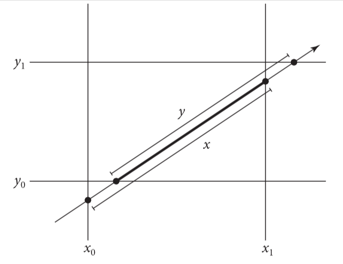
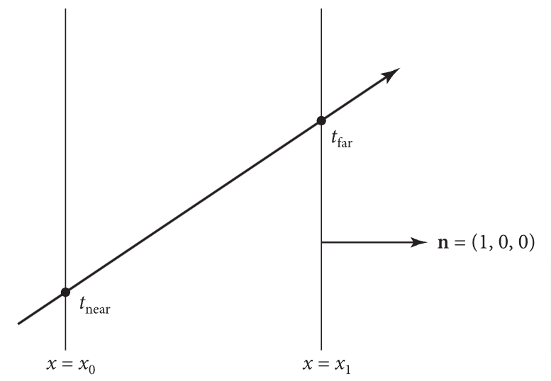

# 6 形状

在本章中，我们会展示pbrt对于几何图元的抽象，比如球体，三角形等。在一个设计简洁的系统中，仔细抽象光线追踪器中的几何形状是一个关键要素，以面向对象的抽象方式来说，形状(Shape)是理想的一员。所有几何图元都实现了一个公共的接口，其它渲染器可以在不需要知道形状底层细节的情况下使用这些接口。在pbrt里，这种做法让分离几何和着色的子系统变得可能。

pbrt把图元的细节隐藏到了2层抽象中。Shape接口提供了对图元的基本几何属性的访问，比如表面积和包围盒，而且其提供了一个光线求交的方法；同时，Primitive接口封装了图元额外的非几何信息，比如材质的属性。其它渲染器只需利用抽象的Primitive接口来处理即可。本章会关注几何相关的Shape类。Primitive接口是第七章的主要话题。

> 本章主要讲图元的抽象，pbrt里把图元分为几何属性和非几何属性部分，几何属性抽象出Shape接口，非几何属性抽象出Primitive接口。目的是使系统中几何和着色两部分解耦，方便扩展和维护。

## 6.1 基本形状的接口

形状的接口定义在base/shape.h文件中，形状的实现可以在shapes.h和shapes。cpp中找到。Shape类定义了总体的形状接口。

```c++
<<Shape Definition>>= 
class Shape : public TaggedPointer<Sphere, Cylinder, Disk, Triangle,
                                   BilinearPatch, Curve> {
  public:
    <<Shape Interface>> 
};
```

### 6.1.1 包围

pbrt渲染的场景经常包含了处理起来计算开销很大的物体。用三维包围体来包围物体对于大部分操作都是很有用的。比如：若一条光线没有穿过一个包围体，pbrt就可以避免对这个包围体里面的所有物体做处理。

轴对齐的包围盒是一种实用的包围体，这种包围盒只需储存6个浮点数，同时又能很好的匹配物体的形状，而且，在做相交测试时，计算开销很小。因此，每个Shape的实现类必须有能力用轴对称的包围盒(表示为Bounds3f)来包围自己。这个包围盒应以渲染坐标来返回值。(回顾章节5.1.1讨论的坐标系)

```c++
<<Shape Interface>>
Bounds3f Bounds() const;
```

为了包围物体的空间范围，形状的实现类也必须能够包围物体表面法线的范围。NormalBounds()方法应该用DirectionCone(定义于章节3.8.4)来返回这样的包围盒。在光照计算中，法线的包围盒十分有用：当某个形状是发光的，对于确定场景中某个特定点是否不被照到是很有效的。

```c++
<<Shape Interface>>
DirectionCone NormalBounds() const;
```

### 6.1.2 光线与包围盒的相交

为了利用Bounds3f实例来包围形状，我们会添加一个Bounds3的方法，即Bounds3:IntersectP(),此方法对光线-包围盒相交进行检查，并且当有相交时，返回两个参数化的t值。

一种理解包围盒的方法是，把其看成与三块板的相交，板看成是介于两个平行面之间的空间区域。为了使光线与包围盒相交，我们轮流让光线与每个包围盒的三个板相交。由于这些板子与三条坐标轴对齐，在光线与板子的相交测试中，就有很多优化方法。

最基本的光线与包围盒相交的算法是这样工作的：首先，给出光线方向上要找出相交的空间范围，用两个t作为间隔来表示。一般来说，t就在$(0,\infty)$间。然后，依次计算光线与每块与轴对齐的板的两个t值。我们计算每个板与当前相交区间的交集，如果发现结果的区间退化（即为空或反向），则返回失败。如果在检查完所有三个平板后，区间非退化，那么我们得到了光线在盒子内的参数范围。图6.1展示了此处理过程，图6.2展示了光线与板相交的基本几何特征。



图6.1 光线与轴对齐的包围盒相交。我们依次计算每个板的相交点，一步步缩小这个间隔参数。在此处是2d表示的，沿着光线与x，y相交的范围给出了在盒子中的光线的范围



图6.2 让光线与一块轴对齐的板相交。在此处展示的两个平面用$x=c$描述，c是常数。每个平面的法线是(1,0,0)。除非光线与平面平行，否则这个光线会与板相交两次，位置在$t_{near}$和$t_{far}$

如果Bounds3::IntersectP()返回true，相交的范围参数就用以参数hitt0和hitt1返回。在(0, tMax)之外的相交会被忽略。若光线原点在盒子中，会在hitt0返回0。

```c++
<<Bounds3 Inline Functions>>
template <typename T>
bool Bounds3<T>::IntersectP(Point3f o, Vector3f d, Float tMax,
                            Float *hitt0, Float *hitt1) const {
    Float t0 = 0, t1 = tMax;
    for (int i = 0; i < 3; ++i) {
        <<Update interval for ith bounding box slab>> 
    }
    if (hitt0) *hitt0 = t0;
    if (hitt1) *hitt1 = t1;
    return true;
}
```

对于每一组平面，这种方式需要计算两次光线与平面的相交。比如：用两个垂直于x轴的平面表示的板可以被描述为$(x_0,0,0)$和$(x_1,0,0)$,法线都是(1,0,0)。考虑平面相交的第一个t,即$t_0$，一束光线的原点o，方向$\vec{d}$和一个平面$ax+by+cz+d=0$的交点的t，把光线的方程带入到平面方程，可得:

$$
0 = a(o_x + t\vec{d_x})+b(o_y+t\vec{d_y})+c(o_z+t\vec{d_z})+d\\
=(a,b,c)·o + t(a,b,c)·\vec{d}+d
$$

要求t，可得:

$$
t=\frac{-d-((a,b,c)·o)}{((a,b,c)·\vec{d})}
$$

由于平面法线上的y和z都是0，故b,c为0，a是1，平面的d是$-x_0$。根据此信息和点乘的定义，可大幅简化计算:

$$
t_0=\frac{x_0-o_x}{\vec{d_x}}
$$

计算板子相交的t值的代码，以计算光线方向分量的倒数开始，以便后续计算乘以此数，而不是执行多次除法。注意，虽然此数是除数，但是没必要做非零检查。若此数为0，那么invRayDir就是一个无限大的数,$-\infty$或$+\infty$,并且后续的算法还是能正确工作。

```c++
<<Update interval for ith bounding box slab>>
Float invRayDir = 1 / d[i];
Float tNear = (pMin[i] - o[i]) * invRayDir;
Float tFar  = (pMax[i] - o[i]) * invRayDir;
<<Update parametric interval from slab intersection  values>> 
```

### 6.1.3 相交测试

Shape的实现类必须提供2个函数的实现，这两个函数用于测试光线与其相交。第一个是Intersect(), 会返回第一次光线与形状相交的几何信息，若有，则沿着给定的光线方向，且t在(0, tMax)区间。

```c++
<<Shape接口>>
pstd::optional<ShapeIntersection> Intersect(const Ray &ray,
                                            Float tMax = Infinity) const;
```

当交点被找到时，会返回ShapeIntersection，其中的SurfaceInteraction是交点对应的表面交互过程，tHit是光到交点的t，用于表示沿着光线方向到交点的距离

```c++
<<ShapeIntersection的定义>>
struct ShapeIntersection {
    SurfaceInteraction intr;
    Float tHit;
}
```

当阅读或写相交方法的代码时，有几个重要的点需要记住:

1. tMax的值定义了光线的终点，若相交发生在此点后，则必须忽略
2. 如果在光线方向与物体有多个交点，则返回最近的那个交点
3. 传入到相交方法的光线是用渲染空间坐标表示的，所以，形状实现类若需要做相交测试，就要负责把坐标转换到物体空间中。相交的信息要用渲染空间坐标返回。

第二个相交检测函数是Shape::IntersectP(),用于在不返回相交详细信息的情况下，预测相交是否会发生，这个测试通常比起完整的相交测试要更高效。这个方法被用在特定的阴影光线中，阴影光线用来测试场景中从某点是否能看到光源。

```c++
<<Shape Interface>>
bool IntersectP(const Ray &ray, Float tMax = Infinity) const;
```

### 6.1.4 相交坐标空间

对于某些形状，在其物体空间中做相交运算就是最自然的表达。比如：后续章节的Sphere形状，在位置于原点，给定半径的情况下来计算相交。把球体放在原点，就可以在相交算法上做各种简化。其他形状，比如三角形Triangle类，会把坐标转换为渲染空间，然后执行相交计算。

类似球体的形状，在物体空间中的操作必须把特定光线转换到物体空间，并且把相交结果转换到渲染空间。大部分操作可以利用其相关联的Transform类的方法来处理(见3.10)。然而，我们自然有个问题要问:"对于返回正确的距离参数，从渲染空间转换到物体空间会有什么影响?"相交方法已经为物体空间中光线的相交找到了一个参数化t的距离，当这个参数化的t从渲染空间转换时，可能已经被平移，渲染，缩放过，甚至更糟。

利用转换的特性，有可能发现到交点的t的距离不会被转换所影响。考虑一个渲染空间中的光线$r_r$,原点是$O_r$，方向是$\vec{d_r}$.给定一个渲染空间到物体空间的转换矩阵M,我们就能找到物体空间的光线$r_o$,原点是$M_{o_o}$，方向是$M\vec{d_o}$

若光线到形状的相交算法发现一个物体空间在光线方向的t距离相交，那么物体空间的相交点就是:

$$
p_o=o_o+t\vec{d_o}
$$

现在，考虑在渲染空间的交点$p_r$，可以通过在方程两侧同时乘M的逆矩阵找到

$$
M^{-1}p_o=M^{-1}(o_o+t\vec{d_o})\\
M^{-1}p_o=M^{-1}o_o+M^{-1}(t\vec{d_o})\\
M^{-1}p_o=M^{-1}o_o+tM^{-1}(\vec{d_o})\\
p_r=o_r+t\vec{d_r}\\
$$

因此，在物体空间中计算的t，同时也是渲染空间里相交点上正确的t。注意，若物体空间光线的方向在变换后已经被归一化，那么这个式子就不再成立，并且，需要提供与未归一化的光线长度相关的矫正因子。这就是变换后的物体空间的光线方向不做归一化的一个原因。

### 6.1.5 正反面

### 6.1.6 面积

在pbrt中，面积光是在Shape类上附加一个发光情况信息来定义。为了把Shape当作面积光，让Shape能够用渲染空间坐标来返回它们的面积是有必要的

```c++
<<Shape Interface>> 
Float Area() const;
```

### 6.1.7 采样

为了在形状上的表面来采样点，并用其作为发光点，一些额外的shape类的方法是必要的。

有两个形状采样的方法，都叫Sample()。第一个方法用一种关于表面积的采样分布，从形状上的表面来选择点，并且以ShapeSample对象来返回一个关于被采样点的局部几何信息。在$[0,1)^2$之间的一个均匀采样值u，用来确定形状上的点的位置

```c++
<<Shape Interface>> 
pstd::optional<ShapeSample> Sample(Point2f u) const;
```

其返回的ShapeSample结构体存储了一个Interaction对象，对应了表面上一个采样后的点，同时包含了这个采样点所在表面积的概率密度

```c++
<<ShapeSample Definition>>= 
struct ShapeSample {
    Interaction intr;
    Float pdf;
};
```

shape的实现类也必须配套提供一个PDF()，对于给定的Interaction返回形状上的特定点的概率密度。这个方法只应该用这个形状表面的interaction来调用。虽然Sample()已经返回了采样点的概率密度，但是当使用多重重要性采样时，由于这种情况下，会使用其他采样方式来生成样本，故此方法是有必要的。一个重要的细节是，此方法的实现允许假设提供的点是在它们的表面上的，调用者要负责保证属于此种情况。

```c++
<<Shape Interface>>+=  
Float PDF(const Interaction &) const;
```

第二个形状采样方法是取被看到的形状的参考点。此方法对于光照特别有用，因为调用者可以传入这个点来被点亮，并且允许形状的实现类来保证它们只在从那个点有可能可见的形状的部分上进行采样。

不像第一个Shape的采样方法(根据概率密度在形状上生成一个关于表面积的点)，第二个方法是利用概率密度来生成一个关于参考点立体角的点。这个区别来源于一个事实，即面积光采样的计算，是把直接光照的积分看作一个从参考点方向上的积分，用这个点的立体角来表达这些采样密度会更方便

```c++
<<Shape Interface>>
pstd::optional<ShapeSample> Sample(const ShapeSampleContext &ctx,
                                   Point2f u) const;
```

关于参考点的几何，着色法线信息是用ShapeSampleContext结构体提供的。参考点的位置是用Point3fi类来定义，这种方式利用了浮点算法来表示光线交点计算结果的数值不确定性。相关的讨论在章节6.8.对于在介质中且不在表面上的点，法线和着色法线就是默认值(0,0,0)

```c++
<<ShapeSampleContext Definition>>
struct ShapeSampleContext {
    <<ShapeSampleContext Public Methods>> 
    Point3fi pi;
    Normal3f n, ns;
    Float time;
};
```

ShapeSampleContext提供了各种方便的构造器，允许直接定义成员变量的值，或者从各种Interaction来构造此对象。

```c++
<<ShapeSampleContext Public Methods>>= 
ShapeSampleContext(Point3fi pi, Normal3f n, Normal3f ns, Float time)
  : pi(pi), n(n), ns(ns), time(time) {}
ShapeSampleContext(const SurfaceInteraction &si)
  : pi(si.pi), n(si.n), ns(si.shading.n), time(si.time) {}
ShapeSampleContext(const MediumInteraction &mi)
  : pi(mi.pi), time(mi.time) {}
```

若代码不需要关注交点的数值误差，下列方法提供了一个常规的Point3对象

```c++
<<ShapeSampleContext Public Methods>>
Point3f p() const { return Point3f(pi); }
```

根据上述的采样方式，我们有了第二个PDF()方法，此方法返回光源上采样的点的概率，这种情况下，参考点的入射光方向$\omega_i$就是wi。正如对应的采样方法那样，此密度应该是参考点的立体角的密度。对于其他形状类的PDF()方法，只应该在参考点到交点的方向已知的情况下调用。所以，此方法的实现者，不负责检查此种情况。

```c++
<<Shape Interface>>
Float PDF(const ShapeSampleContext &ctx, Vector3f wi) const;
```

一些PDF()的实现会需要从参考点跟踪一条在$\omega_i$方向上的光线，来观察此光线是否会与形状相交。下列的ShapeSampleContext方法应该被用来寻找原点，或者光线自身，而不是用ShapeSampleContext::p()返回的点。源于在交点数值误差的处理细节，这些方法的实现和相关的问题可在章节6.8.6找到

```c++
<<ShapeSampleContext Public Methods>>
Point3f OffsetRayOrigin(Vector3f w) const;
Point3f OffsetRayOrigin(Point3f pt) const;
Ray SpawnRay(Vector3f w) const;
```

## 6.2 球体

## 6.3 圆柱体

## 6.4 圆盘

## 6.5 三角网格
