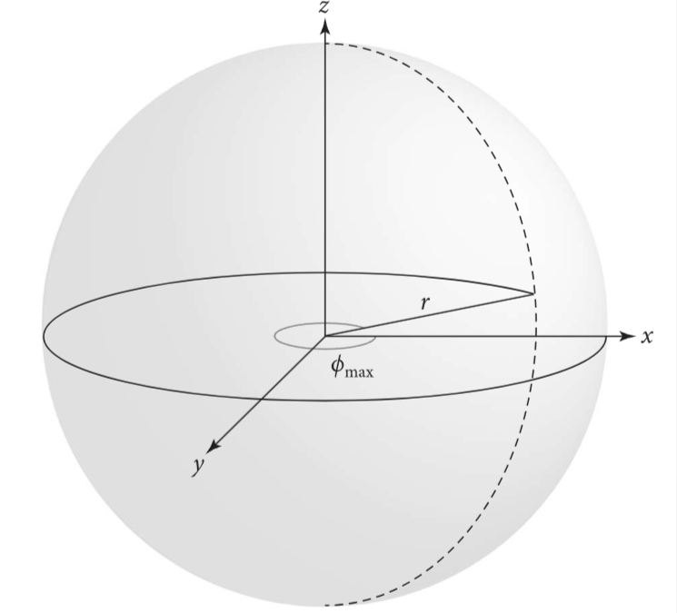
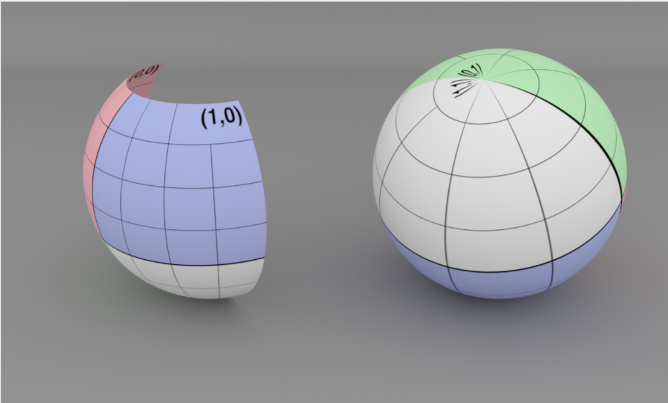

# 6 形状

在本章中，我们会展示pbrt对于几何图元的抽象，比如球体，三角形等。在一个设计简洁的系统中，仔细抽象光线追踪器中的几何形状是一个关键要素，以面向对象的抽象方式来说，形状(Shape)是理想的一员。所有几何图元都实现了一个公共的接口，其它渲染器可以在不需要知道形状底层细节的情况下使用这些接口。在pbrt里，这种做法让分离几何和着色的子系统变得可能。

pbrt把图元的细节隐藏到了2层抽象中。Shape接口提供了对图元的基本几何属性的访问，比如表面积和包围盒，而且其提供了一个光线求交的方法；同时，Primitive接口封装了图元额外的非几何信息，比如材质的属性。其它渲染器只需利用抽象的Primitive接口来处理即可。本章会关注几何相关的Shape类。Primitive接口是第七章的主要话题。

> 本章主要讲图元的抽象，pbrt里把图元分为几何属性和非几何属性部分，几何属性抽象出Shape接口，非几何属性抽象出Primitive接口。目的是使系统中几何和着色两部分解耦，方便扩展和维护。

## 6.1 基本形状的接口

形状的接口定义在base/shape.h文件中，形状的实现可以在shapes.h和shapes。cpp中找到。Shape类定义了总体的形状接口。

```c++
<<Shape Definition>>= 
class Shape : public TaggedPointer<Sphere, Cylinder, Disk, Triangle,
                                   BilinearPatch, Curve> {
  public:
    <<Shape Interface>> 
};
```

### 6.1.1 包围

pbrt渲染的场景经常包含了处理起来计算开销很大的物体。用三维包围体来包围物体对于大部分操作都是很有用的。比如：若一条光线没有穿过一个包围体，pbrt就可以避免对这个包围体里面的所有物体做处理。

轴对齐的包围盒是一种实用的包围体，这种包围盒只需储存6个浮点数，同时又能很好的匹配物体的形状，而且，在做相交测试时，计算开销很小。因此，每个Shape的实现类必须有能力用轴对称的包围盒(表示为Bounds3f)来包围自己。这个包围盒应以渲染坐标来返回值。(回顾章节5.1.1讨论的坐标系)

```c++
<<Shape Interface>>
Bounds3f Bounds() const;
```

为了包围物体的空间范围，形状的实现类也必须能够包围物体表面法线的范围。NormalBounds()方法应该用DirectionCone(定义于章节3.8.4)来返回这样的包围盒。在光照计算中，法线的包围盒十分有用：当某个形状是发光的，对于确定场景中某个特定点是否不被照到是很有效的。

```c++
<<Shape Interface>>
DirectionCone NormalBounds() const;
```

### 6.1.2 光线与包围盒的相交

为了利用Bounds3f实例来包围形状，我们会添加一个Bounds3的方法，即Bounds3:IntersectP(),此方法对光线-包围盒相交进行检查，并且当有相交时，返回两个参数化的t值。

一种理解包围盒的方法是，把其看成与三块板的相交，板看成是介于两个平行面之间的空间区域。为了使光线与包围盒相交，我们轮流让光线与每个包围盒的三个板相交。由于这些板子与三条坐标轴对齐，在光线与板子的相交测试中，就有很多优化方法。

最基本的光线与包围盒相交的算法是这样工作的：首先，给出光线方向上要找出相交的空间范围，用两个t作为间隔来表示。一般来说，t就在$(0,\infty)$间。然后，依次计算光线与每块与轴对齐的板的两个t值。我们计算每个板与当前相交区间的交集，如果发现结果的区间退化（即为空或反向），则返回失败。如果在检查完所有三个平板后，区间非退化，那么我们得到了光线在盒子内的参数范围。图6.1展示了此处理过程，图6.2展示了光线与板相交的基本几何特征。


图6.1 光线与轴对齐的包围盒相交。我们依次计算每个板的相交点，一步步缩小这个间隔参数。在此处是2d表示的，沿着光线与x，y相交的范围给出了在盒子中的光线的范围


图6.2 让光线与一块轴对齐的板相交。在此处展示的两个平面用$x=c$描述，c是常数。每个平面的法线是(1,0,0)。除非光线与平面平行，否则这个光线会与板相交两次，位置在$t_{near}$和$t_{far}$

如果Bounds3::IntersectP()返回true，相交的范围参数就用以参数hitt0和hitt1返回。在(0, tMax)之外的相交会被忽略。若光线原点在盒子中，会在hitt0返回0。

```c++
<<Bounds3 Inline Functions>>
template <typename T>
bool Bounds3<T>::IntersectP(Point3f o, Vector3f d, Float tMax,
                            Float *hitt0, Float *hitt1) const {
    Float t0 = 0, t1 = tMax;
    for (int i = 0; i < 3; ++i) {
        <<Update interval for ith bounding box slab>> 
    }
    if (hitt0) *hitt0 = t0;
    if (hitt1) *hitt1 = t1;
    return true;
}
```

对于每一组平面，这种方式需要计算两次光线与平面的相交。比如：用两个垂直于x轴的平面表示的板可以被描述为$(x_0,0,0)$和$(x_1,0,0)$,法线都是(1,0,0)。考虑平面相交的第一个t,即$t_0$，一束光线的原点o，方向$\vec{d}$和一个平面$ax+by+cz+d=0$的交点的t，把光线的方程带入到平面方程，可得:

$$
0 = a(o_x + t\vec{d_x})+b(o_y+t\vec{d_y})+c(o_z+t\vec{d_z})+d\\
=(a,b,c)·o + t(a,b,c)·\vec{d}+d
$$

要求t，可得:

$$
t=\frac{-d-((a,b,c)·o)}{((a,b,c)·\vec{d})}
$$

由于平面法线上的y和z都是0，故b,c为0，a是1，平面的d是$-x_0$。根据此信息和点乘的定义，可大幅简化计算:

$$
t_0=\frac{x_0-o_x}{\vec{d_x}}
$$

计算板子相交的t值的代码，以计算光线方向分量的倒数开始，以便后续计算乘以此数，而不是执行多次除法。注意，虽然此数是除数，但是没必要做非零检查。若此数为0，那么invRayDir就是一个无限大的数,$-\infty$或$+\infty$,并且后续的算法还是能正确工作。

```c++
<<Update interval for ith bounding box slab>>
Float invRayDir = 1 / d[i];
Float tNear = (pMin[i] - o[i]) * invRayDir;
Float tFar  = (pMax[i] - o[i]) * invRayDir;
<<Update parametric interval from slab intersection  values>> 
```

### 6.1.3 相交测试

Shape的实现类必须提供2个函数的实现，这两个函数用于测试光线与其相交。第一个是Intersect(), 会返回第一次光线与形状相交的几何信息，若有，则沿着给定的光线方向，且t在(0, tMax)区间。

```c++
<<Shape接口>>
pstd::optional<ShapeIntersection> Intersect(const Ray &ray,
                                            Float tMax = Infinity) const;
```

当交点被找到时，会返回ShapeIntersection，其中的SurfaceInteraction是交点对应的表面交互过程，tHit是光到交点的t，用于表示沿着光线方向到交点的距离

```c++
<<ShapeIntersection的定义>>
struct ShapeIntersection {
    SurfaceInteraction intr;
    Float tHit;
}
```

当阅读或写相交方法的代码时，有几个重要的点需要记住:

1. tMax的值定义了光线的终点，若相交发生在此点后，则必须忽略
2. 如果在光线方向与物体有多个交点，则返回最近的那个交点
3. 传入到相交方法的光线是用渲染空间坐标表示的，所以，形状实现类若需要做相交测试，就要负责把坐标转换到物体空间中。相交的信息要用渲染空间坐标返回。

第二个相交检测函数是Shape::IntersectP(),用于在不返回相交详细信息的情况下，预测相交是否会发生，这个测试通常比起完整的相交测试要更高效。这个方法被用在特定的阴影光线中，阴影光线用来测试场景中从某点是否能看到光源。

```c++
<<Shape Interface>>
bool IntersectP(const Ray &ray, Float tMax = Infinity) const;
```

### 6.1.4 相交坐标空间

对于某些形状，在其物体空间中做相交运算就是最自然的表达。比如：后续章节的Sphere形状，在位置于原点，给定半径的情况下来计算相交。把球体放在原点，就可以在相交算法上做各种简化。其他形状，比如三角形Triangle类，会把坐标转换为渲染空间，然后执行相交计算。

类似球体的形状，在物体空间中的操作必须把特定光线转换到物体空间，并且把相交结果转换到渲染空间。大部分操作可以利用其相关联的Transform类的方法来处理(见3.10)。然而，我们自然有个问题要问:"对于返回正确的距离参数，从渲染空间转换到物体空间会有什么影响?"相交方法已经为物体空间中光线的相交找到了一个参数化t的距离，当这个参数化的t从渲染空间转换时，可能已经被平移，渲染，缩放过，甚至更糟。

利用转换的特性，有可能发现到交点的t的距离不会被转换所影响。考虑一个渲染空间中的光线$r_r$,原点是$O_r$，方向是$\vec{d_r}$.给定一个渲染空间到物体空间的转换矩阵M,我们就能找到物体空间的光线$r_o$,原点是$M_{o_o}$，方向是$M\vec{d_o}$

若光线到形状的相交算法发现一个物体空间在光线方向的t距离相交，那么物体空间的相交点就是:

$$
p_o=o_o+t\vec{d_o}
$$

现在，考虑在渲染空间的交点$p_r$，可以通过在方程两侧同时乘M的逆矩阵找到

$$
M^{-1}p_o=M^{-1}(o_o+t\vec{d_o})\\
M^{-1}p_o=M^{-1}o_o+M^{-1}(t\vec{d_o})\\
M^{-1}p_o=M^{-1}o_o+tM^{-1}(\vec{d_o})\\
p_r=o_r+t\vec{d_r}\\
$$

因此，在物体空间中计算的t，同时也是渲染空间里相交点上正确的t。注意，若物体空间光线的方向在变换后已经被归一化，那么这个式子就不再成立，并且，需要提供与未归一化的光线长度相关的矫正因子。这就是变换后的物体空间的光线方向不做归一化的一个原因。

### 6.1.5 正反面

### 6.1.6 面积

在pbrt中，面积光是在Shape类上附加一个发光情况信息来定义。为了把Shape当作面积光，让Shape能够用渲染空间坐标来返回它们的面积是有必要的

```c++
<<Shape Interface>> 
Float Area() const;
```

### 6.1.7 采样

为了在形状上的表面来采样点，并用其作为发光点，一些额外的shape类的方法是必要的。

有两个形状采样的方法，都叫Sample()。第一个方法用一种关于表面积的采样分布，从形状上的表面来选择点，并且以ShapeSample对象来返回一个关于被采样点的局部几何信息。在$[0,1)^2$之间的一个均匀采样值u，用来确定形状上的点的位置

```c++
<<Shape Interface>> 
pstd::optional<ShapeSample> Sample(Point2f u) const;
```

其返回的ShapeSample结构体存储了一个Interaction对象，对应了表面上一个采样后的点，同时包含了这个采样点所在表面积的概率密度

```c++
<<ShapeSample Definition>>= 
struct ShapeSample {
    Interaction intr;
    Float pdf;
};
```

shape的实现类也必须配套提供一个PDF()，对于给定的Interaction返回形状上的特定点的概率密度。这个方法只应该用这个形状表面的interaction来调用。虽然Sample()已经返回了采样点的概率密度，但是当使用多重重要性采样时，由于这种情况下，会使用其他采样方式来生成样本，故此方法是有必要的。一个重要的细节是，此方法的实现允许假设提供的点是在它们的表面上的，调用者要负责保证属于此种情况。

```c++
<<Shape Interface>>+=  
Float PDF(const Interaction &) const;
```

第二个形状采样方法是取被看到的形状的参考点。此方法对于光照特别有用，因为调用者可以传入这个点来被点亮，并且允许形状的实现类来保证它们只在从那个点有可能可见的形状的部分上进行采样。

不像第一个Shape的采样方法(根据概率密度在形状上生成一个关于表面积的点)，第二个方法是利用概率密度来生成一个关于参考点立体角的点。这个区别来源于一个事实，即面积光采样的计算，是把直接光照的积分看作一个从参考点方向上的积分，用这个点的立体角来表达这些采样密度会更方便

```c++
<<Shape Interface>>
pstd::optional<ShapeSample> Sample(const ShapeSampleContext &ctx,
                                   Point2f u) const;
```

关于参考点的几何，着色法线信息是用ShapeSampleContext结构体提供的。参考点的位置是用Point3fi类来定义，这种方式利用了浮点算法来表示光线交点计算结果的数值不确定性。相关的讨论在章节6.8.对于在介质中且不在表面上的点，法线和着色法线就是默认值(0,0,0)

```c++
<<ShapeSampleContext Definition>>
struct ShapeSampleContext {
    <<ShapeSampleContext Public Methods>> 
    Point3fi pi;
    Normal3f n, ns;
    Float time;
};
```

ShapeSampleContext提供了各种方便的构造器，允许直接定义成员变量的值，或者从各种Interaction来构造此对象。

```c++
<<ShapeSampleContext Public Methods>>= 
ShapeSampleContext(Point3fi pi, Normal3f n, Normal3f ns, Float time)
  : pi(pi), n(n), ns(ns), time(time) {}
ShapeSampleContext(const SurfaceInteraction &si)
  : pi(si.pi), n(si.n), ns(si.shading.n), time(si.time) {}
ShapeSampleContext(const MediumInteraction &mi)
  : pi(mi.pi), time(mi.time) {}
```

若代码不需要关注交点的数值误差，下列方法提供了一个常规的Point3对象

```c++
<<ShapeSampleContext Public Methods>>
Point3f p() const { return Point3f(pi); }
```

根据上述的采样方式，我们有了第二个PDF()方法，此方法返回光源上采样的点的概率，这种情况下，参考点的入射光方向$\omega_i$就是wi。正如对应的采样方法那样，此密度应该是参考点的立体角的密度。对于其他形状类的PDF()方法，只应该在参考点到交点的方向已知的情况下调用。所以，此方法的实现者，不负责检查此种情况。

```c++
<<Shape Interface>>
Float PDF(const ShapeSampleContext &ctx, Vector3f wi) const;
```

一些PDF()的实现会需要从参考点跟踪一条在$\omega_i$方向上的光线，来观察此光线是否会与形状相交。下列的ShapeSampleContext方法应该被用来寻找原点，或者光线自身，而不是用ShapeSampleContext::p()返回的点。源于在交点数值误差的处理细节，这些方法的实现和相关的问题可在章节6.8.6找到

```c++
<<ShapeSampleContext Public Methods>>
Point3f OffsetRayOrigin(Vector3f w) const;
Point3f OffsetRayOrigin(Point3f pt) const;
Ray SpawnRay(Vector3f w) const;
```

## 6.2 球面

球面是一种特殊类型的面，称为二次曲面，这种面用x,y,z的二次多项式描述。为了介绍相交算法，以此类型的面作为起点是很不错的。结合变换矩阵，pbrt的球面形状也能够变为椭球的形式。pbrt也支持其他两种基本类型的二次曲面：圆柱面和圆盘面。其他二次曲面比如锥面，双曲面，和抛物面在大部分渲染应用中不太常用，故在本系统中没有包含在内。

许多面可以用一种或两种方式描述：用隐函数形式或参数形式。描述一个三维面的隐函数是:

$$
f(x,y,z)=0
$$

所有满足此函数条件的点集(x,y,z)定义了此表面。对于圆心在原点的单位球面，我们熟悉的隐函数方程是$x^2+y^2+z^2-1=0$。只有离原点1个单位的点集满足这个约束条件，这些点给出了单位球的面。

很多面也可以被参数化描述，参数化即利用一个函数，把表面上的2维的点映射成3维点。比如：半径为r的球面，可以用二维球坐标$(\theta, \phi)$函数来描述。其中$\theta$范围从0到$\pi$,$\phi$的范围从0到$2\pi$,如图6.3

$$
\begin{aligned}
x=&r\sin\theta\cos\phi\\
y=&r\sin\theta\sin\phi\\
z=&r\cos\theta\\
 \tag{6.1}
\end{aligned}
$$



图6.3 球面的基本设置 此球半径r，圆心在物体空间的原点，球面的一部分可以通过定义一个最大$\phi$值来实现

我们可以把函数$f(\theta,\phi)$变换为在$[0,1]^2$的函数$f(u,v)$，然后把此函数稍微推广到允许扫过$\theta\in[\theta_{min},\theta_{max}]$,和$\phi\in[0,\phi_{max}]$球面的一部分,用u,v替换如下:

$$
\begin{aligned}
\phi=&u\phi_{max}\\
\theta=&\theta_{min}+v(\theta_{max}-\theta_{min})\\
 \tag{6.2}
\end{aligned}
$$

这种式子对于纹理映射相当有用，此式可以直接把以$[0,1]^2$定义的纹理映射到球面上。图6.4展示了两个球面的图像，为了展示(u,v)的参数化，使用了一个网格式的贴图



图6.4 **两个球面**，左侧是球面的一部分($z_{max}<r,\phi_{max}<2\pi$),右侧是完整的球面，注意，使用纹理图片展示形状的(u,v)参数化。在完整球面上可以看到其中一个极点

既然我们描述了球面的实现，对于隐式或参数化这两种描述，我们会根据我们要解决的特定问题，看哪种方法更自然就利用哪种。

Sphere类代表了一个球面，它的球心在原点，与其他形状类似，此类的实现在文件shapes.h和shapes.cpp中

```c++
<<Sphere Definition>>
class Sphere {
  public:
    <<Sphere Public Methods>> 
  private:
    <<Sphere Private Members>> 
};
```

就如前文所述，在pbrt中的球面的定义，在此物体的坐标系中，其圆心在原点。球面的构造器提供了在球面的物体空间和渲染空间之间的变换。

虽然pbrt支持动画化的变换矩阵，但是在此的变换并不是animatedTransform类(本章中的其他形状类也如此)。动画化的性转变换是被另一个类:TransformedPrimitive来处理，用来代表场景中的这种形状。这样做可以让我们在单独一个地方对动画化的变换做一些特殊的细节操作，而不用处理所有形状。

球面的半径可以是任意正值，球面的范围可用两种方式截断，第一种，设置最大最小的z值，这个球在z值外的面会被相应截断；第二种，在球坐标里考虑参数化，可以设置最大$\phi$值，球面从0到给定的$\phi_{max}$扫过，大于$\phi_{max}$的部分会被去除

最后，球面的构造器也可以取一个布尔值:reverseOrientation,这个值代表了它们的表面法线方向是否应该从默认(指向球面外侧)反转过来。由于表面法线是用来代表哪个面是形状的"外面"，所以此参数很有用。此参数在pbrt的场景描述文件中，通过ReverseOrientation来管理其状态

```c++
<<Sphere Public Methods>>= 
Sphere(const Transform *renderFromObject, const Transform *objectFromRender,
       bool reverseOrientation, Float radius, Float zMin, Float zMax,
       Float phiMax)
    : renderFromObject(renderFromObject), objectFromRender(objectFromRender),
      reverseOrientation(reverseOrientation),
      transformSwapsHandedness(renderFromObject->SwapsHandedness()),
      radius(radius),
      zMin(Clamp(std::min(zMin, zMax), -radius, radius)),
      zMax(Clamp(std::max(zMin, zMax), -radius, radius)),
      thetaZMin(std::acos(Clamp(std::min(zMin, zMax) / radius, -1, 1))),
      thetaZMax(std::acos(Clamp(std::max(zMin, zMax) / radius, -1, 1))),
      phiMax(Radians(Clamp(phiMax, 0, 360))) {}
```

```c++
<<Sphere Private Members>>= 
Float radius;
Float zMin, zMax;
Float thetaZMin, thetaZMax, phiMax;
const Transform *renderFromObject, *objectFromRender;
bool reverseOrientation, transformSwapsHandedness;
```

### 6.2.1 包围

为球面计算物体空间中的包围盒十分简单。当只渲染一部分球面时，此处的实现使用了用户提供的$z_{min},z_{max}$来围住边界。然而，当$\phi_{max}$小于$\frac{3\pi}{2}$时，此方式不会计算更紧凑的包围盒。这个优化会留作练习。此物体空间中的包围盒在返回前已被转为渲染空间坐标

```c++
<<Sphere Method Definitions>>
Bounds3f Sphere::Bounds() const {
    return (*renderFromObject)(
        Bounds3f(Point3f(-radius, -radius, zMin),
                 Point3f( radius,  radius, zMax)));
}
```

球面的NormalBounds()方法不会考虑任何形式的部分球面，但是总会返回所有可能方向的整个球面的包围盒

```c++
<<Sphere Public Methods>>
DirectionCone NormalBounds() const { return DirectionCone::EntireSphere(); }
```

### 6.2.2 相交测试

光线的相交测试被分为两个阶段，首先，BasicIntersect()执行基本的光线到球面的相交测试，并返回一个小的结构体:QuadricIntersection,若交点被找到，会继续调用InteractionFromIntersection()方法，把QuadricIntersection转换为参数更全面的SurfaceInteraction,此对象可被Intersection()返回

把相交测试拆成2个阶段的动机有2个：其一是这么做允许IntersectP()的实现可以看作BasicIntersect()的封装。其二是pbrt的GPU渲染是被组织好的，因此所有形状中最近的交点会在完整的SurfaceInteraction被构造前就找到，这种拆分与其直接匹配。

```c++
<<Sphere Public Methods>>
pstd::optional<ShapeIntersection> Intersect(const Ray &ray,
                                            Float tMax = Infinity) const {
    pstd::optional<QuadricIntersection> isect = BasicIntersect(ray, tMax);
    if (!isect) return {};
    SurfaceInteraction intr =
        InteractionFromIntersection(*isect, -ray.d, ray.time);
    return ShapeIntersection{intr, isect->tHit};
}
```

QuadricIntersection存储了沿着光线方向到交点的参数化的t，物体空间的交点，盒球面的$\phi$值。就如其名，此结构体会被其他二次曲面以同种方式使用。

```c++
struct QuadricIntersection {
    Float tHit;
    Point3f pObj;
    Float phi;
};
```

最基础的相交测试会把提供的渲染空间中的光线转换到物体空间，然后让其与完整的球面求交。如果定义的是一个球面的一部分，当与已被去除的球面部分相交时，会有一些额外的测试来拒绝此种情况

```c++
<<Sphere Public Methods>>+=  
pstd::optional<QuadricIntersection> BasicIntersect(const Ray &r,
                                                   Float tMax) const {
    Float phi;
    Point3f pHit;
    <<把光线的原点和方向转换为物体空间>> 
    <<解二次曲面方程计算出球面的t0和t1>> 
    <<检查t0和t1，找到最近的交点>> 
    <<找到交点位置和phi>> 
    <<根据裁剪参数检测球面的相交>> 
    <<若球面有交点则返回QuadricIntersection>> 
}
```

转换后的光线原点和方向分别存储于Point3fi和Vector2fi类中，而不是Point3f和Vector3f。这些类代表了在每个维度下的微小间隔量，此间隔量把使用变换时引入的浮点数舍入误差框了起来。在后文中，我们会看到这些误差的范围对于改进相交计算的集合精确度是很有用的。在大部分时候，这些类可以像Point3f和Vector3f一样使用。

```c++
<<把光线的原点和方向转换为物体空间>>
Point3fi oi = (*objectFromRender)(Point3fi(r.o));
Vector3fi di = (*objectFromRender)(Vector3fi(r.d));
```

根据方程3.4，用光线参数化的表示替换掉球面隐函数，我们就有

$$
(o_x+t\vec{d_x})^2+(o_y+t\vec{d_y})^2+(o_z+t\vec{d_z})^2=r^2
$$

注意，此方程的所有元素中，除了t外，值都是已知的。此方程中的t给出了满足球面方程且沿着光线方向的一个参数化的位置，因此此点就是光线与球面的交点。我们可以扩展此方程为一个更通用的关于t的二次曲面方程:

$$
at^2+bt+c=0
$$

此处

$$
\begin{aligned}
a=&\vec{d_x^2}+\vec{d_y^2}+\vec{d_z^2}\\
b=&2(\vec{d_x}o_x+\vec{d_y}o_y)+\vec{d_z}o_z)\\
c=&o_x^2+o_y^2+o_z^2-r^2
\end{aligned}
$$

## 6.3 圆柱体

## 6.4 圆盘

## 6.5 三角网格

在计算机图形学中，三角形是其中被最广泛使用的形状。为了达到较好的细节效果，复杂场景可能会使用百万个三角形来建模。

虽然一种最自然的表示法是使用shape接口来实现存储三个顶点值的Triangle对象，但是有一种更省内存的表示法是把全部三角网格用它的三个顶点存为一个数组，其中每个单独的三角形为其三个顶点在数组中只存三个偏移量。为了见识到为什么这样做，考虑一个著名的公式：欧拉-庞加莱公式，此公式把在封闭离散网格上的顶点V，边E和面F以下式做了关联:

$$
V - E + F = 2(1-g)
$$

此处$g\in N$中的g为网格的亏格，亏格一般来讲是一个比较小的数字，并且可以被解释为网格中的"把手"数量(类比为茶壶的把手)。对于一个三角网格，边和顶点的数量有着更多的关联，如下式:

> 亏格就是曲面上孔的数量，比如球体亏格为0，圆环亏格为1
>
> N代表自然数集

$$
E=\frac{3}{2}F
$$

这可以通过将每条边分成与两个相邻三角形相关的两部分来理解.有3F个这样的半边，重合的一对构成了E个网格的边。对于大的封闭的三角网格，亏格总体的影响一般来讲可以忽略，并且我们可以合并之前的2个方程(设g=0)，可得:

$$
F\approx 2V
$$

> 巨大封闭三角网格体中，亏格被忽略，由上式可得F=2V-4,但是4也被忽略了

换句话说，面的数量近似等于2倍顶点数量。既然每个面引用了3个顶点，每个顶点平均被引用6次，那么当顶点是共享的时候，平摊下来，每个三角形总的需要偏移12字节(三个32位整形数需要4字节)，加上一个顶点一半的存储6字节，假设是用三个4字节的浮点数来存储顶点位置，那么总共每个三角形要18字节。这比起每个三角形以直接存储3个顶点的方式(需要36字节)来说要好多了。当网格中有每个顶点的法线或纹理坐标的时候，能节省的存储空间更多。

> 顶点共享时，至少2个三角形，一个顶点至少共享2次，本来需要2个顶点的空间只需1个空间，平摊下来就节省了一半空间，故取一个顶点一半的空间($4 \times 3 / 2= 12 / 2 = 6$)
>
> 偏移量是用来指向这个共享顶点的地址，就是指针，三个偏移量是因为分别对应了x,y,z,一个指针32bit=4byte，故$3 \times 4 = 12$byte

### 6.5.1 网格的表示和存储

pbrt用TriangleMesh类来存储关于一个三角网格的共享信息。在util/mesh.h和util.mesh.cpp中定义

```c++
<<TriangleMesh Definition>>= 
class TriangleMesh {
  public:
    <<TriangleMesh Public Methods>> 
    <<TriangleMesh Public Members>> 
};
```

除了顶点位置和顶点索引，还可以提供每个顶点的法线n,切向量s,纹理坐标uv，若没有对应的参数，需要传空，若有，则需要与p有相同的元素数量

```c++
<<TriangleMesh Method Definitions>>
TriangleMesh::TriangleMesh(
        const Transform &renderFromObject, bool reverseOrientation,
        std::vector<int> indices, std::vector<Point3f> p,
        std::vector<Vector3f> s, std::vector<Normal3f> n,
        std::vector<Point2f> uv, std::vector<int> faceIndices, Allocator alloc)
    : nTriangles(indices.size() / 3), nVertices(p.size()) {
    <<Initialize mesh vertexIndices>> 
    <<Transform mesh vertices to rendering space and initialize mesh p>> 
    <<Remainder of TriangleMesh constructor>> 
}
```

网格的数据可通过共有成员变量获取，与点坐标和射线方向的成员设计类似，有一些微小的益处，同时也带来了一些困扰。

```c++
<<TriangleMesh Public Members>>
int nTriangles, nVertices;
const int *vertexIndices = nullptr;
const Point3f *p = nullptr;
```

虽然此构造器取std::vector的参数，TriangleMesh存储了指向其数组的普通指针。verTexIndices指针指向了3*nTriangles的值，同时，每个顶点的指针，若非nullptr,则指向nVertices的值

我们选择这样的设计以便不同的TriangleMeshes对象能够在它们有一些或全部参数相同时，指向同一个内存中的数组。虽然pbrt提供了对象实例化的能力，让同一个几何体可以拷贝多份并带有不同的变换矩阵，放置在场景中(比如在7.1.2中描述的TransformedPrimitive对象),但是，提供给其的场景不总是能充分利用这个能力。比如：在图5.11和7.2中的地形场景，有超过400MB用来检测这种多余数组的内存被节省了下来。

BufferCache类根据传给它的每个缓冲，来处理存储一份单独拷贝的细节。此类的LookupOrAdd()方法，取一个它所管理的类型的std::vector，然后返回一个指向相同值的指针

```c++
<<Initialize mesh vertexIndices>>
vertexIndices = intBufferCache->LookupOrAdd(indices, alloc);
```

### 6.5.2 Triangle类

## 6.6 双线性贴片

## 6.7 曲线

## 6.8 舍入误差的管理

