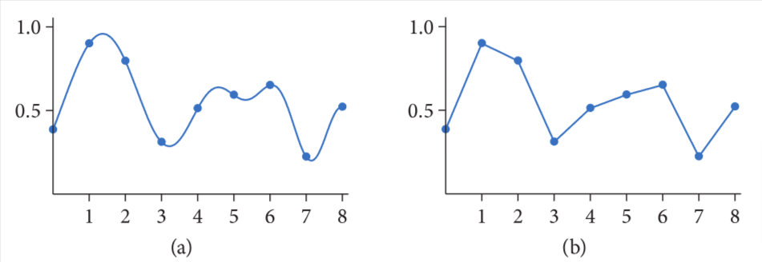
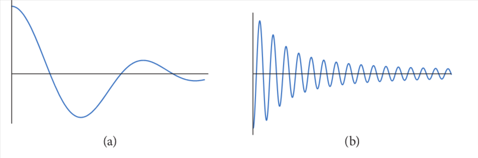
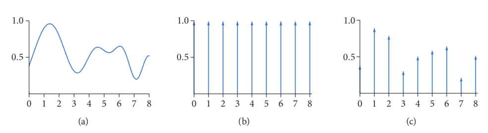
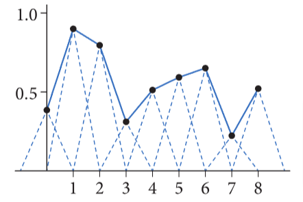
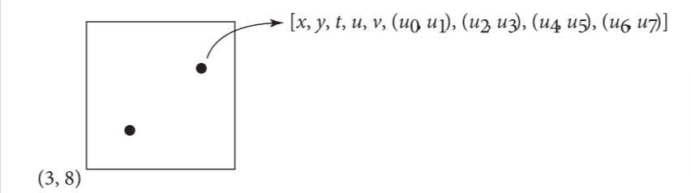
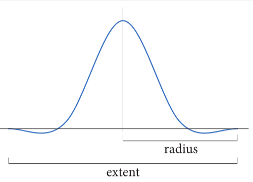

# 8 采样与重建

虽然渲染后最终输出的是一个二维带颜色的像素点组成的网格阵列，但入射光的辐射量事实上是一个在胶片平面上的连续函数。从这个连续函数上取出离散像素值的方法，能明显影响渲染器生成的最终图像的质量。若这个过程处理的不周全，人造的痕迹就会出现。反过来说，若处理得好，相对多那么一点计算量就可以明显提高渲染出来的图像质量。到目前为止，我们是从蒙特卡洛积分的角度讨论这个问题，然而，其他的观点也很有启发。

本章将从介绍采样理论开始(从连续区域里取出离散的样本值，然后使用这些样本来重建一个与原来函数近似的新的函数)。在pbrt中，积分比起重建往往是更普遍的目标，尽管我们会见到傅里叶分析(采样理论的基础)，这个理论也会为蒙特卡洛积分的误差提供启发。在本章的第二部分，我们会讨论蒙特卡洛积分与傅里叶分析的联系，也会讨论采样算法质量的衡量方法。

在后文中，六种采样器的实现占据了本章的大部分篇幅。它们涵盖了解决采样问题的大部分方法。本篇也会包含Filter类，这个类决定了在像素点附近的多个采样如何被合成在一起，用来计算最终像素值。pbrt中的两种Film的实现类都用这些滤波器，来把图像样本的贡献累加到图像的像素上。

## 8.1 采样理论

数码图像使用一组像素值来表示的，一般就是以矩形网格方式对齐的。当在某个现实里的设备显式此数码图像时，这些值被用来确定显式设备上各个像素点发出的光谱功率。当思考数码图像时，区分图像像素(代表特定采样位置的函数的值)和显示像素(代表用某种空间和方向分布发光的现实的物体)是重要的。(例如，在LCD显示器中，当在不同角度观察时，颜色和亮度都会明显变化)显示设备使用图像像素值来在显示器表面建立一个新的图像函数。这个函数是用显示器上所有点定义的，而不是用数码图像像素的无限小的点来定义的。获取采样值的集合和把这些值转换回连续函数的处理过程，叫做重建。

为了计算数码图像中离散的像素值，有必要对原始的连续图像函数进行采样。在pbrt中，就像其他大多数光追渲染器一样，获取图像函数的唯一方法是用追踪的光线来采样。比如，没有通用的方法能计算胶片面上两点之间图像函数的变化界限。然而可以通过在像素位置精确采样出图像函数来生成图像，要获取更好的结果，可通过在不同位置更多的采样，并且把这些关于图像函数额外的信息合成为最终像素值。确实，对于最佳质量的结果，像素值应该被计算出来，这样在显示设备重建出来的图像才会尽可能接近原始图像。注意，此处与期望显示设备的像素呈现出某个位置图像函数的实际值有微妙的不同。处理这种不同就是本章的算法实现的主要目标

由于采样和重建过程涉及近似估计，所以会引入误差，也被称为走样。走样会以多种方式显现，包括锯齿，在运动中闪烁等。这些误差是由于采样处理中没有从连续图像函数中捕捉到所有信息导致的。

考虑一个由f(x)给定的一维函数(也可称为信号)，我们能在其定义域中的任意位置x'，计算f(x')。每个这样的x'称为样本位置，f(x')的值称为样本值。图8.1展示了一组光滑一维函数的样本，使用重建后的信号$\widetilde{f}$来近似原始的函数f。在这个例子中，$\widetilde{f}$是一个分段函数，用邻近样本值间线性插值的方式来与f近似(熟悉采样理论的读者会发现这就是用帽子函数的重建)。由于关于f的信息只来自于在x'的采样值，$\widetilde{f}$几乎不能完美匹配f，因为没有关于f的样本之间的信息。



图8.1 (a)取f(x)的一组点，我们可以确定这些位置的值,(b)这些样本值可以被用来重建一个函数$\widetilde{f}(x)$,这个函数近似f(x)。在8.1.3中介绍的采样理论，可得出f(x)的精确状态，获取样本的数量，并且所使用的重建技术得到的$\widetilde{f}(x)$,几乎与f(x)一致。这种原始图像有些时候能通过采样点来准确重建的事实是非常精彩的

傅里叶分析能被用来衡量重建函数和原始函数的匹配质量。本章会介绍傅里叶分析的核心思想，以便由足够的细节来深入采样和重建处理的部分，但是会忽略许多特性的证明，并且跳过在pbrt中没有直接与采样算法相关的细节。在延伸阅读章节已经指出这些话题的更多信息

### 8.1.1 频域与傅里叶变换

傅里叶分析的其中一个基础是傅里叶变换，傅里叶变换是用频域表示的（一般是以空间域来表达)。考虑在图8.2中的两个函数图像，在8.2(a)的函数随着x的变化相对缓慢，然而在8.2(b)的函数相对变化更快。变化更慢的函数被称为具有更低的频率成分

> 频率成分：多个不同频率下振幅组成的整个分布，类似于spectrum(频谱)，变化慢的函数成分少，因为只需要部分频率做合成贡献即可



图8.2 (a)低频函数 (b)高频函数。简单来说，高频函数在给定的区间内变化更快

图8.3展示了这两个函数的频域图像。低频函数比高频函数趋0更快


图8.3 图8.2里的两个函数在频域的表示。此图像展示了在空间域中，每个频率$\omega$在这两个函数的贡献

大部分函数可以被拆分为加权变换过的正弦波的总和。此精彩的事实首次被Joseph Fourier描述出来。傅里叶变换将一个函数转换为这种表示。这种把函数表示为频率空间的方式，可从中窥探到原函数的特性——以正弦函数表示的频率的分布，对应了原函数频率的分布。利用此种形式，就让用傅里叶分析来获得由于采样和重建过程中引入的误差的洞察，及如何减少可感知到的误差影响成为可能。

一维函数f(x)的傅里叶变换是:

$$
F(\omega)=\int_{-\infty}^\infty f(x)e^{-i2\pi\omega x}dx \tag{8.1}
$$

(回想一下，$e^{ix}=\cos x + i \sin x, 其中i=\sqrt{-1}$)为了简化，此处我们只考虑偶函数f(-x)=f(x),此种情况下，f的傅里叶变换就没有虚部。新的函数F就是关于频率$\omega$的函数。我们会用F来解释傅里叶变换的操作，即$F\{f(x)\}=F(\omega)$。F很明显是一个线性操作，即是说,对于任意标量a，有$F\{af(x)\}=aF\{f(x)\}$，并且$F\{f(x)+g(x)\}=F\{f(x)\}+F\{g(x)\}$。傅里叶变换对于多维函数有一个更通俗的函数，此函数中$\omega$是对应的多维值，然而为了简化，我们只会关注一维的场景

方程8.1叫做傅里叶分析方程，或者某些时候就叫傅里叶变换。我们也能利用傅里叶合成方程(或叫逆傅里叶变换方程)，把频域转换到空间域:

$$
f(x)=\int_{-\infty}^\infty F(\omega)e^{i2\pi\omega x}d\omega
$$

表81表示了一些重要的函数和它们的频域空间表示。这些函数中的一部分是基于狄拉克delta分布的，即用$\int \delta(x)dx=1$定义，且对于所有$x\neq 0,\delta(x)=0$,这些属性的一个重要结论就是:

$$
\int f(x)\delta(x)dx=f(0)
$$

delta分布不能用标准数学函数来表示，但是取而代之的是，一般看作一个有限的单元面积的方形函数，中心在原点且宽度接近0

### 8.1.2 理想的采样和重建

使用频率空间分析，我们现在能正式介绍采样的特性。回顾采样的处理过程，这个过程要求我们选取一组相同间距的样本位置，然后在这些位置计算函数的值。形式上，这对应了把函数乘以一个"shah函数"或叫"冲激脉冲函数(impulse train)"，代表了无限项相同间距的delta函数的总和。shah $III_T(x)$用下式定义:

$$
III_T(x)=T\sum_{i=-\infty}^\infty \delta(x-iT)
$$

此处的T定义了一个周期，或叫采样率，其在采样中的正式定义可用图8.4解释。这个乘法得出了一个无限序列以相等间距间隔的点的函数值:

$$
III_T(x)f(x)=T\sum_i\delta(x-iT)f(iT)
$$



图8.4 正式化的采样处理过程 (a)函数f(x)被(b)shah函数$III_T(x)$所乘，给出了(c)一个缩放后的delta函数的无限序列，代表了每个样本点的值

这些样本值能被用来定义一个重建后的函数$\widetilde{f}$,这个函数通过选取一个重建滤波函数r(x)，并且计算卷积求得:

$$
(III_T(x)f(x))\bigotimes r(x)
$$

此处的卷积操作$\bigotimes$定义为:

$$
f(x)\bigotimes g(x)=\int_{-\infty}^\infty f(x')g(x-x')dx'
$$

对于重建，卷积会在重建滤波器的采样点中心，对缩放后的滤波器实例进行加权求和:

$$
\widetilde{f}(x)=T\sum_{i=-\infty}^\infty f(iT)r(x-iT)
$$

例如，在图8.1中，三角重建滤波函数$r(x)=max(0,1-\vert x\vert)$就被使用。图8.5展示了使用了那个例子的缩放后的三角函数



图8.5 三角重建滤波器实例的总和，以虚线表示，得出的对于原函数重建后的近似值，用实线表示

> 从相邻点加权，越靠近这个点权值越高，然后累加起来，就是这个点的近似值，虚线呈一个三角形状，所以叫三角重建滤波器

### 8.1.3 走样

### 8.1.4 像素的理解

### 8.1.5 渲染中的采样和混叠

### 8.1.6 采样模式的光谱分析

## 8.2 采样和积分

### 8.2.1 变量的傅里叶分析

### 8.2.2 低差异和准蒙特卡洛

## 8.3 Sampler接口

pbrt的Sampler接口让渲染中使用各种样本生成算法成为可能。采样器提供的样本点被pbrt的积分器以各种方式使用，从确定图像平面上相机光线的来源点，到选择阴影射线跟踪到哪个光源，以及阴影光线应该在哪个点停止。

在后面的章节中，我们将会看到精心设计的采样模式不仅仅只是有理论上的好处，而是会极大的改善渲染图象的质量。使用好的采样算法带来的运行时间成本相对很小，因为，比起计算样本的分量值，衡量每个图像样本的辐射量的成本要比前者大得多。所以，做这项工作是有回报的。

采样器的任务是生成均匀的d-维的样本点，每个点的坐标值都在[0,1)间。点的维度总数没有提前设定，采样器必须根据光传输算法执行时的计算要求，生成额外的维度。虽然这种设计比起一开始就生成每个采样点的所有维度来说要更复杂一些，但是对于那些特定路径需要不同维度数量的积分器来说，就更方便了。

> 这里的维度就是指采样值有几个值组成，一个值算一个维度



图8.21 采样器生成了一个d-维的样本点，对于每个图像样本，会用来生成最终图像。在此处，像素(3,8)被采样，并且在像素面上有2个图像样本，样本中的前两个维度(x,y)给出了在像素中的偏移量，后三个维度决定了时间，和对应相机光线的镜头位置。其余的维度是在pbrt的积分器中用于在蒙特卡洛光线传输算法

```c++
<<Sampler的定义>>
class Sampler : public TaggedPointer<<<Sampler Types>> > {
  public:
    <<Sampler Interface>> 
};
```

除了MLTSampler以外，所有采样器都在本章定义，MLTSampler只在MLTIntegrator中使用，详见本书在线版。

```c++
<<Sampler Types>>
IndependentSampler, StratifiedSampler, HaltonSampler, PaddedSobolSampler,
SobolSampler, ZSobolSampler, MLTSampler
```

Sampler的实现类定义了每个像素点要取的样本数，然后通过samplesPerPixel()返回。大部分采样器已把此值作为成员变量，并且通过此方法的实现直接返回这个值。这个方法的实现很直接，我们一般不会纳入本文。

```c++
<<Sampler Interface>>
int SamplesPerPixel() const;
```

当某个积分器正准备用某个给定的像素样本开始工作时，会从调用StartPixelSample()开始，提供给此方法图像中的像素点坐标和像素点中样本的索引(索引值大于等于0，且小于SamplePerPixel()返回的值)，积分器可能也会提供一个起始维度，用于决定样本从哪个维度开始生成

> 上文提到pbrt里的sampler生成采样的维度数一开始是不确定的，所以给了个起始维度参数，用于在某个维度开始，继续生成后续维度值

这种方法是为了两个目的：

1. 某些采样器的实现类，会利用被采样的像素点情况，来改进它们生成采样的整体分布情况，例如：为了保证相邻像素点不会有2个距离很近的样本。虽然这个细节很小，但能大幅提高图像质量
2. 采样器在生成每个样本点前，可把自己置于可确定的状态。让操作可确定是pbrt重要的一部分，对于调试更是重要。所有采样器都被期望能实现这种确定性，以便它们能在多趟渲染过程中，为给定的像素点和样本索引生成几乎一致的样本坐标值。那么，比如pbrt在某次长时间渲染中途崩溃了，调试时就可以指定的像素和样本索引，从渲染器崩溃的地方开始。利用确定性的渲染器，调试时就不需要把崩溃前所有的渲染重新执行一遍。

```c++
<<Sampler Interface>>
void StartPixelSample(Point2i p, int sampleIndex, int dimension = 0);
```

积分器可以通过Get1D()和Get2D()一次性请求d维样本点的1个或2个维度。虽然二维的样本值可以通过调用2次Get1D()获取，但是一些采样器如果知道有2个维度值会被一起使用时，能生成更好的样本值。然而，采样器的接口不支持直接返回3维或更高维度的样本值，因为一般来说，在本书中实现的这类渲染算法并不需要。若有这种场景，可以通过调用低维度的样本值生成方法来构建更高维度的样本点。

```c++
<<Sampler Interface>>
Float Get1D();
Point2f Get2D();
```

有个与Get2D()区别开来的方法:GetPixel2D(), 调用它能拿到一个二维样本，用来确定在胶片平面上被采样的点。后续的某些采样器的实现类，在处理样本的这些维度与处理其他维度中的二维样本的方式不同。其他采样器是调用Get2D()方法实现的。

```c++
<<Sampler Interface>>
Point2f GetPixel2D();
```

由于每个样本的坐标值都是严格小于1的，所以定义一个常数是很有用的，即OneMinusEpsilon,这个常数代表了小于1的最大可表示的浮点数。之后，采样器的实现类有时会把样本值夹拢在这个值的范围内。

```c++
<<Floating-point Constants>>
static constexpr double DoubleOneMinusEpsilon = 0x1.fffffffffffffp-1;
static constexpr float FloatOneMinusEpsilon = 0x1.fffffep-1;
#ifdef PBRT_FLOAT_AS_DOUBLE
static constexpr double OneMinusEpsilon = DoubleOneMinusEpsilon;
#else
static constexpr float OneMinusEpsilon = FloatOneMinusEpsilon;
#endif
```

这些接口里要特别注意的是，使用样本值的代码必须谨慎编写，保证代码请求样本维度的顺序是一致的。考虑以下代码:

```c++
sampler->StartPixelSample(pPixel, sampleIndex);
  Float v = a(sampler->Get1D());
  if (v > 0)
      v += b(sampler->Get1D());
  v += c(sampler->Get1D());
```

在这种情况下，样本的第一个维度总是会传到a()中，当调用b()的代码路径被执行，b()会接收到第二个维度。然而，如果if语句不总是true或false, 那么c()有时候就会接收到第二个维度，或者第三个维度。这种情况会阻碍采样器在每个维度上提供良好分布的样本点。因此，使用采样器的代码必须谨慎编写，使其始终使用掉样本的维度，来避免这个问题。

Clone()是接口所要求的最后一个方法，这个方法返回采样器的的拷贝。因为采样器的的实现类存储了关于当前样本的各种状态，如：被采样的是哪个像素，样本的维度已被使用了多少等等。在是多线程并发时，使用单个Sampler是不安全的。因此，积分器调用Clone()来获取初始Sampler的拷贝，这样每个线程有自己的一个采样器。各种Clone()函数的实现在这里并不关注，所以不会纳入本文。

```c++
<<Sampler Interface>>+= 
Sampler Clone(Allocator alloc = {});
```

## 8.4 独立采样器

独立采样器是Sampler接口最简单的采样器实现。它为每个样本返回独立均匀的样本值，不考虑样本的分布质量。若关注图像的质量时，不应使用。但是这个采样器可以作为与其他采样器比较的基准。

```c++
<<IndependentSampler Definition>>= 
class IndependentSampler {
  public:
    <<IndependentSampler Public Methods>> 
  private:
    <<IndependentSampler Private Members>> 
};
```

与后续的采样器类似，独立采样器会取一个种子用于初始化伪随机数生成器，用来生成采样值。设置不同的种子使在多躺渲染中生成独立的一组样本成为可能，当测量各种采样算法的收敛性时很有用。

```c++
<<IndependentSampler Public Methods>>= 
IndependentSampler(int samplesPerPixel, int seed = 0)
    : samplesPerPixel(samplesPerPixel), seed(seed) {}
```

所以, 为了使独立采样器对于给定的像素样本总是给出相同的样本值，把RNG重设为确定的状态是重要的，而不是比如让其保持在上一个像素样本结束时的状态。为了做到这点，我们利用了pbrt中的RNG类的优势，即此类不仅允许定义$2^64$个序列的伪随机数，而且可以指定序列的偏移量。下方的实现代码基于像素点坐标和种子值，选取了一个确定的序列。然后，基于样本的索引的一个初始偏移量会加到序列里，这样就可以让像素点中不同的样本在序列中相距甚远。如果定义了一个非零的起始维度值，代码会给出一个额外的偏移量加到序列中，用于跳过之前的维度。

```c++
<<IndependentSampler Public Methods>> 
void StartPixelSample(Point2i p, int sampleIndex, int dimension) {
    rng.SetSequence(Hash(p, seed));
    rng.Advance(sampleIndex * 65536ull + dimension);
}
```

有了种子的RNG对象，实现返回1维和2维样本就很简单。注意，Get2D()利用了C++的统一初始化语法，用来保证两次Uniform()是按顺序调用的，这样才能在不同的编译器上有一致的结果

```c++
<<IndependentSampler Public Methods>>
Float Get1D() { return rng.Uniform<Float>(); }
Point2f Get2D() { return {rng.Uniform<Float>(), rng.Uniform<Float>()}; }
Point2f GetPixel2D() { return Get2D(); }
```

所有在8.2章用来分析采样模式的方法都对独立采样器达成一致意见：它一种糟糕的采样器，独立均匀的样本同等的包含了所有频率(它们就是白噪点的定义), 所以它们不会把失真推向更高的频率。此外，均匀随机样本的离散性是1，即最差的可能。(考虑所有样本的维度都是0或1的场景)这个采样器唯一可取之处是，对一个高频率(相对于采样率)下具有大量能量的函数进行积分时，这个采样器与其他更精致的采样器效果差不多。

## 8.5 分层采样器

## 8.6 halton采样器

## 8.7 Sobol采样器

## 8.8 图像重建

如章节5.4.3所述，Film对象中的每个像素点，会用样本点计算出滤波函数与图像函数乘积的积分的估计值。在章节8.1中，为了达到抗锯齿的结果，我们了解到采样理论提供了其如何操作的数学基础。那么，我们应当按如下原则来操作:

1. 从一组图像样本中重建一个连续的图像函数
2. 对该函数进行预滤波，把像素点间的奈奎斯特极限以外的频率去除
3. 在像素的位置把预滤波函数处理后的值做采样，以便计算最终的像素值

由于我们知道我们只会在像素位置进行重采样，那么就没必要显式地构造出此函数。取而代之的是，我们能用一个滤波函数来把上述前两个步骤合并

### 8.8.1 Filter接口

在pbrt中，Filter类定义了用于像素重建滤波的接口，文件位置在base/filter.h中

```c++
<<Filter的定义>>
class Filter :
        public TaggedPointer<BoxFilter, GaussianFilter, MitchellFilter,
                             LanczosSincFilter, TriangleFilter> {
  public:
     <<Filter Interface>> 
};
```


图8.49 在pbrt中的滤波范围，是根据每个滤波器从原点到剪切点的半径来定的。滤波器支持的范围是总体非零的区域，在这里即半径的两倍

所有滤波器都是二维函数，它的中心在原点位置，并且定义了一个半径，超过半径的值为0。x和y方向的半径不同，但是假设它们是彼此对称的。滤波器通过Radius()获得半径，滤波器在每个方向上总体的范围是半径的两倍，见图8.49

<<filter的接口>>

```c++
Vector2f Radius() const;
```

Filter的实现类也必须提供一个方法，来计算他们的滤波函数，此函数调用时，可能点是在滤波器半径外的。在这种情况下，检测出此情况并返回0就是实现类的责任。Evaluate()返回的滤波值不必积分到1，因为像素值的计算是利用方程5.13估计出来的，此值已归一化。

<<Filter的接口>>

```c++
Float Evaluate(Point2f p) const;
```

同时，滤波器也必须能返回它们的积分。大部分积分都能用闭式计算出来。因此，若调用此方法的代码需要一个归一化的滤波函数，用Evaluate()的返回值除以积分即可轻松求得。

```c++
<<Filter Interface>>
Float Integral() const;
```

滤波器也必须提供一个重要性采样方法，即Sample(), 此方法传入一个值域在$[0,1)^2$随机二维样本u

```c++
<<Filter的接口>>
FilterSample Sample(Point2f u) const;
```

此方法返回的FilterSample结构体存储了采样后的位置p及其权重，这个权重值是一个比例，即：p点的滤波函数，比上用于采样的PDF值。由于一些滤波器能从它们的分布里准确采样，为了方便，就可以直接返回1的权重，不用计算那两个值。

```c++
<<FilterSample的定义>>
struct FilterSample {
    Point2f p;
    Float weight;
};
```

给出这个接口的特性后，现在我们就能实现GetCameraSample()，大部分积分器会用此方法计算出CameraSamples，然后将其传入Camera::GenerateRay()

```c++
<<Sampler的内联函数>>
template <typename S>
CameraSample GetCameraSample(S sampler, Point2i pPixel, Filter filter) {
    FilterSample fs = filter.Sample(sampler.GetPixel2D());
    CameraSample cs;
    <<初始化CameraSample的成员变量>> 
    return cs;
}
```

这个函数里的一个细节是，这个函数根据传入的采样器类型进行了模板化。若传到此方法的是Sampler类型，那么这个方法会用pbrt的动态分派机制来处理，来调用Sampler实现类中对应的方法。然而，若是一个具体的采样器类型(比如Halton采样器)传入了进来，那么对应的方法会被直接调用(并且通常是在函数里以内联方式展开)。此功能用于改进pbrt在GPU上的渲染性能，详见章节15.3.3

在滤波器通过Sample()方法返回FilterSample后，就能找到图像采样的位置，方法是，在每个维度移动0.5距离前(为了把离散像素映射到连续的像素坐标(回顾8.1.4))，把滤波器采样后的偏移值加到像素坐标上。滤波器的权重传入CameraSample，以便Film的AddSample()调用时，可以获取到此值。

```c++
<<初始化CameraSample的成员变量>>
cs.pFilm = pPixel + fs.p + Vector2f(0.5f, 0.5f);
cs.time = sampler.Get1D();
cs.pLens = sampler.Get2D();
cs.filterWeight = fs.weight;
```

### 8.8.2 FilterSampler类

不是所有滤波器都能轻松地根据它们的滤波函数的分布来采样。因此pbrt提供了FilterSampler类，此类基于滤波器列表化的表述，来封装其采样细节。

```c++
<<FilterSampler的定义>>
class FilterSampler {
  public:
    <<FilterSampler Public Methods>> 
  private:
    <<FilterSampler Private Members>> 
};
```

在构造器中，只需提供内存分配器和Filter类就可以了。我们发现让调用者指定滤波函数采样率来构建用于采样的表格，这件事并不特别有用。因此我们硬编码了一个采样率，在每个维度的单位滤波范围内进行 32 次采样。

```c++
<<FilterSampler的成员定义>>
FilterSampler::FilterSampler(Filter filter, Allocator alloc)
    : domain(Point2f(-filter.Radius()), Point2f(filter.Radius())),
      f(int(32 * filter.Radius().x), int(32 * filter.Radius().y), alloc),
      distrib(alloc) {
    <<Tabularize unnormalized filter function in f>> 
    <<Compute sampling distribution for filter>> 
}
```

domain给出了滤波器的边界，f存储了列表化的滤波函数值

```c++
<<FilterSampler的private成员>>
Bounds2f domain;
Array2D<Float> f;
```

在pbrt中，目前实现的所有滤波器都是关于原点对称的。这意味着滤波函数值可以在xy的单个象限内列出表来。此外，这些值都可以被拆分成两个一维函数的乘积。所有这些属性可用来减少存储量(采样的表格要求的存储量)。

### 8.8.3 方框滤波器

在图形学中最被广泛使用的滤波器就是方框滤波器(并且，事实上，如果没特别说明，默认就是方框滤波器)。方框滤波把图像矩形区域内的所有样本点视为相同的权重。虽然计算效率高，但是可能是最差的滤波器。回顾章节8.1.2，方框滤波器允许高通样本数据泄漏到重建后的值。这会导致后期锯齿，即便原始的采样值在足够高的频率来避免锯齿，误差还是会被不好的滤波方法引入
