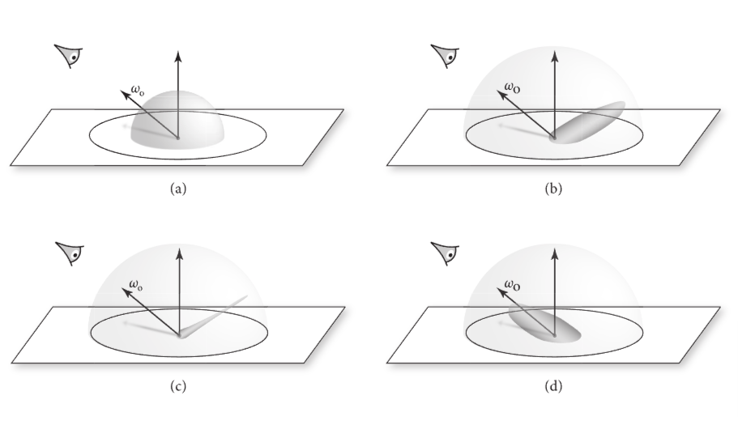
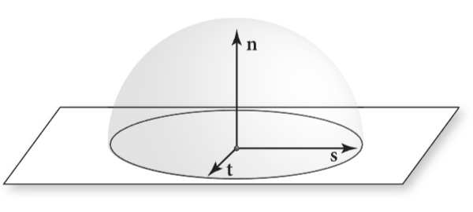

# 9 反射模型

本章定义了一组类，用于描述光线在表面的散射过程。回顾4.3.1.我们介绍了双向反射分布函数(BRDF), BRDF抽象了光在表面的反射现象，BTDF(双向透射分布函数)用来描述表面上的透射现象，BSDF(双向散射分布函数)结合了前面两者的现象。在本章中，我们会从定义一个通用接口开始，来对表面反射和透射函数做接口化。

表面的反射模型来自于以下几个原因:

1. 已被测出的数据：很多现实中表面的反射分布属性已经在实验室中被测出。这些数据用表格形式列出，可以被直接使用，或者可以用一组基本函数计算出相关系数。
2. 现象学模型：用于描述现实世界中表面性质属性的方程，可以用于以假乱真的模拟它们。这种类型的BSDF特别容易被使用，虽然它们有一些靠直觉得出的参数，用于模拟某种表面的表现(比如 粗糙的)
3. 仿真模拟：有时，某种材质的组成在微观层面是已知的。例如：我们可能知道，油漆是由一些均等大小的，浮在介质中的带颜色的颗粒组成，或者某种特定的纤维，由两种已知反射率的线组成。在这种场景下，预处理可以模拟光在这种微结构下的表现，来满足某个近似的BSDF。另一种方式是，当渲染时再进行模拟。
4. 物理中的(波动)光学: 一些反射模型已经推导到光更精细的模型，把其视作波，然后用Maxwell的方程来计算结果，用来看在某种已知属性的表面上如何发生散射。主要使用在场景中包含了微观尺度下的几何细节的时候，比如在数字光学数据存储比如CD和DVD上的薄膜，图层和周期性结构上，这种方式让波动光学表现更加明显。
5. 几何光学： 与仿真模拟类似，若表面在微观尺度上的散射和几何属性是已知的，那么从这些描述里有时就可以直接推导出一个闭合反射模型。几何光学让光与表面的交互过程的建模更加可跟踪，虽然波动效应比如衍射等的复杂性会被忽略。

> 闭合反射模型: 即此模型的计算方程中的项是有限的，且包含有限个标准运算(加减乘除，开根求幂等等)

本章会讨论由这些相关理论得来的各种模型的实现。也可参考14.3，那章介绍了基于在带层次的材质中的光的散射模拟。在本章末尾“扩展阅读”中，给出了各种额外的反射模型。

表面的外观其中一个重要的因素就是表面上反射和透射效应在空间中的变化。第十章中的纹理和材质类会着重讲解这些问题，故在此章的抽象，只会考虑表面某点的散射效果。此外BRDF和BTDF只对光进入和离开表面时的散射效果建模。对于要表现带次表面的表面的光的传播，有一个更完善的模拟，这种模拟把光在材质里面的散射作用模拟出来了，这种方式时必要的，比如利用体积光线传播算法来达成，详见第14章

基本术语:

现在我们来介绍基本的术语，用于描述表面的反射现象。为了对比视觉上的表现结果，我们会分类为以下4个类型：漫反射(diffuse)，抛光(glossy)镜面，完美镜面,和逆反射。大部分真实的表面是由这四种表现混合起来的。漫反射表面均匀地在所有方向散射。虽然在物理上无法实现完美漫反射表面，比如近漫反射表面包括暗淡的黑板和哑光油漆。抛光表面比如塑料或者高光油漆，把光在某个反射方向上更多地散射出去，在其他方向上的反射，就看起来很模糊。完美镜面表面把入射光散射到一个方向。镜子和玻璃就是完美镜面反射的例子。最后，类似绒布，或者月亮这样的逆反射表面，把光主要以入射光相反的方向散射。下图展示了这四种情况的表现:



图9.1 表面反射可以根据从入射方向到反射光方向的分布来归类:(a) 漫反射 (b) 抛光镜面 (c) 近完美镜面 (d) 逆反射

给出了反射的特定类型，反射分布函数可能是各向同性或各项异性的。对于各项同性的材质，若你在面上选择了一个点，然后把法线作为轴进行旋转，光的反射分布不会变。漫反射材质例如纸张和墙面油漆一般就是各向同性的，因为木头纤维或油漆颗粒在方向上是随机排列的。

反之，各向异性材质在沿着法线旋转时，反射不同数量的光。比如头发和各种布料。铣削、轧制、挤压和 3D 打印等工业过程也能生产高度各向异性的表面，一个极端的粒子就是拉丝的金属。

## 9.1 BSDF的表示

在pbrt中有两种表示BSDF的组件，BxDF接口和它的实现类(在9.1.2章节描述)，和BSDF类(在9.1.5描述)。前者对表面的散射类型建模，后者对特定BxDF的实现做封装。
BSDF类也聚焦于让函数通用化，让BxDF的实现类不需要单独去操作，并且它记录了表面的局部的几何属性的信息。

### 9.1.1 几何上的设置和约定

在pbrt中的反射计算是在一个反射坐标系统中执行，这个坐标系统有2个垂直向量和法线向量，这三个向量分别与x,y,z对齐。所有方向的向量传给BxDF并从这里返回，BxDF会在相应的坐标系统中进行计算和采样。为了理解BxDF的实现，理解这个坐标系统是很重要的。

章节3.8介绍了一系列工具函数，比如SinTheta(), CosPhi()等，这些函数能高效地计算单位向量在匹配本章准则的笛卡尔坐标系下的三角函数。它们会在本章大量使用，比如在大部分反射模型中处于核心角色的仰角的余弦值。



图9.2 基本的BSDF坐标系的设置。 这个着色坐标系统是由互相正交的基本向量$(\vec{s},\vec{t},\vec{n})$所定义。我们会让这些坐标与x,y,z轴对齐。在渲染空间中的方向向量$\omega$会在调用任何BRDF或BTDF前转换为着色坐标系的值。

我们时常发现，在BSDF坐标系中关于表面的法线上，检查两个向量是否在同一个半球面上是很有用的，SameHemisphere()函数就用于此目的:

<<球面几何体的内联函数>>

```c++
bool SameHemisphere(Vector3f w, Vector3f wp) {
    return w.z * wp.z > 0;
}
```

> 这个函数在vecmath.h里

当阅读本章代码和要在pbrt中添加BRDF和BTDF时，还有一些准则值得记住:

- 入射光方向$\omega_i$和出射观察方向$\omega_o$都是归一化的，并且被转换到局部的坐标系后，是指向表面外侧的。换句话说，这些方向不是对光的物理传播的建模，这种方式是为了方便在双向渲染算法中进行计算，这些方向与物理上的光传播方向是相反的。
- 在pbrt中，表面法线$\vec{n}$总是指向物体的外侧，这样做方便确定光是否进入，或者透射出了某个物体，若入射光方向$\omega_i$与$\vec{n}$的在同一个半球面，那么光是进入的，否则，就是离开物体的光。因此，法线可能在表面的反面上，而不是$\omega_i$和$\omega_o$中的一个或二者在一个半球面上。不像其他的一些渲染器，pbrt不会翻转法线方向，来与$\omega_o$同侧

### 9.1.2 BxDF接口

BxDF类是为每个独立的BRDF,BTDF定义接口，位置在base/bxdf.h

<<BxDF的定义>>

```c++
class BxDF
    : public TaggedPointer<
          DiffuseBxDF, CoatedDiffuseBxDF, CoatedConductorBxDF,
          DielectricBxDF, ThinDielectricBxDF, HairBxDF, MeasuredBxDF,
          ConductorBxDF, NormalizedFresnelBxDF> {
  public:
    <<BxDF Interface>> 
};
```

BxDF接口提供了一个方法来查找材质的类型，在13到15章中的一些光传播算法用来定制它们的表现。

<<BxDF接口>>

```c++
BxDFFlags Flags() const;
```

BxDFFlags枚举列出来之前提到的分类，也会在透射中区分反射类型。注意，在这个类里，逆反射被视为抛光反射

<<BxDFFlags的定义>>

```c++
<<BxDFFlags Definition>>= 
enum BxDFFlags {
    Unset = 0,
    Reflection = 1 << 0,
    Transmission = 1 << 1,
    Diffuse = 1 << 2,
    Glossy = 1 << 3,
    Specular = 1 << 4,
    // <<混合的BxDFFlags定义>> 
};
```

这些常量也能用二元or操作符结合起来，来区分同时有多种特征的材质。通常情况下使用的混合材质,名字也会混合，如下:

<<混合的BxDFFlags定义>>

```c++
DiffuseReflection = Diffuse | Reflection,
DiffuseTransmission = Diffuse | Transmission,
GlossyReflection = Glossy | Reflection,
GlossyTransmission = Glossy | Transmission,
SpecularReflection = Specular | Reflection,
SpecularTransmission = Specular | Transmission,
All = Diffuse | Glossy | Specular | Reflection | Transmission
```

一些工具函数封装了测试各种特征的标识的逻辑

<<BxDFFlags的内联函数>>

```c++
bool IsReflective(BxDFFlags f) { return f & BxDFFlags::Reflection; }
bool IsTransmissive(BxDFFlags f) { return f & BxDFFlags::Transmission; }
bool IsDiffuse(BxDFFlags f) { return f & BxDFFlags::Diffuse; }
bool IsGlossy(BxDFFlags f) { return f & BxDFFlags::Glossy; }
bool IsSpecular(BxDFFlags f) { return f & BxDFFlags::Specular; }
bool IsNonSpecular(BxDFFlags f) {
    return f & (BxDFFlags::Diffuse | BxDFFlags::Glossy); }
```

BxDF对象的核心方法是f(),这个方法根据给定的一组向量，来返回分布函数的值。这组向量必须是以本地的反射坐标系描述的。

这个接口隐式地假设了光在不同波长下是独立的，在一个波长下的能量不会在另外一个波长下反映出来。在这种条件下，反射的效应可以被描述为每个波长的因子以SampledSpectrum的形式返回。那种会把波长之间的能量分布开来的荧光材质可能需要这个方法返回一个$n \times n$的矩阵，来表示在n个SampledSpectrum对象的光谱样本中传递。

BxDF的实现类，既不在构造器，也不在方法中被告知特定波长与SampledSpectrum的关联，因为它们不需要这个信息

<<BxDF的接口>>

```c++
SampledSpectrum f(Vector3f wo, Vector3f wi, TransportMode mode) const;
```

这个函数也会取TransportMode枚举，用来检测出射方向是面对相机还是面对光源(并且对应入射方向是否相反)。对于处理某处的散射是非对称方向的时候，这种处理是必要的。这个小知识点会在9.5.2讨论

BxDF也必须提供一个方法，利用重要性采样来从某个与散射函数图像近似的分布中，找到一个方向。这不仅对于光传播方程里的蒙特卡洛积分的效率很重要，而且对某些BSDF来说是唯一的计算方法。比如，完美镜面物体，比如镜子，玻璃或者水，只从某个入射方向散射光到某一个出射方向。这种BxDF用狄拉克delta分布来完美描述(详见9.1.4)。对于光散射到单个方向的场景，没有例外。它们的f()和PDF()方法总是返回0

Sample_f()的实现应该确定在给定出射光方向$\omega_o$时确定入射光$\omega_i$,并且为这组方向返回BxDF的值。
它们通过uc,和u参数，在[0,1)中，取三个均匀样本。实现类们可以随意使用，然而，一般来说使用一维样本uc来从不同的散射类型中选择，二维样本来选择一个特定方向。若使用uc和u[0]来选择一个方向，可能会导致比使用u[0]和u[1]1得到的结果更差，故uc和u[0]结合的分布不必太好。不是所有的样本值需要被使用，并且需要额外样本值的BxDF必须自己生成(比如在14.3章节中讲到的LayeredBxDF)

注意某个可能反直觉的方向约定：出射方向$\omega_o$给定后，然后实现类采样了一个入射方向$\omega_i$。本书中的蒙特卡洛方法构造了一条反向的光线路径，即是说，与传输的量(辐射量，重要性)相反的方向

> 为了配合蒙特卡洛光线追踪算法的逆向路径生成方式，这样可以更有效地进行采样和光线追踪计算

这个方法的调用者必须准备处理采样失败的情况，这种情况下会返回一个没设置值的optional对象

<<BxDF的接口>>

```c++
pstd::optional<BSDFSample>
Sample_f(Vector3f wo, Float uc, Point2f u,
         TransportMode mode = TransportMode::Radiance,
         BxDFReflTransFlags sampleFlags = BxDFReflTransFlags::All) const;
```

样本的生成能通过sampleFlags参数(可选),把效果限制在反射或者透射。在不合理的场景下，采样会失败，比如：若调用者在一个不透明表面上请求了一个透射的样本

<<BxDFReflTransFlags的定义>>

```c++
enum class BxDFReflTransFlags {
    Unset = 0,
    Reflection = 1 << 0,
    Transmission = 1 << 1,
    All = Reflection | Transmission
};
```

若采样成功，这个方法返回一个BSDFSample,包含了BSDF f的值，采样方向wi,和它的关于立体角的PDF，BxDFFlags实例用于描述特定样本的特征。BxDF应该定义基于反射坐标系的方向wi，虽然BSDF::Sample_f会在返回前，把这些方向转换成渲染空间。

一些BxDF的实现(比如14.3章提到的LayeredBxDF)会通过仿真生成样本，然后跟随一个随机的光线路径。逃逸的路径的分布是精确的概率分布，但是返回的f和pdf只与真实值成比例。(还好，是成比例的!)这种情况需要在光线传播算法中做特殊的处理，并且这种亲口光通过pdfIsProportional来检测。对于本章所有的BxDF，都能默认设为false

<<BSDFSample的定义>>

```c++
struct BSDFSample {
    <<BSDFSample Public Methods>> 
    SampledSpectrum f;
    Vector3f wi;
    Float pdf = 0;
    BxDFFlags flags;
    Float eta = 1;
    bool pdfIsProportional = false;
};
```

<<BSDFSample的public方法>>

```c++
BSDFSample(SampledSpectrum f, Vector3f wi, Float pdf, BxDFFlags flags,
           Float eta = 1, bool pdfIsProportional = false)
    : f(f), wi(wi), pdf(pdf), flags(flags), eta(eta),
      pdfIsProportional(pdfIsProportional) {}
```

一些实用方法可以通过之前提到的函数，比如BxDFFlags::IsReflective()，来查询样本的特征

<<BSDFSample的public方法>>

```c++
bool IsReflection() const { return pbrt::IsReflective(flags); }
bool IsTransmission() const { return pbrt::IsTransmissive(flags); }
bool IsDiffuse() const { return pbrt::IsDiffuse(flags); }
bool IsGlossy() const { return pbrt::IsGlossy(flags); }
bool IsSpecular() const { return pbrt::IsSpecular(flags); }
```

PDF()方法根据给定的一对方向返回PDF的值，这种方式对于类似多重重要性采样的方法来说很有用。多重重要性采样为了包含一个给定的样本，用多种方式的可能性做对比。

<<BxDF的接口>>

```c++
Float PDF(Vector3f wo, Vector3f wi, TransportMode mode,
          BxDFReflTransFlags sampleFlags = BxDFReflTransFlags::All) const;
```

### 9.1.3 半球面上的反射率

BxDF的方法介绍了以后，就可以实现计算一个BxDF对象的反射率了，计算方法是根据方程4.12和4.13来在反射率上应用蒙特卡洛估计。

BxDF::rho()计算反射率函数$\rho_{hd}$。 这个方法的调用者要负责确定获取样本的数量，并且提供一个均匀采样值用来计算估计值。因此，调用者拥有对采样和返回的估计值的质量的控制权。

<<BxDF方法的定义>>

```c++
SampledSpectrum BxDF::rho(Vector3f wo, pstd::span<const Float> uc,
                          pstd::span<const Point2f> u2) const {
    SampledSpectrum r(0.);
    for (size_t i = 0; i < uc.size(); ++i) {
        <<Compute estimate of >> 
    }
    return r / uc.size();
}
```

每一项的估计式子

$$
\frac{1}{n}\sum_j^n\frac{f_r(\omega, \omega_j)|\cos \theta_j|}{p(\omega_j)}
$$

就很容易估计出来了

<<计算$\rho_{hd}$的估计值>>

```c++
pstd::optional<BSDFSample> bs = Sample_f(wo, uc[i], u2[i]);
if (bs)
    r += bs->f * AbsCosTheta(bs->wi) / bs->pdf;
```

半球-半球的反射率在第二个BxDF::rho()方法，这个方法计算狮子4.13，与上一个rho()方法一样，调用者要负责传入一个均匀采样的值，在这种情况下，需要五个参数才够。

<<BxDF的方法定义>>

```c++
SampledSpectrum BxDF::rho(pstd::span<const Point2f> u1,
        pstd::span<const Float> uc, pstd::span<const Point2f> u2) const {
    SampledSpectrum r(0.f);
    for (size_t i = 0; i < uc.size(); ++i) {
        <<Compute estimate of rho hh>> 

    }
    return r / (Pi * uc.size());
}
```

我们的第一个实现类均匀地在半球上采样第一个向量$\omega_o$，给出了这个量，就可以用BxDF::Sample_f()来采样出来。

<<计算$\rho_{hh}$的估计值>>

```c++
Vector3f wo = SampleUniformHemisphere(u1[i]);
if (wo.z == 0)
    continue;
Float pdfo = UniformHemispherePDF();
pstd::optional<BSDFSample> bs = Sample_f(wo, uc[i], u2[i]);
if (bs)
    r += bs->f * AbsCosTheta(bs->wi) * AbsCosTheta(wo) / (pdfo * bs->pdf);
```

### 9.1.4 BSDF的delta分布

### 9.1.5 各种BSDF

## 9.2 漫反射

## 9.3 镜面反射和透射

## 9.4 导体的BRDF

## 9.5 电导体的BSDF

## 9.6 使用微表面理论测量粗糙度

## 9.7 粗糙的电导体的BSDF

## 9.8 Measured BSDFs

## 9.9 毛发的散射效果
