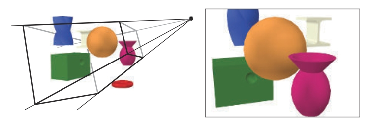
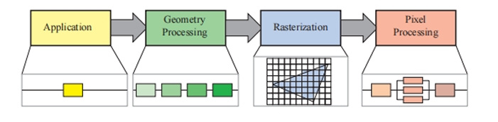
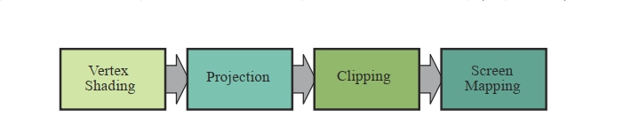

= 第二章 图形渲染管线

[quote,匿名]
一条链子的坚固程度取决于最薄弱的一环

本章呈现了实时图形中的核心部分，他们被称为 *__图形渲染管线__*, 简称为 *__管线__*。管线的主要功能是在给定了一个虚拟相机，三维物体，光源等的条件下，生成或__渲染__出一个二维的图像。因此，渲染管线是实时渲染最根基的工具。使用管线的处理过程如图2.1。图中物体的位置和形状是由他们的几何特征，环境特征，和相机摆放在这个环境的位置决定的。物体的外观是由材质属性，光源，纹理(即应用于物体表面的图片)，和着色方程所影响。

.在左侧的图片中，虚拟相机位于金字塔的顶端(四条线段的交汇处)。物体只有在这个可视体内的部分才会被渲染。对于一个在某个视角下渲染后的图片(类似此例)， 这个可视体是一个frustum(视锥体)(复数形式: frusta),即：一个有者矩形底且顶部被截断的金字塔的形状。右侧的图片展示了相机会"看到"的图像。可注意到左图中红色圈状的物体没有在右图中被渲染出来，因为其位于可视体外。而且，左图中扭曲的蓝色棱柱被视锥体的上平面裁剪了
[#fg2_1,caption="图2.1: "]

比起介绍渲染管线中不同阶段的实现，我们会更侧重于介绍其功能。每个阶段的具体应用会在后续章节详述。

.学到了
****
[plantuml]
....
@startmindmap
*:graphics rendering pipeline
图形渲染管线;
** 输入
*** 相机
**** 位置
**** view volumn：视景体/可视体
***** frustum(复:frusta)：视锥体
*** 三维物体
**** 位置
**** 网格
**** 材质
**** 纹理
*** 光源
**** 位置
**** 着色方程
** 输出
*** 图像
@endmindmap
....
****

== 2.1 架构

在现实世界中，管线这个概念会以不同形式体现出来，工厂里的组装管线如此，快餐店厨房也如此，在图形渲染中，亦如此。一个管线包含了若干阶段，其中的每个阶段执行任务的一部分。

管线的这些阶段是并行的，每个阶段依赖于上一阶段的结果。理想情况下，一个非管线化的系统可被分割为n个管线化的阶段，可提速n倍。对性能的提升就是使用管线的主要原因。例如：大量的三明治可以用一系列人员来快速准备出来，一个人准备面包，另一个人加肉，另一个人加配料。每个人把结果按顺序传递到下一个人，然后立即开始下一个三明治的工作。若每个人需要20秒来执行他们的工作，那么一个三明治的最大速率就是20秒/个，即一分钟3个是可能的。管线中的这些阶段都是并行执行的，但是会等待最慢的那个阶段完成以后才能继续执行。比如，若加肉的阶段变得更复杂，需要30秒。那么最佳速率会变成1分钟2个。在这个管线中，加肉的阶段就是__瓶颈__，因为此阶段决定了整个生成过程的速度。加配料的阶段被称为__饥饿的__(顾客也如此)，此阶段需要等待加肉阶段完成。

在计算机中的实时图形语境下，也可找到此类管线的结构。实时渲染管线可粗分为四个主要阶段————__应用阶段，几何处理阶段，栅格化阶段，像素处理阶段__，如图2.2，在计算机实时图形程序里，此结构是渲染管线的核心，因此，也是后续章节讨论的重要基础。

.渲染管线的基础结构包括四个阶段：应用，几何处理，光栅化，和像素处理。其中的每个阶段本身，也可以是一个管线，比如图中的几何处理阶段，或者可能是(部分)并行化的，比如图中的像素处理阶段，在此图中，应用阶段是一个单独的过程，但是也可被管线化或并行化。可注意到，光栅化会找到比如一个三角形图元中的像素点
[#fg2_2,caption="图2.2: "]

每个阶段通常自身也是一个管线，意味着其中包含数个子阶段。我们把功能性的阶段和其实现的结构区别开了。功能性的阶段有具体要执行的任务，但是没有指定这个任务的实现方式。某种实现方式可能是把两个功能性的阶段合并到一个硬件处理单元执行，或在可编程核心中执行。同时，也可把更耗时的功能性阶段分给数个硬件处理单元来执行。

渲染速度可用__每秒帧数(frames per second)__(FPS)来表示，即每秒渲染完成的图片数。也可用__赫兹(Hertz)__(Hz)表示，记为秒的倒数，即图片更新的频率(60FPS=60Hz,即1/60秒刷新一帧)，直接标记刷新时间也是常见的，单位是毫秒(ms),代表渲染一个图片经过的时间。生成一个图片的时间通常是变化的，取决于每帧计算的复杂程度。FPS用于表示特定帧的速率，也可表示某段时间的平均性能。像显示器之类的硬件上用的是赫兹，数值一般是固定的

应用阶段正如其名，是由应用驱动的，因此一般是用软件实现并在通用CPU上运行。这些CPU一般包含数个核心，这些核心可并行执行多个线程。这让CPU可以高效执行一应用阶段里的大量任务。传统上一般在CPU执行的任务包括碰撞检测，全局加速算法，动画，物理模拟，等等，这取决于应用的类型。下一个阶段是__几何处理阶段__，此阶段处理变换，投影，和其他几何处理相关的操作。此阶段会计算出绘制什么，如何绘制，在哪绘制。阶段一般是在GPU上执行,GPU上包含许多可编程的核心，还有许多固定功能的硬件。__光栅化__阶段一般会取输入其中的三个顶点，组成一个三角形，并且找到在这个三角形里的像素点，然后把结果转交到下一阶段。最后，__像素处理阶段__会为每个像素点执行一个程序，来决定这个像素点的颜色，并且可能执行深度测试，来看此点是否可见。此阶段也可执行逐像素的操作，比如把之前的颜色与新计算出来的颜色做混色。光栅化和像素处理阶段都由GPU处理。所有这些阶段及其内部的管线会在后续四个章节讨论。关于GPU如何处理这些阶段的细节会在第三章给出

== 2.2 应用阶段

开发者能够完全控制在应用截断的操作，故一般是在CPU上执行。因此，开发者能完全决定实现方式，并且可在之后修改以便优化性能。此处的变动也会影响后续截断的性能。比如，一个应用阶段的算法或设置可能减少需要渲染的三角形的数量。

尽管如此，一些应用的工作也可以用GPU的里的一种模式执行，这种模式称为__计算着色器__。此模式把GPU看作高度并行化的通用处理器，忽略专为图形渲染而特设的功能。

在应用阶段的结尾，要被渲染的几何体(即渲染图元，如：点，线段，三角形)会被传到几何处理阶段，这些几何体可能最终会被显示到屏幕上(或要用到的任意设备)。这就是应用阶段最重要的任务

此阶段由于基于软件实现，其结果就是不会被拆分为多个子阶段，后三个阶段则反之。然而，为了提升性能，此阶段通常是在多个处理器核心上以并行方式运行的。在CPU的设计中，这被称为__超标量__结构，因此可以在同一个阶段同时执行处理操作，在章节18.5展示了多核处理器的各种方法

此阶段里常见的处理操作就是__碰撞检测__，当两个物体之间检测到碰撞，会生成一个响应，并发送回被碰撞的物体，还会发送回力反馈设备(若有)。应用阶段也是处理输入设备的地方，如键盘，鼠标，头戴式显示器。加速算法，比如特定剔除算法(见19章)，也是在此阶段实现的，还包括其他在管线中无法进行的操作。

== 2.3 几何处理阶段

GPU上的几何处理阶段负责大部分逐三角形核逐顶点的操作。这个阶段会被再分为下列功能性的阶段：顶点着色，投影，裁剪，和屏幕映射。

.几何处理阶段分成多个功能性阶段组成的管线
[#fg2_3,caption="图2.3: "]

=== 2.3.1 顶点着色

