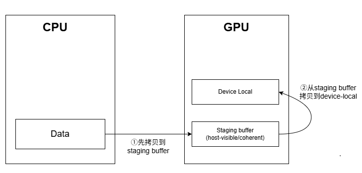
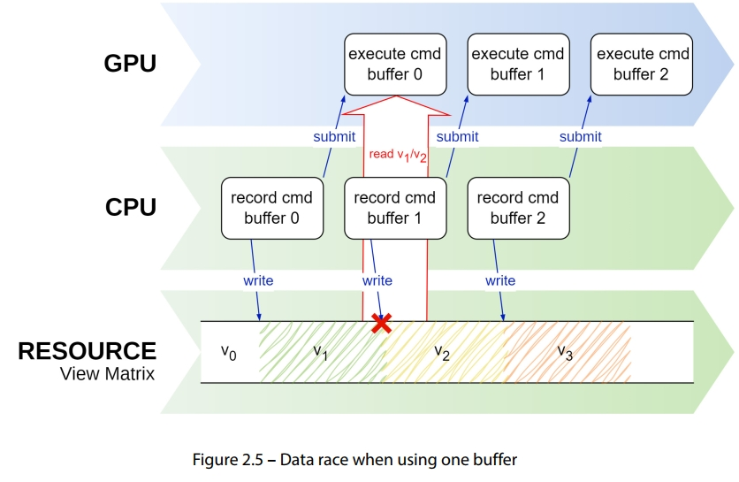
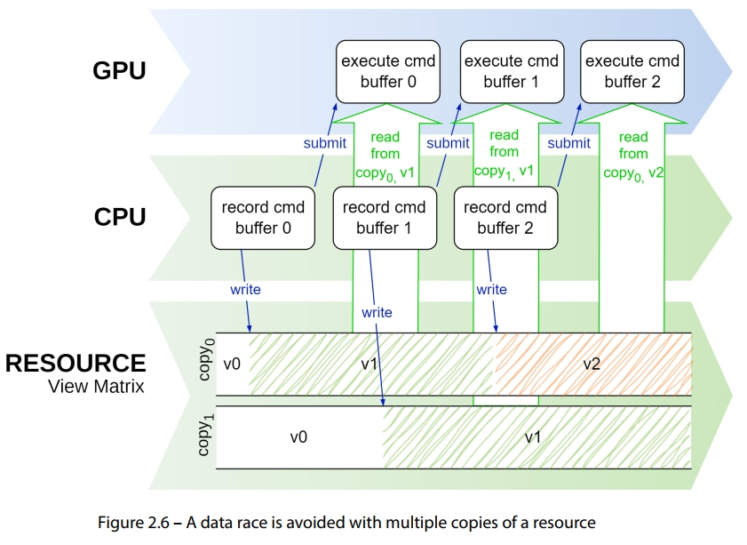
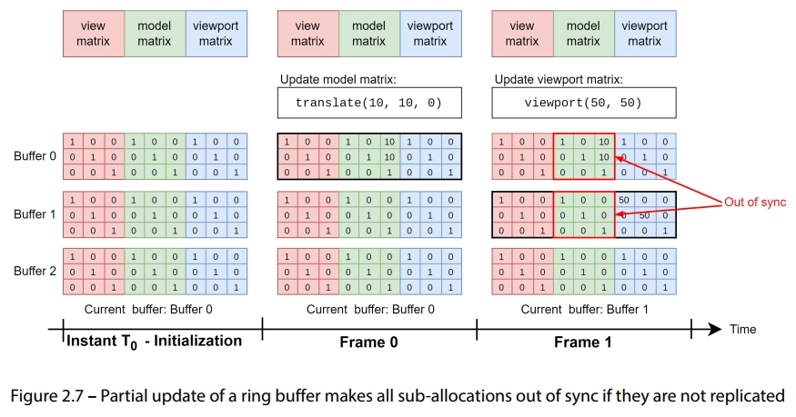
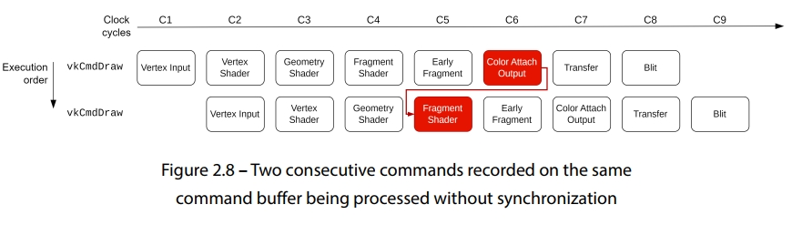
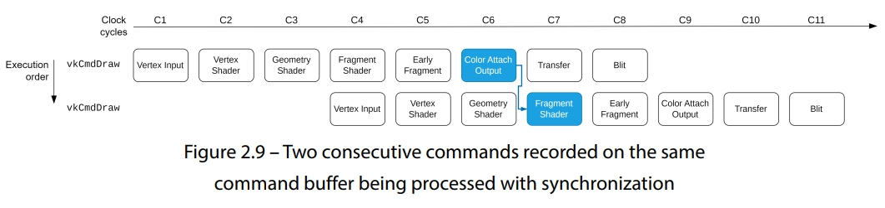
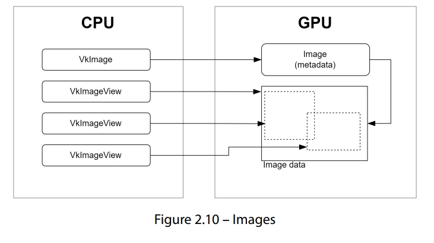

= 现代Vulkan的使用

== 理解Vulkan的内存模型

内存分配和管理在vulkan中至关重要，因为Vulkan几乎不会管理内存的使用细节。除了决定要分配的确切内存地址外，其他的细节是由应用程序自己负责。这代表着程序员必须管理内存的类型，大小，和对齐，及其附属的分配操作。这种方式给予了app在内存管理方面更多的控制能力，并且允许开发者根据特定的用途来优化他们的程序。这份菜单会提供关于由API提供的内存类型的一些基本信息，也包括了一份关于如何分配和绑定这些内存到资源上的总结

[NOTE]
====
vulkan只负责决定内存地址的分配，app需自己负责内存管理，包括内存的类型，大小，对齐等
====

=== 准备

显卡里有两个变量: integrated(集成)和discrete(独立),集成显卡与CPU共享内存，如图2.1

image::img/fg2_1.png[图2.1]

独立显卡拥有自己的内存(即device内存)，与主内存(即host内存)是分开的，如图2.2

image::img/fg2_2.png[图2.2]

vulkan提供了不同的内存类型:

* Device-local内存: 此类型的内存针对GPU进行优化，属于device自己的，一般来说比host可见的内存要快，但是不能被CPU访问。一般来讲，类似渲染目标(render target), 图像存储, 和buffer都存到此处
* Host-visible内存: 此类型的内存可同时被GPU, CPU访问，一般来讲慢于device-local,但是允许数据在GPU和CPU之间高效传输，对于非集成GPU，从GPU读取到CPU的过程发生于PCI-E通道。一般来说，要先设置staging buffer,这里会存入将要传输给device-local内存里的数据，还有uniform buffer，这部分缓冲会在app中频繁更新
* Host-coherent内存: 此类内存类似host-visible内存，但是提供了GPU和CPU的内存一致性，比起上述两种内存类型更慢，但是对于要存储频繁在CPU和GPU中更新的数据来说很有用

[NOTE]
====
. Vulkan的三种内存类型:
.. device-local: 最快, device自己的内存，一般用来存render target, image, buffer, 不能被CPU直接访问
.. host-visible: 次快, CPU,GPU都可访问， 可用来做staging buffer和uniform buffer
.. host-coherent: 最慢, 可保证CPU/GPU的内存一致性
====

=== 如何做

创建和上传数据到buffer的一般步骤如下:

image::img/fgo_ch2_1.png[]

如你所见，这个过程比较繁琐，可用VMA库来简化实现，这是个开源库，为vulkan提供了便利且高效的内存管理方式，为内存的分配提供了高层接口，对复杂的细节进行的抽象，可让你从繁琐的手动内存管理中解脱出来。

== VMA库的初始化

为了使用VMA，首先，你需要创建这个库的实例，并且用VmaAllocator类型的句柄存下来。为了创建这个实例，需要vulkan的physical device和device

[NOTE]
====
也就是说: VMA是用来简化vulkan内存管理的，VMA实例的创建要在VkDevice创建完成后进行
====

=== 如何做

创建一个VMA库的实例需要实例化两个结构体:
* 指向Vulkan API函数的指针，VMA用来找到其他函数的指针
* vulkan的physical device, device, instance的句柄

[NOTE]
====
创建的代码片段参考原书或原书附带的代码(在github上)
====

这个分配器需要指向一些Vulkan函数的指针，以便其可根据你想要的特性来运行。在前例中，我们只提供了最小化的分配和释放内存的功能。分配器需要在context销毁时，使用vmaDestroyAllocator进行销毁

== buffer的创建

Vulkan中的buffer就是一个内存区块，里面有一些数据，这些数据可以是顶点，索引，uniform(全局数据)等等。buffer对象就是这个内存区快及其数据的抽象。与buffer关联的内存是在buffer创建后分配的

[NOTE]
====
buffer对象就是指一个内存区块及其里面的数据， 真正的内存分配是在buffer创建后才进行
====

[%header, cols=3*]
|===
|Buffer类型
|访问类型 
|用例

|Vertex/Index
|只读
|顶点或索引数据的存储

| Uniform
| 只读
| uniform数据的存储

| Storage
| 读/写
| 通用数据存储

| Uniform Texel(统一(全局)纹素)
| 读/写
| 数据被视作texel

| storage texel(存储纹素)
| 读/写
| 数据被视作texel
|===

buffer的创建很简单，但是上表有助于在创建和设置buffer时，了解buffer的类型和要求有哪些。在本章中，我们会提供一份buffer创建的模板代码

=== 准备

在代码中，Vulkan的buffer是用VulkanCore::Buffer类来管理的，此类提供了创建和上传数据给device的功能，还包括一个工具函数，此函数会是用staging buffer来把数据上传至设备独占的内存堆中

=== 如何做

用VMA创建buffer很简单：

. 创建VkBufferCreateInfo
. 创建VmaAllocationCreateFlagBits
. 调用vmaCreateBuffer
. 如果需要调试或优化，调用vmaGetAllocationInfo获取VmaAllocationInfo

== 把数据上传到buffer

把数据从app上传到GPU里的方式，是根据buffer的类型得来的。对于host-visible的buffer，可直接用memcpy来拷贝内存。对于device-local的buffer，我们需要一个暂存buffer(staging buffer), 这个buffer对于CPU和GPU来说都是可见的。在此菜单中，我们会演示如何从app传输到device-visible的内存中（这种buffer的内存区域在设备上）

=== 准备

如果你看不懂上文，请参考"理解Vulkan的内存模型"这一章节

=== 如何做

数据的上传方式取决于buffer的类型:

. 对于host-visible的内存，使用vmaMapMemory来获取目标内存的指针，然后用memcpy拷贝数据到其上即可。这个操作是同步的，所以已被map了的指针，只要memcpy返回后即可被unmap
当host-visible的buffer创建后立即map其上，除非销毁，否则不再改动这个已map的指针是被推荐的做法，这样做不会导致每次需要更新时，map操作的开销。
. 把数据上传到device-local的内存中，需要两步:
.. 先把数据拷贝到host可见的内存上(staging buffer)
.. 然后从staging buffer拷贝到device-local的内存上，是用vkCmdCopyBuffer,如下图所示，注意，这么做需要有一个command buffer
+

+
. 一旦数据移动到了device中的host-visible buffer(staging buffer), 就可用VkCmdCopyBuffer来把数据从staging buffer拷贝到device-local的内存上

[NOTE]
====
. 如果用host-visible的内存做buffer，那么直接调用vmaMapMemory把指针map到这块内存上，然后memcpy，unmap操作可以在销毁时再做，可减少buffer更新时，重复map/unmap的操作
. 对于device-local类型的内存做buffer,先把数据拷贝到staging buffer(host-visible)，再从staging buffer拷贝到device-local的内存
. 使用VMA时，buffer的分配和map/unmap调用改为使用vma开头的api，其他操作类似
====

== 创建一个staging buffer

创建staging buffer与创建一个普通的buffer类似，但是需要flags设定为host-visible,在此菜单中，我们会展示如何创建一个buffer，来作为staging buffer使用。 这种buffer可以被用作从app传输数据到device-local内存的中转

=== 准备

参考creating buffer这一章节

=== 如何做

VkBufferCreateInfo的usage需要包含VK_BUFFER_USAGE_TRANSFER_SRC_BIT, 因为他需要可以作为vkCmdCopyBuffer指令的数据源

staging buffer最好在你的app里进行封装实现。这个封装类可以对buffer的大小根据情况缩容或扩容。可能对于你的app只需要一个staging buffer就足够了。但是在某些系统架构上，内存的要求可能不一，需要注意。

== 如何使用ring buffer来避免数据竞争

当每一帧的buffer需要更新时，我们可能会遇到数据竞争的风险。如下图所示，数据竞争就是一种场景，在一个程序的多个线程并发访问共享的数据的时机，有至少一个线程正在执行写入的操作。这种并发访问，由于操作顺序的不确定，可导致不可预见的行为。比如，一个uniform buffer存储了view, model和视口的矩阵，并且需要在每一帧进行更新。buffer会在第一个指令缓冲记录时被更新并初始化成v1。一旦指令缓冲在GPU上开始处理，buffer包含了正确的数据：

在第一个在GPU上的指令缓冲开始执行后，app可能会在GPU访问的途中尝试更新buffer的内容，变成v2

[NOTE]
====
就是说，在CPU再往内存写数据时，GPU可能也正在读，有可能会出现GPU没有读到期望的数据，而是CPU后续写的数据(因为GPU真正执行的过程是异步的)
====

=== 准备

同步机制显然是Vulkan中最难的一个方面。若过量使用诸如semaphore, fence,和barrier，那么你的app会变成串行执行的，并且没有发挥CPU和GPU的并行处理的潜力。

确保你也读过第一章的"理解swapchain中的同步机制-fence和semaphore"，那个章节和本章节只介绍了同步机制表面上的处理方法，但是作为起始点来说很不错

ring-buffer的实现是在EngineCore::RingBuffer中，其中包含了一个由多个可配置的下属buffer组成的整体。这个RingBuffer的下属buffer都是host-visible且可保持状态的buffer，就是说，这些buffer会在创建后保持已map的状态，以便于访问buffer中的数据

=== 如何做

有一些方法可避免这个(数据竞争的)问题，但是最简单的一种，是创建一个ring buffer，这个ring buffer里包含几个buffer(或者还有其他一些资源)，buffer的数量与在in flight中的帧的数量一致。图2.6展示了当两个buffer可用时的场景。一旦第一个command buffer已被提交并且正在GPU中处理时，app可以在闲时把buffer的copy1进行处理，这时候copy1还没被device访问到

[NOTE]
====
就是拷贝多份数据(资源)，避免数据竞争
====

即便此方法是一种简单的解决方案，也有一个值得注意的点：如果允许部分更新，就必须在buffer更新时做出处理。考虑图2.图例的ring buffer包含了被部分更新的子区域。这个buffer存储了view, model, viewport的矩阵，在初始化时，三个子区域都被初始化成三个独立的矩阵，在Frame 0，这时buffer 0是启用状态，model矩阵被更新，包含了一个平移(10,10,0)的变换，在下一帧,即Frame 1, Buffer 1变成启用状态，然后viewport矩阵被更新, 由于Buffer 1已被初始化为3个独立的矩阵，只更新viewport矩阵会让buffer0和1不同步(也包括Buffer 3), 为了保证这样的部分数据更新有效，我们需要把最后一个在用的buffer，即Buffer 0 拷贝到buffer 1, 然后再更新viewport矩阵

[NOTE]
====
拷贝多份资源也带来了资源的同步问题，故需要在切换资源副本时，先做同步，把上一次的最新数据拷贝到当前要用的资源副本上，还要用不同的指令缓冲录制和提交指令
====

== 设置管线屏障(pipeline barrier)

在Vulkan中，当指令缓冲被处理时，指令的顺序有可能会根据某些约束被重排，这被称为指令缓冲重排，这种操作通过允许驱动优化指令的执行顺序来优化性能。

好消息是，Vulkan提供了一种叫pipeline barrier的机制来保证每条指令能按正确的顺序执行。这种机制是在指令之间显式设定依赖来使用的，可防止这些指令被重排，并且设定哪些阶段可以同时进行。这个菜单会解释什么是管线屏障，及其属性的含义。同时也会为你展示如何创建和安装管线屏障

=== 准备工作

考虑以下两个绘制指令的调用序列。第一个draw会写入一个颜色附件，这时第二个draw会在fragment shader里，从这个附件里进行采样:

[source, c++]
----
vkCmdDraw(...); // 写入到color attachment 0
vkCmdDraw(...); // 从color attachment 0 读取
----

图2.8可视化了这个过程，展示了这两个指令如何被device所处理。在图中，指令从上至下进行处理，管线执行则是从左往右。时钟周期是一个松散的项，因为这个处理过程可能要多个时钟周期，只是用来表示一般来讲的执行过程的先后顺序

在此例中，第二个vkCmdDraw会在C2开始执行，即在第一个draw的调用之后进行。这个偏移的时间量还不够长，因为第二个绘制指令的调用需要从frament shader的color attachment中读取数据，此时第一个draw指令还没到color attach output的阶段，如果没有同步机制，这种配置就会导致数据竞争:

管线屏障是一种特性，其会被录入到指令缓冲中，用来设定在哪个管线阶段需要执行完屏障前的所有指令，然后才能使指令缓冲继续处理。在屏障前的录入的指令叫做首次同步域或者首次域，在屏障后录入的指令叫做第二次同步域或二次域

屏障也可更加精细化的控制同步过程，只需设定在哪个(管线)阶段的指令必须等待屏障前的指令执行完即可。原因是在二次域的指令不需要等待首次域的指令全部结束才能执行，而是可以根据屏障设定的条件下，尽早执行。

在图2.8的例子中，在首个域中，需要把attachment写入,才能让第二次draw的调用可以访问这个attachment。第二次draw的调用，不需要等第一次draw执行完color attach output阶段才执行，而是可以立即执行，直到fragment阶段的color attach output完成，就可继续

有三种类型的屏障:

. **Memory barriers**: 全局屏障，可被应用于在首个和二次域的所有指令
. **Buffer memory barriers**: 只在buffer上的一部分进行访问的指令上生效，可以指定在buffer的哪部分上生效
. **Image memory barriers**: 这种类型的屏障只在访问某个image的subresource时生效。可以根据mip level，image的区域，或layer数组来添加屏障。这是一个特别重要的屏障类型，因为此屏障也可用作把一个image转换成另一种image的布局时使用。比如，当从某个mip level生成mipmap和按位传输(blitting)时, 每个level需要是正确的布局。之前的level需要是VK_IMAGE_LAYOUT_TRANSFER_SRC_OPTIMAL的布局, 而之后的mip level因为要写入，需要是VK_IMAGE_LAYOUT_TRANSFER_DST_OPTIMAL的布局

[NOTE]
====
* 屏障可以控制指令的执行顺序，屏障是录入到指令缓冲中的，代表品璋前的指令需要全部完成，才能执行屏障后的指令
* 屏障还可以设定是在哪个管线的阶段生效，这样可以最大化并行过程，用得好有助于提高性能
* 三种屏障类型区别就在于生效的范围，第一种所有类型，第二种只在buffer的一部分生效，第三种只在image的subresource生效
====

=== 如何做

管线屏障用vkCmdPipelineBarrier指令来录入，可同时提供多种类型的多个屏障。下面的代码片段展示了如何创建一个屏障，用来根据图2.9，在两个draw指令之间添加依赖关系

管线屏障有点晦涩但绝对是Vulkan的基础。确保你理解了它们，并且知道如何操作，然后再阅读后续菜单

== 创建images(texture)

image是用来存储一维，二维或三维数据的，然而大部分是用来存储二维数据。与buffer不同的是，image在内存布局上是做了局部化优化的。这是由于大多GPU具有固定功能的纹理单元或采样器，这些东西从image的纹素数据中读取数据，并且在其上应用过滤器及其他操作，来产出最终的颜色值。image可以有不同的格式，比如RGB, RGBA, BGRA等等

在Vulkan中，image对象只是元数据(metadata)。其数据是分开存储的，创建过程与buffer类似

Vulkan中的image不能被直接访问，只能依赖于image view来访问。image view是一种访问image的一部分数据的方式，其通过设定subresource的范围来实现，也包括aspect(哪一方面的image)(比如color或depth),和mip level,还有array layer的范围

另一个关于image的十分重要的方面就是它们的布局(layout)。其被用于在vulkan中设定某个image资源的用途，比如作为传输操作的源(source)或是目的(destination), 或者用于在渲染中的color或depth附件， 或者作为着色器读写的一种资源。正确的image布局是重要的，因为其保证了GPU能够根据用途来高效访问并操作image的数据。使用错误的image布局会导致性能问题或者渲染的瑕疵，并且也可导致未定义的行为。因此，在Vulkan的app中，正确设定每个image的布局是十分必要的。一般的image布局是未定义的(VK_IMAGE_LAYOUT_UNDEFINED), 颜色附件是(VK_IMAGE_LAYOUT_COLOR_ATTACHMENT_OPTIMAL), 深度/模板附件是(VK_IMAGE_LAYOUT_DEPTH_STENCIL_ATTACHMENT_OPTIMAL), 着色器读是(VK_IMAGE_LAYOUT_SHADER_READ_ONLY_OPTIMAL)。 image的布局转换是在vkCmdPipelineBarrier指令中的一部分

在此菜单中，你会学到如何在某个device上创建image

=== 准备

在VulkanCore::Texture类中，我们封装了关于image和image view复杂的管理过程，提供了对于Vulkan处理纹理的深度的解决方案。从便利高效地上传数据，到image布局和生成mipmap的处理，Texture类使我们可以无缝的集成到Vulkan的例子中

=== 如何做

创建一个image需要一些基础信息，比如type(1D,2D,3D), size, format(RGBA, BGRA等), mip level的数量, layer的数量等(cubemap的面)

[NOTE]
====
* image可用来存储1，2，3维数据，内存是做了局部性优化的，一般用来存储2D纹理信息
* image对象本身只有元数据，实际的数据是分开存储的, 不能直接访问，必须通过image view
* image的布局必须设定正确
====

== 创建一个image view

image view提供了一种根据size, location, format而无关于布局的来解读image的方式。image view需要被显式转换使用image屏障来传输，在此菜单中，你会学到如何在vulkan中创建一个image view

=== 准备

image view通过VulkanCore::Texture类来存储并管理

=== 如何做

创建一个image view很简单，你要做的所有事就是拿到image的句柄，和要代表的image的区域

没有image view，纹理就不能被着色器使用，甚至在image当作颜色附件时，也需要image view

== 创建一个采样器

Vulkan中的采样器不止是一个简单的对象，还是一个介于着色器执行和image数据之间的重要桥梁。除了插值以外，还可以管理过滤操作，寻址模式，和mipmap操作。过滤器代表了在纹素之间的插值法，寻址模式控制坐标系如何与image的尺寸范围做映射。各向异性过滤大幅增强了采样的逼真程度。mipmap，是往下采样后的image的三角级别，也是采样器的另一个方面。简要来说，创建一个采样器涉及到如何把这些image数据的属性和复杂的着色器数据无缝且和谐的组织起来。在此菜单中，你会学到如何创建一个采样器对象

=== 准备

采样器是通过VulkanCore::Sampler类来实现的

=== 如何做

采样器的属性定义了在管线中的一个image的数据如何被解读，一般来说是用在着色器里的数据。处理过程十分简单，初始化一个VkSamplerCreateInfo结构体，然后调用vkCreateSampler即可

采样器是Vulkan中其中一个最简单的对象，也是最容易理解的，因为其描述了计算机图形学中最通用的一些概念

== 为着色器提供数据

从你的app中提供数据，让着色器使用，是Vulkan里最麻烦的事情之一，需要多个步骤，并且顺序和参数要正确。在这个菜单中，会包含几个小菜单，你会学到如何为着色器提供数据，比如纹理，缓冲，和采样器

=== 准备

被着色器消费的资源是用layout关键词来设定的，其带着set和binding的限定词

[source,glsl]
----
layout(set = 0, binding=0) uniform Transforms
{
    mat4 model;
    mat4 view;
    mat4 projection;
} MVP;
----

每个资源都通过binding来代表， set就是一组binding的标识，一个binding不一定只代表一种资源，也可以代表同类型的一组资源

=== 如何做

把资源提供并输入给着色器分为以下多个步骤:

. 使用descriptor set layout设定set和binding，这个步骤不涉及真实的资源，只是设定在set中binding的类型的数目
. 构造一个pipeline layout, 这个对象描述了在管线中用到哪些set
. 创建一个 descriptor pool, 可以提供descriptor set的实例。descriptor pool包含了根据binding类型分组的binding的数量的清单(纹理，采样器， shader storage buffer(SSBO), uniform buffer)
. 使用vkAllocateDescriptorSets从pool里分配descriptor set
. 使用vkUpdateDescriptorSets来把资源进行绑定，这个步骤中，我们会把真实的资源(buffer, texture等)绑定起来
. 在渲染期间，使用vkCmdBindDescriptorSet,把descriptor set及其绑定的资源，绑定到管线上。此步骤使之前绑定好的set和binding可使当前管线中的着色器中可用

下文的菜单会为你展示每一步骤如何做

== 用descriptor set layout设定descriptor

考虑下方的GLSL代码，此代码设定了一些资源:

[source,glsl]
----
struct Vertex {
    vec3 pos;
    vec2 uv;
    vec3 normal;
};
layout(set = 0, binding=0) uniform Transforms
{
    mat4 model;
    mat4 view;
    mat4 projection;
} MVP;
layout(set = 1, binding = 0) uniform texture2D textures[];
layout(set = 1, binding = 1) uniform sampler samplers[];

layout(set = 2, binding = 0) readonly buffer VertexBuffer
{
    Vertex vertices[];
} vertexBuffer;
----

这个代码要求三个set(0,1,2), 所以我们需要创建三个descriptor set layout,在此菜单中，你会学到如何为之前的代码创建descriptor set layout

=== 准备

descriptor set及其bingding是被VulkanCore::Pipeline类所管理。Vulkan中的descriptor set扮演了一个持有各种资源，比如buffer, texture, sampler的容器，这些资源是给着色器使用的。 binding代表了把这些descriptor set与特定的着色器阶段关联的过程，可在渲染时，让着色器和资源之间进行无缝使用。这些descriptor set可视作某种网关，让资源无缝绑定到着色器的阶段上，让数据和着色器执行之间协调的组合到一起。为了更好的协同，这个类简化了descriptor set的创建和管理操作，通过函数去在Vulkan的渲染管线中完成资源的绑定操作

[NOTE]
====
descriptor set代表了一组可被shader使用的同类型的资源的描述，可把资源绑定到特定着色器上
====

== 如何做

descriptor set layout是通过vkDescriptorSetLayout来设定binding(序号，类型)的。每个binding是用vkDescriptorSetLayoutBinding来描述。之前的着色器代码对云国的Vulkan的descriptor set layout的关系如下图2.11

