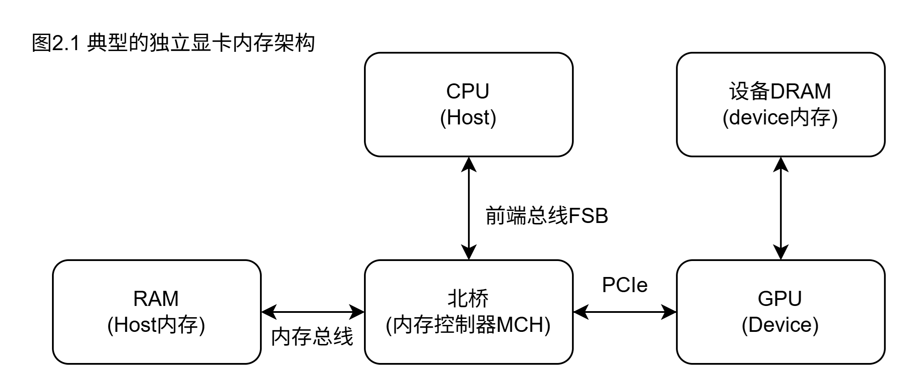
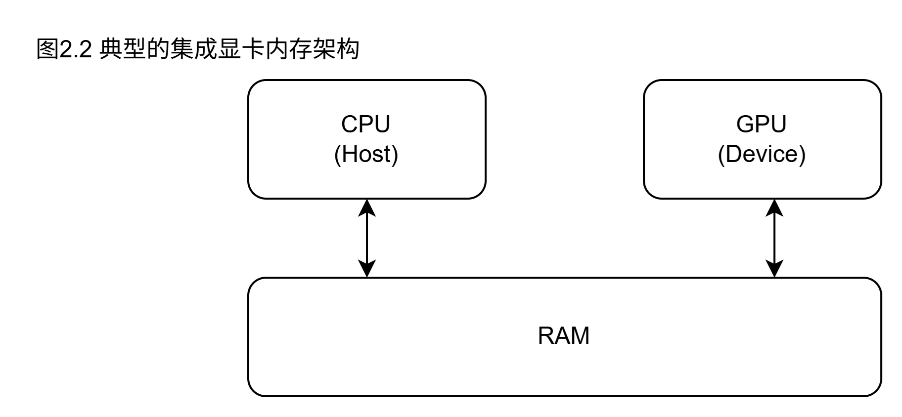
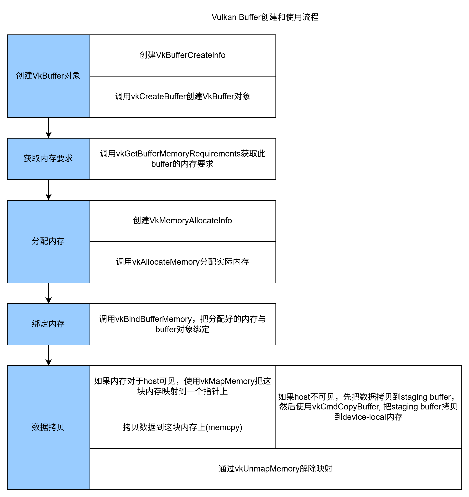

= 现代Vulkan的使用

== 理解Vulkan的内存模型

内存分配和管理在vulkan中至关重要，因为Vulkan几乎不会管理内存的使用细节。除了决定要分配的确切内存地址外，其他的细节是由应用程序自己负责。这代表着程序员必须管理内存的类型，大小，和对齐，及其附属的分配操作。这种方式给予了app在内存管理方面更多的控制能力，并且允许开发者根据特定的用途来优化他们的程序。这份菜单会提供关于由API提供的内存类型的一些基本信息，也包括了一份关于如何分配和绑定这些内存到资源上的总结

[NOTE]
====
vulkan只负责决定内存地址的分配，app需自己负责内存管理，包括内存的类型，大小，对齐等
====

=== 准备

显卡里有两个变量: integrated(集成)和discrete(独立),集成显卡与CPU共享内存，如图2.1

独立显卡拥有自己的内存(即device内存)，与主内存(即host内存)是分开的，如图2.2

vulkan提供了不同的内存类型:

* Device-local内存: 此类型的内存针对GPU进行优化，属于device自己的，一般来说比host可见的内存要快，但是不能被CPU访问。一般来讲，类似渲染目标(render target), 图像存储, 和buffer都存到此处
* Host-visible内存: 此类型的内存可同时被GPU, CPU访问，一般来讲慢于device-local,但是允许数据在GPU和CPU之间高效传输，对于非集成GPU，从GPU读取到CPU的过程发生于PCI-E通道。一般来说，要先设置staging buffer,这里会存入将要传输给device-local内存里的数据，还有uniform buffer，这部分缓冲会在app中频繁更新
* Host-coherent内存: 此类内存类似host-visible内存，但是提供了GPU和CPU的内存一致性，比起上述两种内存类型更慢，但是对于要存储频繁在CPU和GPU中更新的数据来说很有用

[NOTE]
====
. Vulkan的三种内存类型:
.. device-local: 最快, device自己的内存，一般用来存render target, image, buffer, 不能被CPU直接访问
.. host-visible: 次快, CPU,GPU都可访问， 可用来做staging buffer和uniform buffer
.. host-coherent: 最慢, 可保证CPU/GPU的内存一致性
====

=== 如何做

创建和上传数据到buffer的一般步骤如下:

如你所见，这个过程比较繁琐，可用VMA库来简化实现，这是个开源库，为vulkan提供了便利且高效的内存管理方式，为内存的分配提供了高层接口，对复杂的细节进行的抽象，可让你从繁琐的手动内存管理中解脱出来。

== VMA库的初始化

为了使用VMA，首先，你需要创建这个库的实例，并且用VmaAllocator类型的句柄存下来。为了创建这个实例，需要vulkan的physical device和device

[NOTE]
====
也就是说: VMA是用来简化vulkan内存管理的，VMA实例的创建要在VkDevice创建完成后进行
====

=== 如何做

创建一个VMA库的实例需要实例化两个结构体:
* 指向Vulkan API函数的指针，VMA用来找到其他函数的指针
* vulkan的physical device, device, instance的句柄

[NOTE]
====
创建的代码片段参考原书或原书附带的代码(在github上)
====

这个分配器需要指向一些Vulkan函数的指针，以便其可根据你想要的特性来运行。在前例中，我们只提供了最小化的分配和释放内存的功能。分配器需要在context销毁时，使用vmaDestroyAllocator进行销毁

== buffer的创建

Vulkan中的buffer就是一个内存区块，里面有一些数据，这些数据可以是顶点，索引，uniform(全局数据)等等。buffer对象就是这个内存区快及其数据的抽象。与buffer关联的内存是在buffer创建后分配的

[NOTE]
====
buffer对象就是指一个内存区块及其里面的数据， 真正的内存分配是在buffer创建后才进行
====

[%header, cols=3*]
|===
|Buffer类型
|访问类型 
|用例

|Vertex/Index
|只读
|顶点或索引数据的存储

| Uniform
| 只读
| uniform数据的存储

| Storage
| 读/写
| 通用数据存储

| Uniform Texel(统一(全局)纹素)
| 读/写
| 数据被视作texel

| storage texel(存储纹素)
| 读/写
| 数据被视作texel
|===

buffer的创建很简单，但是上表有助于在创建和设置buffer时，了解buffer的类型和要求有哪些。在本章中，我们会提供一份buffer创建的模板代码

=== 准备

在代码中，Vulkan的buffer是用VulkanCore::Buffer类来管理的，此类提供了创建和上传数据给device的功能，还包括一个工具函数，此函数会是用staging buffer来把数据上传至设备独占的内存堆中

=== 如何做

用VMA创建buffer很简单：

