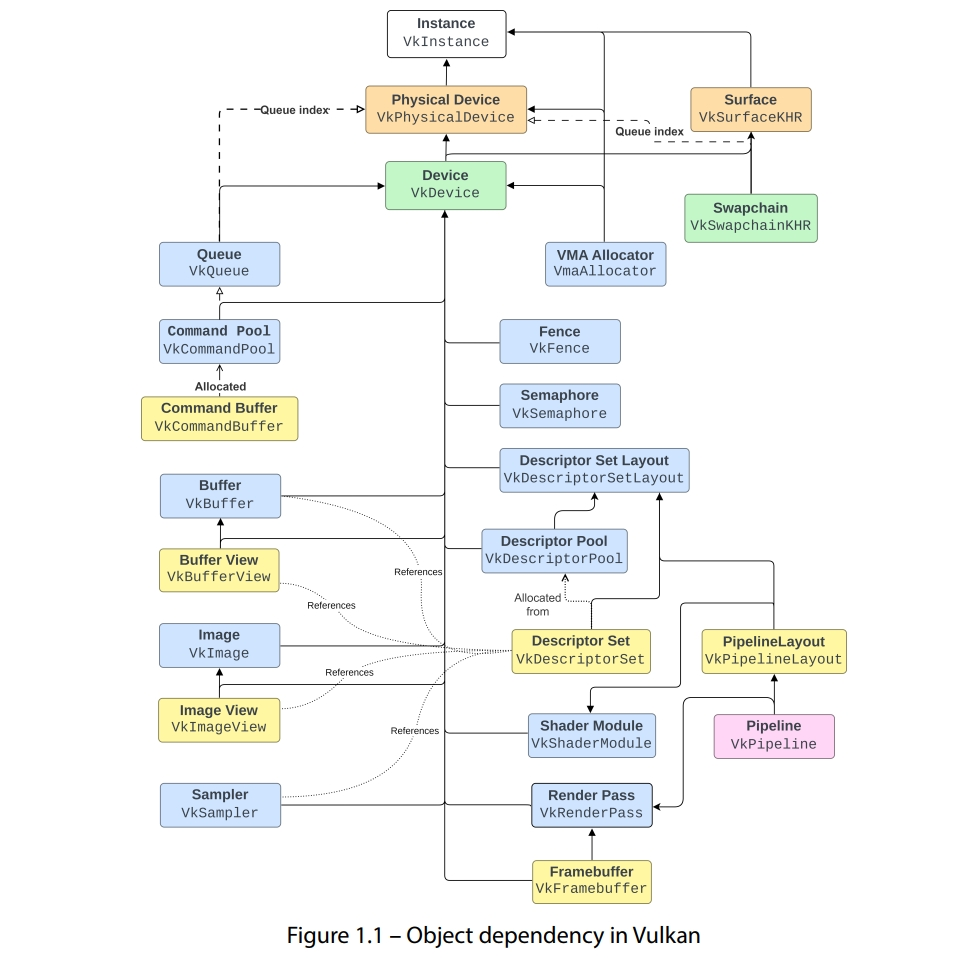

# Modern Vulkan Cookbook

> 随书代码在[这里](https://github.com/PacktPublishing/The-Modern-Vulkan-Cookbook)
>
> 本人代码在[这里](https://github.com/Ryu613/MyVulkanSamples)

1. vulkan对象都以vk开头，对象的创建具有依赖关系，如下图

    
    - 实心箭头是显式依赖：对象需要箭头所指的引用对象，虚线箭头隐式依赖，有逻辑上的依赖关系，但是实际不需要引用对象
    - 箭头样式是折线，代表这个对象是由指向的对象分配出来的
    - 没箭头的，代表可选

2. volk: 对vulkan提供跨平台函数加载支持，使vulkan调用更方便(Vulkan SDK已自带,另一种方式是Vulkan-HPP)
3. vulkan extension提供的API可能只在某些版本有，并且不保证后续版本也有，官方扩展的名字以KHR标记。有些扩展可能官方文档(Vulkan Specification一栏)里没写！
4. 有些核心功能到现在也只是扩展而不是core API。随着版本演进，有些扩展变为core API，有些则还是属于扩展，或是过期或移除
5. 扩展有两个级别，instance级别和device级别。使用extension写代码之前要检查扩展是否可用，要在编译前检查