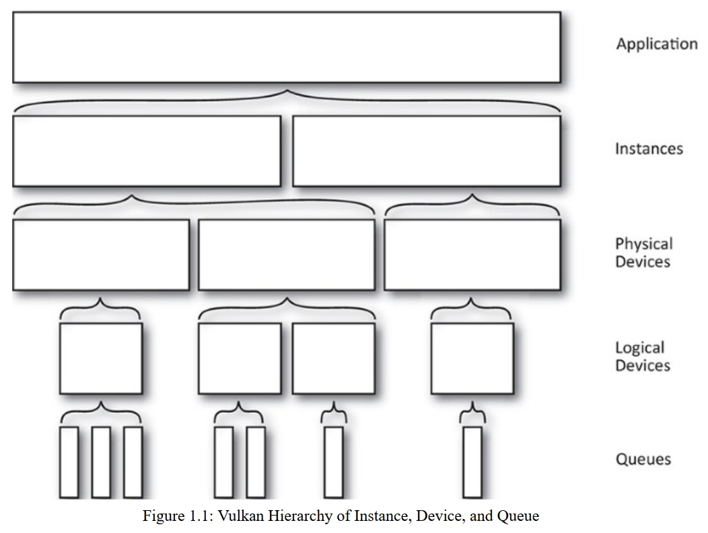

# Vulkan Programming Guide

## 第一章

### 介绍

1. 支持vk的设备一般包括一个处理器和多个固定功能的硬件区块，用来在图形和计算中进行操作加速。设备中的处理器一般有非常多的线程，故在Vulkan里的计算模型重度依赖并行计算。
2. vulkan的设备也可访问内存，且暴露这些内存给开发者。但是这些内存不一定与你用来运行程序的处理器共享。
3. Vulkan的API都是显式的，就是说基本所有操作都由开发者自己负责。
4. 驱动就是一种软件，这种软件把指令和数据形成API，并且把它们转换为某种硬件能理解的形式
5. 传统的API比如OpenGL会帮你检查程序错误，对象状态，管理内存，和同步数据等，比较消耗CPU时间。但是Vulkan把这些工作交给开发者负责，并且把错误检查委托给**层(layer)**了，还得手动设置为启用才生效。
6. Vulkan程序啰嗦且脆弱，但是自由度更高，对设备的操作也可以更细致，可达到的性能上限高
7. Vulkan的设计不仅是作为图形API，其功能被拆分成各种子类别，比如用于拷贝数据的传输类别，用于运行着色器的计算类别，还有图形类别，其包括了栅格化，图元组装，混色，深度，模板测试等常见图形功能。设备对于每个模块的支持都是可选的，甚至呈现层(把图片展示在显示设备上)都是可选的，不在Vulkan的核心API里，而是其扩展里的一部分

### 实例，设备，队列

1. vulkan包含了一个功能上的层次结构，最高层级是**实例(instance)**,实例整合了所有支持vulkan的**设备(device)**，每个设备暴露一个或多个**队列(queue)**。队列是用来执行你程序要做的事务的。
2. 实例是一种逻辑上的软件结构，通过你应用里的上下文，来区分你自己的应用和其他应用或库的状态。
3. **物理设备**是实例的成员，每个设备有确切的能力，也包括可选择的队列。一般来说，物理设备(除了支持热插拔的设备外)代表固定且有限数量的单个硬件，或者一组相互连接的硬件。
4. **逻辑设备**是被实例创建出来的，是基于物理设备构造的一种软件结构，用来代表特定物理设备所保留的某些资源。可能包括可选队列中的一部分。一个物理设备可以创建多个逻辑设备，应用里大部分时间都是都是与逻辑设备进行交互的。

此图展示了vulkan的层次架构，注意到几个点：

1. 物理设备不一定归属于单个实例
2. 一个应用可以有多个实例
3. 逻辑设备都是归属于单个物理设备的
4. 队列都是归属于单个逻辑设备的

也就是说，Vulkan的创建步骤就是从上至下依次进行的