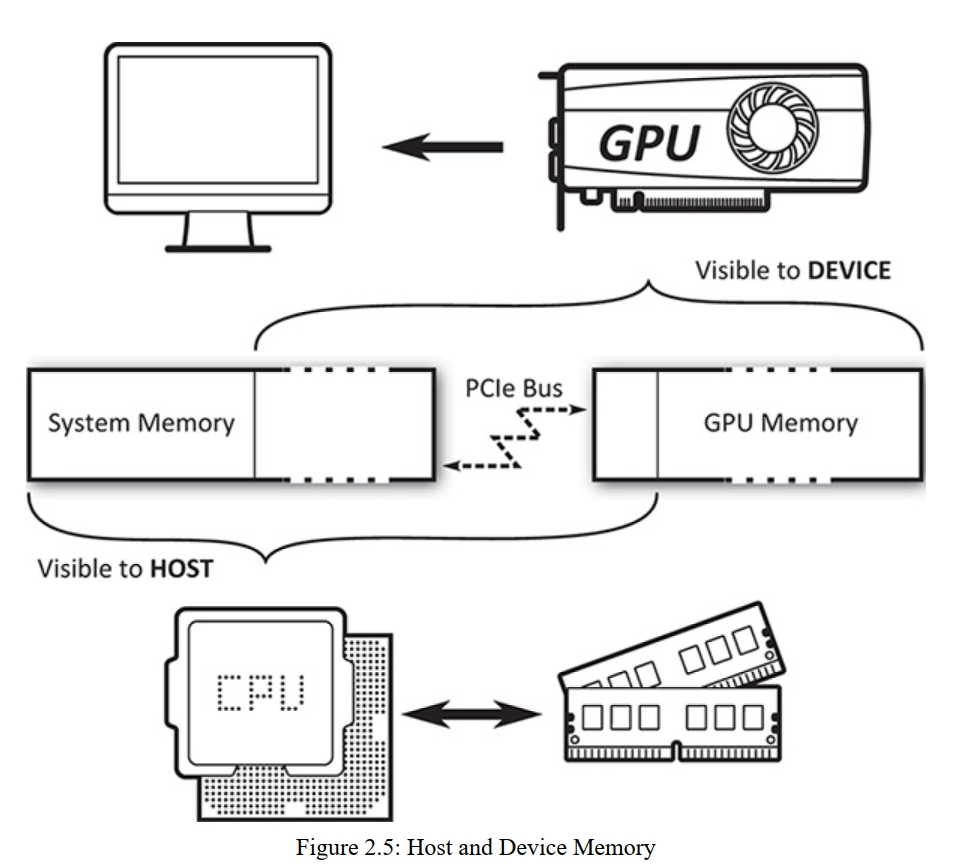

# 第二章 内存和资源

vulkan中有两类最基本的内存: 宿主内存和设备内存，所有Vulkan操作的资源都必须被设备内存所支持，并且这些内存是由应用负责管理。此外，内存被用来保存在宿主上的数据结构。Vulkan为你的应用提供了管理这种内存的机会。

## 宿主内存管理

1. Vulkan的对象在创建时，会用宿主内存存储(类似malloc或new指令)
2. 需要自己保证这些内存在分配时对齐，这么做能明显提高CPU，和Vulkan的性能
3. vulkan有自己的内存分配器，但是也可以自己实现，通过vkCreateInstance()的pAllocator参数传递内存分配器的指针，没传就是用vulkan自己的内存分配器

## 资源

1. 内存里存着资源，资源里是各种数据，Vulkan最主要的一点，就是操作这些数据
2. buffer(缓冲)和image(图像)是Vulkan最基本的两种资源类型
3. buffer是几乎所有事情都可使用的一块简单，线性关系的内存区域
4. image的数据带有结构，类型，格式信息，可由多维数组组成，且提供了对自身读写的各种操作
5. 这两种类型构造步骤都是先创建资源对象本身，再把这个资源备份到内存里，管理这些内存的工作是交给应用自己的，vulkan或者驱动，是不负责的

### buffer

1. 用途广，结构简单，通过vkCreateBuffer()创建

### 格式及其支持

1. buffer没有数据格式的概念，image和buffer view是有的，用于描述本身的特性

### 图像

1. image比起buffer具有额外的信息，包括布局，格式等。可以对其进行操作，比如过滤，混色，深度测试，裁剪测试，生成新的image

### 资源视图(Resource View)

1. 为了把buffer和image进行分块控制，可以为这些资源创建视图, buffer view就是buffer的一部分区域， image view就是某种格式的别名或者代表了image的一部分资源

### buffer view

1. buffer view用于表示buffer里某种特定格式的数据，由于其原始数据之后会被看成一系列纹素(texel),所以也叫texel buffer view。纹素可以直接在着色器中访问， Vulkan会自动把buffer里的纹素转换成着色器期望的格式。
2. 通过vkCreateBufferView()创建

### image view

1. 大部分时候，image资源不能被直接使用，因为其需要除自身信息之外的更多信息
2. 通过vkCreateImageView()创建

### image数组

### 资源销毁

### 设备内存管理

1. 主(系统)内存，就是通过malloc或new分配的那部分内存，可由CPU访问，其不单包括内存的一部分，也包括显存的一部分，见图2.5
2. 设备内存可被GPU访问，也不单包括显存，还包括内存的一部分，通过PCIe总线连接
3. 显存和内存通过某种映射关联起来
4. 在内存上那部分设备内存叫主本地设备内存
5. 能被GPU访问的这部分内存，包括内存的一部分，对于宿主内存来说，都是以堆来表示的。
6. 对于集成式的GPU，比如嵌入式系统，移动设备等，就可能与宿主CPU共享内存控制器和子系统，且设备暴露的堆只会是很少的部分，可能只有一个，这种架构被称为统一内存架构

