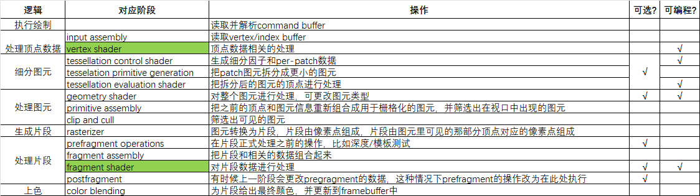

# 第七章 图形管线

此章为重点章节，已对其进行全文翻译，[译文在此](ch7_translate.md)

此处对其进行进一步总结

## 图形管线

1. 为什么要有

主要是给出更多标准化的显示相关的处理过程和操作信息，方便硬件厂商在实现vulkan时，决定哪部分功能应该用固定功能的硬件，哪部分要用到处理器核心

2. 是什么

就是把数据转成image的处理流程的描述，把这个流程看作由首尾相接的单向阶段组成，每个阶段做不同的事情，上个阶段的输出是下个阶段的输入，最开始输入顶点，最终输出图像(图片)

个人总结如下:

## 渲染通道(renderpass)

1. 为什么要有

方便定义渲染步骤，确保最终得到每帧显示的图像

2. 是什么

- Render Pass是对一帧渲染流程的描述，由一个或多个Subpass组成
- subpass描述renderpass中的其中一个步骤要对哪些attachment进行哪种操作，还有给出subpass之间的依赖关系
- 在graphics pipeline建立前需要先建立renderpass，这样渲染管线才知道要渲染到哪个地方， app至少要有一个renderpass，renderpass至少要有一个subpass

## 帧缓冲(framebuffer)

1. 为什么要有

确认Render Pass要用到的attachment，并将这些image view打包成GPU可用的渲染目标集合，方便硬件高效管理显存和访问

2. 是什么

包含最终显示用的swapchain image view，以及深度/模板或其他辅助的image view，打包集中起来供Render Pass的Subpass访问

3. 怎么做

- 创建时主要需要给出关联的renderpass，和这个framebuffer包含哪些attachment(其实就是image view)
- 每个swapchain image view通常对应一个framebuffer
