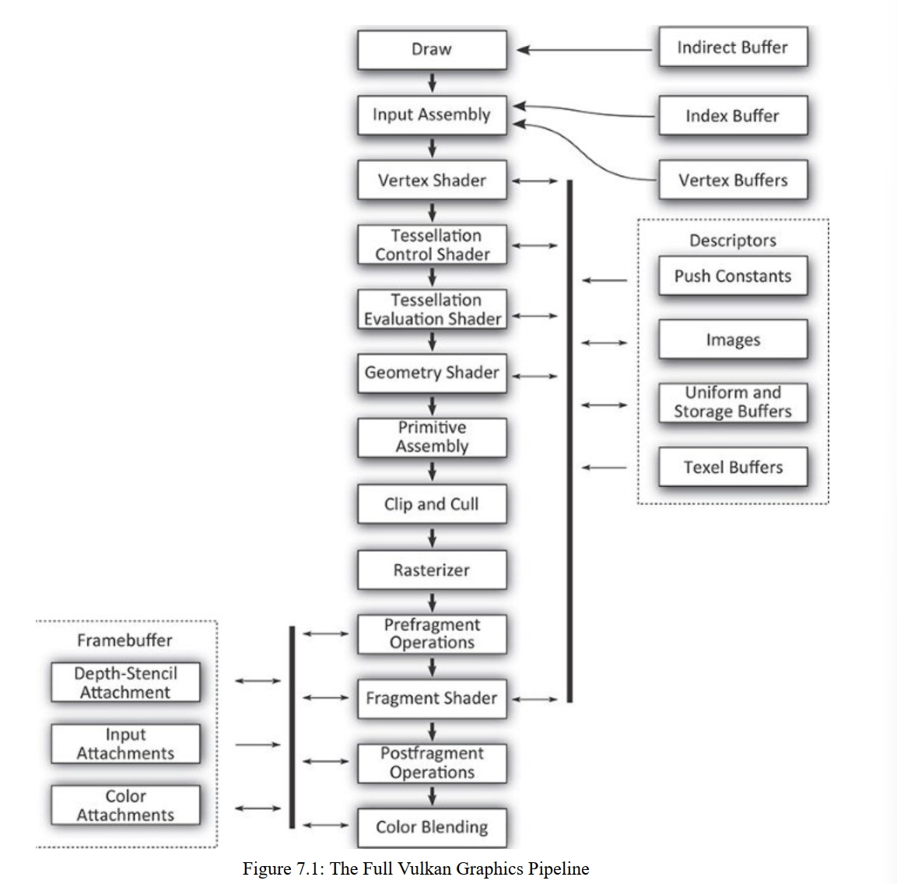

# 第七章 图形管线

对于Vulkan，可能最普遍的用法是把其看作一种图形API。图形功能是Vulkan最基础的一部分，并且主导着几乎任何视觉应用的核心部分。在Vulkan中的图形处理可以被视作一种管线，管线会在多个生成图片所要求的阶段中，取图形指令。本章包含了Vulkan图形管线的基础，并且介绍了我们的第一个图形样例。

## 逻辑图形管线

Vulkan中的图形管线可被视作一种生产线，指令从管线的前面进入，通过各个阶段进行处理。每个阶段获取指令和相关的数据，执行一类转换，把这些数据转为另一种数据。直到管线末尾，数据会被转换成多彩的像素点，构成了你需要输出的图片。

多个图形管线的部分是可选的，并且可以被停用或者甚至不被Vulkan的实现所支持。管线中必须启用的唯一一部分就是vertex shader(顶点着色器)。完整的vulkan图形管线见图7.1。然而，别被吓到，本章我们会逐一介绍这些阶段，并且会后续章节中深入其细节。

下列是每个管线中每个阶段的简明描述：

- draw(绘制): 你的指令进入到vulkan图形管线的地方，一般来说，vulkan的设备里会有一个小型处理器或者某个硬件会把command buffer中的指令进行解析，并且与硬件直接交互，来归纳出具体工作
- input assembly（输入集成）: 这个阶段会把你发送绘制时，包含了顶点信息索引和顶点缓冲进行读取
- vertex shader(顶点着色器): 顶点着色器在此执行，此阶段会把顶点的属性输入，然后为下一阶段准备转换和处理后的顶点数据
- tessellation control shader(细分控制着色器): 这个可编程的着色阶段是负责生成细分因子和其他被用于固定功能细分引擎的每个补丁过的数据
- tessellation primitive generation(细分图元生成): 没在图7.1中，此阶段有着固定的功能，会利用上一阶段的细分因子来把图元拆分成更小更简单的图元，以便在后续的细分计算着色器中进行着色
- tessellation evaluation shader(细分计算着色器): 这个着色阶段会把在细分图元生成器生成的每个新的顶点上运行。其操作与顶点着色器类似，不同的是其只对传入的生成的顶点着色，而不是从内存里读取的那些顶点进行着色。
- geometry shader(几何着色器)： 这个着色阶段会在完整的图元上操作。图元可能是点，线或者三角形，又或是前三者的特殊变种。这个阶段有能力在管线中途改变图元的类型
- primitive assembly图元组装： 这个阶段会把顶点，细分，或几何阶段生成的多个顶点分组，并形成可用于栅格化的图元。这个阶段也会裁剪和剔除图元，然后把它们转换成恰当的viewport(视口)中
- 裁剪和剔除: 这个固定功能的阶段决定这些图元的那一部分会对输出图像有贡献，并且对于没贡献的部分图元进行丢弃，对可能可见的图元转发给栅格化
- rasterizer(栅格化)：栅格化是vulkan中所有图形的基础核心。栅格化会取已被组合好，用一串顶点表示的图元，然后把其转换成单个fragment(片段),这些片段可能就是组成你图片的各个像素
- prefragment operations(片段前操作): 一旦片段的位置已知，某些操作就可在片段上执行，这些预片段操作包括深度和模板测试(若已启用)
- fragment assembly(片段组装): 没在图里展示，片段组装阶段取栅格化的输出结果，称为一个组，传入到片段着色阶段
- fragment shader(片段着色器): 这个阶段运行在管线中的最终着色器，此着色器负责计算出会被送往最终固定功能的处理阶段的数据
- postfragment operation(片段后操作): 在某些场景下，片段着色器修改了会在片段前操作的数据。这种情况下，那些片段前的操作会移动到片段后的阶段来执行
- color blending(混色): 颜色操作会取片段着色器和片段后操作的最终结果，并且把这些数据用于更新framebuffer(帧缓冲)。 颜色操作包括有混色，和逻辑操作

如上所述，在图形管线中，有许多相互关联的阶段。不像在第六章介绍的计算管线，图形管线不单包含各种固定功能的选择和配置，还包含了五个着色器阶段。此外，根据具体实现，一些逻辑上固定功能的阶段，实际上至少部分是在着色器代码实现的，这些代码由驱动生成。

在vulkan中，把图形管线表示为对象的目的，就是因为把固定功能的硬件里的一部分管线，转移到可编程的着色器核心的过程中，需要提供尽可能多的信息。若这些信息在同一对象的同一时间中并不都可用，可能意味着vulkan的一些实现可能需要根据配置的专改进行重编译。在图形管线中的这组状态就需要仔细选择，以避免这种情况，让状态的切换尽可能快。

vulkan中绘制的基础单位是顶点。顶点被分组成图元，然后被vulkan管线处理。vulkan中最简单的绘制指令是vkCmdDraw()

......

## 渲染通道(renderpass)

区分vulkan图形管线和计算管线的一点就是renderpass,一般来说，你会使用图形管线来把像素渲染成图片，这些图片要么在进行处理，要么展示给用户。在复杂的图形应用中，图片是在很多通道上建立的，每个通道负责生成场景中不同的部分，应用整个帧的效果，比如后处理，组合，或渲染UI元素等。

这种通道在vulkan中可以用一个renderpass对象表示。单个renderpass对象封装了多个通道或者单个输出图像组上的渲染阶段。每个在renderpass的通道称为subpass(子通道)。renderpass 对象可以包含多个子通道，但是即便在单个输出图片上的一个通道的简单应用，renderpass对象也包含了关于输出图像的信息

所有绘制操作必须被包含在一个renderpass中。除此以外，图形管线需要直到它们要渲染到哪里，因此，有必要在创建图形管线前创建一个renderpass对象，以便我们能够告诉管线关于其将要生成的图像的信息。渲染通道会在13章深入介绍。

......

## 帧缓冲(framebuffer)

帧缓冲是一种对象，用来表示图形管线将要渲染出来的一组图像。这些效果影响到管线中最后几个阶段: 深度，模板检测，混色，逻辑操作，多重采样等。framebuffer对象是用renderpass的引用创建的，并且可以与任何具有相似附件排序(?)的renderpass一起使用

通过调用vkCreateFrameBuffer()进行创建

......
