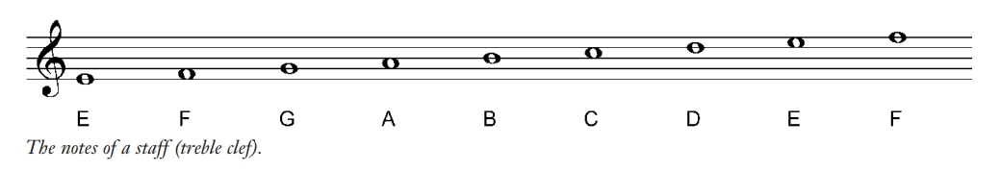
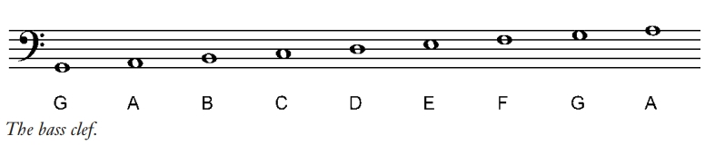
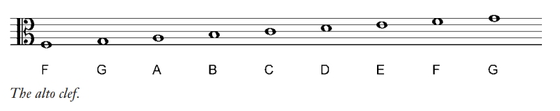
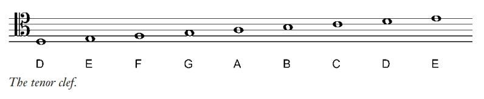
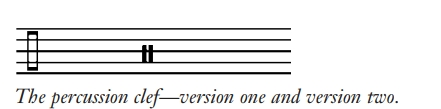

# 第一部分 音调(Tones)

## 第一章 音高和谱号

### 什么是音乐？

本书的定义是：以一种特定的旋律组织起来的连续的音调

### 什么是音调(tone)？

在特定音高播放或演唱的一种声音

### 什么是音高(pitch)？

空气分子震动的特定频率，频率越高音高越高，反之同理

### 音调如何描述?

用频率描述，单位赫兹Hz, 代表每秒周期次数。比如中央C，代表256Hz(现代的标准音高是中央C之上的A, 440Hz)，即每秒经过了256个周期的震动

但是用频率写旋律太麻烦,一般不用

## 什么是音阶(scale)?

音阶就是一系列的音高，每个音阶以特定音调开始，直到更高音高的同个音调结束

### 音阶的命名法

在西方世界，把音阶分为7个音符

1. 数字表示法：1234567,
2. solfeggio(唱名): do re mi ...

### 用传统音乐记法表示西方C大调音阶

### 音调名

由于音调的数字命名和唱名，都是以相对方式命名的，第一个音都是1，或do，但没有具体从哪个音高开始。

故可以用字母来命名，每个字母代表一个特定的频率。同一个字母之间间隔一个八度(octave),所有A的音高都是基于一个标准音高高低八度得来

钢琴键盘中，三连黑键最左边的白键为F，二连黑键最左边的都是C，其余键就可以基于此的相对位置找到，钢琴最中间的C叫做“中央C”

在钢琴中，最左边的C为C1，中央C为C4，以此类推

### 乐谱

为了方便书写音乐，音调会画成图表形式，这种图表叫乐谱(staff),谱号(clef)决定了音高(pitch)

最左侧的谱号叫高音谱号(treble clef)，从下往上第一条线上音为E，最上面一条线上的音为F，可以在上或下附加线(ledger lines)继续写

#### 高音谱号

起笔于第二条线，对应音调G，加上这个符号看起来有点像大写的G，所以有时也可称为G谱号。

高音谱号下，从下往上每条线的音调依次是EGBDF，间隔依次是FACE

#### 低音谱号

低音谱号两个点中间是从下往上第四条线，对应F

每条线从下往上依次是GBDFA，间隔依次是ACEG

#### 大谱(the grand staff)

钢琴用谱，包括高音谱和低音谱，高音谱对应右手，低音谱对应左手。下加一线上为中央C，对应低音谱上加二线

#### 特殊谱号

当用高音或低音谱号不方便时使用，比如中音谱号(alto clef),此谱号中间的线对应中央C

中高音谱号(tenor clef)，中央C在四线上

还有八音谱号(octave staff)，在高音或低音谱号上方或下方标注8，代表高八度或低八度，不常用

#### 打击谱号(percussion clef)

打击乐器用，没有固定的音高，也叫无音高谱号，有两种写法

此种乐谱每条线和间隔不代表音高，而是代表乐器的某个部分，对应哪个部分根据特定打击乐器而定

### 音程(intervals)

