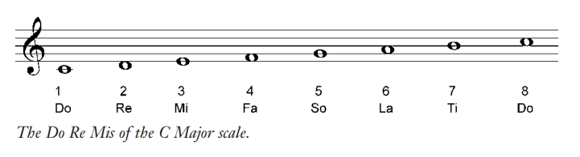

# 第一部分 音调(Tones)

## 第一章 音高和谱号

### 什么是音乐？

本书的定义是：以一种特定的旋律组织起来的连续的音调

### 什么是音调(tone)？

在特定音高播放或演唱的一种声音

### 什么是音高(pitch)？

空气分子震动的特定频率，频率越高音高越高，反之同理

### 音调如何描述?

用频率描述，单位赫兹Hz, 代表每秒周期次数。比如中央C，代表256Hz(现代的标准音高是中央C之上的A, 440Hz)，即每秒经过了256个周期的震动

但是用频率写旋律太麻烦,一般不用

## 什么是音阶(scale)?

音阶就是一系列的音高，每个音阶以特定音调开始，直到更高音高的同个音调结束

### 音阶的命名法

在西方世界，把音阶分为7个音符

1. 数字表示法：1234567,
2. solfeggio(唱名): do re mi ...

### 用传统音乐记法表示西方C大调音阶

