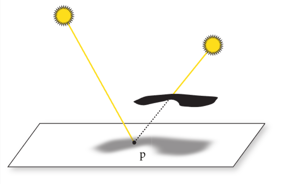
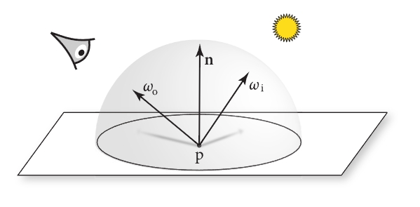

# 本书目标和总览

pbrt是基于光线追踪算法的。此算法沿着无限小的光线出发，直到与物体表面产生交互，用这种方式在某个特定位置和方向找到首个可视物体是十分简单的。同时，这种方法也是很多其他渲染算法的基础。

作者希望此书完整，图文并茂，且是基于物理(学)的

后面就是作者展开解释这几个概念，然后介绍了本书在版本迭代中更新的内容

> 本人补充或感受写到这种引用格式里
>
> 我编排的章节大体与原著一致，少数小篇章由本人重新整理，可能会略有小改，但是总体遵循原著。
>
> 内容是翻译加个人总结重新整理语言后写出来的，应该符合中文表达习惯。只保留了最重要的信息，所以部分内容会被省略，但是也会有一些内容会补充解释


## 介绍

### 什么是渲染？

即从3d场景的(代码/数学的)描述里，处理并生成图片。

### 什么是基于物理？

> 我个人更偏向于叫“基于物理学的”

即使用物理学上的规则和定律，去对现实世界的画面做拟真，这里主要指的是光线和物体之间的交互规律。这种技术被广泛使用大概只有15年，也就是比较新。

### 什么是pbrt？

pbrt即基于物理学的渲染系统，这个渲染系统是基于光线追踪算法的。这个系统能被用来渲染复杂场景下的仿真图片

### 本书特点

其他书只有理论，这本书既有理论又有完整实现，还提供了开源代码

## 文艺编程

Donald Knuth提出了编程美学的想法。简单来讲就是以人为本，而不是以机器为本的编程思想。代码可以被人类更好的阅读和理解。

后面举了文艺编程的例子，我看下来感觉像是基于注释的编程，每个注释代表了一段代码片段，通过注释去链接和跳转，和组织实际代码。

## 照片级渲染和光线追踪算法

### 照片级渲染的目的

根据3d场景创建分不清是实拍照片还是渲染出来的图片。具体来说就是用物理学方法，基于现在的显示技术，尽量准确的模拟光线与物体的交互过程。

### 什么是光？

描述了人类对光的认识的发展，讲到了光的波粒二象性。后面提到我们不用模拟到如此之深，因为光的波动性现象只在微观层面比较明显。这里我们主要是模拟光的粒子性，这种方式叫做光线追踪。

### 什么是光线追踪

简单来说就是模拟光的传播路径，在特定场景中会与其他物体交互和散射出来的这个过程。

大部分光追渲染系统都有以下这些因素的考虑:

1. 相机： 主要用来决定怎么看到这个场景。很多渲染系统把光看作是从相机发出的，然后打到场景中，来检测和观看这些光碰到的物体，然后把这些信息呈现到每个像素点上。

2. 光与物体的相交： 光线在场景里的物体相交时如何作用，比如物体的材质，法线等属性。大部分光追器能检测光线和多个物体的交点，但是一般来说，只返回第一个光线与物体相交的交点。

3. 光源： 光线追踪器必须模拟整个场景中光线的分布情况，这不仅包括灯光本身的位置，还包括它们在空间中分布能量的方式。

4. 光在物体表面的散射： 每个物体都需要提供它的外观信息，包括光如何与其表面交互，也包括光的再次辐射（折射，反射）的现象。关于表面散射的建模是参数化的，这样方便用来模拟各种外观材质。

5. 间接光的传播： 由于光打到物体上还会再次散射出来，所以光追器需要能捕捉并处理这些效应。

6. 光线的传播： 光在介质中传播的效应也需要考虑，比如在雾中，在烟中等

这些因素在后文都将充分介绍。

### 相机和胶片

介绍了针孔相机和视锥体。也就是针孔相机只关注所有经过这个小孔的光线，光线可以用一个原点加一个方向定义。针孔相机可以看成从这个孔作为原点，射向所看场景的方向，来定义这个光线。

到达相机的所有光线中，能量和波长都各有不同。人类的视觉系统会根据光的波长的不同，区分为不同的颜色。大部分相机的感应器能收集三种不同波长的光的分布情况，对应到红色，绿色和蓝色。这些光的信息足够让人类观察者感知到场景的视觉呈现样貌。

因此，pbrt还对胶片进行了抽象，用其储存图像，并且模拟胶片对入射光的反应。

pbrt中的相机和胶片的抽象在第五章会详细说明。除此以外，渲染系统就能关注于衡量光线的光照效果。

### 光线与物体的相交

当相机生成了一条光线，渲染器的第一个任务就是检测这个光线第一个碰到的物体，光线与其相交的交点，这个交点对于这个光线就是可见的，然后我们会模拟光在这个交点上的交互效应。

为了找到这个交点，我们要在所有物体中找到与这个光线相交的，并取出第一个这样的物体。我们先定义光线的表达式：

$$r(t) = o + t\vec{d}$$

o是光线原点，d是光的方向向量，t是光传播的时间，介于$[0,+\infty)$, r(t)是光线基于t的函数，找寻交点位置的话，确定t就可以了。
假设物体的表示函数是一个隐函数$F(x,y,z)=0$, 那么就是说，我们可以把光线方程带入到这个隐函数里，那么这个隐函数就只有一个未知参数就是t，我们在解出这个t，取最小的正根，就是最近的相交点对应的t。

比如，一个在原点的球面，半径为r的隐函数如下:

$$
x^2 + y^2 + z^2 - r^2 = 0
$$

把xyz的值替换为r(t)在三个维度的分量如下:

$$
(o_x + t\vec{d_x})^2 + (o_y + t\vec{d_y})^2 + (o_z + t\vec{d_z})^2 - r^2 = 0
$$

即这个式子只有t是未知的，只需要解t，看这个二次函数有没有实根就行。若没有实根，就是光线没有与球面相交，若有实根，那么最小的正实根就是交点。

找到交点对于光追器来说还远远不够，还需要知道交点所在表面的特定属性。首先，要找到这个交点对应的材质，然后，为了对这个点着色，额外的几何信息也需要提供，比如法线向量$\vec{n}$。虽然大部分光追器只需要$\vec{n}$,但是像pbrt这样的精密渲染系统还需要更多的信息，比如，表面的局部参数，位置，多种偏导数等。

如果直接找场景中所有物体求交点，那么程序就太慢了。更好的方式是用一种加速结构来快速去除不会与光相交的物体，把光追器的算法的时间复杂度降低至$O(m\log n)$，m是图像中的像素点个数，n是场景中物体的数量。虽然建立这个加速结构本身时间复杂度也是$O(n)$。这种方式对于复杂场景是很有效的。

pbrt对于各种形状的的几何相关的接口定义和实现会在第六章详述，加速结构会在第七章详述。

### 光的分布

之前的章节讲了如何找到光线与物体的交点，现在需要考虑光线到达交点后，会有多少光作用其上。这个问题涉及到场景中光的几何分布和光辐射分布。

对于点光源这样的简单光源来说，光的几何分布只取决于光的位置，但是点光源在现实中是不存在的，所以，基于物理的光都是基于面光源的。这代表了光源与其发出光的表面的几何形状有关。

为了更简单，在这里先用点光源做示例，更具体的内容见第4章和12章。

我们需要知道光线在交点p周围的微小区域里的分布了多少光。假设光源的光功率为$\Phi$,从这个点光源从各个方向辐射出来的光强度都是一致的，就是说，包裹这个点光源的单位球面上的光功率就是$\Phi/(4\pi)$, 具体的度量方法会在4.1节解释。

> 功率是指单位时间内传递的能量，单位是瓦特，能量单位是焦耳
>
> 球面面积公式是$S=4\pi r^2$, 单位球面r=1，球面的单位面积就是$1/4\pi$, 所以球面的单位面积的功率就是$\Phi/(4\pi)$


图1.5 检测p点周围微分面积内接收到的光功率，光源到p点的距离用r表示

考虑在图1.6中，由于之前假设光源在每个方向上的光功率一致，也就是单位面积上的光功率一致，那么距离光源越远的球面上，由于总面积变大，每个单位面积上的光功率就会变小。对于半径为r的球面上的单位面积的光功率根据r的变化，遵循$1/r^2$的变化规律


假设p点附近的微分面dA与入射光有$\theta$角(见图1.5)，光功率分布于dA上的比例以$\cos \theta$变化(也就是角度越小，功率越大)，综上可得，在这个微分面上的微分光功率dE就是:

$$
dE = \frac{\Phi \cos \theta}{4 \pi r^2}
$$

> 这里r就是光源到交点距离，θ就是r与交点法线的夹角，$\Phi$就是光源的功率(可以近似看作单位时间内光源亮度)

也就是说，打在一个物体表面的光有多少，与两个量有关，$\cos \theta$(表面与光方向的夹角余弦)和r(光源到交点的距离)

由于光是直线传播的，所以场景中的多光源是易于处理的。对于总体光照表现来说，可以通过分别计算每一束光线，再把其累加起来完成。这意味着，对于场景中的每个着色点，只需要使用专门的算法来对部分光源进行随机采样就可以了。详见12.6章节。

### 可见性

在之前的章节中，忽略了一个重要的因素：阴影。对于某些着色点，只有在光可以到达的位置才能被着色，即假设了光是畅通无阻的。

如下图，左侧的光可以照射到p点，右侧的光到达不了p点



还好，对于光追器来说，检测光源是否能到达着色点是容易的。只需要在这个点上构造一个射线，看是否能到达光所在的点就行，这种特殊的射线叫做阴影射线。

如果我们跟着阴影射线走，直达光源，比较这个t和光源碰撞的第一个物体的t就可以判断出这个点是否被遮挡。若没有被遮挡，这一点的着色就需要加上该光源对其的贡献。

### 光在表面的散射

> 这里的散射代表光的反射、漫反射、折射等一切从表面改变传播方向的现象的总称

我们现在能计算出重要的两个方面的信息了，着色点的位置和在其上的入射光照。现在需要考虑光在表面是如何散射的。

特别是对于交点p，散射出来的光(特别是朝向相机位置的光)带了多少能量。

如下图，入射光方向$\omega_i$, 交点p，散射出来的光到相机的方向$\omega_o$, $\omega_o$方向上光有多少能量取决于入射光的能量和BRDF



> BRDF(双向反射分布函数): 是一个函数，描述光线从一个方向入射到表面后，以另一个方向反射的比例，这个函数的参数就包括了$\omega_i$和$\omega_o$

场景中的每个物体都得有一个材质属性，这个属性用来描述表面每个点的外观属性。材质里就包含了BRDF,这个函数描述光线从一个方向入射到表面后，以另一个方向反射的能量的比例，对于p点的BRDF，函数就是$f_r(p, \omega_o, \omega_i)$ (为了方便计算，$\omega$是单位向量)

那么，我们很容易通过BRDF的定义，推广到对于透射光来说，有BTDF(双向透射分布函数),同时推广到广义的散射函数BSDF(双向散射分布函数)。

> 这里的bidirectional指光线在入射方向和散射方向之间的相互作用

pbrt支持多种BSDF模型，详见第九章。更复杂的函数有BSSRDF(双向散射表面反射分布函数)，用来描述从表面散射出来的点，与入射的点不是同一个点的场景，这种函数对于类似牛奶，皮肤等半透明材质的模拟是很必要的。

### 间接光的传播

Turner Whitted在1980年的光线追踪论文阐述了光追的递归本质，这是在渲染图片时，模拟间接光的镜面反射和光的传播的关键思想。

比如：如果从相机出发的一束光打到了类似镜子那样，拥有光滑表面的物体上，我们可以根据法线，得到反射光线，然后再递归地调用光追，找到从镜面上这个点的反射光到达的点的信息，以此类推，最终把这些结果汇总起来返回给相机这条光线作为结果。

对于透明物体，就是类似这种方法来模拟的。很多早期的光追器样例就是用光滑透明玻璃球来演示的。因为这种场景对于其他的渲染技术还不好模拟。

一般来说，到达相机的光的量由两部分组成：相机看向的物体发出的光(若这个物体是光源)的量，和这个物体反射出来的光的量。

这个思想对应了光传播方程(也叫渲染方程)，用来衡量光的辐射量，光的辐射度量会在4.1章节详解。

光在物体上某点的辐射量$L_o(p, \omega_o)$是该点在这个方向发出的光$L_e(p,\omega_o)$加上所有p点上的入射光接收到的能量,在球面$S^2$的积分(总光量)。
$$
L_o(p, \omega_o) = L_e(p, \omega_o) + \int_{S^2}f(p, \omega_o,\omega_i)L_i(p,\omega_i)|\cos \theta_i|d\omega_i
$$

> $L_o(p, \omega_o)$: 从p点沿$\omega_o$方向射出的光的辐射度(亮度)，这个$\omega_o$即射到相机点的方向
>
> $L_e(p, \omega_o)$: p点若自己是光源，要加上它自己的光辐射度
>
> $\int_{S^2}$: 表示从p点为球心所在的球面$S^2$上，要汇总所有入射光的光辐射
>
> $f(p, \omega_o,\omega_i)$: 这个就是BRDF函数，指从入射光方向$\omega_i$到出射方向$\omega_o$的光的反射辐射量是多少
>
> $L_i(p,\omega_i)$: 光源入射到p点的辐射度
>
> $|\cos \theta_i|$: 入射光与p点法线的夹角的余弦，描述点p由于入射光照射角度影响p点能接收到多少$L_i(p,\omega_i)$的量，加绝对值是说大于90°角的场景取正
>
> $d\omega_i$: 入射方向的微分立体角，用于对所有入射方向进行积分

关于这个公式的完整推导见4.3.1和13.1.1。要用分析法直接求这个积分，只要不是一个非常简单的场景,都是不可能的。所以我们需要简单化假设，或者是用一些积分技巧。

Whitted的光追算法简化了积分式，忽略其他方向的光辐射量，只考虑光源的$L_i(p,\omega_i)$，并且只考虑理想的反射和折射现象。就是说，这样做把积分变成了简单的累加法。

在1.3.6章节，我们会看到如何根据上面的公式做简单随机采样。在复杂光照和复杂表面散射的场景下，也能创造逼真的图像。在书的后续章节，会展示如何优化图像的生成效率。

### 光在介质中的传播

之前的文章中假设的是光在真空中的传播。若光在类似烟雾，雾气或者尘埃里面传播，光辐射的分布就不是之前提到的均匀分布的情况。很多种类的现象都跟光在介质的传播作用有关。比如在地球大气中，远处的物体会越来越淡(饱和度降低)。

对于在介质中传播的光，有两种效应：

1. 光的衰减：介质会吸收光，或者散射到其他的方向。我们可以通过计算光和交点的透光率$T_r$来模拟这个现象。透光率可以表示有多少光被散射。

2. 光的增益： 光传播过程中参与的介质，也可能会增强光，比如介质是发光体(比如火焰)，或者介质介质散射了其他方向的光，正好散射方向与光传播方向一致。我们可以通过求解体积光传输方程来得出光的辐射量，这种方法类似于之前我们通过求解光传输方程来确定反射的光辐射量。

## pbrt的系统总览

pbrt系统是按照面向对象来架构的，也就是说，之前上文提到的每一种基本的类型，系统中都会有对应的类型来实现其功能。

大部分pbrt的系统实现都会包含这14种关键类型。

> 对应代码类的表单请查看原书[system overview](https://www.pbr-book.org/4ed/Introduction/pbrt_System_Overview#)

包括以下几种类型:

1. Spectrum(光谱)类：

    描述光在不同波长下的强度和能量分布，用于精确模拟光的颜色和光谱特性，如材质反射和折射

2. Camera(相机)类:

    表示渲染系统中的相机，用于定义视点、视角和图像的投影方式，控制图像的采样和最终的图像生成过程

3. Shape(几何体)类:

    表示几何体的具体形状，负责光线的交叉检测和几何属性的计算

4. Primitive (基本渲染实体)类：

    表示场景中的基本渲染实体,把shape和material组合在一起, 用于处理物体的几何形状和材质信息，进行光线追踪和光照计算

5. Sampler(采样器)类:

    用于在渲染过程中生成随机或准随机的样本点，决定如何对场景进行采样

6. Filter(过滤器)类：

    用于对采样后的图像进行过滤，通常是为了解决锯齿和采样噪声问题，改善最终渲染的图像质量

7. BxDF(双向分布函数相关的)类：

    表示双向反射分布函数，计算表面的光反射、散射、折射等复杂光线交互行为
8. Material（材质）类：

    表示物体表面的材质特性，用于计算光线与物体表面的相互作用，决定最终的光照效果

9. FloatTexture (浮点纹理)类:

    表示使用浮点数值的纹理，用于在材质或光照计算中使用可变的数值。为材质提供标量数据，如表面粗糙度、凹凸细节等

10. SpectrumTexture(光谱纹理):

    表示光谱分布的纹理，为材质提供与颜色或光谱相关的数据，用于精确控制光反射或折射时的光谱行为。

11. Medium(介质)类:

    表示场景中光线传播的介质，如空气、水、玻璃等，处理光线在介质中的散射、吸收和折射，模拟雾、烟、液体等复杂效果

12. Light (光源)类:

    表示场景中的光源，用于发出光线并照亮场景，定义不同类型的光源（点光源、环境光、平行光等），影响场景的照明效果

13. LightSampler(光源采样器)类:

    用于对场景中的光源进行采样，决定如何选择和使用光源进行光照计算

14. Integrator (积分器)类:

    负责执行光线追踪的核心算法，将场景的几何形状、光源、材质结合在一起计算最终的图像，控制光线传播的方式，决定如何累积和计算光线对图像的贡献

关于在这套系统下如何扩展，参考C.4章节

在本书之前的三个版本中，使用的是C++的抽象类扩展方式，这次，为了更好的为GPU提供渲染的支持，使用了更加便捷的方式，这种方式是基于标签的，每种特定类型都有独有的一个整数表示，关于这个话题，详见1.5.7。

在pbrt中，用这种方式实现的多态类型都被定义在头文件中，在base/文件夹下。这个版本的pbrt能在支持C++17的GPU上运行，并且提供相交测试的API

> 某些GPU(比如NVIDIA)可以运行特定C++提供的特定API的代码
>
> 在本书里面是运行在NVIDIA的GPU上，AMD暂时不支持
>
> 本小节后面部分内容是描述在CPU和GPU上渲染的不同点

### 系统执行的阶段

pbrt理论上可以分为三个阶段：

1. 场景描述处理阶段：

    把用户定义好的关于场景的描述信息进行处理。

    场景描述就是指一个文本文件，里面定义了一些几何形状，和对应的材质，光源，虚拟的相机等，还包括了各种算法要用到的各种参数。场景文件的格式定义可以在官网上查看。

    处理好的结果就是一个BasicScene类的对象，存储了场景的特性，但是还不足以用这些信息进行渲染。

2. 场景加载阶段：

    之前步骤的场景描述处理好后，生成对应的各种物体

    本书之前的版本把第一步和第二步混在一起，这个版本我们分开了，因为CPU渲染和GPU渲染在如何存储到内存中的时候，是不同的。

3. 主渲染循环阶段：

    这个阶段占了整个执行过程的大部分时间，本书的大部分代码都是在这个阶段的内容。为了更好的组织渲染过程，本书实现了一个积分器，就是为了处理和求解之前提到的渲染公式。

### main函数

伪代码如下:

> 我已经把文章里的代码主要的描述写成注释了
>
> 具体解释参考原书

```c++
int main(int argc, char* argv[]) {
    // 把命令行里的参数转换为字符串列表
    std::vector<std::string> args = GetCommandLineArguments(argv);
    // 为这些处理好的字符串声明一些变量
    // PBRT存储了各种适合放在命令行里的渲染参数，后续会被传到InitPBRT()函数中
    PBRTOptions options;
    std::vector<std::string> filenames;
    // 处理命令行的参数
    // 初始化pbrt
    InitPBRT(options);
    // 处理提供的场景描述文件
    BasicScene scene;
    BasicSceneBuilder builder(&scene);
    ParseFiles(&builder, filenames);
    // 渲染该场景
    // RenderWaveFront支持CPU和GPU渲染，可以并行地处理百万级别的图像采样，详见15章
    if (Options->useGPU || Options->wavefront)
        RenderWavefront(scene);
    else
        // 在CPU上渲染，使用Intergrator(积分器)实现，
        // 比起wavefront并行数量低得多，根据并行的CPU线程数来决定图像采样的数量
        RenderCPU(scene);
    // 渲染后的资源清理工作
    CleanupPBRT();
}
```

### 积分器接口

在RenderCPU()中，Integrator接口的实现类会实例化一个对象来处理渲染，由于Intergrator只运行在CPU上，所以我们会定义一个Integrator基类。这个类的具体实现定义在cpu/intergrator.h和cpu/intergrator.cpp中

```C++
/*
	积分器接口：根据指定总体的Primitive和光源信息来渲染场景
*/
#pragma once


namespace pbrt {
	class Integrator {
	public:
		// 积分器必须提供渲染的实现，这个函数是无参的，当场景完成初始化后，会被RenderCPU()立刻调用
		// 由具体的积分器实现来决定如何渲染场景
		virtual void Render() = 0;
		// 整合了场景里所有的几何物体的引用的特殊的Primitive
		// 存储了所有场景中的Primitive，这些Primitive都是有加速数据结构的
		// 这种结构能避免大量的光线求交操作，特别是与光源距离很远的Primitive
		// 由于这个特殊的Primitive也实现了Primitive接口，所以跟其他Primitive也没区别
		Primitive aggregate;
		// 所有光源都被一个类代表，且都实现了Light接口
		// 这个Light接口可以定义光源的形状和发射出来的光的能量的分布
		std::vector<Light> lights;
		// 所有的“无限”光源也会被存储在另外一个数组中，这种光源详见12.5
		// 这种光模拟无限远的光源，用来模拟阳光
		std::vector<Light> infiniteLights;
		// 找到在tmax距离内，与光线相交的物体相关的信息,即ShapeIntersection
		// 注意tMax的类型是Float(首字母大写)，具体是float还是double取决于编译器标识
		// 一般来讲float的精度也足够了，Float的定义在pbrt.h中
		pstd::optional<ShapeIntersection> Intersect(const Ray& ray, Float tMax = Infinity) const;
		// 与intersect()类似，这个函数检测光线是否由物体相交，只返回布尔值
		// P后缀说明这个函数只是用于判断是否intersetc(相交)的，不需要找最近的交点或者返回其他额外的信息
		// 一般来讲效率更高，比如可以用到阴影射线的相交判断上
		bool IntersectP(const Ray& ray, Float tMax = Infinity) const;
	protected:
		Integrator(Primitive aggregate, std::vector<Light> lights)
			: aggregate(aggregate),
			lights(lights) {
			// 若这个总Primitive存在，则取整个场景的加速结构包围盒，若没有，则调用Bounds3f()获取
			Bounds3f sceneBounds = aggregate ? aggregate.Bounds() : Bounds3f();
			// 遍历每一个光源
			for (auto& light : lights) {
				// 一些光源需要知道整个场景的包围盒，在刚刚创建这些光源的时候还是没有的，所以在构造器里，调用了Preprocess()函数来完成这些工作
				light.Preprocess(sceneBounds);
				// 若是平行光(阳光)，放到infiniteLights这里
				if (light.Type() == LightType::Infinite)
					infiniteLights.push_back(light);
			}
		}

	};
}
```

### 图块积分器与主渲染循环

对于所有基于CPU的pbrt积分器，都是使用相机模型来定义视图相关的参数，来用于渲染图像，为了让不同处理器能够并行处理，把图像分割成一个个图块。所以，pbrt用图块积分器来实现这个操作。

```C++


```

采样器对最终生成的图像质量有明显的影响，它具有2个作用:

1. 选取哪些图像上的点，用于光线的追踪
2. 提供随机的采样值，用于估算光的传输积分值

比如，一些积分器需要根据光源选取随机的点，来计算面光源的光照效果。如何为这些光源生成分布更好的采样点会极大影响最终图像质量，详见第八章。

对于所有的pbrt积分器来说，每个像素点最终的颜色是基于随机采样算法的。如果每个像素点的最终颜色是用多个采样点取平均值，那么图像的质量就更好。采样点如果太少，采样问题就是图像上会出现很多颗粒状噪点，当采样点越多，噪点就越少(详见2.1.4)。

图块积分器的render()函数，会分轮次处理每个像素的采样点，对于刚开始的两轮，每个像素点只取一个采样点，后面的两轮，每个像素点会取2个采样点，后面的每轮处理，采样点个数翻两倍。

虽然这样的处理对于最终图像结果没有影响，但是这样做就可以预览到图片生成的整个过程，而不是只能一个像素一个像素的出结果。

由于pbrt是多线程并行处理的，在线程请求新的图块，和线程每轮结束时，一些线程会空闲，但是其他线程还在处理图块，这些因素促使了使用capped doubling方法

> capped doubling:
>
> doubling:使线程要处理的任务加倍，减少请求新图块的频率
>
> capped: 有上限的，避免处理任务加得太多导致其他线程闲置得问题

