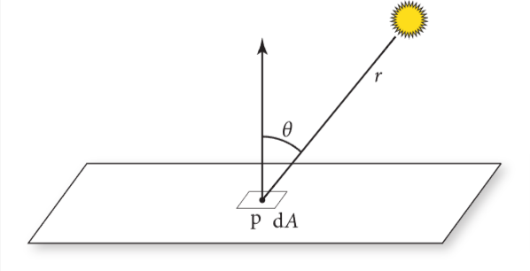
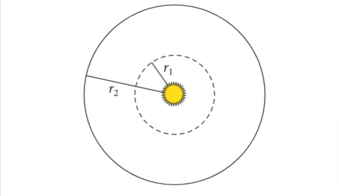

# 本书目标和总览

pbrt是基于光线追踪算法的。此算法沿着无限小的光线出发，直到与物体表面产生交互，用这种方式在某个特定位置和方向找到首个可视物体是十分简单的。同时，这种方法也是很多其他渲染算法的基础。

作者希望此书完整，图文并茂，且是基于物理(学)的

后面就是作者展开解释这几个概念，然后介绍了本书在版本迭代中更新的内容

> 本人补充或感受写到这种引用格式里
>
> 我编排的章节大体与原著一致，少数小篇章由本人重新整理，可能会略有小改，但是总体遵循原著

## 介绍

### 什么是渲染？

即从3d场景的(代码/数学的)描述里，处理并生成图片。

### 什么是基于物理？

> 我个人更偏向于叫“基于物理学的”

即使用物理学上的规则和定律，去对现实世界的画面做拟真，这里主要指的是光线和物体之间的交互规律。这种技术被广泛使用大概只有15年，也就是比较新。

### 什么是pbrt？

pbrt即基于物理学的渲染系统，这个渲染系统是基于光线追踪算法的。这个系统能被用来渲染复杂场景下的仿真图片

### 本书特点

其他书只有理论，这本书既有理论又有完整实现，还提供了开源代码

## 文艺编程

Donald Knuth提出了编程美学的想法。简单来讲就是以人为本，而不是以机器为本的编程思想。代码可以被人类更好的阅读和理解。

后面举了文艺编程的例子，我看下来感觉像是基于注释的编程，每个注释代表了一段代码片段，通过注释去链接和跳转，和组织实际代码。

## 照片级渲染和光线追踪算法

### 照片级渲染的目的

根据3d场景创建分不清是实拍照片还是渲染出来的图片。具体来说就是用物理学方法，基于现在的显示技术，尽量准确的模拟光线与物体的交互过程。

### 什么是光？

描述了人类对光的认识的发展，讲到了光的波粒二象性。后面提到我们不用模拟到如此之深，因为光的波动性现象只在微观层面比较明显。这里我们主要是模拟光的粒子性，这种方式叫做光线追踪。

### 什么是光线追踪

简单来说就是模拟光的传播路径，在特定场景中会与其他物体交互和散射出来的这个过程。

大部分光追渲染系统都有以下这些因素的考虑:

1. 相机： 主要用来决定怎么看到这个场景。很多渲染系统把光看作是从相机发出的，然后打到场景中，来检测和观看这些光碰到的物体，然后把这些信息呈现到每个像素点上。

2. 光与物体的相交： 光线在场景里的物体相交时如何作用，比如物体的材质，法线等属性。大部分光追器能检测光线和多个物体的交点，但是一般来说，只返回第一个光线与物体相交的交点。

3. 光源： 光线追踪器必须模拟整个场景中光线的分布情况，这不仅包括灯光本身的位置，还包括它们在空间中分布能量的方式。

4. 光在物体表面的散射： 每个物体都需要提供它的外观信息，包括光如何与其表面交互，也包括光的再次辐射（折射，反射）的现象。关于表面散射的建模是参数化的，这样方便用来模拟各种外观材质。

5. 间接光的传播： 由于光打到物体上还会再次散射出来，所以光追器需要能捕捉并处理这些效应。

6. 光线的传播： 光在介质中传播的效应也需要考虑，比如在雾中，在烟中等

这些因素在后文都将充分介绍。

### 相机和胶片

介绍了针孔相机和视锥体。也就是针孔相机只关注所有经过这个小孔的光线，光线可以用一个原点加一个方向定义。针孔相机可以看成从这个孔作为原点，射向所看场景的方向，来定义这个光线。

到达相机的所有光线中，能量和波长都各有不同。人类的视觉系统会根据光的波长的不同，区分为不同的颜色。大部分相机的感应器能收集三种不同波长的光的分布情况，对应到红色，绿色和蓝色。这些光的信息足够让人类观察者感知到场景的视觉呈现样貌。

因此，pbrt还对胶片进行了抽象，用其储存图像，并且模拟胶片对入射光的反应。

pbrt中的相机和胶片的抽象在第五章会详细说明。除此以外，渲染系统就能关注于衡量光线的光照效果。

### 光线与物体的相交

当相机生成了一条光线，渲染器的第一个任务就是检测这个光线第一个碰到的物体，光线与其相交的交点，这个交点对于这个光线就是可见的，然后我们会模拟光在这个交点上的交互效应。

为了找到这个交点，我们要在所有物体中找到与这个光线相交的，并取出第一个这样的物体。我们先定义光线的表达式：

$$r(t) = o + t\vec{d}$$

o是光线原点，d是光的方向向量，t是光传播的时间，介于$[0,+\infty)$, r(t)是光线基于t的函数，找寻交点位置的话，确定t就可以了。
假设物体的表示函数是一个隐函数$F(x,y,z)=0$, 那么就是说，我们可以把光线方程带入到这个隐函数里，那么这个隐函数就只有一个未知参数就是t，我们在解出这个t，取最小的正根，就是最近的相交点对应的t。

比如，一个在原点的球面，半径为r的隐函数如下:

$$
x^2 + y^2 + z^2 - r^2 = 0
$$

把xyz的值替换为r(t)在三个维度的分量如下:

$$
(o_x + t\vec{d_x})^2 + (o_y + t\vec{d_y})^2 + (o_z + t\vec{d_z})^2 - r^2 = 0
$$

即这个式子只有t是未知的，只需要解t，看这个二次函数有没有实根就行。若没有实根，就是光线没有与球面相交，若有实根，那么最小的正实根就是交点。

找到交点对于光追器来说还远远不够，还需要知道交点所在表面的特定属性。首先，要找到这个交点对应的材质，然后，为了对这个点着色，额外的几何信息也需要提供，比如法线向量$\vec{n}$。虽然大部分光追器只需要$\vec{n}$,但是像pbrt这样的精密渲染系统还需要更多的信息，比如，表面的局部参数，位置，多种偏导数等。

如果直接找场景中所有物体求交点，那么程序就太慢了。更好的方式是用一种加速结构来快速去除不会与光相交的物体，把光追器的算法的时间复杂度提升至$O(m\log n)$，m是图像中的像素点个数，n是场景中物体的数量。虽然建立这个加速结构本身时间复杂度也是$O(n)$。这种方式对于复杂场景是很有效的。

pbrt对于各种形状的的几何相关的接口定义和实现会在第六章详述，加速结构会在第七章详述。

### 光的分布

之前的章节讲了如何找到光线与物体的交点，现在需要考虑光线到达交点后，会有多少光作用其上。这个问题涉及到场景中光的几何分布和光辐射分布。

对于点光源这样的简单光源来说，光的几何分布只取决于光的位置，但是点光源在现实中是不存在的，所以，基于物理的光都是基于面光源的。这代表了光源与其发出光的表面的几何形状有关。

为了更简单，在这里先用点光源做示例，更具体的内容见第4章和12章。

我们需要知道光线在交点p周围的微小区域里的分布了多少光。假设光源的光功率为$\Phi$,从这个点光源从各个方向辐射出来的光强度都是一致的，就是说，包裹这个点光源的单位球面上的光功率就是$\Phi/(4\pi)$, 具体的度量方法会在4.1节解释。

> 功率是指单位时间内传递的能量，单位是瓦特，能量单位是焦耳
>
> 球面面积公式是$S=4\pi r^2$, 单位球面r=1，球面的单位面积就是$1/4\pi$, 所以球面的单位面积的功率就是$\Phi/(4\pi)$

图1.5 检测p点周围微分面积内接收到的光功率，光源到p点的距离用r表示

考虑在图1.6中，由于之前假设光源在每个方向上的光功率一致，也就是单位面积上的光功率一致，那么距离光源越远的球面上，由于总面积变大，每个单位面积上的光功率就会变小。对于半径为r的球面上的单位面积的光功率根据r的变化，遵循$1/r^2$的变化规律

假设p点附近的微分面dA与入射光有$\theta$角(见图1.5)，光功率分布于dA上的比例以$\cos \theta$变化(也就是角度越小，功率越大)，综上可得，在这个微分面上的微分光功率dE就是:

$$
dE = \frac{\Phi \cos \theta}{4 \pi r^2}
$$

> 这里r就是光源到交点距离，θ就是r与交点法线的夹角，$\Phi$就是光源的功率

