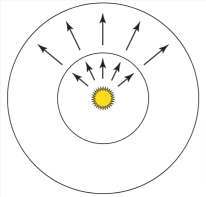
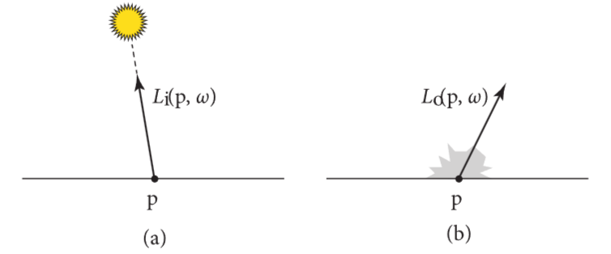

# 辐射度量学，光谱，色彩

为了精确的描述光如何被呈现，和如何被采样并计算成为一张图片。我们首先要建立一些辐射度量学的认知。

辐射度量学研究的是电磁辐射在某种环境中的传播现象。在本章中，我们首先会介绍电磁辐射的四个关键指标：辐射通量(flux), 辐射强度(intensity), 辐照度(irradiance),辐射度(radiance)

这几个物理量会跟着波长变化，可以用光谱分布来描述这些物理量。光谱分布可以给出每个波长下有多少光。(spectrum代表光谱分布，spectra代表复数的光的光谱分布)

对于渲染来说，我们只关心介于380nm到780nm的波长的电磁体的光波波长，也就是对于人类来说可见的光。

在4.5详细介绍了关于光谱分布相关的各个类

人类感知颜色是这样的，若光波波长小于400nm左右时，是淡蓝色的，对于波长约为550nm时，是绿色的，波长约为650nm是红色的。

为什么要有精确的颜色模型原因有二：

1. 显示设备对于像素的值，是用颜色值来表示，而不是光谱分布，所以，精确的把光谱分布转为对应的颜色对于图像的渲染显示是十分重要的。
2. 发光和反射相关的颜色属性是利用颜色来实现的。这些颜色为了可以用于渲染，必须被转换为光谱分布。

> 第二点，转为光谱是为了计算光线的传播。

关于颜色相关的实现和函数，详见章节4.6

## 辐射度量学

辐射度量学基于光的粒子性，波动性被忽略，只考虑基于几何光学的宏观尺度下光线与物体的作用。由于辐射度量学与Maxwell公式有一定联系，所以算是有比较坚实的物理基础。

> 光学属于物理学的一个分支，几何光学是光学的一部分内容

pbrt中，做出了如下假设:

1. 线性叠加：两束光合并即为两束光的能量相加，在现实中，是有非线性叠加的情况，但只在极高能量的光之间的叠加时会发生。
2. 光的能量保留：散射后的光的能量永远小于散射前的能量
3. 没有光的偏振现象
4. 没有荧光，磷光现象
5. 光处于稳定状态：假设光的辐射分布是稳定的，不会随着时间变化

这样的假设最大的缺失就是没有光的衍射和干涉现象。但是这个问题也可以通过一些方法绕过。比如，把光辐射用Wigner分布函数替换(本书不讲)

### 基本物理量

辐射通量(flux), 辐射强度(intensity), 辐照度(irradiance),辐射度(radiance)，这些量都衍生自关于时间，面积，方向上的能量(energy)。这些量一般都是基于光的波长的，详见4.1.3

#### 能量(energy)

单位为焦耳，来源于光照时发出的光子，每个光子是在特定波长下的，且带有特定数量的能量。辐射度量学下的所有基本的物理量都会以不同的方式影响光子的量，对于在波长$\lambda$的光子携带的能量如下式:

$$
Q=\frac{hc}{\lambda}
$$

c是光速(299472458 m/s), h是普朗克常数$h\approx 6.626 \times 10^{-34} m^2kg/s$

#### 辐射通量(flux)

能量用于衡量一段时间内的能量总数，然而在稳态假设下，我们更关心瞬时的能量。辐射通量(flux)也被称为power，代表在单位时间内传递到某个表面或空间的能量总和。可以通过求微分能量与微分时间的比值的极限来得到:
$$
\Phi = \lim_{\Delta t \to 0}\frac{\Delta Q}{\Delta t} = \frac{dQ}{dt}
$$

单位是焦耳每秒(J/s)或者瓦特(W)

光源发出的光的能量就是用辐射通量描述的，若把光源看成一个理想球体，从这个球体球心出发在两个不同距离画两个球，小的球的通量与大的球通量相等，但是由于这两个球面的面积不同，大球每个单位面积上能量小于小球。如图4.1

#### 辐照度(irradiance)和辐射出射率(radiance exitance)

辐射通量的衡量，要求单位时间内的某块区域的能量能被先衡量出来。给定一个有限的面A，我们能用公式$E=\Phi/A$来定义这个面积上的平均辐射通量的密度。其中E就是辐照度，代表通量到达表面的能量密度，也叫"辐射出射率(M)"(通量离开表面时的密度)。E的单位是$W/m^2$。(辐照度有时候也用于表示光离开表面时的通量，为了表述更清晰，我们分开两种情况)

对于像图4.1这样的点光源来说，辐照度在外层球面上的量小于内层球面上的量(外层球面面积更大)。若这个点光源发出的光能量在所有方向都相同，且对于球面的半径为r，有:

$$
E=\frac{\Phi}{4\pi r^2}
$$

这个公式解释了，某点接收到的光的能量会随着与光源的距离的平方来下降。

推广上式，得到辐照度是在微分面积下的微分通量的极限，如下式:

$$
E(p) = \lim_{\Delta A \to 0}\frac{\Delta \Phi (p)}{\Delta A} = \frac{d\Phi (p)}{dA}
$$

反过来，辐照度即为E(p)在面积A下的积分：

$$
\Phi = \int_A E(p)dA
$$

辐照度的公式也帮助我们理解兰伯特定理, 即是说，对于落到某个表面的光的能量，是光出射方向与表面法线的余弦值的部分。

当光源出射方向与面积A有一定角度时(A2)，A的面积比正射(A1)时要大，为$A/\cos \theta$
所以对于A2的每个点，辐照度是:

$$
E_2 = \frac{\Phi \cos\theta}{A}
$$

#### 辐射强度(intensity)

考虑现有一个无穷小的光源在发射出光子，若我们把这个光源放到单位球的球心上，我们能计算出光的通量的密度，即辐射强度，用I表示，单位是W/sr。对于球的全部方向，有下式:
$$
I = \frac{\Phi}{4\pi}
$$

推广上式，得到

$$
I = \lim_{\Delta \omega \to 0}\frac{\Delta \Phi}{\Delta \omega} = \frac{d\Phi}{d\omega}
$$

反过来，通过对I在$\omega$上的积分，我们能求出辐射通量$\Phi$:
$$
\Phi=\int_{\Omega}I(\omega)d\omega
$$

辐射强度用于描述光在某个方向上的分布，但是只有点光源的情况下才有意义

#### 辐射度(radiance)

在辐射度量学中，最后一个，且最重要的一个物理量就是辐射度(radiance)，用L表示，辐照度和辐射出射率给了我们某点p下的微分面积下的微分辐射通量的值，但是这个值没有对不同方向的分布做区分。辐射度给出了立体角下的辐照度，如下式:

$$
L(p,\omega)=\lim_{\Delta\omega\to 0}\frac{\Delta E_\omega(p)}{\Delta\omega} = \frac{dE_\omega(p)}{d\omega}
$$

$E_\omega$代表垂直于$\omega$方向的面的辐照度，也就是说，辐射度并不是指辐射通量中p所在的面的通量。这种表示法去除了在兰伯特定律中的$\cos\theta$

辐射度是每个单位面积和单位立体角下的辐射通量的密度，关于辐射通量的形式，有下式：

$$
L = \frac{d^2\Phi}{d\omega dA^{\bot}}
$$

$dA^\bot$是$dA$在垂直于$\omega$的假想面上的投影，见图4.3。

由上式可知，在某个极小立体角$\omega$方向和这个角方向垂直的投影面$A^\bot$上的辐射通量，当$d\omega$和$dA$变得非常小时，计算出来的极限即L，也就是辐射度。

### 入射/出射辐射度函数

在表面边界上，辐射度函数L一般来说是不连续的，辐射度在微微高于表面和微微低于表面的情况可能完全不同(比如在镜面上和下方，辐射度完全不同)。这时候就需要分表面的内外，即用两个函数分别表示它们的辐射度
$$
L^+(p,\omega) = \lim_{t \to 0^+}L(p+t\vec{n_p}, \omega)\\
L^-(p,\omega) = \lim_{t \to 0^-}L(p+t\vec{n_p}, \omega)
$$

$\vec{n_p}$是p点的法线向量

这样的方式太繁琐了，没必要。我们偏向于根据面对光源的入射的点和出射的点来区分二者。

我们把入射光写作$L_i(p,\omega)$,出射光写作$L_o(p,\omega)$,在这两种情况下，\omega总是指向p点向表面离开的那一侧。其他有些书上可能$L_i$的$\omega$方向是指向p点的，要注意。

对于某个空间中,且不在面上的点，$L^+=L^-$,也就是:
$$
L_o(p,\omega)=L_i(p,-\omega)=L(p,\omega)
$$

### 辐射度量学的光谱分布

之前讨论的辐射量（如辐射亮度、辐射通量等）没有考虑不同波长的光的区别。接下来可以通过对极小的波长范围取极限值，来定义这些辐射量的“光谱版本”，即更精确地表示不同波长的光对辐射量的贡献。

我们能定义光谱辐射量$L_\lambda$, 表示无穷小的波长区间的辐射度:
$$
L_\lambda = \lim_{\Delta\lambda\to 0}\frac{\Delta L}{\Delta \lambda} = \frac{dL}{d\lambda}
$$
反之，对其积分就是辐射度L：
$$
L = \int_{\lambda_0}^{\lambda_1}L_\lambda(\lambda)d\lambda
$$

以此类推，可以给出各个光谱下的辐射物理量。

### 亮度与光度学

所有在辐射度量学中的量，在光度学里面，都有对应的量。光度学是研究人类能够通过视觉系统感知到的可见的电磁辐射的。

每个光谱辐射的量，都可以通过对光谱响应曲线$V(\lambda)$进行积分，转换为对应的光度学中的量。这个$V(\lambda)$描述了人眼对各个波长光的敏感度情况。

亮度指人眼能观察到的光的光谱能量分布下的明亮程度。举个例子,在绿色波长中具有一定能量的光谱分布，会比在蓝色波长中具有相同能量的光谱分布对人眼看起来更亮。(由于人眼对不同波长的光敏感度不同，尤其是对绿色更为敏感)

我们可以用Y来表示亮度，Y关于光谱辐射度可列下式:
$$
Y = \int_\lambda L_\lambda(\lambda)V(\lambda)d\lambda
$$

亮度和光谱响应曲线$V(\lambda)$很接近于用XYZ表示的色彩的值，详见4.6.1

亮度的单位是每立方米坎德拉($cd/m^2$), 坎德拉与在光度学中的辐射强度等效。

## 辐射度量学中的积分

## 表面反射

## 光的发出

## 光谱分布的表示

## 色彩