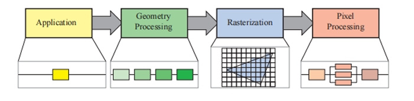

# 第二章 图形渲染管线

## 2.1 渲染管线的架构

渲染管线四大阶段: 应用阶段 -> 几何处理阶段 -> 光栅化阶段 -> 像素处理阶段

每个阶段本身也可以是一个管线，有些阶段可以并行化执行(如像素处理阶段)

1. 应用阶段：通常运行在CPU上，在软件中实现，负责碰撞检测，全局加速算法，动画，物理模拟等任务。最终输出为几何物体的信息，称为图元。
2. 几何处理阶段： 处理几何的变换，投影，和其他几何相关的操作，通常运行在GPU上。
3. 光栅化阶段： 把几何描述的三角形的顶点信息，转换为各个像素点，然后转发到下一阶段，一般运行在GPU上。
4. 像素处理阶段： 把上一阶段生成的每个像素点着色，执行深度测试等操作，一般运行在GPU上。

## 2.2 应用阶段

如前所述

## 2.3 几何处理阶段

可细分为四个阶段（三个可选阶段）: 顶点着色 -> (曲面细分 -> 几何着色 -> 流式输出)-> 投影 -> 裁剪 -> 屏幕映射

旧年代在此阶段计算顶点颜色而得名，现代主要是负责计算并设置每个顶点相关的数据，是否着色是可选的。

计算顶点的位置，同时给出顶点相关的参数，比如法线，纹理坐标等。

顶点着色后，有几个可选处理阶段：曲面细分,几何着色，流式输出。

主要步骤：

1. 把模型所处的坐标系转换为世界坐标系，使各个模型位于同一个世界空间，基于同一套坐标系下。所以要对模型的顶点坐标做转换。
2. 把相机移动到原点，并看向-z方向，y轴指向上方，x轴指右方。便于后续的投影和裁剪等操作。
3. 投影：把三维空间投影到二维面上，可选正交投影或透视投影，通过投影矩阵完成转换。
4. 裁剪： 根据可视空间裁剪出一个视锥体(透视投影)或长方体(正交投影)，转换后的模型顶点的z坐标分量不会存储在图像中，而是存到z-buffer中，用于判断先后遮挡关系。对于一部分在可视空间内的物体，要用可视空间切割这些物体，生成新的顶点。
6. 屏幕映射： 把图元原本的三维坐标转换为屏幕上的坐标，z坐标映射到[0,1](OpenGL是[-1,+1])

## 2.4 光栅化阶段

把上一步骤输出的图元，转换为像素点。

分为两个子阶段： 三角形设置 -> 三角形遍历

1. 三角形设置： 用于三角形遍历的一些数据的计算，由硬件实现。
2. 三角形遍历： 遍历检查哪个像素点属于图元，然后生成各个片元，计算片元的各种属性值，比如深度值等。

## 2.5 像素处理阶段
