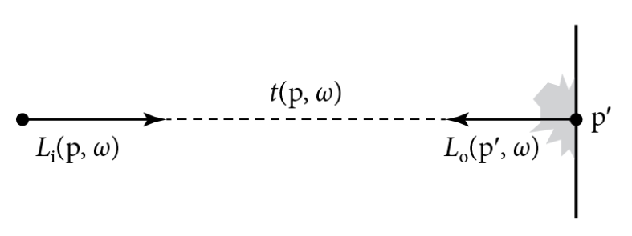

# 13 光的传播I: 表面反射

本章把光追理论，辐射度量学理论，蒙特卡洛采样算法结合起来，来实现两种不同的积分器，用来计算场景中物体表面散射的辐射量。这些积分器比第一章所说的RandomWalkIntegerator更有效率，用这两种积分器可以使错误数降低几百倍。

我们会以光传播等式的派生来开始，这个公式是在1.2.6章节介绍的。然后我们能正式介绍路径追踪算法，此算法应用了蒙特卡洛积分来计算这个等式。然后，我们会对SimplePathIntegrator的实现做描述，它是路径追踪的精简版实现，对于理解基本算法和调试样本算法是很有用的。然后本章会用PathIntegrator做概括总结，它是路径追踪更完整的实现。

这两个积分器会找到从相机开始的光的传输路径，并且考虑到了这些形状表面的散射效应。第14章会扩展路径追踪，使其包含介质传播的效果(本书在线版还包括了一章，用来描述双向路径追踪)

## 13.1 光传播公式

光传播公式(LTE)描述了场景中辐射量分布的平衡性，这个公式给出了在表面上某点的总反射辐射量，这个辐射量是根据表面发光，BSDF和入射光照分布到达此点的量得出的。在此我们不考虑光在介质中的传播场景，这部分会在14章介绍

让LTE的计算困难的原因是，某个点接收到的辐射量是受场景中所有物体的几何和散射特性所影响。比如，某个很亮的光照射到一个红色物体上，可能会导致红色的光映到旁边的物体上，或者玻璃可能会在桌面上形成焦散效果。处理这种光照复杂性的渲染算法称为全局光照算法,为了与局部光照算法区分开，局部光照算法在着色计算中只使用与某一个表面属性相关的信息。

> 全局光照算法考虑场景光在所有物体相互作用的效果，本地光照算法只考虑单独的物体的着色，不会受其他物体影响

### 13.1.1 基本推导

我们已经选择基于用辐射度量学来描述光，故我们的光传输公式把这个条件作为基本假设，那么光的波动性就不重要了，故场景中的辐射分布就是均匀的。

光传输公式(LTE)的重要定律就是能量守恒，能量的改变必须在某种过程中被"归因"，同时，我们必须记录所有能量的变化。因为我们假设了光照是直线的过程，从某个系统中出来和进入的能量的差值，必须和发射出和吸收的能量的差值相等。这种想法在多个空间尺度下都相通。在宏观尺度下，我们有能量守恒定律：

$$
\Phi_o - \Phi_i = \Phi_e - \Phi_a
$$

即，离开物体的辐射通量$\Phi_o$减去进入物体的辐射通量$\Phi_i$，与物体辐射出的辐射通量$\Phi_e$减去吸收的辐射通量$\Phi_a$的差，是相等的

为了使某个平面上的的能量守恒，离开平面的辐射度$L_o$必须等于辐射出的辐射度加上入射光散射后的辐射量。辐射出的辐射量用$L_e$给出，散射后的辐射量是用散射公式给出，即下式:

> $L_o$等于这个点自己辐射出的辐射量加上照到这个点的光散射后的辐射量

$$
 L_o(p, \omega_o) = L_e(p, \omega_o) + \int_{S^2}f(p, \omega_o,\omega_i)L_i(p,\omega_i)|\cos \theta_i|d\omega_i
$$

> 这里的p点是场景中任意一点，这个式子就是说场景中任意一个p点(物体表面的点只是其中一种情况)，如何求得它的光辐射量

图13.1 在自由空间中，沿着光线方向的辐射量是不变的。因此，为了计算从p点在$\omega$方向的入射光辐射量，我们能找到这条射线的第一个与物体表面的交点，然后计算$-\omega$方向的出射光辐射量。光线投射函数$t(p,\omega)$给定了射线$(p,\omega)$在第一个表面的交点p'

由于我们已经假设光传播过程中没有介质参与，辐射量就是一个不会变化的数。因此，我们能把p点的入射光辐射量与p'的出射光辐射量关联起来，如上图13.1。 若我们定义了一个光线投射函数$t(p, \omega)$，用来计算从p射到第一个碰到的表面一点p'，方向为$\omega$,我们就能通过p'的出射辐射量，来写出p点的入射光辐射量

> 即，由能量守恒假设，可以用p'在$-\omega$上的的出射辐射量来反推p在$\omega$方向上的入射辐射量

$$
L_i(p, \omega) = L_o(t(p,\omega), -\omega)
$$

由于场景并不是封闭的，我们会让光线投射函数在光$(p, \omega)$没有与场景物体相交的时候，返回一个特殊值$\Lambda$，使得$L_o(\Lambda, \omega)$总为0

为了简洁，把$L_o$的下标舍弃，那么LTE就可写成:

$$
 L(p, \omega_o) = L_e(p, \omega_o) + \int_{S^2}f(p, \omega_o,\omega_i)L(t(p, \omega), -\omega_i)|\cos \theta_i|d\omega_i
$$

上式中的关键是，只有一个我们感兴趣的量，即表面上某点的出射辐射量。当然这个量在上式中的两侧都存在，所以我们的任务不简单，但是肯定更简单点了。记住，我们可以通过强制利用能量守恒来让这个式子更简单，这是很重要的。

> 就是说，在原版LTE中，有两个量需要关注，$L_i$和$L_e$，但是通过利用能量守恒定律，把$L_i$的部分替换为交点处反向的出射辐射量，改成了上式以后，只有一个$L_e$需要关注，也就降低了LTE的计算难度

### 13.1.2 LTE的解析解

LTE式子的简洁性掩盖了一个事实，除非是非常简单的场景，否则得到这个式子的解析解是不可能的。式子的复杂性来源于基于物理的BSDF模型，还有任意场景的几何特征，还有物体间错综复杂的可见关系，合起来的这一切，都需要一种数值上的解决方法。幸运的是，把光线追踪算法结合蒙特卡洛积分，就给出了一个强力的组合工具，能够在不需要在各种LTE分量中设置限制条件（比如： 要求所有BSDF都是朗伯材质，或者大幅限制物体的几何形状）的场景下，处理这种复杂性。

对于求解LTE，只需要简单设置一下即可。虽然对于更通用性质的渲染没有太大帮助，但是这种方法能帮助调试积分器。若某个积分器想求解完整的LTE时，不能计算出对应的解析解，那么很显然积分器就有问题。例如：考虑一个球面内部，都是朗伯型的BRDF,$f(p, \omega_o, \omega_i) = c$, 同时在所有方向上也发出常数性质的辐射量。那么我们就有：

$$
 L(p, \omega_o) = L_e + c\int_{H^2(\vec{n})}L(t(p, \omega), -\omega_i)|\cos \theta_i|d\omega_i
$$

在球面内部任意一点的出射辐射度的分布，与其他的点都相同。这个场景下，不同的点之间不会引入变化量。因此入射光辐射分布在所有点都是相等的，并且以余弦加权的入射光辐射量也必须在所有地方都相等。故，我们可以把辐射量函数替换为一个常数，那么LTE就可以写作下式:

$$
L = L_e + c\pi L
$$

> $\pi$是朗伯反射引入的，不是半球积分的$2\pi$

### 13.1.3 LTE在物体表面的形式

### 13.1.4 在路径上积分

### 13.1.5 被积函数中的delta分布

### 13.1.6 分割被积函数

## 13.2 路径追踪

## 13.3 一个简单的路径追踪器

## 13.4 更好的路径追踪