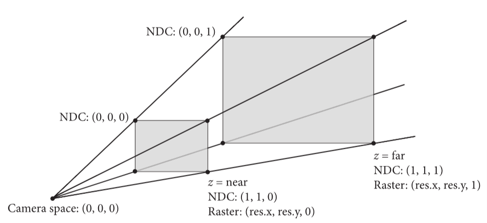
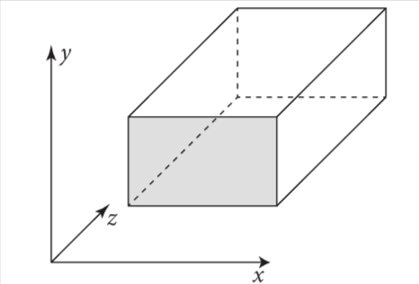
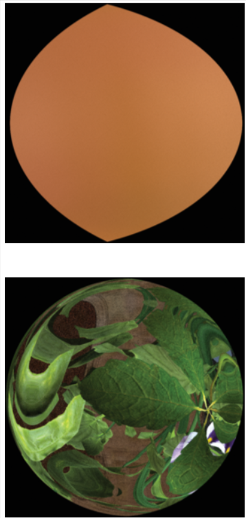
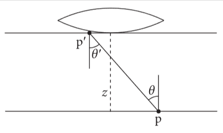
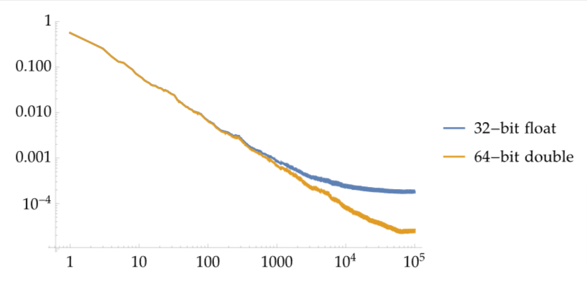

# 5 相机和胶片

小孔成像忽略了透镜的聚焦效果，是全图清晰聚焦的，透镜只能部分聚焦，导致图像看起来不太真实，为了使图像更真实，需要模拟透镜的效果。

相机的透镜系统引入了各种图像畸变，比如图像边缘的晕影效果，和枕型，桶型失真等。

在pbrt中，使用Film类来表示相机捕捉到的图像，用Camera接口来代表相机

在本章中，会介绍2个Film的实现类，它们两个都使用PixelSensor类来代表特定感光器对光谱的响应效果，使其看起来像胶片拍的或是数码相机拍的吗，关于胶片和感光器的类会在本章最后一节介绍。

## 5.1 相机接口

Camera类继承自TaggedPointer

> TaggedPointer简单来讲是为了减少C++多态时虚表的内存开销(特别是复杂场景的渲染时，虚表会导致内存占用大)，并让同一个函数同时支持GPU和CPU的调用(代码在CPU和GPU运行时，函数存储在内存中不同的位置)

```c++
class Camera : public TaggedPointer<PerspectiveCamera,OrthographicCamera,
                                    SphericalCamera, RealisticCamera> {
  public:

    /*
        必须实现的方法，用于对应图像采样的光线的计算，返回的光线需要归一化
        若给定的CameraSample对象由于一些原因没有有效的光线，那么pstd::optional
        中的返回值需要被重置。

        传入进来的SampleWavelengths(样本波长)不是常量引用，故相机就可以模拟镜头
        的色散效果，在这种情况下，光线只追踪单一波长的光，并且 GenerateRay() 
        方法将调用 SampledWavelengths::TerminateSecondary()

        传入到此函数的CameraSample结构体，包含了相机光线需要的所有样本值。
    */
    PBRT_CPU_GPU inline pstd::optional<CameraRay> GenerateRay(
        CameraSample sample, SampledWavelengths &lambda) const;

    /*
        相机必须提供此方法的实现，这个方法不仅会类似GenerateRay()计算主光线，
        还会计算位于胶片沿x,y方向上移动一个像素的微分光线，
        用来代表特定相机光线的采样所对应的胶片的区域大小，
        用于计算抗锯齿时的纹理查找，提高图像质量
    */
    PBRT_CPU_GPU
    pstd::optional<CameraRayDifferential> GenerateRayDifferential(
        CameraSample sample, SampledWavelengths &lambda) const;

    /*
        相机的实现必须提供对应Film(胶片)的访问实现，用于获知诸如输出的图片的分辨率等信息
    */
    PBRT_CPU_GPU inline Film GetFilm() const;

    /*
        模拟现实相机的快门效果，让胶片暴露在光中一小段时间。若此值不为0，会有动态模糊效果
        相对于相机有移动的物体会被模糊
        可以根据快门开关之间的时间内的光分布情况，利用蒙特卡洛积分和点采样方法，可以得到动态模糊的效果

        此接口用一个在[0,1)间随机均匀分布的样本u，对应到快门的开启时间点，一般来讲
        只是用来在快门开启和关闭时间里进行线性插值，使动态模糊更真实
    */
    PBRT_CPU_GPU inline Float SampleTime(Float u) const;

    /*
        允许相机设置ImageMetadata对象的参数，比如相机的转换矩阵等，若输出的图片的格式支持存储这些额外的信息，那么这些信息会被写入到最终图像里
    */
    void InitMetadata(ImageMetadata *metadata) const;

    /*
        Camera接口的实现类必须使CameraTransform类可以用于其他坐标空间
    */
    PBRT_CPU_GPU inline const CameraTransform &GetCameraTransform() const;
}
```

### 5.1.1相机的坐标空间

除了世界空间外，还有物体空间，相机空间，相机-世界空间，和渲染空间

- 物体空间： 几何图元定义所在的坐标系统，比如，在pbrt中，球体圆心就在物体空间的坐标原点
- 世界空间： 所有物体摆放在一个世界空间里，需要把物体从物体空间坐标转换为时间空间坐标，世界空间是其他空间的标准框架。
- 相机空间： 相机被放置于世界空间的某一点，有一个观察方向和摆放的朝向，相机的位置看成坐标原点，这个坐标系的z轴对应观察方向，y轴对应相机摆放的向上的方向
- 相机-世界空间： 类似相机空间，这个坐标系的原点是相机的位置，但是保持了世界空间的方向，相机不一定沿着z轴观察
- 渲染空间： 场景根据渲染需求做了坐标系转换，在pbrt中，可以是世界空间，相机空间，或是相机-世界空间

> 相机空间中，坐标系原点在相机位置，三个轴根据相机移动和转动变化，相机-世界空间中，坐标原点在相机位置，但是三个轴方向与世界空间一致

基于光栅化的渲染中，传统上都是在相机空间中进行各种计算，三角形的顶点坐标，在投影到屏幕和光栅化前，会从物体空间中全部转换到相机空间中，方便判断哪些物体能被相机看到。

与此相对的是，许多光线追踪器(包括pbrt之前的版本)是在世界空间上渲染。当生成光线时，相机是在相机空间中实现的，但是这些相机会把那些需要求交和着色的光线，转换到世界空间中。这种方式存在一个问题，即转换过程中，离原点近的，精度高，远的精度低，若相机的位置离原点很远，这个相机看向的场景时呈现的图像就会存在误差。

> 若相机和场景离原点过远，相机空间到世界空间的转换过程的浮点数造成的误差会导致图像失真

在相机空间中渲染，对于离相机最近的物体，由于没有了相机空间到世界空间的转换过程，能原生提供最大的浮点计算精确度。但是在光线追踪中，这样做有个问题。场景一般会把主要特征沿着坐标轴建模(比如建筑物模型的地板和天花板可能就是对齐y轴的)，轴对称包围盒在这种情况下会退化得只剩一个维度，这样就减小了包围盒的表面积。

类似BVH的加速结构会在第七章介绍，在这种包围盒下影响比较大，若相机在这样的场景中旋转，轴对称包围盒的包围效果就不好，会影响渲染性能。

> 轴对称包围盒(AABB): 一个矩形框，其边与坐标轴平行，用于包围三维空间中的物体。它是最小的矩形体积，可以包含所有物体的顶点
>
> 个人理解：由于模型建模时为了方便，会把模型的主要特征，沿着坐标轴方向建模(比如高楼的高度会沿着y轴方向向上建模)。在相机空间中，由于坐标系根据相机的观察方式做了转换，模型在这个空间里可能就是“歪着的”，用轴对称包围盒这样的方式去包裹，会造成盒子空出来的空间通常比世界空间下的要大，在光线求交时，增加了大量本来不会相交的点的判断，影响了性能

使用相机-世界空间来渲染会更好，相机是在坐标原点，场景坐标也被相应转换，然而，转动相机不会影响场景的几何坐标点，因此加速结构的包围盒还是很有效。使用相机-世界空间，不会有更快的渲染速度或更精确的渲染结果。

CameraTransform类抽象了在各个空间之间的坐标系转换过程,这个类维护了两类转换，从相机空间到渲染空间的转换，和从渲染空间到世界空间的转换。在pbrt中，后者的转换不能动画化，所有动画都是用相机空间来转换，这是为了保证移动相机时，不会造成场景中静态物体也需要动态化，这会造成性能损失。

> 移动相机不会造成性能损失，但是移动物体由于会导致包围盒变大，会降低加速结构的效率，所以要避免物体不必要的移动

```c++
/*
    封装各个坐标空间之间的转换过程
    该类维护了两类转换：从相机空间到渲染空间，从渲染空间到世界空间
    Camera的实现类必须使此类支持其他系统的坐标空间
*/
/*
    传入相机到世界空间转换后的对象，根据配置里渲染基于的渲染空间做转换
    默认的渲染空间是相机-世界空间，但是也可以在命令行里面配置成其他空间
*/
CameraTransform::CameraTransform(const AnimatedTransform &worldFromCamera) {
    switch (Options->renderingSpace) {
    case RenderingCoordinateSystem::Camera: {
        // <<对于相机空间的渲染，计算worldFromRender>>

        /*
            对于相机空间的渲染，从相机到世界空间的转换过程会被worldFromRender使用
            对于从相机空间到渲染空间的变换过程，用了恒等变换(identity transformation),
            故这两个坐标系统是等价的。
            由于worldFromRender是不能被动画化，所以取了动画帧时间的中点(tMid)，然后
            把这个点在相机变换中的动画，并入renderFromCamera
        */
        Float tMid = (worldFromCamera.startTime + worldFromCamera.endTime) / 2;
        worldFromRender = worldFromCamera.Interpolate(tMid);
        break;
    }
    case RenderingCoordinateSystem::CameraWorld: {
        // <<对于相机-世界空间的渲染，计算worldFromRender>>
        /*
            对于相机-世界空间上的渲染(默认)，渲染空间到世界空间的坐标系变换时基于动画帧
            的中点来转换到相机的位置
        */
        Float tMid = (worldFromCamera.startTime + worldFromCamera.endTime) / 2;
        Point3f pCamera = worldFromCamera(Point3f(0, 0, 0), tMid);
        worldFromRender = Translate(Vector3f(pCamera));
        break;
    }
    case RenderingCoordinateSystem::World: {
        // <<对于世界空间的渲染，计算worldFromRender>>
        /*
            对于世界空间的渲染，就是做恒等变换
        */
        worldFromRender = Transform();
        break;
    }
    default:
        LOG_FATAL("Unhandled rendering coordinate space");
    }
    LOG_VERBOSE("World-space position: %s", worldFromRender(Point3f(0, 0, 0)));
    // <<计算renderFromCamera>>
    /*
        一旦worldFromRender设置完后，worldFromCamera剩余的变换过程会在这里处理，
        存入到renderFromCamera
    */
    Transform renderFromWorld = Inverse(worldFromRender);
    Transform rfc[2] = {renderFromWorld * worldFromCamera.startTransform,
                        renderFromWorld * worldFromCamera.endTransform};
    renderFromCamera = AnimatedTransform(rfc[0], worldFromCamera.startTime, rfc[1],
                                         worldFromCamera.endTime);
}
```


### 5.1.2 CameraBase类

Camera接口的通用函数放到CameraBase中，其他相机类皆继承此类。关于camera的实现的相机类都放在cameras.h下面

CameraBase类如下:

```c++
/*
    camera接口的通用功能实现在此，所有camera实现须继承此类
*/
class CameraBase {
  public:
    // CameraBase Public Methods
    PBRT_CPU_GPU
    Film GetFilm() const { return film; }
    PBRT_CPU_GPU
    const CameraTransform &GetCameraTransform() const { return cameraTransform; }

    PBRT_CPU_GPU
    Float SampleTime(Float u) const { return Lerp(u, shutterOpen, shutterClose); }

    void InitMetadata(ImageMetadata *metadata) const;
    std::string ToString() const;

    PBRT_CPU_GPU
    void Approximate_dp_dxy(Point3f p, Normal3f n, Float time, int samplesPerPixel,
                            Vector3f *dpdx, Vector3f *dpdy) const {
        // Compute tangent plane equation for ray differential intersections
        Point3f pCamera = CameraFromRender(p, time);
        Transform DownZFromCamera =
            RotateFromTo(Normalize(Vector3f(pCamera)), Vector3f(0, 0, 1));
        Point3f pDownZ = DownZFromCamera(pCamera);
        Normal3f nDownZ = DownZFromCamera(CameraFromRender(n, time));
        Float d = nDownZ.z * pDownZ.z;

        // Find intersection points for approximated camera differential rays
        Ray xRay(Point3f(0, 0, 0) + minPosDifferentialX,
                 Vector3f(0, 0, 1) + minDirDifferentialX);
        Float tx = -(Dot(nDownZ, Vector3f(xRay.o)) - d) / Dot(nDownZ, xRay.d);
        Ray yRay(Point3f(0, 0, 0) + minPosDifferentialY,
                 Vector3f(0, 0, 1) + minDirDifferentialY);
        Float ty = -(Dot(nDownZ, Vector3f(yRay.o)) - d) / Dot(nDownZ, yRay.d);
        Point3f px = xRay(tx), py = yRay(ty);

        // Estimate $\dpdx$ and $\dpdy$ in tangent plane at intersection point
        Float sppScale =
            GetOptions().disablePixelJitter
                ? 1
                : std::max<Float>(.125, 1 / std::sqrt((Float)samplesPerPixel));
        *dpdx =
            sppScale * RenderFromCamera(DownZFromCamera.ApplyInverse(px - pDownZ), time);
        *dpdy =
            sppScale * RenderFromCamera(DownZFromCamera.ApplyInverse(py - pDownZ), time);
    }

  protected:
    // CameraBase Protected Members
    CameraTransform cameraTransform;
    Float shutterOpen, shutterClose;
    Film film;
    Medium medium;
    Vector3f minPosDifferentialX, minPosDifferentialY;
    Vector3f minDirDifferentialX, minDirDifferentialY;

    // CameraBase Protected Methods
    CameraBase() = default;

    CameraBase(CameraBaseParameters p);

    /*
        通过多次调用camera的GenerateRay()函数来计算光线的微分量

        camera的实现类必须实现此函数，但是那些方法之后还是会调用此函数
        (注意，函数的签名不同于实现类中的那个)

        相机的各种实现类会传入this指针(camera入参)，这会允许此函数调用对应camera的
        GenerateRay()函数。这种额外复杂性的引入是由于我们没在camera接口使用虚函数，
        这意味着CameraBase类需要有camera传入才能调用GenerateRay()方法
    */
    PBRT_CPU_GPU
    static pstd::optional<CameraRayDifferential> GenerateRayDifferential(
        Camera camera, CameraSample sample, SampledWavelengths &lambda);
};
```

CameraBase的构造器参数如下:

```c++
/*
    CameraTransForm: 最重要的类，把相机坐标变换成场景所用的坐标
    
    shutterOpen, shutterClose: 快门的开关时间

    Film: 存储最终图像，且模拟了胶片的感光器

    Medium: 相机要考虑的介质
*/
struct CameraBaseParameters {
    CameraTransform cameraTransform;
    Float shutterOpen = 0, shutterClose = 1;
    Film film;
    Medium medium;
    CameraBaseParameters() = default;
    CameraBaseParameters(const CameraTransform &cameraTransform, Film film, Medium medium,
                         const ParameterDictionary &parameters, const FileLoc *loc);
};
```

## 5.2 投影相机的模型

三维空间下的观察问题在三维图形学下是最基本的问题之一，即，如何把3D场景展示在二维图像上。最经典的解决方法是用$4\times 4$矩阵来实现。因此，我们会介绍一个投影矩阵的相机类，叫ProjectiveCamera，然后基于它，定义2个相机模型。第一个实现是正交投影，另一个实现是透视投影，这两种是最经典和广泛运用的投影类型。

正交和透视投影都需要定义2个与观察方向垂直的平面，近平面和远平面，当渲染在光栅化的时候，不在这两个平面内的物体会被剔除，最终图像中就没有这些物体。(剔除近平面前面的物体是非常重要的，为了防止物体深度为0时计算投影出现问题，把相机背后的物体错误地映射到了前面)

> 当物体深度接近或等于0时，计算时导致结果为无穷大或未定义，导致奇点问题(不可控现象，比如黑块，闪烁，消失)。深度值为负时，若计算没有加排除负值的判断，会导致相机后面的物体会跑到前面来

对于光追器来说，投影矩阵只是单纯用来检测离开相机的光，没有考虑相机后面的情况，所以会出现此问题

还有更多的坐标系统，这些坐标系统对于定义各种投影相机类很有用：

- 屏幕空间： 在胶片平面上定义，相机在相机空间中把物体投影到了胶片平面上，在屏幕窗口中，生成图像的一部分会被看到。近平面上的点对应的z深度是0，远平面上的点对应z深度就是1。注意，虽然其被称为"屏幕"空间，但是还是一个3维的坐标系统，因为z值还是有意义的
- 标准化设备坐标(NDC)空间: 被渲染的图像真正的坐标系统，在x和y，范围从坐上到右下，(0,0)到(1,1)，深度值与屏幕空间一样，可通过线性变换把屏幕空间转换为NDC空间
- 光栅空间：与NDC空间几乎相同，除了x和y是从(0,0)到图像分辨率下的x,y值

这三种空间和近远平面的关系如下:


图5.2 一些camera相关的类的坐标空间一般用于简化camera的实现。camera类持有这些空间之间的转换方法。在渲染空间下的场景中的物体会被相机观察到，相机坐落于相机空间的原点，指向+z方向。在近平面和远平面之间的物体，会被投影到胶片平面，胶片平面就是相机空间中的近平面。胶片平面在光栅平面就是z=0的地方，x，y的值就是图片分辨率的x,y值。NDC空间归一化了光栅空间，所以x,y值在(0,0)到(1,1)

除了CameraBase类需要的参数外，ProjectiveCamera也需拿到投影变换矩阵参数，屏幕空间的范围就是图像的范围，还有焦距参数和透镜光圈大小的参数。如果光圈不是一个无穷小的孔，那么图像中的一部分可能会模糊(在真实的透镜系统中，聚焦范围外的物体会模糊)。这种效果的模拟会在后面的章节详述

```c++
/*
    投影相机： 从3d场景转换到2d图像的抽象，继承有正交和透视投影相机
*/
class ProjectiveCamera : public CameraBase {
  public:
    // ProjectiveCamera Public Methods
    ProjectiveCamera() = default;
    void InitMetadata(ImageMetadata *metadata) const;

    std::string BaseToString() const;

    /*
        除了CameraBase类需要的参数外，ProjectiveCamera也需拿到投影变换矩阵参数，
        屏幕空间的范围就是图像的范围，还有焦距参数和透镜光圈大小的参数。
        如果光圈不是一个无穷小的孔，那么图像中的一部分可能会模糊(在真实的透镜系统中，
        聚焦范围外的物体会模糊)

        ProjectiveCamera的继承类会把投影变换传到基类的构造器中，提供了相机到屏幕
        空间的投影转换。因此，构造器能更方便的从光栅空间转换到相机空间
    */
    ProjectiveCamera(CameraBaseParameters baseParameters,
                     const Transform &screenFromCamera, Bounds2f screenWindow,
                     Float lensRadius, Float focalDistance)
        : CameraBase(baseParameters),
          screenFromCamera(screenFromCamera),
          lensRadius(lensRadius),
          focalDistance(focalDistance) {
        // Compute projective camera transformations
        // Compute projective camera screen transformations
        /*
            从屏幕空间转换到光栅空间，注意y轴是反过来的
        */
        Transform NDCFromScreen =
            Scale(1 / (screenWindow.pMax.x - screenWindow.pMin.x),
                  1 / (screenWindow.pMax.y - screenWindow.pMin.y), 1) *
            Translate(Vector3f(-screenWindow.pMin.x, -screenWindow.pMax.y, 0));
        Transform rasterFromNDC =
            Scale(film.FullResolution().x, -film.FullResolution().y, 1);
        rasterFromScreen = rasterFromNDC * NDCFromScreen;
        screenFromRaster = Inverse(rasterFromScreen);

        cameraFromRaster = Inverse(screenFromCamera) * screenFromRaster;
    }

  protected:
    // ProjectiveCamera Protected Members
    Transform screenFromCamera, cameraFromRaster;
    Transform rasterFromScreen, screenFromRaster;
    Float lensRadius, focalDistance;
};
```

### 5.2.1 正交投影相机

正交投影相机把场景的矩形区域投影到区域对应的盒子区域的正面上。物体在这种投影法上，没有近大远小的变化，平行的线还是平行的，并且这种方式保持了物体间相对的距离，如图5.3:


图5.3 正交观察矩形体是一个在相机空间里与坐标轴对齐的盒子，在其中的物体会被投影到z=近平面上

正交投影的图片看上去会显得缺乏深度感。但是平行的线还是能保持平行

正交投影相机OrthographicCamera的构造器用Orthographic()函数生成正交变换矩阵

### 5.2.2 透视投影相机

与正交投影相似的是透视投影相机也会把长方体空间投影到二维胶片的面上，但是，会有近大远小效果。物体投影后会产生形状变化，这种方式与人眼和相机镜头的原理相似。

### 5.2.3 薄透镜模型和景深

理想化的针孔相机只允许光线通过单个点，然后到达胶片上，在现实是不可实现的。然而，让相机拥有极小的光圈是可行的，小的光圈允许相对更少的光照射到胶片感光器上，在这种场景下，需要更长时间的光照来捕获足够的光子来精确的拍到图像，代价是，当物体在快门打开的期间移动，会导致物体模糊。

真实的相机有镜头系统，会把光聚焦在一个有限尺寸下的光圈中，光线穿过此光圈照到胶片上。相机的设计师们(和摄影师们利用可调节大小的光圈)面临一个抉择：光圈越大，照射到胶片上的光越多，需要曝光的时间就越短。然而，镜头只能聚焦在单个平面上(焦距面)，离这个平面距离越远的物体，就越模糊，越大的光圈，这个效应越明显。

RealisticCamera类实现了一个对真实镜头系统的很精确的模拟。对于我们之前介绍的简单的相机模型来说，我们能应用一个经典的的光学近似方法，即薄透镜近似法，这种近似法利用传统计算机图形学投影模型，来对有限光圈的效应做建模。薄透镜近似法用一个球形轮廓的镜片的光学系统来建模，此透镜的厚度相对于镜片的曲率半径要小

在薄透镜近似法下，与光轴相平行的入射光会穿过透镜，并聚焦于透镜后的一点，这个点叫焦点。焦点到透镜的距离f叫焦距。如果胶片平面被安放在焦点处，那么无限远的物体会被聚焦，因为它们会在胶片上变成一个点

接下来介绍了薄透镜原理和公式，初中物理知识

## 5.3 球形相机

此相机会在相机的一个点上收集所有方向的光，然后把点映射到图像对应的方向上，对应类是SpericalCamera

## 5.4 胶片和成像

之前讲了相机的投影和镜头系统，现在有必要对胶片如何衡量光进行建模，来最终渲染出图像。本章会从辐射度量学如何衡量在胶片上的光说起，然后继续说光谱能量如何被转换为三原色(RGB),这会引出PixelSensor类，这个类就是用来做这个事的，一般来讲也是利用相机来处理，下一步是考虑胶片上的图像采样如何被累加到最终图像的每个像素点上，我们会介绍Film接口和其2个实现类

### 5.4.1 相机计算公式

公式给出了真实图像的形成过程，同时，更小心的定义胶片或者相机感光器涉及到的辐射度量学中的量是有意义的。穿过透镜的光线携带了场景中的光辐射量。对于胶片上的一点，也因此带有入射光包含的各种方向上的辐射量。离开镜头的辐射量的分布受胶片上那个点的离焦模糊量影响，图5.17展示了2张图片，分别展示了胶片上两个点看到的从镜头射过来的辐射量图像



胶片上的两点看到的图像，上图表示在聚焦清晰的点来看，入射辐射在该区域几乎恒定；下图表示在失焦区域的点来看，只有很小的区域可视，且这个区域的辐射强度变化很快

给出入射辐射量的函数，我们能定义胶片上某点的入射光的辐照度。可用辐射度来得到辐照度，我们可以利用立体角微元$d\omega$的计算公式$d\omega=\frac{dA\cos \theta}{r^2}$的计算公式, 把在立体角上的积分转换为在面积上的积分(在这种情况下，这个平面的一个区域$A_e$与后透镜元件是相切的)。这样就可以得到在胶片上的点p的辐照度公式:

$$
E(p)=\int_{A_e}L_i(p,p')\frac{|\cos \theta \cos \theta'|}{||p'-p||^2}dA_e
$$

> 本式通过辐射度在面积微元$A_e$上积分得到辐照度
>
> 其中$A_e$是在切线的平面的面积
>
> $L_i(p,p')$代表从点p'发出的光，落到p处的辐射度
>
> $\theta$如下图，是p点和法线的夹角
>
> $\theta'$是p'和法线的夹角
>
> 之所以取$|\cos \theta \cos \theta'|$,是对$L_i(p,p')$做了两次朗伯余弦，代表了从透镜到p',从p'到p的夹角导致的光辐射衰减
>
> $||p'-p||^2$代表从点p'到p的距离，除以此项是用来表示距离与光的强度呈平方反比衰减
> 后透镜元件: 指的是相机镜头中的最后一个透镜元件，通常位于镜头的后部，紧邻相机感光器或胶卷。它的主要作用是将光线聚焦到感光器上，从而形成清晰的图像

图5.18展示了这种场景下的几何关系:



图5.18：辐照度测量方程的几何设置。辐射度可以在通过后透镜元件切线平面上的点 p' 到胶卷平面上的点 p 时进行测量。z 是从胶卷平面到后透镜切线平面的轴向距离，$\theta$ 是从 p' 到 p 的向量与光轴之间的角度。

### 5.4.2 感光器的建模

传统的胶片是基于一种化学反应，当卤化银晶体暴露在光照下时，会生成溴化银。卤化银对蓝色十分敏感，但是可以把晶体分成多层，中间用彩色滤光片和染料把每层分开，来捕捉彩色的图像

现代数码相机使用CCD或者CMOS感光器，这些感光器使每个像素在光照下会把一定数量的光子转换为电能。捕获彩色图像的方法各种各样，但是最常见的是用彩色滤光片在每个像素上覆盖，只计算彩色滤光片允许通过的红绿蓝三种颜色的光子数。每个像素一般也会有一个微镜片，增加感光器能捕获到的光量。

对于胶片和数码感光器，像素的颜色测量都可以使用光谱响应曲线来建模，该曲线可以把彩色滤光片或胶片对光的化学响应与波长的关系表现出来。

给定一个入射光的光谱分布$s(\lambda)$, 一个像素的红光部分如下式:

$$
r = \int s(\lambda)\overline{r}(\lambda)d\lambda
$$

数码感光器的像素点一般是以马赛克方式排布，绿色像素比红蓝像素多2倍，因为人类的视觉系统对绿光更敏感。为了把感光器像素转换为图像像素的颜色，需要采用去马赛克算法，这也是像素马赛克的一个体现。

采用四边形马赛克像素并按原样使用其颜色值的简单方法效果不佳，因为组成感光器像素的位置略有不同

> 1. 一个感光器对应一种颜色，感光器上面有彩色滤光片，只能通过红绿蓝三种光中的一种
> 2. 感光器的每个像素点对应一种颜色，多个感光器像素点的排布方式就叫马赛克排布，由于人眼对绿色更敏感，绿色像素点是红蓝数量的两倍
> 3. 多个感光器像素点最终通过解马赛克算法合成一个图像像素点的颜色，也就是多个感光器像素点对应图像中一个像素点
> 4. 在马赛克分布里，感光器的像素点的位置不是均匀的，分布方式有好几种，具体请查阅资料

设计数码感光器有诸多挑战，大部分挑战是来自像素点的尺寸需要极小，因为图像需要高分辨率。像素点越小，打到其上的光子越少，导致精确衡量光照量就越难。像素阵列也会遭遇各种类型的噪声，其中，散粒噪声(shot noise)是最主要的一种，这种噪声是由于光子的离散性导致的：捕获到的光子中有一些随机扰动，会导致捕获到的光子一会多一会少。散粒噪声可以用泊松分布来建模

为了使传统胶片产生足够的化学反应，或者使光子被感光器充分捕获，每个像素必须接收到足够的光量。在公式5.5中，我们可知每个像素捕获的能量取决于入射光的光辐射量，像素面积，出瞳面积，和曝光时间。对于特定相机的实现，像素面积是固定的，为了增加光照而增加镜片光圈面积和曝光时间都可能导致非预期的副作用。更大的光圈减少了景深效应，这可能导致非预期的失焦模糊。更长的曝光时间也会由于场景中物体的运动或相机在快门开启的时候的运动导致模糊。感光器和胶片因此提供了在ISO配置下的额外控制。

对于现实中的胶片，ISO把对光的感应度进行了量化(ISO值越高，图像需要的光越少)。在数码相机中，ISO控制了增益大小-即从感光器读出的像素值的缩放因子。对于现实中的相机，增加增益值会导致噪点增多(像素点初始的光量加了倍率)。由于pbrt不会依据现实中的感光器的噪点现象来建模，ISO值会根据需要的曝光度来设置一个值

在pbrt的感光器模型中，我们不会对马赛克和噪点做建模，也不会对其他现象比如泛光效果(当曝光时间足够长时，这个像素点的光会增加，并且周围的像素点光也会增加)。我们也不会模拟从感光器中读出图像的处理过程(许多相机使用滚动快门，逐行读取扫描线)。对于高速移动的物体，这会导致意想不到的效果。本章末的练习会以不同方式修改pbrt，以讨论这些效果

PixelSensor类实现了pbrt的半理想的像素色彩度量模型。定义于film.h和film.cpp下

PixelSensor对感光器的像素色彩度量进行了半理想化的建模:

1. 曝光控制: 图像明暗可以由用户控制
2. RGB感应：基于光谱感应曲线，模拟光谱辐射量到三原色的转换
3. 白平衡： 相机对捕获的图像进行处理，包括对初始RGB值根据光照色彩来调整，
   来模拟人类视觉系统中的色彩适应过程。因此，捕获的图像在视觉上看起来与
   人类观察者在拍照时记忆中的图像相似

### 5.4.3 图像采样的过滤

### 5.4.4 Film接口

胶片接口定义在film.h文件中

SpectralFilm在代码里没有提到，这个类用于记录在某个特定波段的光谱图像，这个图像被离散化为不重叠的范围内。详见pbrt的文件格式的文档

样本可通过两种方式提供给胶片。第一种方法是在积分器估计辐射度时，让Sampler从胶片上选择某点。这些样本通过AddSample()函数提供给Film对象，addSample()包含如下参数:

- 样本的像素点坐标,pFilm
- 样本的光谱辐射度，L
- 样本的波长, lambda
- 一个可选的VisibleSurface，用来描述第一个可视的点的几何特征
- 权重值：由Filter::Sample()返回，用于计算时使用

Film的实现假设多个线程不会并发时，用同一个点的pFilm调用AddSample()(然而Film的实现应该假定线程会同时在不同的pFilm点并行调用)。因此，不必担心这个函数的实现存在互斥问题，对于某个像素，一些数据并不独有的时候除外

Film接口也包含了一个函数，返回所有可能生成的样本的边框。注意，这个边框跟图像像素点的边框不一样，通常情况下，像素滤波器范围比单个像素更宽

VisibleSurface持有某个表面上的某点的各种信息，除了点，法线，着色法线，时间外，还储存了每个像素点的偏导数$\frac{\partial z}{\partial x}$和$\frac{\partial z}{\partial y}$, x和y是在光栅空间，z在相机空间。这些值在图像的去噪算法中很有用，因为它们使得检测平面中相邻像素是否共面成为可能。表面的反射率(albedo)是在均匀光照下的反射光的光谱分布，这个量在去噪前把纹理从光照中分离是很有用的

我们不会在此包含VisibleSurface的构造器，这个构造器的主要功能就是从SurfaceInteration对象拷贝值到自己的成员变量上。

成员变量set是用来检测VisibleSurface是否已被初始化

Film的实现能调用usesVisibleSurface()来检测是否传了*VisibleSurface到addSample()里。若VisibleSurface没传，这个函数能允许积分器避免初始化VisibleSurface的昂贵开销

从光源开始对路径进行采样的光传输算法(比如双向路径算法), 要求把贡献值“溅射"到任意像素上的能力，比起把计算最终像素值当成一个加权的溅射贡献平均值来说，这里的贡献值是被简单累加的。一般来说，在给定像素点周围"溅射"到的贡献值越多，那么像素就越亮。addSplat()把某个值溅射到图像中的某个位置

对比AddSample(), addSplat()函数可以被多个最终会更新同一个像素的线程同时并行调用，因此，Film的实现，在实现这个函数的时候，必须实现互斥，或者原子操作。

Film的实现必须提供SampleWavelengths()函数，来从胶片感光器能响应的波段采样。(比如，通过SampledWavelengths::SampleVisible())

此外，这些实现也必须提供一些方便操作的函数，来获取图像的范围，感光器的对角线的长度，单位是米

WriteImage()函数会处理并生成最终图像，然后把其存到文件里。由于相机空间变换，这个函数取了一个缩放因子，应用到样本上，提供给addSplat()函数

### 5.4.5 胶片的通用功能

Film的实现类继承自FilmBase类，这个类里有通用的成员函数和Film的部分接口的函数实现

FilmBase的构造器入参有这些值:

- 图像的整体分辨率
- 整个图像的边界框
- 滤波器
- 像素感光器
- 胶片的对角线长度
- 输出图片的文件名

这些参数都被打包放到了FilmBaseParameters结构体中，用来减少入参长度

```c++
struct FilmBaseParameters {
    Point2i fullResolution;
    Bounds2i pixelBounds;
    Filter filter;
    Float diagonal;
    const PixelSensor *sensor;
    std::string filename;
};
```

FileBase的构造器之后会从这个结构体里复制这些值，把胶片的对角线长度从毫米转换为米，因为在pbrt里，测量距离的单位是米

<<FilmBase的public方法>>

```c++
FilmBase(FilmBaseParameters p)
    : fullResolution(p.fullResolution), pixelBounds(p.pixelBounds),
      filter(p.filter), diagonal(p.diagonal * .001f), sensor(p.sensor),
      filename(p.filename) {
}
```

<<FilmBase的protected成员>>

```c++
Point2i fullResolution;
Bounds2i pixelBounds;
Filter filter;
Float diagonal;
const PixelSensor *sensor;
std::string filename;
```

拥有这些值可以用来直接实现Film接口的一些函数

<<FilmBase的public方法>>

```c++
Point2i FullResolution() const { return fullResolution; }
Bounds2i PixelBounds() const { return pixelBounds; }
Float Diagonal() const { return diagonal; }
Filter GetFilter() const { return filter; }
const PixelSensor *GetPixelSensor() const { return sensor; }
std::string GetFilename() const { return filename; }
```

SampleWavelengths()的一个实现，根据公式5.9的分布值进行采样

<<FilmBase的public方法>>

```c++
SampledWavelengths SampleWavelengths(Float u) const {
    return SampledWavelengths::SampleVisible(u);
}
```

SampleBounds()方法只需给定Filter，也可以被简单实现。计算样本的边界框涉及滤波器半径的扩展和在pbrt中像素坐标的半个像素距离的偏移量。详见8.1.4

<<FilmBase的方法定义>>

```c++
Bounds2f FilmBase::SampleBounds() const {
    Vector2f radius = filter.Radius();
    return Bounds2f(pixelBounds.pMin - radius + Vector2f(0.5f, 0.5f),
                    pixelBounds.pMax + radius - Vector2f(0.5f, 0.5f));
}
```

### 5.4.6 RGBFilm类

RGBFilm记录图像呈现的RGB色彩值

<<RGBFilm的定义>>

```c++
class RGBFilm : public FilmBase {
  public:
    // <<RGBFilm的public方法>> 
  private:
    // <<RGBFilm::Pixel的定义>> 
    // <<RGBFilm的Private成员>> 
};
```

为了处理从FilmBase传过来的参数，RGBFilm取了一个颜色空间用来输出图像，这个参数允许定义一个RGB颜色分量的最大值，同时有一个参数，用来控制输出图像的浮点精确度

<<RGBFilm的方法定义>>

```c++
RGBFilm::RGBFilm(FilmBaseParameters p, const RGBColorSpace *colorSpace,
                 Float maxComponentValue, bool writeFP16, Allocator alloc)
    : FilmBase(p), pixels(p.pixelBounds, alloc), colorSpace(colorSpace),
      maxComponentValue(maxComponentValue), writeFP16(writeFP16) {
    filterIntegral = filter.Integral();
    // <<计算outputRGBFromSensorRGB矩阵>> 
}
```

滤波器的积分函数用于归一化通过AddSplat()提供的样本的滤波器的值，所以它也被缓存到了成员变量里

<<RGBFilm的private成员>>

```c++
const RGBColorSpace *colorSpace;
Float maxComponentValue;
bool writeFP16;
Float filterIntegral;
```

最终图像的颜色空间是用用户定义的RGBColorSpace类来给出，这个类与感光器的RGB颜色空间不太可能相同。这个构造器因此计算一个$3 \times 3$的矩阵，用来把感光器的RGB值转换为输出的颜色空间值

<<计算outputRGBFromSensorRGB矩阵>>

```c++
outputRGBFromSensorRGB = colorSpace->RGBFromXYZ *
    sensor->XYZFromSensorRGB;
```

<<RGBFilm的private成员>>

```c++
SquareMatrix<3> outputRGBFromSensorRGB;
```

给定图像(可能是被裁剪过的)的像素分辨率，构造器分配一个二维像素数组结构，每一个元素就是一个像素点。运行中的加权像素贡献量的总和，是在rgbSum这个成员变量里以RGB的颜色的方式呈现。 weightSum持有了像素点采样的光贡献量的滤波器加权后的值的总和。这些分别对应了公式5.13中的分子和分母。最后，rgbSplat持有了一个(未加权)的样本溅射量的总和。

所有的这些量都是用双精度浮点数实现的。单精度浮点数一般是很高效，但是当用于大量样本的图像渲染时，关联的总量值的精度就不太行。虽然在视觉上能看出来的错误很少见，但是在衡量蒙特卡洛采样算法的错误的时候，容易引起问题。

图5.24展示了这个问题的例子，我们为每个像素取了四百万样本来渲染一个测试场景的图像， 是用32位或64位浮点值作为RGBFilm的像素值，然后，我们根据样本数量画出了方差(MSE)。对于无偏的蒙特卡洛估计器，当取n个样本时，MSE是O(1/n)，在双对数图中，应该是斜率-1的直线。然而，我们可见当n>1000时，32位浮点的参考图像,MSE就平了，
也就是更多的采样不会减少错误了。如果用64位浮点数，还是曲线会如期望那样继续往下走。


图5.24，MSE根据样本数量的变化情况。当渲染场景时，用无偏蒙特卡洛估计器时，我们期望MSE与样本数n相关，算法复杂度O(1/n)。在双对数图里，这个错误率对应了一条斜率为-1的直线。考虑我们使用的测试场景，我们能看到参考图像是用32位浮点数时，当n大于1000时，报错率就下不去了。

> 也就是说，当每个像素采样率约大于1000后，由于单精度浮点数的原因，会导致样本数量继续增加的时候，错误率的减小就大不如前，这种场景下，就需要考虑用双精度浮点数

<<RGBFilm::Pixel的定义>>

```c++
struct Pixel {
    double rgbSum[3] = {0., 0., 0.};
    double weightSum = 0.;
    AtomicDouble rgbSplat[3];
};
```

<<RGBFilm的private成员>>

```c++
Array2D<Pixel> pixels;
```

RGBFilm不会把VisibleSurface指针传给AddSample()

<<RGBFilm的public方法>>

```c++
bool UseVisibleSurface() const {return false;}
```

AddSample()在根据pFilm点更新像素前，把光谱辐射转换为感光器的RGB值

<<RGBFilm的public方法>>

```c++
void AddSample(Point2i pFilm, SampledSpectrum L,
       const SampledWavelengths &lambda,
       const VisibleSurface *, Float weight) {
    // <<把样本的辐射量转换为PixelSensor的RGB值>>  
    // <<(可选)感光器的RGB值做夹拢>> 
    // <<用已被滤波器处理的样本贡献量来更新像素值>> 
}
```

辐射量首先被感光器转换为RGB值

<<把样本的辐射量转换为PixelSensor的RGB值>>

```c++
RGB rgb = sensor->ToSensorRGB(L, lambda);
```

用蒙特卡洛积分渲染的图片，当使用的采样分布与被积函数匹配不够好时，能表现出亮噪点像素，是由于当$\frac{f(x)}{p(x)}$用蒙特卡洛估计时，$f(x)$非常大，$p(x)$非常小导致的(这种像素点俗称萤火虫)，对于这种像素点，可能需要许多其他的样本来得到更精确的估计。

去除萤火虫点的广泛做法是，把样本的贡献值都夹拢在最大量中。这么做会一引入一些错误：能量丢失了，然后图像不再是无偏于真实图像的。然而，当图像更关注美学而不是数学时，这种方式还是挺有效的。

RGBFilm的maxComponentValue参数能被设置为夹拢的阈值，默认是无穷大，即不夹拢

<<可选操作：夹拢感光器的RGB值>>

```c++
Float m = std::max({rgb.r, rgb.g, rgb.b});
if (m > maxComponentValue)
    rgb *= maxComponentValue / m;
```

给定一个可能被夹拢的RGB值，在其中的像素点会通过把光贡献量加到公式5.13的分子分母上

<<用滤波器处理过的样本贡献量更新像素值>>

```c++
Pixel &pixel = pixels[pFilm];
for (int c = 0; c < 3; ++c)
    pixel.rgbSum[c] += weight * rgb[c];
pixel.weightSum += weight;
```

AddSplat()方法首先重用从AddSample()的前两个部分，来计算对应辐射量L的RGB值

<<RGBFilm方法定义>>

```c++
void RGBFilm::AddSplat(Point2f p, SampledSpectrum L,
                       const SampledWavelengths &lambda) {
    // <<把样本辐射量转换为PixelSensor的RGB值>> 
    // <<可选：夹拢感光器的RGB值>> 
    // <<对影响到的像素计算splat和splatBounds的边界>> 
    for (Point2i pi : splatBounds) {
        // <<在pi处应用滤波器，且添加溅射贡献量>> 
    }
}
```

### 5.4.7 GBufferFilm类

此类不但存储每个像素的RGB值，也存储了第一个可见相交点的额外几何信息。这个额外信息对于各种应用是很有用的，比如图像去噪算法，为机器学习提供训练数据等。

<<GBufferFilm的定义>> 

```c++
class GBufferFilm : public FilmBase {
  public:
    // <<GBufferFilm的public方法>> 
  private:
    // <<GBufferFilm::Pixel的定义>> 
    // <<GBufferFilm的private成员>> 
};
```

除了Pixel结构体外，我们不会介绍此类的实现。Pixel被用于RGBFilm中，带了一些额外的字段，用于存储几何信息。同时也利用VarianceEstimator类，存了每个像素点的红绿蓝三色值，详见B.2.11。其他部分的实现是对RGBFilm的直接泛化，同时也更新了这些额外的值。

<<GBufferFilm::Pixel的定义>>

```c+=
struct Pixel {
    double rgbSum[3] = {0., 0., 0.};
    double weightSum = 0., gBufferWeightSum = 0.;
    AtomicDouble rgbSplat[3];
    Point3f pSum;
    Float dzdxSum = 0, dzdySum = 0;
    Normal3f nSum, nsSum;
    Point2f uvSum;
    double rgbAlbedoSum[3] = {0., 0., 0.};
    VarianceEstimator<Float> rgbVariance[3];
};
```